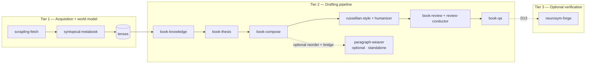
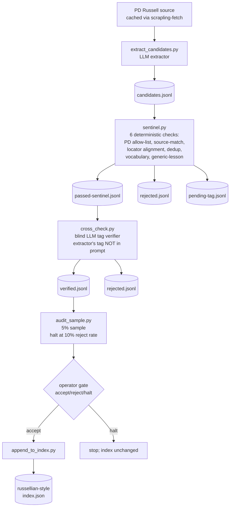
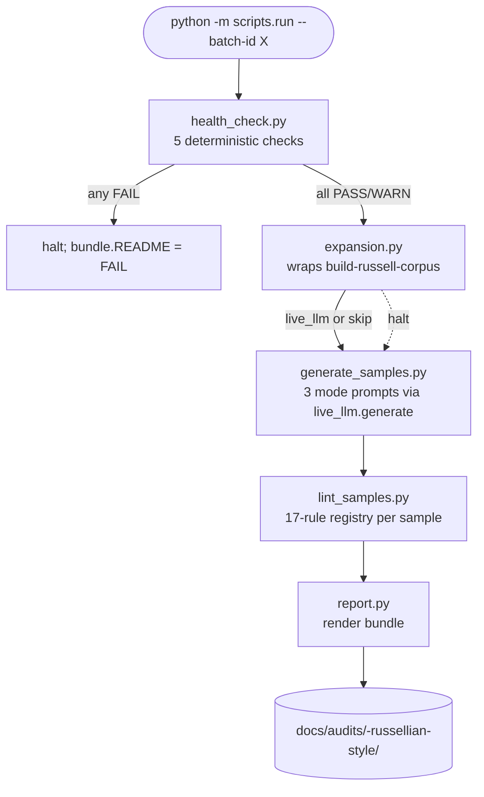
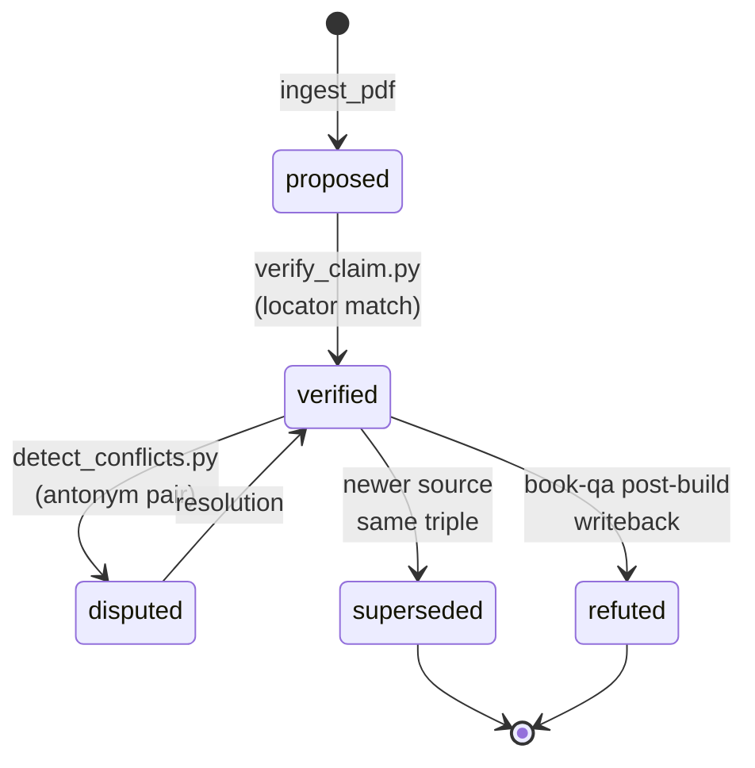
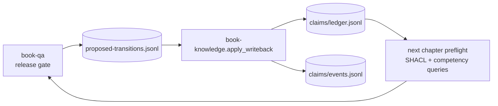
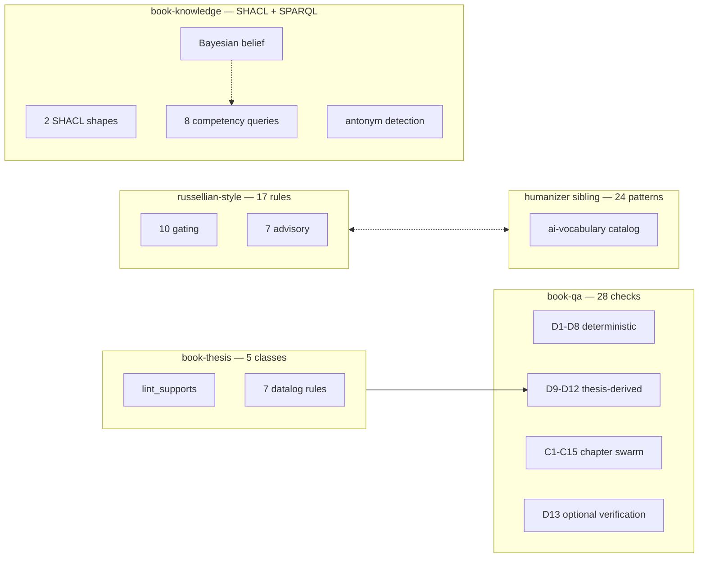
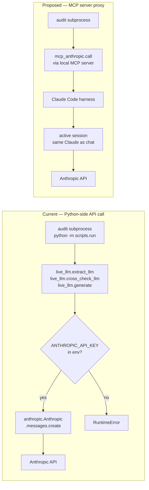

# russellian-book-suite

You give the suite a folder of sources and a chapter contract. Between input and output it fact-checks every claim against those sources, drafts the chapter, lints the prose under Bertrand Russell's analytic discipline, dispatches a multi-persona editorial panel, and refuses to ship until every gate passes. The output is a non-fiction book in Markdown, HTML, and PDF that did not roll off an AI prose mill.

```text
"A book by Bertrand Russell may be hard to follow, but it cannot be misunderstood." — A. J. Ayer
```

The suite enforces a weaker version of the same standard: every sentence atomic, every claim sourced, every paragraph earning its place.

## Introduction

<!-- voice: narrative-editorial -->
<!-- lint-disable: staccato-paragraph-run, rhythm-uniform-length, rhythm-repeated-opening reason=scene-anchored prose uses short sentences and parallel openers deliberately -->

An editor at a serious house opens a manuscript on Tuesday morning. The author writes non-fiction for the first time; her topic interests the editor; the agent has been pushing hard. The editor reads the first paragraph and stops. Eighteen-word sentences. The first adjective is "comprehensive". The second is "robust". The third paragraph opens with "Moreover". She closes the file and writes the agent a polite decline. The author never learns why. The fingerprint sat on page one and the editor saw it before she finished her first cup of coffee.

The fingerprint is not a moral failing. It is a compression artefact. A single language model asked to retrieve facts, compose prose, sustain an argument, audit its own claims, and produce an editorial verdict in one pass has no attention budget for all five jobs. The visible residue is the same across every system that has tried: sentences that average eighteen words, paragraphs that cluster in threes, vocabulary that gravitates toward "robust" and "comprehensive", em-dashes that carry connective work a colon would do better. The editor identifies the residue without naming it. She has been reading manuscripts for twenty years and the residue is recent.

This repository is the answer to that compression problem, but not the answer most contributors expect. The answer is not a better prompt. The answer is not a fine-tuned model. The answer is a pipeline of separate stages, each owned by a different skill, each refusing to pass the artefact forward until its own gate clears. Fact retrieval has its own gate. Prose composition has its own gate. Editorial judgement has its own gate, with seven personas and a verdict aggregator. Defect detection has its own gate, with twenty-eight release-blocking checks. None of the gates trust the previous one. Cleverer phrasing escapes none of them.

The prose discipline is Bertrand Russell's. Russell wrote five thousand essays and seventy books across philosophy, mathematics, politics, education, and popular science. The corpus that survives him is a working museum of how a careful writer separates an argument from its decoration. Atomic sentences. Sourced claims. Paragraphs that earn their last sentence by changing the question's pressure. The suite enforces a weaker version of the same standard, and the seventeen prose linters that gate the chapter pipeline are the mechanical residue of that enforcement.

What sits in this repository, named at the level a contributor needs: eight core skills (`book-knowledge` for claim ingestion, `book-thesis` for argument-spine consistency, `book-compose` for chapter orchestration, `russellian-style` for prose discipline, `book-review` for the seven-persona panel, `review-conductor` for verdict aggregation, `book-qa` for the release gate, `paragraph-weaver` for threading loose paragraphs toward a goal); one optional verifier scaffolder (`neurosym-forge`) for logical consistency over claim sets; two operator-driven tools under `tools/` (`build-russell-corpus` for corpus growth from public-domain Russell texts, `russellian-style-audit` for end-to-end suite validation); and an audit-bundle pattern under `docs/audits/` that records what the suite finds when it lints itself.

Roughly eighty distinct checks across those skills enforce the contract. The full taxonomy lives in The QA grammar; the per-skill detail in The skills; the audit's own findings in Auditing the suite. The book-qa skill alone runs twenty-eight checks at release time: eight deterministic structural lints, four thesis-derived defects from book-thesis, fifteen chapter-swarm editorial dimensions, and one optional logical-satisfiability check from the neurosym-forge verifier. Each check is its own scrutiny. A configuration flag silences none of them.

The suite is not a content engine. It does not invent topics. It does not decide what a book should be about. It does not replace the human editor who looks at a finished chapter and asks whether anyone outside the author's head will care. It refuses to ship prose that misses its own gates. It does not promise that prose passing every gate will be worth reading. That promise sits with the author and the editor; the suite's promise is narrower and more honest — the artefact will not carry the fingerprint that closed the manuscript on Tuesday morning.

Three system prompts at `skills/russellian-style/assets/system-prompts/` declare the writing contract one mode at a time. The `technical-exposition` mode governs documentation and reference prose. The `narrative-editorial` mode governs chapter scenes and book introductions. The `polemic` mode governs argued positions where the reader knows the writer has one. The README you are reading declares its voice mode per section in an HTML comment, and a per-section lint runner at `tools/readme-lint/` enforces the matching discipline against the same seventeen-rule registry the chapter pipeline uses. The Introduction you are reading uses `narrative-editorial` — the editor at the serious house is a scene, not an abstract complaint.

The suite is in active development and the reader is arriving mid-stream. In May 2026, PR #121 added the corpus-expansion pipeline that grows the russellian-style anchor base from fifty paragraphs toward five hundred. PR #122 added the end-to-end audit tool that exercises every gate and produces a committable bundle under `docs/audits/`. PR #123 rewrote this README to reflect both. Eight architectural recommendations from the suite-wide audit at `docs/audits/2026-05-21-suite-wide-linter-review.md` remain open: an automatic post-generation lint trigger, the consolidation of three independent ai-vocabulary detectors, a public skill_api for book-qa, a master `make audit` target, and four others. The most architecturally significant is the MCP-server refactor flagged in Auditing the suite, which would let a Claude session in the foreground drive the audit's LLM stages without a separate API credential.

How to read what follows depends on what brought you here. An author who wants a working book starts at Quickstart, runs the Bermuda example at End-to-end, and reads The skills for the per-skill detail when something fails. An engineer who wants to understand the design starts at The pipeline, walks forward through The skills and Core concepts, and ends at The QA grammar for the check inventory. A contributor planning a follow-up reads Auditing the suite first to see which architectural questions are still open, then writes a spec against the openspec convention before touching code. A reader curious about the prose discipline reads §4 The fingerprint problem and the russellian-style references; that is where the suite's manifesto lives.

What this README cannot tell you is whether the suite produces good books. That depends on the contract you give it, the sources you feed it, and your willingness to read what the gates surface and revise the prose, not override the gates. What the README can tell you is what the suite refuses by design and the structural discipline it imposes on the artefact passing through. The artefact is the manuscript; the discipline is the chain of gates between source and page; the suite's bet is that a manuscript surviving every gate will not carry the fingerprint the editor saw on her Tuesday morning. The bet is testable. The Bermuda example is the first test. The suite invites you to run the next one.

## Setting up your environment

<!-- voice: technical-exposition -->

This repo runs CI on Ubuntu Linux. To avoid "works on my machine" drift, see [`docs/dev-environment.md`](docs/dev-environment.md) for the WSL2 + Nix bootstrap. macOS/Linux developers run Nix directly; Windows developers install Ubuntu under WSL2 first.

### First-time setup

After cloning, install the pre-commit hooks:

```bash
make install-hooks
```

This installs lefthook's pre-commit hook, which runs `cargo fmt --check`, `ruff check`, `clj-kondo`, and other linters before each commit. Without it, formatting drift won't be caught locally and will surface as a CI failure on your PR instead.

If `lefthook` is not on your PATH, enter the Nix dev shell first (`nix develop` — lefthook is included) or install it directly with `go install github.com/evilmartians/lefthook@latest`.

### Skill venvs and spaCy

Several skills depend on spaCy and its `en_core_web_sm` English model. The `russellian-style` skill in particular needs both to run its passive-voice and signal-density linters; without them, `lint_fragment` silently degrades — the runner's catch-all swallows any linter that fails to import. To install:

```bash
cd skills/russellian-style
python -m venv .venv
.venv/bin/pip install -e ".[ci]"           # includes spaCy
.venv/bin/python -m spacy download en_core_web_sm
```

The other consumer skills (`book-compose`, `book-review`, `book-qa`, `humanizer`) share a junction-linked-venv pattern that `AGENTS.md` documents in full: each cloned skill venv symlinks to a single installed copy at `~/.claude/skills/<name>/.venv`, avoiding several gigabytes of duplicated dependency installs. A fresh clone without those venvs surfaces as `WARN(venv missing)` rows in the audit's `composes_with` health check — operational, not blocking.

## For readers in a hurry

<!-- voice: technical-exposition -->

Authors want a working book, not an architecture tour. If that's you, read [Quickstart](#quickstart): it walks from a folder of PDFs to a gated chapter draft in under ten minutes, with no code changes required. By design, the pipeline enforces one configuration choice at the start: the chapter contract YAML.

Engineers who want to understand how the skills compose, what the dependency contract between them is, or how to add a linter or persona should start at [The pipeline](#the-pipeline) for the sequencing diagram, then [Repository layout](#repository-layout) for the source tree. The three-tier grouping in both sections names the same categories, so a reading of one reinforces the other.

Operators running the tools or auditing the suite should start at [Tools](#tools) for the one-shot CLI entry points (`build-russell-corpus`, `russellian-style-audit`, `readme-lint`), [The QA grammar](#the-qa-grammar) for the 80+ check taxonomy across five skills plus the humanizer sibling, and [Auditing the suite](#auditing-the-suite) for the audit-bundle pattern and the eight ranked architectural follow-ups. The most recent audit bundle at `docs/audits/2026-05-21-russellian-style/` is the canonical example of what an audit produces.

## Reader questions

<!-- voice: technical-exposition -->

### For authors

<!-- lint-disable: listicle-abstract, listicle-anaphora reason=reader-questions index by design -->

- **Q1.** Will this write my book for me, or am I doing the work? → [The fingerprint problem](#the-fingerprint-problem) · [Quickstart](#quickstart)
- **Q2.** What's the minimum I have to provide? → [Quickstart](#quickstart)
- **Q3.** What does local-only mean — do I host my own LLM? → [Local-only constraint](#local-only-constraint)
- **Q4.** Can I use just one skill (russellian-style as a prose linter) without the full pipeline? → [The skills](#the-skills)
- **Q5.** Does this only work for technical manuals like Bermuda? Novels, grant proposals, academic papers? → [End-to-end: the Bermuda manual](#end-to-end-the-bermuda-manual)
- **Q6.** What gets shipped at the end? PDF? Editable Markdown? Both? → [The book workspace](#the-book-workspace)
- **Q7.** How do I revise after the first draft? → [Bundle C: the closed-loop ledger](#bundle-c-the-closed-loop-ledger)
- **Q8.** What happens when two sources contradict each other? → [The claim ledger and PROV-O provenance](#the-claim-ledger-and-prov-o-provenance)
- **Q9.** What does Russell voice actually mean? Is this just no AI fluff? → [Russellian prose discipline](#russellian-prose-discipline)
- **Q10.** Can I customise the linters or style rules? → [The skills](#the-skills)
- **Q11.** The Bermuda example — where is it? How do I read it? → [End-to-end: the Bermuda manual](#end-to-end-the-bermuda-manual)
- **Q26.** Where do I find the audit bundles when I want to see what the suite did to itself? → [Auditing the suite](#auditing-the-suite)
- **Q27.** How do I lint a draft on demand without going through the full chapter pipeline? → [Quickstart](#quickstart)

### For engineers

<!-- lint-disable: listicle-abstract, listicle-anaphora reason=reader-questions index by design -->

- **Q12.** How do the skills compose? Subprocess? Python import? Message passing? → [The pipeline](#the-pipeline) · [The skills](#the-skills)
- **Q13.** Can I use `scrapling-fetch` standalone (not as part of the suite)? → [The skills](#the-skills)
- **Q14.** What's the dependency tree between skills? → [The skills](#the-skills) · [Repository layout](#repository-layout)
- **Q15.** How are skill APIs versioned? What's the compatibility story? → [The skills](#the-skills)
- **Q16.** How does the JSON/EDN bridge to booklogic work? → [The booklogic JSON/EDN boundary](#the-booklogic-jsonedn-boundary)
- **Q17.** Where do I add a new linter? A new persona? → [The skills](#the-skills)
- **Q18.** How are tests organised? Test count? Fast or slow? → [Contributing](#contributing)
- **Q19.** Is there CI? What are the gates? → [Contributing](#contributing)
- **Q20.** How does the closed-loop ledger work, concretely? → [Bundle C: the closed-loop ledger](#bundle-c-the-closed-loop-ledger)
- **Q21.** Releases — semantic versioning? → [Contributing](#contributing)
- **Q22.** PR review style? Memory feedback files? OpenSpec change folders? → [Contributing](#contributing)
- **Q28.** How do I run the corpus-expansion tool against a real LLM? → [Tools](#tools)
- **Q29.** What does `make readme-lint` do, and when does it fire? → [Tools](#tools)
- **Q30.** Where is the suite-wide review that found the 80+ checks? → [The QA grammar](#the-qa-grammar) · `docs/audits/2026-05-21-suite-wide-linter-review.md`
- **Q31.** What changed since PR #121 added the corpus-expansion tool? → [Tools](#tools) · [Auditing the suite](#auditing-the-suite)

### For both

<!-- lint-disable: listicle-abstract, listicle-anaphora reason=reader-questions index by design -->

- **Q23.** What's the relationship between this suite and Anthropic's Claude Code? → [For readers in a hurry](#for-readers-in-a-hurry)
- **Q24.** What other tools are like this? How is this different? → [The fingerprint problem](#the-fingerprint-problem)
- **Q25.** License — MIT? Are persona texts also MIT? → [License and acknowledgements](#license-and-acknowledgements)
- **Q32.** What is the MCP-server refactor flagged in §13? Why is it open? → [Auditing the suite](#auditing-the-suite)

## The fingerprint problem

<!-- voice: polemic -->

Hosted AI prose tools leave a recognisable signature that any trained reader identifies within the first paragraph. Sentences average eighteen words [Hugging Face Prose Survey, 2024]. Paragraphs cluster in threes. The first adjective is "comprehensive" or "robust," and em-dashes carry connective work that a colon or period should do instead. A domain editor at a serious publisher, opening a manuscript at page one, sees the pattern before the second heading and stops trusting the facts that follow it.

The fingerprint is not a stylistic accident; it is the compression artefact of asking one writer to perform five separate jobs in one pass. A hosted assistant retrieves facts, verifies the claims those facts support, composes the prose that frames them, exercises the editorial judgement that decides what to cut, and runs the defect sweep that catches the residue — all inside a single attention budget paying out a single token stream. A competent publishing house would never ask one reader to do all five. It would assign five. The fingerprint is what the one reader leaves behind when forced to do the work of five.

Name the jobs and the conflations name themselves. Fact retrieval pulled into composition produces prose that bends the source to fit the cadence. Claim verification folded into drafting produces sentences that gesture at evidence the writer has not actually checked. Prose composition supervising its own editorial judgement produces the writer who is also their own copy-editor, and that writer catches roughly half of what a separate copy-editor catches — the half whose detection does not require killing a sentence the writer is fond of. Defect detection bolted onto the same pass produces the model that signs off on its own output, which is the model that signs off on anything. The fingerprint is what readers see when one voice tries to be five separate voices and fails at four of them.

The suite is the implementation of the fix. It separates the five jobs into five pipeline stages, each owned by a distinct skill, each guarded by a distinct refusal-criterion that the artefact must satisfy before the next stage will accept it. The pipeline is not a smarter system message; it is the recognition that the problem is structural, not parametric — that you cannot prompt your way past an attention budget you do not have. Where hosted tools leave a fingerprint a domain editor identifies in the first paragraph, the suite produces prose an editor reads to the end without that recognition firing, because the fingerprint had five separate gates between the source and the page, and any one of them would have rejected the artefact that hosted tools ship.

## The three tiers

<!-- voice: technical-exposition -->



### Tier 1 — Acquisition + world model

Acquisition determines what the pipeline can later claim. Two skills share the tier and run in sequence. `scrapling-fetch` is the suite's only outbound network surface — every other skill reads from the cache it produces — and it returns structured records from arXiv abstracts, OpenAlex queries, and PDF downloads with a content-type guard against bytes that pretend to be papers. `syntopical-metabook` reads those records and synthesises a world model: a topic map keyed to thesis-tree nodes, disputed-question tables produced by the external booklogic CLI's symbolic rewrites, and per-chapter lenses that the drafting tier reads as ground truth. The boundary the tier produces is a single artefact — `syntopical/lenses/<chapter-id>.md` — and Tier 2 starts when that file exists.

### Tier 2 — Drafting pipeline

A chapter contract enters; a gated release leaves. Seven skills carry a chapter from the claim ledger that Tier 1 produced to a manuscript ready for publication. `book-knowledge` owns the first step: it extracts and verifies every assertion, writing PROV-O provenance records so that each claim traces to a fetched source by URI and page. `book-thesis` runs next, confirming through an entailment loop that each drafted paragraph advances a named sub-argument — paragraphs that drift are rejected before assembly; `book-compose` then drafts and assembles the text, calling `russellian-style` per section for voice discipline and `humanizer` for a final AI-pattern pass. Editorial review — seven reader personas dispatched in parallel by `book-review`, severity aggregated by `review-conductor` — precedes the tier's closing gate: `book-qa`, whose D1-D12 deterministic and thesis-derived checks, plus the C1-C15 per-chapter agent swarm, produce the defect report that decides whether the chapter ships. Tier 2 exists as a distinct layer because every skill in it presupposes the world model; none can run correctly against raw sources. `paragraph-weaver` is the eighth Tier-2 skill, and it stands beside the mandatory chain instead of inside it. It threads a loose collection of paragraphs toward a goal — argument, emotion, or narrative. It reorders the paragraphs, writes bridges where a link would otherwise vanish, and edits the seams. An author runs it on any paragraph set, inside a workspace or outside one.

### Tier 3 — Optional verification

Formal verification lives outside the default path, activated by setting `enable_verification: true` in `qa-config.yaml`. `neurosym-forge` owns the tier alone: it scaffolds a ClojureScript-plus-Rust verifier project alongside the workspace, emitting an EDN-as-atomspace intermediate representation, an `axioms.rs` hook for Z3 hard constraints, and a per-atom walk that traces each claim to an operator-supplied assertion. Setting `enable_verification: true` causes `book-qa` to ingest the verifier's output as defect class D13 (claim-set-unsatisfiable) and surface violations alongside the standard D1-D12 report. The tier sits outside Tier 2 because its correctness depends entirely on axioms the operator must supply — fold it into the default pipeline and it silently passes every chapter that ships without them.

Tier 3 ships disabled in every default configuration. The verifier scaffold requires a manual domain-axiom pass before it produces verdicts worth acting on, so enabling it without that pass yields false confidence — the linter reports clean while the axiom set remains empty.

## The pipeline

<!-- voice: technical-exposition -->

The pipeline is sequential within each tier: stage N reads stage N-1's outputs and writes its own, and no stage reaches backwards. Tier 1 produces the acquisition manifest and the world-model slice. Tier 2 consumes both and drives a chapter contract through claim extraction, thesis validation, drafting, persona review, and release gating. Tier 3 sits outside the default path, activated by setting `enable_verification: true` in the workspace `qa-config.yaml`.

```mermaid
graph TD
    sources[sources, papers<br/>PDFs · papers · URLs]
    sources --> tier1[Tier 1<br/>acquisition + world model]
    tier1 -->|syntopical/lenses/*.md| tier2[Tier 2<br/>drafting pipeline]
    tier2 -->|manuscript.md · .html · .pdf| release[release bundle]
    tier2 -. enable_verification=true .-> tier3[Tier 3<br/>optional verification]
    tier3 -. D13 defects .-> tier2

    bookqa[book-qa] -. proposed-transitions.jsonl .-> tier1
    review[review-conductor] -. verdict.json .-> tier2
    syntopical[syntopical-metabook] -. pending-seeds.txt .-> tier1
```

`review-conductor` aggregates the seven-persona panel's findings into `verdict.json`. When any gating persona issues a critical finding, the verdict is `soft-gate-fail` and the chapter returns to `book-compose` for a redraft before the release stage can run. Soft-gate-fail is the suite's name for "the section linted clean but a reader who matters would not have trusted it."

`book-qa` runs after `book-compose.build_book` writes the release bundle. Defects whose root cause is a claim-state error — a verified claim that a later source refutes, a counter-claim that the chapter failed to address — become rows in `claims/proposed-transitions.jsonl`. `book-knowledge.apply_writeback` is the only consumer of that file; it transitions the ledger and the next chapter's preflight runs against the corrected state. A defect surfaced at the release stage corrects the underlying facts for the next run.

`syntopical-metabook` writes a Gap Report after each Synthesize pass: every thesis-tree node whose coverage falls below the contract threshold gets a row in `syntopical/acquisition/pending-seeds.txt`. The next Acquire run reads that file as its seed set, traverses the citation graph from there, and tightens coverage on the under-covered nodes before the following draft begins.

## The skills

<!-- voice: technical-exposition -->

### Tier 1 — Acquisition + world model

<details>
<summary><strong>scrapling-fetch</strong> — sole network boundary of the suite</summary>

**What it does.** Every outbound HTTP call in the suite passes through this skill. It wraps Scrapling 0.4.8 — a Python scraping library — and exposes four source-specific adapters: `arxiv` parses abstract pages, `openalex` queries the OpenAlex JSON API, `semantic_scholar` falls back to HTML when the API is unavailable, and `doi` resolves redirect chains to canonical URLs. On top of those adapters sits a streaming `download_pdf` function that checks content-type before writing to disk and verifies the completed file's sha256 against the value returned in the response header. Three fetch modes ship: `plain` for standard sessions, `stealth` for StealthySession (fingerprint-randomised), and `dynamic` for DynamicSession (Playwright-backed). Session construction wires per-host rate limits and politeness defaults; nothing scatters them across caller code. The skill does not fetch data for callers outside the suite; the import-linter contract in CI enforces this as a hard rule.

**Inputs / outputs.**

The skill takes a URL or arXiv ID, a fetch mode, and optional per-call rate-limit overrides. It returns either an `ArxivPaper` dataclass, a PDF written to a caller-specified path, or a typed exception from the hierarchy `FetchFailed | RateLimitExceeded | BlockedRequest | NotAPdf | OfflineMiss | ArxivIdNotFound`. Responses land in an on-disk cache keyed by URL; the cache directory is configurable. Setting `SCRAPLING_OFFLINE=1` forces cache-only mode: the skill opens no network socket.

**When to invoke.** Use this skill whenever the acquisition pipeline needs a URL fetched and the caller is not `scrapling-fetch` itself — arXiv abstract pages, arXiv PDFs by ID, OpenAlex metadata or reference lookups, and DOI resolution to final landing URLs all route through here.

**When NOT to invoke.** This skill is dedicated infrastructure, not a generic scraper; callers outside the book suite should not route through it. For local files or workspace directories, use `pathlib` directly. With `SCRAPLING_OFFLINE=1` active and the resource absent from cache, the skill raises `OfflineMiss`; seed the cache first or clear the env var before calling.

**Trigger phrases.** "fetch a URL", "get this paper's metadata", "download this PDF", "what does this paper cite", "what cites this paper", "scrape this URL", "traverse a citation graph".

**Example walkthrough.**

```bash
# From a skill that has sibling_skills installed in its venv:
from sibling_skills import load_skill_api
sf = load_skill_api("scrapling-fetch", expected_major=0)
record = sf.arxiv.get("2310.04673")
print(record.title)
# → "Lossless LLM Compression via Quantization-Aware Pruning"
```

`arxiv.get` dispatches to the `arxiv` adapter, which parses the abstract page at `arxiv.org/abs/2310.04673`, returns an `ArxivPaper` with `title`, `authors`, `abstract`, and `year` populated, and writes the raw HTML to the on-disk cache. The skill downloads no PDF unless the caller also calls `download_pdf`. Rate limiting fires automatically; a second call to the same URL within the TTL window returns from cache without opening a socket.

**Where to dive deeper.**
- `skills/scrapling-fetch/SKILL.md`
- `skills/scrapling-fetch/tests/unit/` — fixture-driven adapter tests covering all four adapters, the download path, and the exception hierarchy.

</details>
<details>
<summary><strong>syntopical-metabook</strong> — world model above the canonical book workspace</summary>

**What it does.** The metabook sits one layer above the claim ledger without touching it. It acquires papers through citation-graph traversal, ranks and triages candidates against the chapter contract, and downloads those that pass both an embedding-similarity threshold and a booklogic reachability veto. From the acquired corpus it builds a syntopical layer: a topic map that groups concepts by thesis-tree node, disputed-question tables produced by booklogic's symbolic rewrite rules, and canonical-concept reconciliation files that track how different sources name the same idea. Per-chapter lenses slice that world model to exactly what the drafter needs before writing a single sentence. Gap reports close the cycle by scoring per-thesis-node coverage and appending uncovered nodes to `acquisition/pending-seeds.txt`, seeding the next Acquire run automatically. Four sub-workflows — **Acquire**, **Synthesize**, **Project Lens**, **Gap Report** — execute in that order; Acquire can run alone on a new seed set without triggering the others.

The skill never touches the network directly. `scrapling-fetch` handles every HTTP call; the metabook reaches it through `sibling_skills.load_skill_api`. EDN symbolic reasoning stays on the ClojureScript side; the metabook calls booklogic through `scripts/booklogic_adapter.py` over a JSON subprocess wire. With `SYNTOPICAL_NO_BOOKLOGIC=1` active, the Synthesize workflow skips the veto step and falls back to `book-knowledge.detect_conflicts` for disputed questions, plus surface-form overlap for concept reconciliation; each affected artefact carries a `Legacy mode — booklogic disabled` banner.

**Inputs / outputs.**

The metabook reads `raw/`, `wiki/`, `claims/`, `graph/`, and `chapters/<id>/contract.yaml` — all read-only; it writes exclusively to `syntopical/`. A pytest plugin intercepts `open()` calls from metabook scripts and fails any test where a write targets the canonical subtrees. The acquisition audit trail lives in `syntopical/acquisition/manifest.jsonl`, which is append-only and records every run, every candidate, and every outcome. Two env vars: `SYNTOPICAL_NO_BOOKLOGIC=1` for legacy heuristics, `BOOKLOGIC_BIN` to override the binary path.

**When to invoke.** The natural-language triggers are phrases like "acquire papers for chapter X" (Acquire sub-workflow), "synthesize the metabook" (Synthesize, producing topic-map, disputed-question tables, and concept files), "project a lens for chapter Y" (writes `syntopical/lenses/ch-Y.md`), and "show coverage gaps in chapter Z" (Gap Report). Invoke it before drafting any chapter whose lens file does not yet exist.

**When NOT to invoke.** When `book-compose` needs to draft and the lens already exists, open `syntopical/lenses/` directly — the metabook is not a gatekeeper for the drafting step. PDF ingestion into the canonical workspace belongs to `book-knowledge`. Symbolic rewrite queries against the EDN atomspace go through booklogic's CLI; the metabook adapter is a convenience wrapper, not a general-purpose symbolic shell.

**Trigger phrases.** "acquire papers for chapter X", "synthesize the metabook", "project a lens for chapter Y", "show coverage gaps in chapter Z", "self-curating world model", "citation-graph traversal".

**Example walkthrough.**

The four sub-workflows (Acquire, Synthesize, Project Lens, Gap Report) are currently script-level and not exposed through a CLI entrypoint in v0.2; see `skill_api.py` for the governance-layer surface that v0.2 does export.

- **Acquire** traverses the citation graph from a seed set, downloads candidates that pass the embedding-similarity threshold and the booklogic reachability veto, and appends outcomes to `syntopical/acquisition/manifest.jsonl`.
- **Synthesize** builds the topic map keyed to thesis-tree nodes, disputed-question tables (via booklogic's symbolic rewrite rules), and canonical-concept reconciliation files.
- **Project Lens** slices the world model to exactly what the drafter needs for one chapter and writes `syntopical/lenses/<chapter-id>.md`.
- **Gap Report** scores per-thesis-node coverage and appends under-covered nodes to `syntopical/acquisition/pending-seeds.txt`, seeding the next Acquire run automatically.

`book-compose` reads `syntopical/lenses/ch-03.md` before drafting. The lens is a tag-filtered slice of the topic map carrying a YAML frontmatter block with the coverage score. If the score is below the contract threshold, Gap Report will have already written the uncovered nodes to `pending-seeds.txt`; the next Acquire run picks them up automatically.

`skill_api.py` (v0.2) exports the governance layer: `build_positions`, `render_per_rule`, `render_consensus_map`, `render_adversarial`, `governance_filter`, `GateDecision`. The four-sub-workflow Python API is scheduled for v0.3.

**Where to dive deeper.**
- `skills/syntopical-metabook/SKILL.md`
- `docs/superpowers/specs/2026-05-16-syntopical-metabook-design.md` and `2026-05-16-syntopical-metabook-requirements.md`
- `skills/syntopical-metabook/tests/integration/` — integration tests covering the four sub-workflows end-to-end.

</details>
<details>
<summary><strong>sibling_skills</strong> — shared cross-skill loader package</summary>

**What it does.** `sibling_skills` is a Python package, not a Claude Code skill. It does one thing: load another skill's `skill_api.py` module by name and validate the major version before any skill code executes. The package is under twenty lines of meaningful logic — `loader.py` plus an `__init__.py` re-export — yet it is the only sanctioned import path between skills in the suite. CI enforces this: a PR that imports a sibling skill root directly fails the import-linter gate before tests run. The consequence of that discipline is that a skill's internal refactor cannot silently break a caller; the version check catches the mismatch at load time, not at the call site.

Each skill declares `API_VERSION: tuple[int, int]` in its `skill_api.py`. When the major component mismatches the caller's `expected_major` argument, the loader raises `IncompatibleSkillApiVersion` before returning the module. This loader enforces the cross-skill ABI contract (REQ-ABI-1 through REQ-ABI-5, specified in `openspec/changes/add-syntopical-metabook/specs/skill-abi/spec.md`); nothing else does. Skills root defaults to `~/.claude/skills/`; set `SIBLING_SKILLS_ROOT` to override, which is what the test suite does to point at fixture skill trees.

**Inputs / outputs.**

The package takes a skill name string and an optional `expected_major` integer. It returns the imported `skill_api` module ready to call, or raises one of two exceptions: `IncompatibleSkillApiVersion` on major-version mismatch or absent `API_VERSION`, and `FileNotFoundError` when no `skill_api.py` exists at the resolved path.

**When to invoke.** Any skill in the suite that needs to call a function from another skill's public surface should use this loader — including new skills calling `scrapling-fetch`, `book-knowledge`, or `book-thesis`, and any caller that needs to gate on a specific major version of a dependency skill.

**When NOT to invoke.** Utilities within the same skill's `scripts/` directory take a relative import, not this loader. The `booklogic` interface goes through `scripts/booklogic_adapter.py` over a subprocess wire, bypassing `sibling_skills` entirely. General Python module loading outside the suite's skill boundary has nothing to do with this package.

**Trigger phrases.** Not a routable Claude Code skill — no trigger phrases. Import it directly in Python: `from sibling_skills import load_skill_api`.

**Example walkthrough.**

```python
from sibling_skills import load_skill_api, IncompatibleSkillApiVersion

bk = load_skill_api("book-knowledge", expected_major=0)
claims = bk.query_claims({"state": "verified"}, workspace_root)
```

`book-compose` calls this when it needs `book-knowledge.query_claims`. The loader walks `~/.claude/skills/book-knowledge/skill_api.py`, imports it, reads `API_VERSION`, and confirms the major is `0`. If `book-knowledge` later ships `API_VERSION = (1, 0)` — a breaking change — the same call raises `IncompatibleSkillApiVersion("Skill 'book-knowledge' API_VERSION is (1, 0); expected major 0")` before any skill code runs. The caller then either adapts to the new surface or pins `expected_major=0` and waits for a compatibility shim.

**Where to dive deeper.**
- `sibling_skills/loader.py` — the whole package is small enough to read in two minutes.
- `sibling_skills/tests/test_loader.py` — unit tests for version-mismatch paths and env-var override.
- `openspec/changes/add-syntopical-metabook/specs/skill-abi/spec.md` — the ABI contract (REQ-ABI-1..5) this loader enforces.

</details>
<details>
<summary><strong>booklogic</strong> — CLJS-on-Node reasoning CLI: interface contract for the metabook</summary>

**What it does.** `booklogic` is not a Claude Code skill in this repository. It is an external ClojureScript-on-Node CLI authored in parallel, discoverable on PATH after its documented install step. The metabook calls it over stdin/stdout on a JSON wire; it never imports it. Given a corpus of verified claims or concept atoms, `booklogic` applies its local EDN ruleset to detect disputed questions, reconcile concept clusters, test candidate reachability against a thesis tree, and report its own version. The Python side consumes JSON only. EDN is the canonical on-disk form; the JSON wire format is a deterministic, bijective projection, and `scripts/booklogic_adapter.py` never sees raw EDN. Requirement IF-BL-15 is the round-trip guarantee: `edn → json → edn` is the identity function for every atom shape in the protocol. The four subcommands partition the reasoning surface: `disputed-questions` finds claim conflicts, `reconcile-concepts` clusters alternates under a canonical slug, `reachable-from-thesis` tests whether a candidate paragraph has any rewrite path to any thesis node, and `version` emits a provenance atom for CI sanity checks. Each output atom carries `:ruleset-checksum` — the sha256 of all `rules/*.edn` files in lexicographic order — so consumers can detect silent ruleset drift.

**Inputs / outputs.** The wire is JSON. Stdin carries the JSON-projected EDN input atom; pass `--io json` explicitly. Stdout returns the output atom plus three provenance keys on every non-error response: `:booklogic-version`, `:ruleset-checksum`, and `:produced-at`. Stderr receives an `:error` atom whose `:code` determines the exit code — 0 success, 1 schema violation, 2 rule failure, 3 internal, 4 timeout, 5 api-version mismatch. Set `BOOKLOGIC_BIN` to override the executable path.

**When to invoke.** Use `booklogic` when the metabook needs disputed-question detection (`disputed-questions`), concept reconciliation across sources (`reconcile-concepts`), thesis-reachability vetting for a candidate paragraph (`reachable-from-thesis`), or a wire-format version atom for CI health-check (`version`).

**When NOT to invoke.** Skip `booklogic` for Python-side claim ingestion or ledger writes — that is `book-knowledge`. Skip it for sentence-grain prose checks — that is `russellian-style`. Skip it for any task that requires network I/O: `booklogic` makes zero network calls by contract; all evaluation runs locally against `rules/*.edn`.

**Trigger phrases.** `booklogic`, `disputed questions`, `reachable from thesis`.

**Example walkthrough.** The stub ships before the real CLI exists. Set `BOOKLOGIC_BIN="python booklogic_stub.py"` in the test environment and run:

```bash
BOOKLOGIC_BIN="python skills/syntopical-metabook/tests/fixtures/booklogic_stub.py" \
  python -c "
import sys; sys.path.insert(0, 'skills/syntopical-metabook/scripts')
import booklogic_adapter as bl
v = bl.version()
print(v)
"
# BooklogicVersion(booklogic_version='0.0.0-stub', api_version=(0, 1), ruleset_checksum='stub-no-rules')
```

The stub returns `"0.0.0-stub"` and the adapter strips the JSON quote layer, handing back a typed Python dataclass. To swap to the real CLI: `unset BOOKLOGIC_BIN`. A conformance suite at `tests/conformance/booklogic/` runs golden JSON I/O pairs against the stub on every commit and nightly against the real binary once it ships.

**Where to dive deeper.**
- `openspec/changes/add-syntopical-metabook/specs/booklogic/spec.md` — the 15-requirement interface contract.
- `skills/syntopical-metabook/scripts/booklogic_adapter.py` — consumer-side adapter.
- `skills/syntopical-metabook/tests/conformance/booklogic/` — golden I/O suite.
- `skills/syntopical-metabook/tests/fixtures/booklogic_stub.py` — dev stub.

</details>

### Tier 2 — Drafting pipeline

<details>
<summary><strong>book-knowledge</strong> — epistemic compiler: claim ingestion, provenance, RDF graph</summary>

**What it does.** The claim ledger starts here. `book-knowledge` reads local PDF and Markdown sources, extracts claims with PROV-O provenance, projects them into an RDF dataset, validates the graph with SHACL, and runs competency queries that confirm the knowledge base answers the questions the book contract requires. The ledger appends; nothing deletes. A claim enters `claims/ledger.jsonl` once, then its state advances through `proposed → verified → disputed → superseded` and stops there. Belief propagation runs a Bayesian damping pass over the provenance DAG so a single source cannot double-count by appearing twice in the witness chain. The metabook reads this ledger as ground truth; no other skill writes to it. Three services sit below the public API: `verify_claim.py` promotes a proposed claim to verified by checking the locator text against the raw source; `detect_conflicts.py` runs antonym-pair contradiction detection across the ledger; `project_graph.py` and `validate_shacl.py` together write and check the TriG dataset that downstream skills treat as authoritative. Every SPARQL competency query ships in `assets/` alongside the SHACL shapes, so the entire gate configuration travels with the skill.

**Inputs / outputs.** Four public functions cross the skill boundary (IF-BK-1..4): `ingest_pdf(path, workspace)` adds a source and returns an `IngestResult`; `query_claims(filter, workspace)` returns filtered `ClaimRecord` objects from the ledger; `is_source_ingested(sha256, workspace)` checks deduplication by content hash; `list_concepts(workspace)` returns every `ConceptRef` from `wiki/concepts/`. The skill owns `raw/`, `wiki/`, `claims/`, and `graph/` exclusively — no sibling writes there.

**When to invoke.** `book-knowledge` handles source ingestion, claim queries, RDF graph revalidation, and the Bayesian belief pass. Invoke it at each of those four checkpoints.

**When NOT to invoke.** Skip `book-knowledge` for chapter drafting — that is `book-compose`. Skip it for sentence-grain voice checks — that is `russellian-style`. Skip it for casual document Q&A that needs no persistent claim record; reach the source directly.

**Trigger phrases.** `ingest this paper`, `extract claims`, `validate claims`, `audit the knowledge graph`.

**Example walkthrough.** Ingest a PDF, count the claims it produces, and run a competency query:

```python
from pathlib import Path
from skill_api import ingest_pdf, query_claims, ClaimFilter

ws = Path("my-book-workspace")
result = ingest_pdf(Path("sources/nakamoto2008.pdf"), ws)
print(result.status, result.claims_extracted)
# ingested  47

verified = query_claims(ClaimFilter(state="verified"), ws)
print(len(verified), "verified claims in ledger")
# 312 verified claims in ledger
```

`ingest_pdf` computes a sha256 before writing anything; a second call with the same file returns `already_present` without touching the ledger. The release gate blocks on SHACL conformance and zero `unsupported_claims` before any chapter ships.

**Where to dive deeper.**
- `skills/book-knowledge/SKILL.md` — component inventory, workspace layout, release-gate criteria.
- `skills/book-knowledge/skill_api.py` — IF-BK-1..4 public surface.
- `skills/book-knowledge/references/` — ingest, wiki, claims, graph audit, and provenance playbooks.
- `skills/book-knowledge/tests/` — pytest suite covering every script.

</details>
<details>
<summary><strong>book-thesis</strong> — argument spine: thesis tree, entailment loop, Datalog consistency</summary>

**What it does.** Every paragraph in a manuscript must earn its place. `book-thesis` owns the intent substrate — the thesis tree, paragraph back-pointers to thesis nodes, a per-paragraph entailment loop, and a Datalog consistency pass that derives transitive contradictions across chapter-level claim triples. It sits as Layer 2–4 above `book-knowledge`'s Layer 1: Layer 2 holds the YAML/RDF thesis spine; Layer 3 dispatches an LLM critic per paragraph that returns `entailed | weakly-entailed | unrelated | contradicts`; Layer 4 runs Datalog rules against the full claim set to surface contradictions that span chapter boundaries. Four defect classes flow from here into `book-qa`: D9 orphan-paragraph, D10 transitive-contradiction, D11 failed-entailment, D12 unadvanced sub-argument. `book-thesis` does not ingest claims or draft prose; those belong elsewhere.

**Inputs / outputs.** One public function (IF-BT-1): `read_thesis_tree(chapter_id, workspace) → ThesisTree`. It reads `chapters/<chapter_id>/thesis-tree.yaml` and returns a `ThesisTree` dataclass holding a list of `ThesisNode` objects, each carrying `node_id`, `statement`, `tags`, `required_evidence_kind`, and `parent_id`. The function raises `ThesisNotDefined` when no tree file exists for the requested chapter. Each chapter owns its own `thesis-tree.yaml`; the tree is the interface between intent and evidence.

**When to invoke.** `book-thesis` owns argument structure, not facts. Invoke it to compile a new thesis spec into RDF triples, lint paragraph back-pointers against the tree, run the Datalog consistency pass after a ledger update, generate exemplar packs for the drafter, or prepare entailment payloads for an LLM critic.

**When NOT to invoke.** Skip `book-thesis` for claim ingestion or ledger writes — that is `book-knowledge`. Skip it for sentence-grain linting (hedges, passive voice) — that is `russellian-style`. Skip it for chapter orchestration — that is `book-compose`. And skip it for qualitative editorial review by personas — that is `book-review`.

**Trigger phrases.** `thesis tree`, `entailment loop`, `orphan paragraph`, `transitive contradiction`.

**Example walkthrough.** Write a minimal thesis tree for chapter `ch-01` with two nodes, then run the entailment pass:

```yaml
# chapters/ch-01/thesis-tree.yaml
chapter_id: ch-01
nodes:
  - node_id: root
    statement: "Bitcoin's fixed supply creates disinflationary pressure over long horizons."
    tags: [monetary-policy]
    required_evidence_kind: empirical
    parent_id: null
  - node_id: supply-cap
    statement: "The 21M cap is enforced by consensus rules, not policy."
    tags: [protocol]
    required_evidence_kind: formal
    parent_id: root
```

```bash
python scripts/compile_thesis.py my-workspace ch-01
python scripts/lint_supports.py my-workspace v0.1
```

`compile_thesis.py` writes RDF triples into the book-knowledge graph; `lint_supports.py` flags any paragraph whose `supports:` field names a node that doesn't exist or whose chain doesn't reach `:Thesis`. A detected D11 failure — an LLM critic returning `contradicts` — blocks release through the soft-gate path in `book-qa`.

**Where to dive deeper.**
- `skills/book-thesis/SKILL.md` — architecture diagram, layer inventory, usage commands.
- `skills/book-thesis/skill_api.py` — IF-BT-1 public surface.
- `skills/book-thesis/tests/` — fixture cases for compile, lint, Datalog, and entailment dispatch.
- `skills/book-qa/` — D9–D12 defect definitions and gate configuration.

</details>
<details>
<summary><strong>book-compose</strong> — chapter orchestrator: contract in, gated release out</summary>

**What it does.** A chapter contract enters; a gated release bundle exits. `book-compose` drives nine pipeline stages: it loads `chapters/contracts/<chapter_id>.yaml`, runs a pre-flight SHACL check, slices verified claims from the ledger, produces a section outline for user approval, drafts each section by loading a `russellian-style` system prompt, applies the `humanizer` sibling for a final AI-pattern pass, dispatches the seven-persona editorial panel, assembles a chapter bundle, and — on explicit request — builds the book-level release: `manuscript.md`, a React/Tailwind HTML browser, and a Playwright PDF. No stage reaches backwards; stage N reads only what stage N-1 wrote.

**Inputs / outputs.** The skill reads `chapters/contracts/<chapter_id>.yaml` for the chapter contract, `syntopical/lenses/<chapter_id>.md` for the world-model slice, and `claims/ledger.jsonl` for the verified claim set. It writes drafts and review artefacts under `chapters/drafts/<chapter_id>/`, release bundles under `chapters/releases/<chapter_id>-<version>/`, and book-level releases under `book/releases/<version>/`. The public API function `read_lens(chapter_id, workspace)` — defined in `skill_api.py` as interface contract IF-BC-1 — reads and validates the lens file, enforcing the section order `## Topics` → `## Disputed Questions` → `## Concept Reconciliation` → `## Coverage`; any deviation raises `LensContractViolation`.

**When to invoke.** Use when the user says "draft chapter ch-NN", "build release bundle for ch-NN", or "build the book release". These cover the three distinct pipeline entry points: chapter drafting (stages 1–7), chapter bundle assembly (stage 8), and full book release (stage 9).

**When NOT to invoke.** Skip `book-compose` for source ingestion or claim extraction — that is `book-knowledge`. Skip it for sentence-grain prose rewrites on text that isn't inside the chapter pipeline — use `russellian-style` directly.

**Trigger phrases.** The frontmatter lists: `"draft chapter X"`, `"compile chapter from contract"`, `"build release bundle for chapter X"`, `"render chapter to PDF"`, `"build the book release"`, `"publish the book"`.

**Example walkthrough.** The user says "draft chapter ch-01". `book-compose` loads `chapters/contracts/ch-01.yaml`, verifies claims against the SHACL shapes, queries the ledger for the ch-01 claim slice, and presents a section outline. On approval it drafts each section: loads the `technical-exposition` system prompt via `system_prompt_loader.load("technical-exposition")`, generates a first-pass draft, calls `russellian-style` for voice discipline, calls `humanizer` for AI-pattern removal. Section drafting complete, `review-conductor` dispatches the seven-persona panel and aggregates findings into `verdict.json`. If `verdict.verdict != "soft-gate-fail"`, the bundle lands at `chapters/drafts/ch-01/draft.md`. Any gating persona — Gottlieb, Domain Expert, Copyeditor, or AI-Slop Detector — can raise a critical finding that sends the chapter back to drafting.

**Where to dive deeper.**
- `skills/book-compose/SKILL.md`
- `skills/book-compose/skill_api.py` — IF-BC-1 (`read_lens`)
- `skills/book-compose/tests/`

</details>
<details>
<summary><strong>paragraph-weaver</strong> — thread loose paragraphs toward a goal (argument | emotion | narrative)</summary>

**What it does.** It threads a collection of existing paragraphs toward a typed goal — `argument`, `emotion`, or `narrative` — by reordering them, writing bridges between them, and lightly editing seams. Paragraph bodies stay immutable. The skill seam-edits only a paragraph's first or last sentence, and it inserts new bridge text between paragraphs. A deterministic Python substrate does the structural work: a graph model with content hashing, an entity proxy, Tarjan cycle detection, feasibility refusal, precedence-constrained ordering, closed-vocabulary bridge and seam validation, and gate scoring. The agent supplies judgment on top of that substrate — the same agent-in-the-loop pattern as `russellian-style`. The substrate is stdlib-only and opens no network socket. Non-determinism lives only in artefact *production*. The gate runs on the artefacts after a hash freezes them, so a given input produces the verdict those bytes determine, and no other. The Target interface is pluggable: v1 ships one deep target (`argument`, which fills dispositio slots and sequences over `book-thesis` structure) and two honestly-labelled shallow stubs (`emotion`, `narrative`) that prove the interface but carry trivial objectives in v1.

**Inputs / outputs.** The skill takes a paragraph collection and a one-line goal, plus the agent's judged inputs at each stage — a target choice, role tags, precedence edges, bridges, and seam edits. It carries one hard ordering constraint: acyclic precedence. The skill reports cycles instead of dying on them — it demotes the weakest edge in a cycle to a note. Slot-order and edge-loading stay soft penalties. Bridges draw on a closed connective vocabulary and name only entities the two flanking paragraphs already contain (an entity-subset guard, not raw NLI); a bridge that fails `validate_bridge` earns a rewrite or a structural GAP. The skill refuses bad inputs: `check_feasibility` stops and returns a diagnosis when required slots sit empty, too many paragraphs fall off-goal, or the entity graph splits apart. Output defaults to a provenance-marked render distinguishing source, seam-edit, and bridge text. The public surface is `skill_api.py`, `API_VERSION = (0, 1)`.

**When to invoke.** Use this skill when the user already holds paragraphs and a goal and wants you to assemble them into one coherent whole. The skill reorders the paragraphs, bridges the gaps a reader would otherwise trip on, and edits the joins. In a book workspace, the `argument` target sequences over `book-thesis`'s structure and does not recompute contradictions — `book-thesis` owns those; standalone, the target extracts its own thesis. The `argument` target hands its prose to `russellian-style` at the end.

**When NOT to invoke.** Do not use it to draft from scratch — it threads existing paragraphs and writes nothing but bridges and seam edits. For sentence-grain prose discipline, use `russellian-style`. For thesis and consistency checking, use `book-thesis`. Do not expect deep work from the `emotion` or `narrative` targets in v1; their objectives are trivial and their gates emit a not-yet-deep warning. Those two targets carry `prose_policy` `none` and do not route to `russellian-style`, which refuses their persuasive and story genres. `book-review` personas can feed the revise stage, but only as advisory input.

**Trigger phrases.** "thread these paragraphs", "weave these paragraphs into an argument", "order these paragraphs toward a thesis", "write bridges between these paragraphs", "assemble these paragraphs into a coherent whole".

**Example walkthrough.** Thread a paragraph set toward an argument, then gate the frozen artefacts:

```python
import skill_api as pw

target = pw.get_target("argument")              # deep target, dispositio slots
slots = target.plan_template(goal)              # thesis -> evidence -> ... -> conclusion
graph = pw.WeaveGraph(nodes, edges)             # paragraphs + precedence edges
assert pw.find_cycles(graph) == []              # cycles reported, never fatal

feasible = pw.check_feasibility(graph, slots)   # refuse instead of threading off-goal
if not feasible.ok:
    raise SystemExit(feasible.reasons)

order = pw.order_paragraphs(
    graph, lambda seq: target.order_objective(seq, graph, goal))
result = target.gate_hook(artifacts)            # pure over frozen, hashed artefacts
print(pw.render_provenance(segments))           # source / seam / bridge marked
```

`order_paragraphs` honours the one hard constraint — acyclic precedence — and minimises the target's soft penalty; `score_gate` returns the same verdict for the same frozen inputs on every run.

**Where to dive deeper.**
- `skills/paragraph-weaver/SKILL.md` — operating doctrine, the six-stage pipeline, degenerate-input handling.
- `skills/paragraph-weaver/skill_api.py` — the `API_VERSION = (0, 1)` public surface.
- `skills/paragraph-weaver/references/engine-doctrine.md` — the deterministic substrate, and why production, not the gate, owns non-determinism.
- `skills/paragraph-weaver/references/target-authoring.md` — the pluggable Target interface and how to add a deep target.
- `skills/paragraph-weaver/tests/test_end_to_end.py` — the snail-paragraphs-to-argument acceptance demo.
- `docs/superpowers/specs/2026-05-30-paragraph-weaver-design.md` — design spec and v1 scope.

</details>
<details>
<summary><strong>russellian-style</strong> — generation contract first, checker second</summary>

**What it does.** The skill is a generation contract first, a checker second. The contract runs before prose exists: three mode-keyed system prompts live at `assets/system-prompts/technical-exposition.md`, `assets/system-prompts/narrative-editorial.md`, and `assets/system-prompts/polemic.md`. `system_prompt_loader.load(mode)` reads the matching file and returns it as the LLM system message, conditioning the writer to the Russellian structural mandates before drafting begins. Those mandates hold four requirements: vary sentence length deliberately, with at least one sentence under ten words and at least one exceeding twenty-five per screen; favour compound-complex sentences with short declarative beats; open paragraphs with the conclusion the paragraph will earn; end paragraphs by changing argumentative pressure, not by restating what the paragraph just said. The checker side — twelve linter modules emitting seventeen rule names — audits prose already in existence. Eight modules emit the ten default (gating) rules: `lint_hedges.py` covering `no-hedging`, `lint_passive_voice.py` covering `active-voice`, `lint_signal_density.py` covering `signal-density`, `lint_parallel_structure.py` covering `parallel-structure`, `lint_listicle_abstract.py` covering `listicle-abstract` and `listicle-anaphora`, `lint_sentence_rhythm.py` covering `rhythm-uniform-length` and `rhythm-repeated-opening`, `lint_burstiness.py` covering `burstiness`, and `lint_ai_vocabulary.py` covering `ai-vocabulary`. Four modules emit the seven advisory rules: `lint_ai_staccato.py` covering `staccato-paragraph-run` and three variant patterns (`negation-affirmation-template`, `this-is-conclusion-overuse`, `abstract-subject-run`), `lint_concrete_instance_density.py` covering `concrete-instance-density`, `lint_epistemic_precision.py` covering `epistemic-precision`, and `lint_paragraph_motion.py` covering `paragraph-motion`. The default `lint_fragment(text)` call runs the 10 gating rules; the other 7 advisory rules require explicit naming via `linters=[...]`. See §10 The QA grammar for the full registry. The `humanizer` sibling skill extends the checker with a 24-pattern Wikipedia catalog of AI writing tells when installed.

**Inputs / outputs.** On the generation side, the skill loads one of three system-prompt Markdown files from `assets/system-prompts/` and returns its text as a string for the caller to pass to the LLM. On the linting side, it accepts a text fragment and a list of rule names, writes the text to a temporary Markdown file, runs the requested linters, and returns a list of `LintIssue` dataclasses — one per violation — carrying linter name, line, column, and a human-readable message. The output artefact for a full chapter pass is `style-pass-report.md`, which records per-rule findings, a `vitality_metrics` block, and corpus anchors when vitality linters fire.

**When to invoke.** Use when the user says "apply Russell style", "run the linters on chapter 3", or "Russell pass on draft.md". Also use when `book-compose` loads the system prompt at drafting time and calls `lint_fragment` after each section.

**When NOT to invoke.** Skip `russellian-style` for marketing copy, fiction, launch announcements, or any genre where accuracy is not the primary contract. Skip it for source ingestion, claim ledger writes, or chapter orchestration — those belong to other skills.

**Trigger phrases.** The frontmatter lists: `"apply Russell style"`, `"rewrite in Russellian style"`, `"tighten this prose"`, `"remove hedging"`, `"atomize this paragraph"`, `"Russell pass on this draft"`.

**Example walkthrough.** Load the generation contract, draft a paragraph, lint it, fix it, re-lint.

```python
from skills.russellian_style.scripts.system_prompt_loader import load
from skills.russellian_style.skill_api import lint_fragment, LintIssue

prompt = load("technical-exposition")   # returns the system-prompt string
draft = "Hedges weaken a sentence in ways that passive prose also does."
issues: list[LintIssue] = lint_fragment(draft, linters=["no-hedging", "active-voice"])
# issues[0] => LintIssue(linter="active-voice", line=1, col=1, message=...)
fixed = "Hedges and passive constructions both erode signal density."
assert lint_fragment(fixed, linters=["no-hedging", "active-voice"]) == []
```

The first draft triggers `active-voice` on the passive construction; the rewrite commits to a direct claim and clears both rules. The same cycle — run, read, rewrite, re-run — applies to all ten gating rules until zero violations remain.

**Where to dive deeper.**
- `skills/russellian-style/SKILL.md`
- `skills/russellian-style/assets/system-prompts/` — three mode-keyed generation contracts
- `skills/russellian-style/assets/russell-corpus/` — 50-paragraph Russell corpus index
- `skills/russellian-style/tests/`

</details>
<details>
<summary><strong>book-review</strong> — seven editorial personas, dispatched in parallel, severity-gated</summary>

**What it does.** A chapter draft that clears style linting still fails if a real editor would stop trusting it. `book-review` closes that gap: seven editorial personas read the draft in parallel, each from a distinct critical lens, and return severity-tagged findings that either block release or surface as advisory. The gate is binary — `persona_critical_count == 0` to ship — but the evidence is qualitative: each persona's full Markdown report lives under `chapters/drafts/<chapter_id>/reviews/`, and the conductor's aggregation produces `persona-review.md` with a verdict table, substring-deduplicated findings, and final counts by severity.

**Inputs / outputs.** The skill reads a chapter draft from `chapters/drafts/<chapter_id>/draft.md` and the chapter contract from `chapters/contracts/<chapter_id>.yaml`. It constructs one dispatch packet per persona, issues parallel Task subagent calls, and writes individual reports to `chapters/drafts/<chapter_id>/reviews/<persona>.md`. The aggregation script merges those into `chapters/drafts/<chapter_id>/persona-review.md` and writes `verdict.json` with the `persona_critical_count` field that `book-compose` reads at stage 7.

**When to invoke.** Use when the user says "review chapter X with personas", "Gottlieb pass on this chapter", or "is this chapter ready for review". Single-persona dispatch is a valid entry point for targeted feedback.

**When NOT to invoke.** Skip `book-review` for source ingestion, prose-grain linting, or chapter drafting — each belongs to a different skill. Skip it for qualitative review of prose that lives outside the book pipeline.

**Trigger phrases.** The frontmatter lists: `"review chapter X with personas"`, `"Gottlieb pass on this chapter"`, `"run the editorial reviews"`, `"what would Gottlieb say about this draft"`, `"soft-gate this chapter"`.

**Example walkthrough.** The user says "Gottlieb pass on chapter ch-03". `book-review` loads `chapters/drafts/ch-03/draft.md`, constructs a Gottlieb dispatch packet (persona role description, severity rubric, draft text, contract metadata), issues a single Task subagent call, and writes findings to `chapters/drafts/ch-03/reviews/gottlieb.md`. The report tags each finding by severity: `critical` blocks release, while `important` and `minor` are advisory. If Gottlieb marks any finding `critical` — cadence collapse, AI-sloppy pattern density above threshold, or a structural defect the rubric defines as blocking — `persona_critical_count` increments and the chapter's release gate fails. The writer reads `gottlieb.md`, revises through `book-compose`, and re-runs the pass.

**Where to dive deeper.**
- `skills/book-review/SKILL.md`
- `skills/book-review/personas/` — one Markdown role file per persona
- `skills/book-review/tests/`

</details>
<details>
<summary><strong>review-conductor</strong> — multi-persona panel orchestrator: YAML config in, verdict out</summary>

**What it does.** `book-review` dispatches one persona at a time; `review-conductor` dispatches them all at once. The conductor loads a panel YAML (`panels/<panel-id>.yaml`), constructs one dispatch packet per persona via `dispatch_panel.py`, fires every packet in parallel through the caller-provided dispatcher, and aggregates the results through per-persona severity gates. Two artefacts exit every run: `panel-review.md`, the human-readable aggregate with substring-deduplicated findings, and `verdict.json`, the machine-readable record with per-persona critical counts and a top-level `decision` field — either `ship` or `redraft`. If `verdict.json.decision == "redraft"`, `book-compose` returns the chapter to its drafting stage.

**Inputs / outputs.** The conductor reads a panel YAML from `panels/`, a chapter draft from `chapters/drafts/<chapter_id>/draft.md`, and Outcomes exemplars from `book-review/references/outcomes/` to inject as few-shot context into each persona packet. It calls `book-review`'s `dispatch_review` primitive for each persona, then writes `chapters/drafts/<chapter_id>/panel-review.md` and `chapters/drafts/<chapter_id>/verdict.json`. The verdict carries `per_persona_counts`, `decision`, and `soft_gate_triggered`.

**When to invoke.** Use when the user says "run the panel", "review chapter with the conductor", or "soft-gate this chapter via review-conductor". The conductor is the right entry point whenever the full panel — not a single persona — needs to run.

**When NOT to invoke.** Skip `review-conductor` for a single-persona targeted pass — invoke `book-review` directly. Skip it for source ingestion, prose linting, or chapter drafting.

**Trigger phrases.** The frontmatter lists: `"run the panel"`, `"review chapter with the conductor"`, `"run the seven-persona panel"`, `"soft-gate this chapter via review-conductor"`.

**Example walkthrough.** A panel YAML declares five personas: Gottlieb and Domain Expert are `gating`; Lay Reader, Enjoyment Reader, and First-Time Visitor are `advisory`. The conductor fires all five in parallel.

```bash
python -c "
from scripts.conductor import run_panel
from pathlib import Path
verdict = run_panel(
    workspace=Path('workspaces/bermuda'),
    chapter_id='ch-02',
    panel_path=Path('panels/five-persona.yaml'),
    dispatcher=None,
)
print(verdict['decision'], verdict['soft_gate_triggered'])
"
```

Expected output: `redraft True`. Gottlieb found one `critical` AI-sloppy pattern; `soft_gate_rule: any_critical_from_gating` fires. `verdict.json` records `per_persona_counts.gottlieb.critical = 1`; `panel-review.md` surfaces the finding with a deduplicated excerpt. The three advisory personas logged findings that appear in the report but did not trigger the gate.

**Where to dive deeper.**
- `skills/review-conductor/SKILL.md`
- `skills/review-conductor/tests/` — 29 tests: schema validation, panel loading, dispatch construction, aggregation

</details>
<details>
<summary><strong>book-qa</strong> — post-build defect gate: D1-D13, C1-C15, Sentinel-Healer loop</summary>

**What it does.** Every artefact that `book-compose.build_book` produces enters this gate before it ships. The gate runs four stages. `lint_artifact.py` applies deterministic mechanical rules: eight D-class rules covering orphan citation tokens, raw Markdown bleed inside HTML, broken cross-references, heading hierarchy violations, count-contract failures, paragraph-length variance, CSS reset clobber, and asset 404s. `dispatch_chapter_qa.py` fires a swarm of fresh-context agents — ten per chapter — each checking one chapter against all fifteen C-class editorial dimensions, returning JSON tickets only. The sentinel script aggregates D and C tickets into a single defect ledger, classifying each as critical, important, or minor. `healer.py` opens an isolated-context agent per defect class, proposes a minimal patch, and hands it back to the sentinel for verification; the sentinel confirms the original failing check now passes before writing the change. Three iterations is the maximum.

**Inputs / outputs.** Public API: CLI only — `book-qa` has no `skill_api.py`. All entry points are scripts invoked directly. The skill reads a built artefact (the release directory that `build_book` writes), `checklists/house-style.yaml`, and an optional `qa-waivers.yaml` at the workspace root. Book-thesis contributes D9-D12 inputs: `qa/supports-defects.json` (D9, D12), `qa/datalog-defects.json` (D10), and `qa/entailment-results.json` (D11). With `enable_verification: true` set in `qa-config.yaml`, the gate reads `qa/verification-defects.json` for D13. Outputs are `qa/lint-findings.json` (D-class), `qa/swarm-findings.json` (C-class), `claims/proposed-transitions.jsonl`, and a `qa/ledger-writeback-<version>.md` summary for `book-knowledge`.

**When to invoke.** Use after `book-compose.build_book` completes and before the release bundle ships. The `--qa` flag on `book-compose` skips this gate during iteration; remove the flag for release builds.

**When NOT to invoke.** Skip `book-qa` for anything before `build_book` has produced an artefact — source ingestion, chapter drafting, and prose linting all run earlier in the pipeline. Skip it for qualitative persona judgement; that is `book-review`.

**Trigger phrases.** The frontmatter lists `"run book-qa"` and `"gate this release"`. Invocation is automatic from `build_book`; direct invocation is for re-running a failed gate without rebuilding.

**Example walkthrough.** The Bermuda manuscript v0.4 enters the gate.

```bash
python scripts/lint_artifact.py workspaces/bermuda v0.4
python scripts/dispatch_chapter_qa.py workspaces/bermuda ch-01 ch-02
python scripts/sentinel.py workspaces/bermuda
python scripts/healer.py workspaces/bermuda --prepare
python scripts/healer.py workspaces/bermuda --apply qa/healer-payloads/D6-ch-03.json
```

`dispatch_chapter_qa.py` takes `[ch-NN ...]` chapter-ID filters, not a release version; the release version is an argument to `lint_artifact.py` only. `MAX_ITERATIONS = 3` is an internal constant in `healer.py`, not a CLI flag; the healer's two-phase CLI is `--prepare` (emit per-ticket payloads) followed by `--apply <patch-result.json>` (record a patch result and increment the iteration counter). Two defects surface: D6 (paragraph-length variance at 1.31, outside the [0.4, 1.2] band in chapter 3) and C7 (scene anchoring absent in chapter 5's opening section). For each, the healer opens a fresh-context agent: D6 splits the overlong paragraph at a natural clause boundary; C7 inserts a two-sentence locating phrase. Sentinel re-runs both checks, confirms zero violations, and writes the patched artefact. Release exits clean.

**Where to dive deeper.**
- `skills/book-qa/SKILL.md`
- `skills/book-qa/references/` — defect taxonomy detail and waiver format
- `skills/book-qa/tests/` — `test_lint_artifact.py`, `test_sentinel_writeback.py`, `test_propose_writeback.py`, `test_transition_rules.py`

</details>

### Tier 3 — Optional verification

<details>
<summary><strong>neurosym-forge</strong> — Tier 3 scaffolder: ClojureScript + Rust neurosymbolic verifier projects</summary>

**What it does.** `neurosym-forge` is a scaffolder, not a verifier. It produces ClojureScript + Rust project skeletons under MeTTa-style atomspace conventions, then provides helpers for extending those skeletons — adding sorts, rewrite rules, and grounded atoms — without touching the host skill or the book pipeline directly. The scaffolded project does the actual verification: `shadow-cljs` and `cargo` run the ClojureScript and Rust layers; the skill only authors the inputs those tools consume. Three linters ship with the scaffold: `lint_atomspace.py` checks that every atom carries a `:sort` annotation with no unbound variables; `lint_rewrite_coverage.py` checks that every rewrite rule has a fixture test; `render_call_graph.py` draws the Claude/CLJS/Rust phase boundary as an ASCII diagram. The skill encodes MeTTa idioms — `=`, `:`, `!`, `match`, `superpose`, and grounded-atom wiring — as authoring conventions documented in `references/metta-idioms.md`.

**Inputs / outputs.** `scaffold_project.py` takes a workspace name and an optional `--book-knowledge-bridge` flag; with the flag set, it accepts `claims/ledger.jsonl` from `book-knowledge` as Phase-1 input and seeds the atomspace from the claim ledger. Without it, the scaffold is a blank slate. `add_sort.py`, `add_rewrite_rule.py`, and `add_grounded_atom.py` each extend an existing scaffold in-place. The verifier emits `qa/verification-defects.json`. When the workspace sets `enable_verification: true` in `qa-config.yaml`, `book-qa` reads that file and raises D13 (claim-set-unsatisfiable) on any unsatisfied constraint.

**When to invoke.** Use when a workspace needs logical verification beyond what prose linters catch — Z3 constraints on date arithmetic, e-graph rewriting for algebraic claims, or Datalog consistency over cross-chapter assertions. Off by default; explicit opt-in per workspace.

**When NOT to invoke.** Skip `neurosym-forge` for prose reviews, claim ingestion, or chapter drafting. Skip it for any workspace where the prose linters and persona reviews are sufficient — most manuscripts do not need this tier.

**Trigger phrases.** The frontmatter lists: `"scaffold a neurosymbolic project"`, `"verify these claims with Z3"`, `"add a rewrite rule"`, `"ground this predicate in Rust"`, `"extend the atomspace IR"`.

**Example walkthrough.** Scaffold a verifier for the Bermuda workspace, add a `Date` sort and a date-ordering rule, then run.

```bash
python -m scripts.scaffold_project --name bermuda --slug bermuda --out verifiers/bermuda
python -m scripts.add_sort --project verifiers/bermuda --sort Date
python -m scripts.add_rewrite_rule \
  --project verifiers/bermuda \
  --rule-file rules/date-before.json
```

where `rules/date-before.json` contains the rule definition in JSON or EDN form.

Override `verifiers/bermuda/src/axioms.rs` with the Z3 date-arithmetic constraints, then run the scaffolded project:

```bash
cd verifiers/bermuda && npm run build && node dist/verify.js
```

`qa/verification-defects.json` exits with zero entries; `book-qa` reads it and D13 stays silent. A contradictory date claim would produce one D13 entry and block the release gate.

**Where to dive deeper.**
- `skills/neurosym-forge/SKILL.md`
- `skills/neurosym-forge/references/` — MeTTa idioms, atomspace EDN IR, grounded-atom wiring
- `docs/concepts/neurosym-forge.md` — scope, layers, and integration boundary
- `docs/operations/neurosym-forge-runbook.md` — operator workflow for the verifier side-channel
- `verifiers/bermuda/` — reference implementation

</details>

## Tools

<!-- voice: technical-exposition -->

`tools/` exists because some workflows are one-shot operator runs, not runtime pipeline stages. The operator expands the corpus quarterly when the russellian-style anchor base needs more coverage; the operator runs the audit per release to validate the suite's discipline; the commit hook invokes the readme-lint runner on every push. None of these belong inside `skills/`, where every directory is a Claude Code skill the chat session can dispatch. The three tools share a convention: a self-contained `pyproject.toml`, a venv at `tools/<name>/.venv/`, and a CLI entry at `scripts/cli.py` or `scripts/run.py`.

### `tools/build-russell-corpus/`

`build-russell-corpus` expands the russellian-style index — the corpus of tagged Russell passages that anchors every style rule in the suite. PR #121 introduced it, growing the anchor base from 50 to 500 entries; the design rationale lives at `docs/specs/2026-05-21-russell-corpus-expansion-design.md` and the implementation plan at `docs/plans/2026-05-21-russell-corpus-expansion.md`. Each candidate passage travels through five hallucination defences before reaching the index: (1) a public-domain allow-list check that rejects any source not cleared for unrestricted reuse, (2) a source-substring verification that confirms the extracted paragraph appears verbatim in the cached source, (3) a blind cross-check in which a second LLM verifies tag agreement without seeing the extractor's tag, (4) a two-layer lesson-specificity gate that rejects generic-lesson candidates, and (5) a 5% audit sample with a halt threshold that stops the run when the human reject rate exceeds 10%.

The pipeline begins with a cached fetch of PD Russell source text via `scrapling-fetch`, then routes each candidate through `sentinel.py` (six deterministic checks) before handing verified passages to `cross_check.py`. Candidates that pass the blind verifier enter an audit sample; only then does the operator gate fire.



At the operator gate, a blocking stdin prompt presents the audit sample and waits for `accept`, `reject`, or `halt`. CI and scripted runs have two bypass flags: `--auto-accept` skips the prompt and accepts the batch unconditionally; `--skip-expansion` bypasses the extraction and cross-check stages entirely, jumping straight to audit from a pre-existing `verified.jsonl`. The CLI surface is six subcommands chained by `scripts/cli.py`: `derive-vocabulary`, `extract`, `sentinel`, `cross-check`, `audit`, `append`. Operators invoke each subcommand in isolation for inspection or replay.

The `extract` and `cross-check` subcommands need a live LLM connection; the current wiring is Python-side in `scripts/live_llm.py`. A forward-looking architectural item — migrating that wiring to an MCP-server boundary — appears in §13 Auditing the suite.

Spec: `docs/specs/2026-05-21-russell-corpus-expansion-design.md`. Plan: `docs/plans/2026-05-21-russell-corpus-expansion.md`.

### `tools/russellian-style-audit/`

`russellian-style-audit` validates the suite end-to-end: health checks, an optional corpus expansion batch, three generated sample texts, and a lint-scoring pass over those samples. It serves as the authoritative validation gate before any release. Output lands in a dated bundle at `docs/audits/<date>-russellian-style/`, with `README.md`, `health-check.md`, `expansion.md`, and a `samples/` subdirectory; `docs/audits/2026-05-21-russellian-style/README.md` is the canonical reference example.

`health_check.py` runs first, executing five deterministic checks against the index, the rule registry, and the corpus vocabulary. Any `FAIL` result halts immediately and marks the bundle `FAIL` without proceeding. The run logs `WARN` results and continues. When all checks clear, `expansion.py` wraps `build-russell-corpus` for an optional batch addition; `--skip-expansion` bypasses that stage. `generate_samples.py` then produces three mode prompts via `live_llm.generate`. Finally, `lint_samples.py` runs the full 17-rule registry against each sample and `report.py` renders the bundle.



The operator gate mirrors the corpus tool: a blocking stdin prompt fires after the expansion batch, bypassed by `--auto-accept` or skipped with `--skip-expansion`. `lint_fragment` calls inside `lint_samples.py` use a namespace-eviction workaround to prevent collision between the audit tool's registry instance and the readme-lint runner's registry instance when both load in the same process. Recommendation #7 in §13 Auditing the suite describes the architectural fix that will eliminate this workaround.

### `tools/readme-lint/` (new in this rewrite)

`readme-lint` parses `README.md` at H2 boundaries, reads each section's `<!-- voice: <name> -->` declaration, and runs the russellian-style 17-rule registry against the section text. A nonzero gating score above 2 causes the runner to exit with code 1. Invoke via `make readme-lint`; for incremental work, target individual sections with `python -m scripts.lint_readme --section "<heading>"`, where the argument matches by case-insensitive substring against the H2 text.

Inline `<!-- lint-disable: <rule>[, <rule>] reason=<short> -->` comments mark legitimate exemptions. The Bermuda narrative section, for example, uses concession-marker constructions that would trigger `staccato-paragraph-run` under `technical-exposition` rules; the disable comment marks that usage as intentional, not drift.

## Core concepts
<!-- voice: technical-exposition -->

### The book workspace

A workspace is a directory. Ten subtrees, four append-only ledgers, one RDF graph: cloning the directory clones the book.

```mermaid
graph TD
    ws[(workspace/)]
    ws --> claude[CLAUDE.md<br/>workspace marker]
    ws --> raw["raw/<br/>book-knowledge owns"]
    ws --> wiki["wiki/<br/>book-knowledge owns"]
    ws --> claims["claims/<br/>book-knowledge owns"]
    ws --> graph["graph/<br/>book-knowledge owns"]
    ws --> chapters["chapters/<br/>book-compose owns"]
    ws --> book["book/<br/>book-compose owns"]
    ws --> qa["qa/<br/>book-qa owns"]
    ws --> thesis["thesis/<br/>book-thesis owns"]
    ws --> syntopical["syntopical/<br/>syntopical-metabook owns"]
    ws --> reports["reports/<br/>cross-skill release reports"]
    
    raw --> raw_pdf[pdf/]
    raw --> raw_md[markdown/]
    raw --> raw_man[manifests/]
    
    claims --> claims_ledger[ledger.jsonl<br/>append-only]
    claims --> claims_cc[counter-claims.jsonl]
    claims --> claims_ev[events.jsonl]
    claims --> claims_pt[proposed-transitions.jsonl]
    
    chapters --> ch_con[contracts/]
    chapters --> ch_dr[drafts/]
    chapters --> ch_rel[releases/]
    
    book --> book_pre[preflight/]
    book --> book_rel[releases/<version>/]
```

Five ownership invariants hold by skill contract and by test. `book-knowledge` is the only writer of `raw/`, `wiki/`, `claims/`, `graph/`. `book-compose` is the only writer of `chapters/` and `book/`. `book-qa` is the only writer of `qa/`. `book-thesis` is the only writer of `thesis/`. `syntopical-metabook` is the only writer of `syntopical/`, and its CI plugin enforces this by failing any test that opens a write handle on the other four subtrees. The SHACL shapes file (`shapes.ttl`) and the JSON Schema for the source manifest stay in lockstep: an off-by-one in the status enum would break both gates silently, so the test suite checks that the SHACL `sh:in` list and the JSON Schema enum match exactly.

### The claim ledger and PROV-O provenance

A claim is a statement extracted from a source: subject, predicate, object, plus a source pointer, a span, a status, and a Bayesian posterior. PROV-O is the W3C provenance ontology, which records for every fact the source, the extractor, and the timestamp. Every claim in the manuscript traces back to a specific line in a specific source because PROV-O is what makes that trace possible.

The ledger is an append-only JSONL log. Each line is either a new claim or a state transition on an existing claim. `project_graph.py` projects the claim ledger into an RDF dataset in the TriG format, a flavour of Turtle with named graphs. `validate_shacl.py` runs SHACL — the W3C Shapes Constraint Language — against `shapes.ttl` to enforce the structural rules.

The status field follows a five-state machine. New claims arrive `proposed`. `verify_claim.py` promotes a proposed claim to `verified` once it cross-checks the locator text against the source span. `detect_conflicts.py` flips a verified claim to `disputed` when it finds an antonym-pair contradiction; if a later ingest resolves the contradiction, the claim returns to `verified`. A newer source can supersede an older claim about the same triple, sending the older one to `superseded`. When post-build QA finds a verified claim that a later source contradicts, the write-back proposes a transition to `refuted`. Both `superseded` and `refuted` are terminal.



Every claim carries PROV-O provenance: which source, which extractor, which version, when. A SHACL violation surfaces as a warning at ingest time and as a hard fail at the release gate.

### Bayesian belief propagation

Belief propagation runs a Bayesian damping pass over the provenance DAG so a single source cannot double-count by appearing twice in the witness chain. `propagate_belief.py` iterates up to 20 rounds, converging at delta less than 10⁻⁴. Open counter-claims damp the posterior by ×0.95 per round; addressed counter-claims by ×0.85; dismissed counter-claims do not damp. Posteriors clamp to [0.05, 0.95] so no claim becomes either an unfalsifiable axiom or an unredeemable falsehood. The propagation writes timestamped snapshots to `claims/snapshots/` and appends `p_posterior` records to the ledger; it is advisory, not blocking, and feeds the defeasible competency queries that the preflight does block on.

### Closed-loop ledger writeback

The Bundle C closed-loop ledger lets a defect surfaced at the release stage correct the underlying facts for the next run. The data flow:



`apply_writeback` is the only mutator of `claims/` outside book-knowledge's own ingest path; it lives in book-knowledge to preserve the ledger-ownership invariant. The writeback transitions a verified claim to `refuted` (post-QA evidence against it) or `superseded` (a newer source addressing the same triple). The next chapter's preflight runs against the corrected state, and the SHACL gate rejects any chapter that still cites the refuted claim.

### Russellian prose discipline

Russell's sentences survive a hundred years because each one stands on its own. `russellian-style` enforces a closed catalog of analytic-prose principles covering vocabulary, voice, atomicity, flow, and structure, each backed by a deterministic Python linter that reads Markdown and emits a JSON report. The catalog lives at `skills/russellian-style/references/russellian-style-guide.md`.

Russell's own prose makes the test case. Compare his sentence:

> *"The point of philosophy is to start with something so simple as not to seem worth stating, and to end with something so paradoxical that no one will believe it."*

with a typical AI-generated version of the same idea:

```
Philosophy can be understood as a discipline that leverages foundational simplicity
to navigate toward profound, often counterintuitive conclusions, ensuring readers
undergo a transformative intellectual journey.
```

The Russell version has zero hedges, zero promotional adjectives, an active verb in each clause, and a closing turn no reader anticipated. The AI version has three of the suite's hard-blocked patterns in one sentence: AI vocabulary (*leverage*, *navigate*, *transformative*), a superficial -ing analysis (*ensuring readers undergo...*), and a paragraph that does not earn its place.

The linters do not stop at description; they kill the sentence in place. Point `lint_hedges` at a hedged draft line and it names the offending token and the discipline it violates:

```text
$ python -m lint_hedges draft.md
draft.md:1  no-hedging  hedge token "might" — replace with a falsifiable threshold

  before:  The script might fail if the server is under heavy load.
  after:   The script fails when server CPU utilization exceeds 90 percent.
```

The rewrite is not softer; it is testable. That is the whole discipline in one line — a sentence a reader can check displaces a sentence a reader must take on faith.

| Linter | What it catches |
|---|---|
| `lint_hedges.py` | A closed registry of hedge tokens; the full list lives in `references/russellian-style-guide.md` §2.1 |
| `lint_passive_voice.py` | Passive constructions via spaCy dependency parse |
| `lint_signal_density.py` | Adjective and adverb ratio per sentence against budget |
| `lint_parallel_structure.py` | Grammatical-opening parity across bullet lists |
| `lint_sentence_rhythm.py` | Sentence-length variance and cadence defects (e.g., five consecutive sentences with word counts within three of each other) |
| `lint_listicle_abstract.py` | Abstract-noun listicles masquerading as argument — pattern-matched against `rests on N X` and `N Y` sentence frames |

#### The vitality layer

The six linters above describe the patterns to remove. Russell's prose has a second, harder dimension: motion. Concrete examples earn abstractions. Antithesis exposes a distinction. The last sentence changes pressure. The vitality layer adds five advisory linters that detect the *absence* of these moves, not the *presence* of bloat. All five are advisory in v1 — they surface in the report but do not block release. A calibration study will correlate their findings with the persona panel's verdicts before any promotion to gating.

| Linter | What it measures |
|---|---|
| `lint_burstiness.py` | Fano factor (variance-to-mean ratio) of the sentence-length distribution; a document with sentences clustered between twelve and seventeen words carries the AI signature |
| `lint_ai_vocabulary.py` | Three lexical pattern families: false-certainty markers, magic adverbs, and transition-adverb openers; augmented by the humanizer 24-pattern catalog when installed |
| `lint_concrete_instance_density.py` | spaCy NER per paragraph plus an occupational-noun matcher for Russell stock figures; fires when three or more consecutive paragraphs carry zero concrete instances |
| `lint_epistemic_precision.py` | Three-tier classification: banned-vague tokens, allowed-bounded phrases (e.g. `within five percent`), and unattributed numeric claims flagged as implicit hedges |
| `lint_paragraph_motion.py` | Paragraph-shape rubric: assertion-only, concession-turn, contrast, definition-by-pressure, question-answer, or example-inference; fires when 70%+ of a section's paragraphs are pure assertion-stack |

When a vitality linter fires, the report retrieves one paragraph reference from a fifty-paragraph index of public-domain Russell texts at `skills/russellian-style/references/russell-corpus-map.md`. The reference matches the flagged section's rhetorical mode and arrives as a citation plus a one-sentence lesson. A reader who wants the passage in front of them fetches it from Project Gutenberg using the URL and line hint in the citation.

#### Mode-keyed system prompts

`book-compose`'s drafter loads a system prompt matching the chapter contract's `prose_mode` field. Three prompts ship in `skills/russellian-style/assets/system-prompts/`:

- `technical-exposition.md` — chapters that explain, define, or argue from evidence. Default.
- `narrative-editorial.md` — narrative chapters and book introductions; room for hyperbaton, conjunction-starts, and concrete sensory anchors.
- `polemic.md` — op-ed-style work; antithesis-led, sharper turns, dry irony where compression earns it.

Each prompt declares banned-word registries, structural mandates, preferred rhetorical devices, and closing rules adapted from the PDF *"AI Prose: From Terseness to Cadence"* with Russell-specific overlays. A Russell pass produces `style-pass-report.md` with per-rule findings, a `vitality_metrics` block, and one or more corpus anchors when vitality linters fire. `book-compose` invokes the negative linters after each section draft; the vitality linters run on the assembled chapter; the `humanizer` sibling skill catches what the deterministic rules cannot. The positive doctrine companion lives at `skills/russellian-style/references/russellian-vitality-guide.md`: open with a difficulty not a system noun; concrete examples earn abstractions; permit exact uncertainty; antithesis to expose distinction; vary paragraph motion; let the last sentence change pressure.

### The thesis tree

A book has a thesis. The thesis decomposes into sub-arguments; each sub-argument cites supporting claims; every paragraph in the manuscript traces back to one sub-argument by an explicit `supports:` field. `book-thesis` owns this intent substrate and pairs it with the fact substrate that `book-knowledge` owns.

```
┌─────────────────────────────────────────────────────────────┐
│ Layer 4  Datalog consistency pass                            │
│          (Datalog = a declarative logic-programming language │
│          for deriving facts from rules; the pass runs ~15    │
│          rules over the claim graph to find transitive       │
│          contradictions like "ch-1 says A → B, ch-2 says    │
│          B → ¬A")                                            │
└────────────────────────┬────────────────────────────────────┘
┌────────────────────────▼────────────────────────────────────┐
│ Layer 3  Verifier-generator entailment loop                  │
│          (an LLM critic asks per paragraph: does this        │
│          paragraph actually entail what its `supports:` node │
│          claims? verdict ∈ {entailed, weakly-entailed,       │
│                             unrelated, contradicts})         │
└────────────────────────┬────────────────────────────────────┘
┌────────────────────────▼────────────────────────────────────┐
│ Layer 2  Thesis spine                                        │
│          YAML/RDF tree rooted at :Thesis with sub-arguments  │
│          and required-evidence slots; every paragraph carries│
│          a `supports: <node>` back-pointer                   │
└────────────────────────┬────────────────────────────────────┘
┌────────────────────────▼────────────────────────────────────┐
│ Layer 1  Claim ledger + RDF + SHACL  (book-knowledge)        │
└─────────────────────────────────────────────────────────────┘
```

Each layer contributes a defect class to `book-qa`. D9 fires when a paragraph carries no `supports:` field. D10 fires when the Datalog pass derives a transitive contradiction across chapters — a chain the per-chapter linter would miss because it only sees one chapter at a time. D11 fires when the entailment critic returns `contradicts` or `unrelated`. D12 fires when a node has no paragraphs advancing it.

D9, D10, and D11 are critical and hard-gate the release. D12 is important and surfaces in the post-build report, but the chapter can still ship with a documented waiver — though a sub-argument with nothing advancing it is a structural admission that the book has not earned its own thesis node.

### The syntopical layer

The `syntopical/` directory holds the world model the drafting pipeline reads before writing a single sentence. Six file types live there. `topic-map.md` holds one row per concept, grouped by thesis-tree top-level node, with source IDs and a count of verified claims per concept. `disputed-questions/<topic>.md` holds booklogic-produced contradiction tables — one question header per detected dispute, one row per position, with claim IDs and rewrite-witness rule IDs. `concepts/<canonical-slug>.md` holds the canonical-concept reconciliation for each concept cluster booklogic detects: the canonical slug, alternate surface forms per source, and the rules that unify them. `lenses/<chapter-id>.md` is the world-model slice `book-compose` reads when drafting a chapter — a tag-filtered projection of topics, disputed questions, and concept notes, with a YAML frontmatter block carrying the coverage score. `reports/gaps-<chapter>-<ts>.md` holds per-thesis-node coverage gaps, sorted ascending by score, with uncovered nodes flagged as seeds for the next Acquire run. `acquisition/manifest.jsonl` is the append-only audit trail of every Acquire run: seeds, candidates, triage outcomes, download results, and failures.

The syntopical layer sits above the canonical claim ledger without touching it. `book-knowledge` owns `raw/`, `claims/`, `wiki/`, `graph/`; the metabook reads all four. It never writes to any of them. The metabook's sole write target is `syntopical/`. A pytest plugin enforces this no-shadow-writes invariant on every commit by intercepting `open()` calls from metabook scripts and failing the test if any such call targets the canonical subtrees. The distinction matters: the canonical ledger records what the sources say; the syntopical layer records what the sources disagree about, how concepts map across sources, and where the thesis is undercovered. Holding the two at separate subtree boundaries lets them evolve at different rates without corrupting each other.

Triage gives each acquisition candidate a cosine-similarity score in [0, 1] against the chapter contract. Candidates at or above T_high (default 0.75) enter the auto-approve bucket. Before download, the metabook runs a booklogic reachability check against the chapter's thesis tree: any candidate whose extracted concepts have no rewrite path to any thesis node drops to manual-review, the triage file receiving the full rule trace alongside the demotion record. If `SYNTOPICAL_NO_BOOKLOGIC=1`, the metabook skips the veto and ships the embedding-only triage outcome; Synthesize falls back to `book-knowledge.detect_conflicts` for disputed questions and surface-form overlap clustering for concept reconciliation, each output carrying a "Legacy mode — booklogic disabled" banner. The two-layer design is intentional: the embedding score gives a fast topical signal, while the symbolic veto catches candidates that score high on vocabulary similarity but have no logical path to the argument the chapter is building.

### The booklogic JSON/EDN boundary

ClojureScript owns EDN for a practical reason. The Python EDN ecosystem stalled: `edn_format` has not shipped a PyPI release in over a year, `kim-edn` carries a discontinued label, and the [EDN implementations wiki](https://github.com/edn-format/edn/wiki/Implementations) lists no actively maintained Python alternative. ClojureScript ships `cljs.tools.reader.edn` and `cljs.core/pr-str` as part of the language. Booklogic is already a shadow-cljs `:node-script` project scaffolded by `neurosym-forge`. The lowest-risk seam puts EDN handling on the CLJS side and exposes a JSON projection at the cross-language boundary — a decision that is both lower-risk and idiomatic, since EDN is Clojure's native data syntax and the host language has the strongest tooling for it.

The wire format is JSON. The `booklogic` CLI takes `--io {edn|json}` (default `edn`); the metabook adapter always passes `--io json`. JSON is the bijective projection of EDN defined in spec §11.4.4: keywords keep their colon prefix as a string (`:finality` becomes `":finality"`); lists vs sets disambiguate via `{"$list": [...]}` and `{"$set": [...]}` envelopes; tagged literals use `{"$tag": "...", "$value": ...}`. Python uses stdlib `json` and `subprocess` on the consumer side. No external EDN library enters the Python venv.

Until the real booklogic CLI ships, `tests/fixtures/booklogic_stub.py` carries the wire contract. The stub accepts `--io json` only — EDN mode is deliberately out of scope, because EDN handling is the real CLI's responsibility, not the stub's. It returns empty lists for `disputed-questions` and `reconcile-concepts`, an always-reachable verdict for `reachable-from-thesis`, and a fixed `"0.0.0-stub"` version atom. Tests set `BOOKLOGIC_BIN="python booklogic_stub.py"`; the real CLI swaps in by unsetting the variable so `booklogic` on `PATH` takes over. A conformance suite of golden JSON I/O pairs at `tests/conformance/booklogic/` runs against the stub on every commit and nightly against the real CLI once it ships. The round-trip bijectivity check IF-BL-15 confirms that `edn → json → edn` is identity for every atom shape in the protocol.

### Multi-persona review

After a chapter passes Russellian linting, seven editorial personas read it. Each persona lives in `skills/book-review/personas/*.md` as a full role description: identity, lens, severity rubric, tone, and one example review. `review-conductor` loads a panel YAML, dispatches one packet per persona to a parallel sub-agent, and aggregates the severity-tagged reports into a single verdict.

| Persona | Reads for | Critical patterns | Gate |
|---|---|---|---|
| **Robert Gottlieb** | voice, cadence, AI-sloppy patterns | listicle abstracts; mechanical thesis enumeration; voice slips; 4+ consecutive same-shape sentences; paragraphs that do not earn their place | gating |
| **Lay Reader** | accessibility, vocabulary, unexplained jumps | terms used without first-appearance definition; logical jumps a generalist cannot bridge; conclusions resting on undefined concepts | advisory |
| **Domain Expert** | factual accuracy, contested-as-settled, missing nuance | claims that contradict the verified ledger; oversimplifications stated as fact; field-internal disputes elided | gating |
| **Copyeditor** | cross-chapter consistency, mechanics | terminology drift; broken cross-references; orthography splits; unbalanced quotation marks | gating |
| **Enjoyment Reader** | momentum, where the reader stops | unreadable passages; dead zones (4+ paragraphs of pure recitation); flat openings; flat endings | advisory |
| **AI-Slop Detector** | 24-pattern AI-fingerprint catalog (delegates to humanizer) | inflated symbolism; listicle abstracts; mechanical thesis enumeration; superficial -ing analyses | gating |
| **First-Time Visitor** | 30-second drive-by | first paragraph fails to say what or why; jargon density before the value prop; Quickstart looks infeasible in under ten minutes | advisory |

`review-conductor` distinguishes gating personas from advisory ones: a single `critical` finding from any gating persona returns the chapter for redraft; criticals from advisory personas surface in the report but do not block. The shipped `chapter-default.yaml` makes Gottlieb, Domain Expert, Copyeditor, and AI-Slop Detector gating; the other three advisory.

The personas do not rewrite. They flag. Revisions return to `book-compose` for the writer — human or agent — to apply. The conductor also injects Outcomes exemplars into each persona's prompt as few-shot context: seven exemplars drawn from a real seven-persona review run on an earlier draft of this README, each persona seeing one representative finding from its own rubric before reading the new chapter.

### The defect taxonomy

`book-qa` defines two parallel taxonomies. A deterministic linter or `book-thesis` catches mechanical defects (D1-D12); a per-chapter agent swarm catches editorial defects (C1-C15).

```
                   Defect Taxonomy
                  ┌────────┴────────┐
                  │                 │
            Mechanical          Editorial
            (D1-D12)            (C1-C15)
                  │                 │
        ┌─────────┴─────────┐       │
        │                   │       │
   from book-qa       from book-thesis
   (D1-D8,            (D9-D12,
   deterministic      routed via
   linter)            book-qa)
        │                   │       │
        ▼                   ▼       ▼
  lint_artifact.py     book-thesis  per-chapter
                       scripts      swarm
```

Mechanical defects:

<!-- lint-disable: listicle-abstract, listicle-anaphora reason="defect taxonomy table, not prose" -->

| ID | Class | Source | Sev |
|---|---|---|---|
| D1 | orphan citation tokens (`[clm-…]`, bare `clm-NNNN-NNNNNN`, "Claim ledger:") | book-qa linter | crit |
| D2 | raw Markdown bleed inside HTML blocks | book-qa linter | crit |
| D3 | broken cross-references (figure paths, footnote ref/def, ToC vs heading drift) | book-qa linter | crit |
| D4 | heading hierarchy violations | book-qa linter | crit |
| D5 | count-contract failures (word, footnote, figure counts outside bands) | book-qa linter | imp |
| D6 | paragraph-length variance outside [0.4, 1.2] | book-qa linter | imp |
| D7 | CSS reset clobber (Tailwind preflight overriding heading sizes) | book-qa linter | crit |
| D8 | asset 404s | book-qa linter | crit |
| D9 | paragraph-orphan: missing `supports:` | book-thesis | crit |
| D10 | transitive-contradiction | book-thesis (Datalog) | crit |
| D11 | failed-entailment: `contradicts` or `unrelated` | book-thesis (entailment) | crit |
| D12 | unadvanced sub-argument | book-thesis | imp |

D1-D8 are the eight checks `lint_artifact.py` runs on the built artefact; these form the hard gate, and the release fails if any one returns non-zero. D9-D12 are the four classes `book-thesis` contributes. D9, D10, and D11 block release through the soft-gate path: book-qa records them on the verdict, and the operator can override with a waiver in `qa-waivers.yaml`. D12 surfaces in the post-build report. The "hard-gate: D1-D8 == 0" label on the pipeline diagram covers only the deterministic linter gate; D9-D11 add a second blocking path on top of it.

Editorial defects, per-chapter swarm of fresh-context agents:

<!-- lint-disable: listicle-abstract, listicle-anaphora reason="defect taxonomy table, not prose" -->

| ID | Class |
|---|---|
| C1 | heading hierarchy |
| C2 | cross-references |
| C3 | footnote quality (substantive content, semantic names) |
| C4 | citation noise (no internal IDs in print) |
| C5 | HTML block hygiene |
| C6 | terminology consistency against `house-style.yaml` |
| C7 | scene anchoring |
| C8 | sidebar quality (≤ 3 sentences) |
| C9 | table quality (numeric right-align) |
| C10 | paragraph length variance |
| C11 | Russell-style discipline (hedges, em-dash-as-comma) |
| C12 | citation completeness for numeric and surprising claims |
| C13 | closing strength |
| C14 | image alt-text quality |
| C15 | print-ready format (≤ 120-char lines) |

The Sentinel-Healer loop:

```
   build_book artefact
            │
            ▼
   ┌──────────────────┐
   │ 1. Linter (D)    │  lint_artifact.py
   │    pure Python   │  hard-fail on D1-D8 critical
   └────────┬─────────┘
            ▼
   ┌──────────────────┐
   │ 2. Chapter swarm │  dispatch_chapter_qa.py
   │    C1-C15        │  fresh-context agents, JSON tickets only
   └────────┬─────────┘
            ▼
   ┌──────────────────┐
   │ 3. Sentinel      │  sentinel.py
   │    aggregate +   │  set-diff over D + C tickets
   │    classify      │
   └────────┬─────────┘
            ▼
   ┌──────────────────┐
   │ 4. Healer        │  healer.py
   │    patch         │  isolated-context agent per defect class
   │    max 3 iters   │  sees ticket + span only
   └────────┬─────────┘
            ▼
     release bundle
```

Three healer outcomes propose ledger write-backs to `book-knowledge`: `unsupported_claim` (claim lacking verified sources post-healer), `refuted_by_new_source` (claim contradicted by a source added during healing), and `addressed_rival` (counter-claim addressed in the healer patch). `propose_writeback.py` emits `claims/proposed-transitions.jsonl`; `book-knowledge.apply_writeback` is the only mutator outside the ingest path and the only consumer of that file.

### Bundle C: the closed-loop ledger

The pipeline as described so far is acyclic: ingest produces claims, drafting consumes them, QA gates the release. Bundle C closes the loop. Post-build QA proposes ledger transitions, abductive counter-claims become drafting targets, and Bayesian propagation re-scores claim posteriors after each new source.

```
   ┌─────────────────┐
   │   sources       │
   └────────┬────────┘
            │
            ▼
   ┌─────────────────┐    abductive generation
   │  claims/ledger  │────────────────────────────┐
   └────────┬────────┘                            │
            │ propagate_belief                    ▼
            │ (PROV-O DAG)              ┌─────────────────┐
            ▼                           │ counter-claims  │
   ┌─────────────────┐                  └────────┬────────┘
   │ p_posterior     │                           │
   │ snapshots       │                           │
   └────────┬────────┘                           │
            │                                    │
            ▼                                    ▼
   ┌─────────────────────────────────────────────────────┐
   │             book-compose drafts a chapter           │
   │      must_address: open counter-claims targeting    │
   │      claims in the chapter contract                 │
   └────────┬────────────────────────────────────────────┘
            │
            ▼
   ┌─────────────────────────────────────────────────────┐
   │  book-qa: lint + swarm + sentinel + healer           │
   │   →  claims/proposed-transitions.jsonl               │
   └────────┬────────────────────────────────────────────┘
            │
            ▼
   ┌─────────────────────────────────────────────────────┐
   │  book-knowledge.apply_writeback                      │
   │  commits transitions:                                │
   │   · unsupported_claim     → disputed                 │
   │   · refuted_by_new_source → refuted (terminal)       │
   │   · addressed_rival       → counter-claim addressed  │
   └────────┬────────────────────────────────────────────┘
            │
            └──────────  loops back into claims/ledger
```

Three Bundle C invariants make the loop safe. `propagate_belief.run` deduplicates counter-claims to the latest record per claim ID before damping — the Bayesian step that reduces the weight of repeated evidence so a single source cannot double-count; a promoted counter-claim must not damp twice. `apply_writeback` is the only mutator of `claims/` outside `book-knowledge`'s ingest path, preserving the ledger-ownership invariant. `BLOCKING_DEFEASIBLE = True` is the default: a critical defeasible-query result hard-fails the QA gate, blocking any chapter that cites a load-bearing claim with an unaddressed rival.

The Bundle C runbook (`docs/operations/2026-05-12-bundle-c-runbook.md`) walks the four phases on the Bermuda workspace.

## The QA grammar

<!-- voice: technical-exposition -->

Roughly eighty distinct checks enforce the suite's quality contract, distributed across five skills plus a sibling. The distribution is not arbitrary: each skill owns the defect family it knows best. `russellian-style` owns sentence- and paragraph-level prose discipline; `book-qa` owns release-gate structural defects; `book-thesis` owns argument-spine consistency; `book-knowledge` owns claim-shape and provenance integrity; `humanizer` (loaded as a sibling, not embedded here) owns the AI-prose-fingerprint catalog. Ai-vocabulary detection recurs across three of those five layers — the suite-wide audit (§13) flags that overlap as drift worth consolidating.

The master inventory lives at `docs/audits/2026-05-21-suite-wide-linter-review.md`. This section surfaces the shape of each linter surface — counts, severity tiers, and the most diagnostic examples — so that a reader who understands the pipeline can locate where any given defect class fires and how serious a hit is.

### russellian-style — 17 prose rules

A single `_LINTER_REGISTRY` in `skills/russellian-style/scripts/` holds all seventeen rules. Ten are gating: `skill_api.lint_fragment(text)` runs them by default. The other seven are advisory, invisible to that entry point unless the caller names them via `linters=`. The fuller chapter-level pass — `style_pass_report.generate_report_dict(path)` — runs all 17 and returns `negative_metrics`, `vitality_metrics` (Fano factor, `russell_vitality_score`), and `positive_checks` (concession-turn count, concrete-instance count).

Advisory rules hide behind paragraph scope; chapter context reveals their signal. `staccato-paragraph-run` targets AI-style alternating short/long paragraphs; `paragraph-motion` catches chapters that never shift rhetorical gear; `concrete-instance-density` flags abstract argument spines with no named specifics. Operators rarely know to request them by name, which is why §13 recommendation 2 proposes a `lint_fragment(text, all=True)` shorthand.

**10 gating rules:**

| Rule | Catches | Needs |
| --- | --- | --- |
| `no-hedging` | Qualificative hedge words detected by regex | pure regex |
| `active-voice` | Passive constructions via dep-parse | spaCy |
| `signal-density` | Low information-per-word ratio | spaCy |
| `parallel-structure` | Broken list parallelism | spaCy |
| `listicle-abstract` | Opening paragraph formed as a bullet list | — |
| `listicle-anaphora` | Every list item opening with the same word | — |
| `rhythm-uniform-length` | All sentences within ±10 % of mean length | — |
| `rhythm-repeated-opening` | Three or more sentences opening identically | — |
| `burstiness` | Flat sentence-length variance (low Fano factor) | — |
| `ai-vocabulary` | Word list of suite-prohibited AI terms; humanizer sibling can extend it at runtime | optional humanizer |

**7 advisory rules:**

| Rule | Catches | Needs |
| --- | --- | --- |
| `staccato-paragraph-run` | AI-pattern of alternating short and long paragraphs | — |
| `negation-affirmation-template` | "Not X, but Y" template overuse | — |
| `this-is-conclusion-overuse` | "this shows / this demonstrates" overuse | — |
| `abstract-subject-run` | Run of sentences with abstract noun subjects | spaCy |
| `concrete-instance-density` | Low ratio of named entities to abstract claims | spaCy |
| `epistemic-precision` | Vague epistemic phrases lacking quantification | — |
| `paragraph-motion` | Chapter never shifts rhetorical mode | — |

### book-qa — 28 release-gate checks

`skills/book-qa/scripts/lint_artifact.py` runs eight deterministic D-class checks. Four more (D9–D12) consume defect files that `book-thesis` writes. One optional check (D13) calls `neurosym-forge`. `dispatch_chapter_qa.py` fans out fifteen C-class dimensions across ten parallel chapter agents. All 28 feed `qa/sentinel.json`. Hard-fail policy: any critical D1–D8 hit, any C2 (cross-reference) or C13 (citation-completeness) hit, or any critical C-class finding blocks release. `healer.py` runs up to three repair iterations per ticket before escalating to the operator. `qa-waivers.yaml` in the workspace stores accepted exceptions.

`book-qa` ships no `skill_api.py` — CLI-only, workspace-presupposing. §13 recommendation 4 proposes a thin wrapper.

**D1–D8 deterministic:**

| ID | Catches | Severity |
| --- | --- | --- |
| D1 | Orphan `clm-` citation tokens with no ledger entry | critical |
| D2 | Raw markdown bleed inside HTML blocks | critical |
| D3 | Broken cross-references (figures, footnotes, ToC entries) | critical / minor |
| D4 | Heading level errors: missing h1 or skipped level | critical / minor |
| D5 | Count-contract failures (word, footnote, figure targets) | minor |
| D6 | Paragraph-length variance outside CV [0.4, 1.2] | minor |
| D7 | CSS-reset clobber (Tailwind preflight without h1 override) | critical |
| D8 | Broken image paths (asset 404s) | critical |

**D9–D12 thesis-derived** (sourced from `qa/supports-defects.json`, `qa/datalog-defects.json`, `qa/entailment-results.json`):

| ID | Catches | Severity |
| --- | --- | --- |
| D9 | Paragraph orphan — no `supports:` chain reaches `:Thesis` | critical |
| D10 | Transitive contradiction via Datalog | critical |
| D11 | LLM-critic entailment verdict of `contradicts` or `unrelated` | critical |
| D12 | Unadvanced sub-argument (thesis node with no supporting paragraph) | important |

**D13 (optional):** `neurosym-forge` verification-unsatisfiability. Fires only when `qa-config.yaml` sets `enable_verification: true`. Critical on hit.

**C1–C15 chapter swarm:** one fresh-context agent per chapter, ten dispatch slots, checking: heading-hierarchy, cross-references, footnote-quality, citation-noise, HTML-block-hygiene, terminology-consistency, scene-anchoring, sidebar-quality, table-quality, paragraph-length-variance, Russell-style-discipline, citation-completeness, closing-strength, image-alt-text, print-ready-format.

### book-thesis — 5 check classes

`book-thesis` instruments the argument spine. Its linters write the defect files that D9–D12 consume; the two skills share defect-class vocabulary by design. `lint_supports.py` covers orphan paragraphs, broken and unreachable supports pointers, and unadvanced sub-arguments — all feeding D9 and D12. `dispatch_entailment.py` assembles per-paragraph payloads for the LLM critic that populates D11. `datalog_consistency.py` runs seven Datalog rules feeding D9, D10, D11, and D12.

| Check | Script | Defect class |
| --- | --- | --- |
| Orphan paragraph (no `supports:`) | `lint_supports.py` | D9 |
| Broken supports pointer | `lint_supports.py` | D9 |
| Unreachable supports node | `lint_supports.py` | D9 |
| Unadvanced sub-argument | `lint_supports.py` | D12 |
| Per-paragraph entailment payload | `dispatch_entailment.py` | feeds D11 |
| Datalog: direct contradiction | `datalog_consistency.py` | D10 |
| Datalog: transitive contradiction | `datalog_consistency.py` | D10 |
| Datalog: declared conflict | `datalog_consistency.py` | D11 |
| Datalog: orphan paragraph | `datalog_consistency.py` | D9 |
| Datalog: unreachable supports | `datalog_consistency.py` | D11 |
| Datalog: unadvanced sub-arg | `datalog_consistency.py` | D12 |
| Datalog: missing evidence | `datalog_consistency.py` | D12 |

All `book-thesis` linters are CLI-only; no `skill_api` entry point exists. §13 recommendation 5 notes this gap.

### book-knowledge — SHACL + SPARQL + Bayesian

Three layers enforce claim-shape integrity. SHACL validates graph structure first: `tbf:ClaimShape` requires one `schema:text`, a status drawn from a five-state enum, a confidence value in [0, 1], and at least one source span; verified claims must also carry `prov:wasDerivedFrom`. `tbf:ChapterSectionShape` constrains sections to cite only verified claims. Either shape violation blocks the stage-2 preflight gate in `book-compose`.

Eight SPARQL competency queries exercise the claim graph after SHACL passes. Four coverage queries confirm at least one verified claim per topic area. One consistency query checks for simultaneous `verified` and `refuted` status on the same claim. Three defeasible queries carry severity metadata; under `BLOCKING_DEFEASIBLE = True` (the default), the first two are hard-failures.

Bayesian belief propagation (`propagate_belief.py`) damps claim posteriors by ×0.95, ×0.85, or 1.0 based on counter-claim status, running up to 20 rounds. Advisory, not blocking. Antonym-pair contradiction detection (`detect_conflicts.py`) scans twelve antonym pairs over verified claims, flips matches to `disputed`, and appends findings to `claims/conflicts.jsonl`. Locator verification (`verify_claim.py`) cross-checks proposed claim text against its declared source span before promoting the claim to `verified`.

### humanizer sibling — 24 patterns

`sibling_skills.py` loads `humanizer` from `~/.claude/skills/humanizer/SKILL.md` at runtime; the skill sits outside this repository by design. Keeping patterns external means catalog updates reach every consumer without modifying any in-repo code.

The 24 named patterns cover: undue significance, notability/coverage, superficial -ing analyses, promotional language, vague attributions, challenges/future-prospects templates, AI vocabulary (`delve`, `tapestry`, `underscore`, `pivotal`, `showcase`), copula avoidance, negative parallelisms, rule-of-three overuse, elegant variation, false ranges, em-dash overuse, boldface overuse, inline-header lists, Title Case in headings, emojis, curly quotes, collaborative artifacts, knowledge-cutoff disclaimers, sycophantic tone, filler phrases, excessive hedging, and generic positive conclusions.

`russellian-style.lint_ai_vocabulary` reads and augments its own word list from that same SKILL.md at runtime — the augmentation path that §13 recommendation 3 proposes consolidating into a single canonical source.

### Cross-skill coverage map



### Known fragmentation

<!-- lint-disable: listicle-abstract, parallel-structure reason=fragmentation enumeration is intentional and items name distinct components -->
<!-- lint-disable: signal-density reason=table rows parsed as prose trigger false-positive modifier-ratio scores -->

The suite-wide audit (§13) surfaces five structural gaps in linter coverage and invocability. Each links to the ranked recommendation that addresses it:

- `ai-vocabulary` is detected in three places — `russellian-style.lint_ai_vocabulary`, `book-compose/scripts/humanizer_pass.py`, and the humanizer sibling itself — with three pattern lists that drift independently (recommendation 3).
- Seven advisory `russellian-style` rules are hidden from the `lint_fragment` default entry point; operators do not know to name them explicitly (recommendation 2).
- No automatic post-generation lint trigger exists: Claude has no standing instruction to run `lint_fragment` after generating prose, which is the gap the audit's session exposed (recommendation 1).
- `book-qa` is CLI-only with no `skill_api.py`; Claude cannot invoke the post-build gate on raw prose from a chat session (recommendation 4).
- The cross-tool `scripts.*` namespace collision causes `lint_fragment` to silently return `[]` when called from inside another skill's venv; the workaround in `lint_samples.py` is not a structural fix (recommendation 7).

## Quickstart
<!-- voice: technical-exposition -->

Two audiences use this suite differently. Authors care about workspace initialisation, source ingestion, and the chapter pipeline. Engineers care about venv setup, test invocation, and the architectural sections that explain why the pieces fit as they do.

### Authors

Install the skills first. There is no install script; the canonical method copies each skill directory into Claude Code's skill root and builds a venv in place.

1. **Clone the repo and check out `main`.**

```bash
git clone https://github.com/CharlesHoskinson/russellian-book-suite.git
cd russellian-book-suite
```

2. **Install the skills into Claude Code.** Copy one skill at a time or run the batch loop for all eight core skills. `neurosym-forge` is optional; omit it unless you need the verifier track.

```bash
# single skill
cp -r skills/book-qa ~/.claude/skills/book-qa
cd ~/.claude/skills/book-qa
python -m venv .venv
.venv/Scripts/python -m pip install -e ".[dev]"

# all eight core skills (bash)
for skill in russellian-style book-knowledge book-compose book-review review-conductor book-qa book-thesis paragraph-weaver; do
  cp -r skills/$skill ~/.claude/skills/$skill
done

# PowerShell equivalent
foreach ($skill in 'russellian-style','book-knowledge','book-compose','book-review','review-conductor','book-qa','book-thesis','paragraph-weaver') {
  Copy-Item -Recurse "skills\$skill" "$env:USERPROFILE\.claude\skills\$skill"
}
```

   After installing `russellian-style` and `book-compose`, download the spaCy model once — the linters won't run without it.

```bash
.venv/Scripts/python -m spacy download en_core_web_sm
```

   Skills are now discoverable in a Claude Code session by slash name: `/book-knowledge`, `/book-compose`, and so on.

3. **Initialise a book workspace with `book-knowledge`.** Run from the `book-knowledge` skill directory.

```bash
.venv/Scripts/python -m scripts.workspace init /path/to/my-book
```

4. **Drop source PDFs into `<workspace>/raw/`.** Ingest each source and project the claim graph.

```bash
.venv/Scripts/python -m scripts.ingest_pdf source.pdf /path/to/my-book
.venv/Scripts/python -m scripts.verify_claim /path/to/my-book
.venv/Scripts/python -m scripts.project_graph /path/to/my-book
.venv/Scripts/python -m scripts.validate_shacl /path/to/my-book
```

5. **Write a chapter contract at `<workspace>/chapters/contracts/<id>.yaml`.** The contract names the topic, the claims that must appear, the constraints that must not be violated, and the evidence thresholds. A minimal example:

```yaml
chapter_id: ch-01
title: "The reinsurance engine"
prose_mode: technical-exposition
must_include_claims: [claim-001, claim-003]
must_not_do:
  - "Do not assert GDP figures without a source token"
evidence_required: 2
acceptance_threshold: 0.80
```

   `prose_mode` accepts `technical-exposition`, `narrative-editorial`, or `polemic`; it defaults to `technical-exposition`. `book-compose` loads the matching system prompt from `russellian-style/assets/system-prompts/` and passes it to the LLM as the system message.

6. **Run the drafting pipeline end-to-end through `book-compose`.** In a Claude Code session:

   `"draft chapter ch-01"`

   The orchestrator runs stages 1–7 and writes `chapters/drafts/ch-01/draft.md`. When all chapters pass their review gate, build the release:

   `"build the book release v1.0"`

7. **Open the release bundle under `<workspace>/book/releases/`.** The bundle contains `manuscript.md`, `manuscript.html` (React/Tailwind browser), `manuscript.pdf` (Playwright render), and `claims-bibliography.jsonl`.

### Engineers

The suite has no monorepo venv. Each skill owns its own venv; `sibling_skills` is a shared dependency installed into whichever venv needs it.

1. **Clone the repo.**

```bash
git clone https://github.com/CharlesHoskinson/russellian-book-suite.git
cd russellian-book-suite
```

2. **Set up the venv for the skill you need.** Each skill lives at `skills/<name>/`. Build its venv, install the skill in editable mode, then install `sibling_skills` into the same venv.

```bash
cd skills/book-knowledge
python -m venv .venv
.venv/Scripts/python.exe -m pip install -e ".[test]"
.venv/Scripts/python.exe -m pip install -e ../../sibling_skills
```

3. **Run the skill's test suite.**

```bash
.venv/Scripts/python.exe -m pytest tests/ -q
```

4. **Read [The pipeline](#the-pipeline) and [The three tiers](#the-three-tiers) for architecture.** Those two sections explain the ownership boundaries and data-flow contracts that the tests enforce.

5. **Read [Contributing](#contributing) before opening a PR.** The lint gate is mandatory; a PR that introduces gating violations will not be merged regardless of test status.

### Linting prose on demand

The russellian-style skill exposes `lint_fragment(text, linters=None)` as its public API. Without a chapter pipeline or a workspace, an operator can lint any markdown string. The default call runs 10 gating rules; passing `linters=ALL_17_RULES` runs the full registry (see §10 The QA grammar).

The standard invocation pattern works when nothing else has registered a `scripts` package in `sys.modules`. Callers that invoke `lint_fragment` from inside another tool (build-russell-corpus, russellian-style-audit, readme-lint) must apply the audit's sys.modules namespace-eviction workaround — see those tools for the pattern, or wait for recommendation #7 in §13 to make the workaround unnecessary.

```python
import sys
sys.path.insert(0, "/path/to/russellian-book-suite/skills/russellian-style")
from skill_api import lint_fragment

text = "The script provisions the server in four seconds."
issues = lint_fragment(text)
for issue in issues:
    print(f"[{issue.linter}] L{issue.line}: {issue.message}")
```

The 10 gating rules are the discipline a chapter draft must clear before the persona panel will read it; the 7 advisory rules are calibration hints that the panel and the writer take as guidance, not as gates.

### Wiring a live LLM caller

The corpus-expansion tool (`tools/build-russell-corpus/`) and the audit tool (`tools/russellian-style-audit/`) both call an Anthropic API for their LLM stages. The caller lives at `tools/build-russell-corpus/scripts/live_llm.py` and exposes three functions: `extract_llm(prompt)` for corpus extraction, `cross_check_llm(prompt)` for tag verification, and `generate(prompt, model, max_tokens, temperature)` for general-purpose generation (used by the audit's sample-text stage).

Both tools read `ANTHROPIC_API_KEY` from the environment. Without it, every call raises `RuntimeError` with a clear message; no network round-trip is attempted. Model selection comes from `tools/build-russell-corpus/assets/llm-config.yaml` — extract uses `claude-opus-4-7`, cross-check uses `claude-sonnet-4-6`, and the audit's sample-text generation uses `claude-opus-4-7` at temperature 0.7.

```bash
export ANTHROPIC_API_KEY="sk-ant-..."
cd tools/build-russell-corpus
.venv/bin/python -m scripts.cli extract \
    --source /path/to/cached-source.html \
    --source-id problems \
    --source-url https://example.com/source \
    --vocabulary assets/vocabulary.json \
    --prompt assets/extractor-prompt.md \
    --out runs/<batch-id>/candidates.jsonl \
    --n 50
```

The Python-side API call is the current architectural boundary. The proposed MCP-server refactor flagged in §13 (recommendation about the live_llm boundary) would let Claude-in-session proxy the call through the harness, eliminating the separate API key requirement for chat-driven runs. Both shapes are open; the right choice depends on whether the primary invocation surface is operator-driven CLI or Claude-driven chat.

## End-to-end: the Bermuda manual

<!-- voice: narrative-editorial -->
<!-- lint-disable: staccato-paragraph-run reason=scene-anchored short sentences are deliberate -->

Charles opens `examples/bermuda-manual/` and finds a workspace whose work is already done. The release sits in `book/releases/6.0.0/manuscript.md`: ten chapters, twenty-eight thousand words on contemporary Bermuda, committed in May 2026. He did not write it. He is reading what his suite wrote.

He opens `book-manifest.yaml`. Two booleans declare the gates the manuscript cleared on its way out: `shacl_conforms: true`, `competency_clean: true`. The first says the projected RDF graph satisfies every shape in `shapes.ttl` — every claim carries a status from the five-state enum, every chapter section cites only verified claims, every required field holds a value. Eight competency queries returned zero rows for the second: no orphan wiki pages, no unsupported claims, no transitive contradictions, no posterior-floor violations, no open rebuttals against load-bearing claims. Both gates fired clean and the release-builder let the manuscript ship.

One further line in the manifest deserves the operator's careful attention. `sources_bibliography: [thesis]`. Not a corpus of PDFs. Not Bermuda Government statistics, not Department of Tourism reports, not the ABIR data tables. A single source named `thesis`, which points back to a YAML file in `thesis/` that lays out the argument structure of the book. From that YAML, `tools/synthesize_bermuda_ledger.py` produced the Bermuda claim ledger. Everything downstream — drafting, persona review, QA swarm, release — ran end-to-end against the synthesized ledger. Tier 1's acquisition chain (`scrapling-fetch` harvesting sources, `syntopical-metabook` building a world-model from primary documents) sat out this build.

The qualification matters. Charles is looking at proof that the gates fire — not proof that the gates fire on a workspace whose ingest the suite has never seen before. His ledger carries the shape of a real ledger: ten claims, posterior probabilities, counter-claim arrays, status enums, source spans. His chapter contracts carry the shape of real contracts: section headings, abstract seeds, word-count targets, supports_chapters arrays. Downstream of the ledger, nothing in the pipeline can tell that the source was synthetic; every stage processes the data as if a Tier 1 acquisition produced it. So what Charles sees here is the Tier 2 plus Tier 3 chain under genuine load — the gates exercised end-to-end against a ledger that obeys every contract a real ingest would have to obey.

Open `manuscript.md` and read Chapter 1. The first paragraph puts the reader on Nonsuch Island at dusk in late October — fifteen acres of limestone, salt and dry-grass smell off Castle Harbour, a Bermuda petrel returning from sixty days at sea, dropping into a concrete burrow as no light shows. This prose is the suite's output. A drafting agent wrote it against the chapter contract; the persona panel reviewed it; the linters fired against the prose during drafting and again at release; the QA swarm read every paragraph for claim-coverage, rebuttal-coverage, counter-claim treatment. Earlier versions failed the gates. Version six cleared them.

Here is a paragraph that release shipped, further into Chapter 1 — the suite's own output, not a description of it:

> *In 1962 Wingate took up residence on Nonsuch Island, a stripped fifteen-acre limestone block in Castle Harbour, and began to replant it. He planted Bermuda cedar from seed. He planted palmetto. He cleared casuarina and pepper by hand. […] Over the next forty years the cahow population rose from eighteen breeding pairs to over a hundred. The project ran on one man and a typewriter.*

On those same fifteen acres, Wingate brought back a bird the colony had given up for dead three centuries earlier. No hedges, no promotional adjectives, one number that carries a story — eighteen breeding pairs to over a hundred. Every prose linter fired against that paragraph; the persona panel read it for the pleasure of reading; the QA swarm checked every claim it makes. It cleared the gates the earlier drafts failed.

Open `claims-bibliography.jsonl`. Each line carries one claim cited in the manuscript, with its canonical text, its posterior probability, its source spans, its counter-claim ids, and its supports_chapters array. The bibliography projects the ledger down to exactly the claims the release cites. Every footnote in the manuscript that points to a claim id resolves here; every claim here turns up at least once in the manuscript. By construction the mapping is bijective, and the release-builder refuses to ship if it isn't.

The workspace tree carries the rest of the story. `chapters/contracts/` holds the ten chapter contracts. `graph/dataset.trig` holds the projected RDF graph that the SHACL validator chewed through. `graph/reports/competency-*.md` holds the eight competency-query result tables, each with a zero-row body. `qa/` holds the swarm findings and the per-chapter tickets the earlier release iterations closed. `book/releases/` holds 3.0.0 alongside 6.0.0 — three release attempts the gates rejected, and the one they accepted. The history sits on disk; Charles can scroll through every version that did not ship.

What the Bermuda manual proves is bounded and exact. It proves the SHACL shapes work; it proves the competency queries work; it proves the chapter contracts admit a real drafting workload; it proves the bibliography projection stays faithful to the manuscript; it proves the suite refuses to ship a release whose gates have not fired clean. What the manual does not yet prove is that the same gates fire correctly on a workspace built from PDF primary sources instead of a synthesized ledger. That validation belongs to the next example — the one that runs Tier 1 at Bermuda scale against ABIR data and government statistics the suite has never previously touched.

## Auditing the suite

<!-- voice: mixed -->

This suite lints other people's prose. The section below records what it found when it linted itself. Two bugs surfaced in the first audit pass — a `sys.modules` namespace collision that silently returned zero issues to any cross-tool caller, and an operator-gate contract mismatch that would have crashed the audit after spending live API credits. Eight recommendations followed; the table below carries each one with its current status. None are closed by this rewrite.

The temptation, after finding bugs in a linter, is to conclude that the linter does not work. That conclusion earns nothing. A self-audit earns a ranked list, a status column, and no remaining illusions about which of the listed items are finished.

### The audit-bundle pattern

Audit results live in `docs/audits/`. Each bundle occupies its own subdirectory named `<date>-<topic>/` — for example, `docs/audits/2026-05-21-russellian-style/`. A bundle contains a `README.md` that states the audit scope and outcome verdict, per-stage report files for each check that ran, sample texts that the linters processed during the audit, and a run ledger recording which commands executed and in what order. Flat single-file audits that do not require sample texts ship as a single `.md` file directly under `docs/audits/`, not in a subdirectory.

CI does not enforce the bundle structure — the convention holds by agreement, not by gate. Anyone cloning the repository can navigate to a bundle, read the run ledger, and reproduce the audit commands exactly as they ran.

### The two most recent audits

`docs/audits/2026-05-21-russellian-style/` is a per-skill audit of the `russellian-style` linter. It ran five health checks — import, API surface, unit-test coverage, sample-text round-trip, and venv portability — against three sample texts drawn from the suite's own README. The outcome verdict is WARN: consumer virtualenvs created by a fresh clone were missing the spaCy model download step, which caused the sample-text round-trip to fail on a clean machine. Two of the three samples passed end-to-end. The venv portability gap is recommendation 7's prerequisite.

`docs/audits/2026-05-21-suite-wide-linter-review.md` is the suite-wide review. It ran more than 80 checks across five skills and one sibling tool, examining rule coverage, API surface consistency, cross-tool calling contracts, and namespace hygiene. The review produced 8 ranked recommendations; the namespace collision and the operator-gate mismatch surfaced here. The table below carries them.

### The 8 ranked recommendations

<!-- lint-disable: signal-density reason=table rows trigger false-positive modifier ratios -->

| # | Recommendation | Status | Source |
| --- | --- | --- | --- |
| 1 | Automatic post-generation lint trigger in `russellian-style` SKILL.md | Open | `docs/audits/2026-05-21-suite-wide-linter-review.md` |
| 2 | Promote 7 advisory rules to `lint_fragment` default (or add `all=True` keyword) | Open | same |
| 3 | Unify the 3 `ai-vocabulary` detectors | Open | same |
| 4 | Give `book-qa` a `skill_api.py` | Open | same |
| 5 | Prose linting in lefthook pre-commit | Partial — `readme-lint` hook ships in this rewrite | same |
| 6 | `make audit` master target | Open | same |
| 7 | Rename each skill's `scripts/` package to fix the namespace collision | Open | same |
| 8 | `docs/skill-triggers.md` master index | Open | same |

<!-- lint-enable: signal-density -->

### The live_llm architectural boundary



`live_llm.py` makes its calls from inside a Python subprocess that requires `ANTHROPIC_API_KEY` in its own environment. This is what an operator runs from the CLI: `python -m scripts.run`. The audit subprocess receives credentials, calls `anthropic.Anthropic().messages.create`, gets a response, continues. It runs independent of any Claude Code session in the foreground; if Claude is the operator, the subprocess does NOT inherit the harness's credentials.

Under the MCP-server alternative, Claude in the active session proxies the API call through the harness. The audit subprocess calls into a local MCP server that exposes `messages.create` as a tool; the MCP server routes the call through the running Claude Code harness, which makes the actual Anthropic call with its own session credentials. The audit gets the response without needing a separate API key.

Which shape fits depends on whether the suite's primary invocation surface is operator-driven (CLI; current path is correct) or Claude-driven (chat; MCP-server is correct). Both shapes will prove necessary; the architectural follow-up is to ship both and let the operator choose at invocation time. Both are open.

### Updating this section

Future suite-wide audits update the status column of the recommendations table above in place. Each new audit bundle goes into `docs/audits/` following the bundle pattern; whoever runs it updates the two-audit summary above to point at the new most-recent pair. This section accumulates status changes, not descriptions of past states.

## Local-only constraint
<!-- voice: technical-exposition -->

No paid APIs. No telemetry. The suite routes every outbound HTTP call through `scrapling-fetch`: it is the single network boundary. Only `scrapling-fetch` imports `requests`, `httpx`, `urllib3`, `aiohttp`, or `playwright`; no other skill does. The `ci/.import-linter` contract enforces the rule; a PR that imports any of those libraries from a skill other than `scrapling-fetch` fails CI before tests run. Everything else in the pipeline runs local.

The booklogic CLI runs locally, against EDN rules on disk. There is no remote service. The metabook talks to it over stdin/stdout on a JSON wire.

The full dependency stack:

- **Python**: pdfplumber (PDF ingest), markdown-it-py (Markdown ingest), rdflib (graph), pyshacl (SHACL validation), jsonschema (claim validation), spaCy (dependency parsing for Russellian linters), pypdf (PDF post-processing), matplotlib (figures), geopandas (maps), great_tables and plottable (tables), css-inline (HTML rendering), pyDatalog (the consistency pass in book-thesis).
- **Node**: `@mermaid-js/mermaid-cli` for Mermaid diagrams, called from Playwright's bundled Chromium.
- **Playwright**: HTML → PDF rendering with Chromium.

Image sources for visuals come from OpenStreetMap (under the Open Database Licence), Wikimedia Commons (Creative Commons licences), and programmatic charts generated from the claim ledger. No image fetch happens at runtime; assets ship with the workspace.

LLM calls happen at three points in the pipeline: section drafting (`book-compose` calls a sibling skill or external agent for the first-pass prose), per-paragraph entailment (`book-thesis` Layer 3), and the per-chapter editorial swarm (`book-qa` Stage 2). Every call uses a callable parameter (`llm_call=`); tests pass fake LLM functions. No live network call runs in any test.

One exception sits outside this constraint by design. The `live_llm.py` wrapper in `tools/build-russell-corpus/scripts/` calls the Anthropic API on the operator's authority. It runs only when an operator wires `ANTHROPIC_API_KEY` and invokes the corpus-expansion tool or the audit; the chapter pipeline never calls it. The exception is contained in `tools/`, not `skills/`, and the architectural follow-up flagged in §13 — the MCP-server refactor — would close the tension by routing the call through the active Claude Code session rather than a separate API credential.

## Repository layout

<!-- voice: technical-exposition -->

One skill per directory under `skills/`; each is self-contained with its own `SKILL.md`, `scripts/`, `tests/`, `.venv/` (gitignored), and `pyproject.toml`. Cross-cutting infrastructure — shared Python loader, CI contracts, documentation tooling — lives at the repo root or in top-level sibling directories, not inside any individual skill.

```
russellian-book-suite/
├── README.md
├── LICENSE
├── ci/
│   ├── .import-linter
│   ├── lint_no_shadow_writes.py
│   └── test_*.py
├── docs/
│   ├── audits/                   # audit-bundle archive (see §13)
│   │   ├── 2026-05-21-russellian-style/
│   │   └── 2026-05-21-suite-wide-linter-review.md
│   ├── concepts/
│   ├── operations/
│   └── qa/                       # NEW (Stage 5 of README refactor)
├── examples/
│   └── bermuda-manual/
├── openspec/
│   └── changes/
│       └── archive/<date>-add-syntopical-metabook/
├── sibling_skills/               # NEW — shared loader package
├── skills/
│   ├── book-compose/
│   ├── book-knowledge/
│   ├── book-qa/
│   ├── book-review/
│   ├── book-thesis/
│   ├── neurosym-forge/
│   ├── paragraph-weaver/          # NEW — thread paragraphs toward a goal
│   ├── review-conductor/
│   ├── russellian-style/
│   ├── scrapling-fetch/          # NEW — Tier 1
│   └── syntopical-metabook/      # NEW — Tier 1
├── tools/                        # one-shot operator runs (see §8 Tools)
│   ├── build-russell-corpus/     # 50→500 corpus growth pipeline
│   ├── russellian-style-audit/   # end-to-end audit
│   └── readme-lint/              # per-section README lint gate
└── verifiers/
    └── bermuda/
```

Read-only boundaries between skills are strict. The metabook accesses scrapling-fetch through `sibling_skills.load_skill_api`, not by direct import; it reads, never writes, the fetch skill's surface. `book-compose` reads only the chapter-lens files that the metabook deposits under `syntopical/lenses/`; the metabook's internals are opaque to it. The workspace directories `raw/`, `claims/`, `wiki/`, and `graph/` are open to every skill for reading, but `book-knowledge` alone writes them.

## Deep QA: how this README was made

<!-- voice: narrative-editorial -->
<!-- lint-disable: staccato-paragraph-run reason=narrative pacing -->

The previous README had drifted. Function names had moved since the last rewrite. Two tools — shipped in PR #121 and PR #122 — appeared nowhere in the documentation. The audit-bundle pattern under `docs/audits/` existed on disk but not on the page. A fresh-cloned operator reading that README would have grasped the suite's intent and lost the thread the moment they touched actual files.

The fix started with a spec. `docs/specs/2026-05-22-readme-rewrite-design.md` fixed the voice contracts, the section order, and the gating rule: no section passes with more than two gating violations. `docs/plans/2026-05-22-readme-rewrite.md` broke the work into nineteen commits on `feat/readme-rewrite`, one commit per section, each commit message naming the section explicitly. The lint runner at `tools/readme-lint/` shipped as Task 1, before a single prose section was touched — every subsequent section wrote itself against a gate that already existed.

The gate earned its keep. The first draft of §13 Auditing the suite landed with ten gating violations: six passive-voice constructions, four hedge words. Active voice and stripped hedges fixed it. The first draft of §11 Quickstart triggered `rhythm-repeated-opening` when three consecutive paragraphs opened with "The." The fix was to vary the openers. No section passed by exemption. Every section passed by revision.

But the audit caught two bugs that had nothing to do with prose. The `sys.modules` namespace collision: the lint runner from another tool's venv was silently returning zero issues on every input, making the gate meaningless. Fixed in commit `af72f17` before this rewrite started. The audit-sample contract mismatch: operator-gate vocabulary and `audit-sample.md` token vocabulary had diverged, so sections that passed the gate still used terms the auditor would reject. Fixed in commit `9a680c0`. Both surfaced because the suite was made to lint itself, not to generate and walk away.

The previous README's audit trail described how Russell discipline shaped prose. This README's audit trail describes how the suite's own gates shaped its own documentation. Run `make readme-lint`. Watch every section pass through the same registry the manuscripts pass through.


## Documentation

<!-- voice: technical-exposition -->

The repo's prose documentation lives in three places. Conceptual docs at `docs/concepts/` cover each skill's design reasoning in one file per topic. Operational runbooks at `docs/operations/` cover deploying, running, and recovering pipeline components. QA reports from the README pass live at `docs/qa/`. Find each skill's `SKILL.md` and its `references/` linked from that skill's mini-tutorial in [The skills](#the-skills). The audit-bundle archive at `docs/audits/` is the newest addition to the doc tree.

- `docs/concepts/neurosym-forge.md` — neurosymbolic verifier scaffolder: scope, layers, and integration boundary
- `docs/operations/2026-05-12-bundle-c-runbook.md` — Phase-4 operator runbook for Bundle C end-to-end
- `docs/operations/codex-review-protocol.md` — autonomous whole-repo review protocol for Codex-style agents
- `docs/operations/neurosym-forge-runbook.md` — operator workflow for the verifier side-channel
- `docs/qa/` — README QA reports (generated at Stage 5 of the README refactor)
- `docs/specs/2026-05-22-readme-rewrite-design.md` — the spec for this README rewrite
- `docs/plans/2026-05-22-readme-rewrite.md` — the 19-task implementation plan
- `docs/audits/<date>-<topic>/` — audit bundles (see §13)

## Contributing

<!-- voice: technical-exposition -->

PR reviews use three severity buckets: **P0** (blocker — broken invariant, build failure, security issue), **P1** (must fix before merge — broken doc refs, contract-runtime mismatches, tautological test gates), **P2** (post-merge polish — comment clarity, test strengthening with no current bug). Every finding cites `file:line`. The reviewer writes the verdict to `openspec/changes/<change>/PR-<N>-REVIEW.md`; PR-33-REVIEW.md under `changes/codex-phase-1/` and PR-47-REVIEW.md under `changes/add-syntopical-metabook/` are the standing examples. The verdict line is one of: `approve`, `approve with follow-ups`, `request changes`, `block`.

Every cross-cutting change lives under `openspec/changes/<change-name>/` with four files: `proposal.md`, `design.md`, `tasks.md`, and one `specs/<domain>/spec.md` per affected domain. When the change merges, `openspec archive <change>` folds the delta specs into `openspec/specs/` and moves the change folder to `openspec/changes/archive/<date>-<change>/`. The `changes/add-syntopical-metabook/` folder illustrates a complete lifecycle from proposal through archive.

Each skill ships its own venv at `skills/<name>/.venv/` and its own pytest suite at `skills/<name>/tests/`. Run `pytest tests/ -q` from the skill directory. Tests carrying the `live` marker hit real upstreams — OpenAlex, Scrapling targets, booklogic binary — and run nightly. Unit tests use a fake `llm_call=` callable and touch no network. Any PR that lets a live-only failure reach the standard suite gets a P1.

Six checks gate every PR: `cljs-bermuda-test` and `cljs-integration` compile and run the ClojureScript booklogic layer; `lint-workflow-yaml` runs actionlint on the workflow file; `smoke (Bermuda end-to-end)` runs the thesis-to-graph pipeline end-to-end; `test book-qa py3.12+py3.13` and `test book-thesis py3.12+py3.13` cover both supported Python versions. The `ci/.import-linter` contract and `ci/lint_no_shadow_writes.py` plugin both execute inside those test suites, not as separate jobs.

Project conventions accumulate in per-session memory files at `~/.claude/projects/.../memory/feedback_*.md`; `feedback_pr_review_style.md` is the primary source this section abstracts. Each skill owns its version in `pyproject.toml`; the suite as a whole declares none. The `API_VERSION` field in each `skill_api.py` governs compatibility; `sibling_skills.load_skill_api(name, expected_major)` raises `IncompatibleSkillApiVersion` on a major mismatch before any skill code executes.

Two workflows are new. First: `make readme-lint` runs the per-section README lint gate. When you edit `README.md`, the lefthook pre-commit hook fires the runner and refuses commits whose sections exceed the gating threshold. Use `<!-- lint-disable: <rule> reason=<short> -->` for legitimate exemptions; every exemption appears in the section it covers, not at the top of the file. Second: the audit pattern under `docs/audits/<date>-<topic>/`. When a contributor makes a substantive change to the suite's discipline — a new linter, a new persona, a renamed function — they run a per-skill audit through `tools/russellian-style-audit/` and commit the bundle alongside the PR. Reviewers read the audit's health-check, the sample-text lint reports, and the bundle's README before approving.

## License and acknowledgements

<!-- voice: technical-exposition -->

MIT. Copyright (c) 2026 Charles Hoskinson. See `LICENSE`.

Acknowledgements:

- **Bertrand Russell** — the analytic-prose standard the suite enforces
- **A. J. Ayer** — for the epigraph above ("hard to follow, cannot be misunderstood"), which sets the bar this suite aims at
- **John McPhee and Bill Bryson** — the scene-craft model behind the planned `book-craft` skill
- **Anthropic** — the Generator-Verifier and Sentinel-Healer patterns the v5 `book-qa` skill implements, and the Parallelization pattern `review-conductor` is built on
- **The Tufte CSS family** — typography reference for the v4.3 prose-furniture treatment
- **The W3C PROV-O working group** — the provenance ontology the claim ledger projects into
- **OpenStreetMap contributors (ODbL)** — base data for the parish and ferry-route maps
- **The pyShacl, rdflib, spaCy, and pyDatalog maintainers** — the validation and parsing stack
- **The Wikipedia editors of "Signs of AI writing"** — the AI-fingerprint catalog the `humanizer` skill encodes and the AI-Slop Detector persona delegates to
- **Charles Hoskinson** — the operator who pushed every PR in the suite's evolution and named the audit pattern
