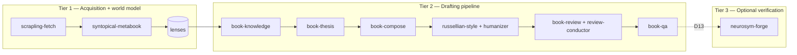
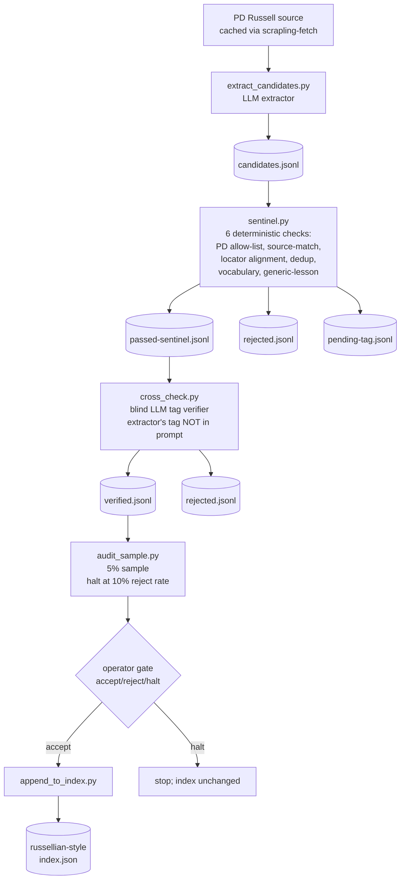
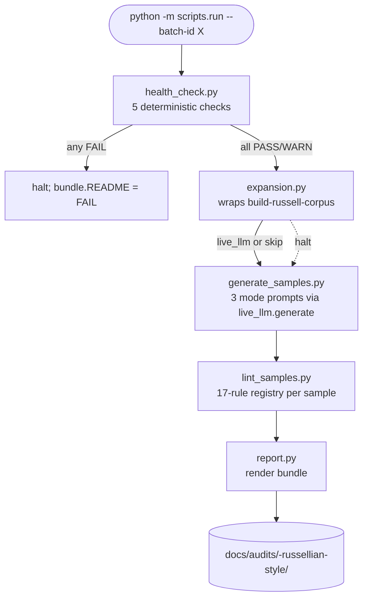
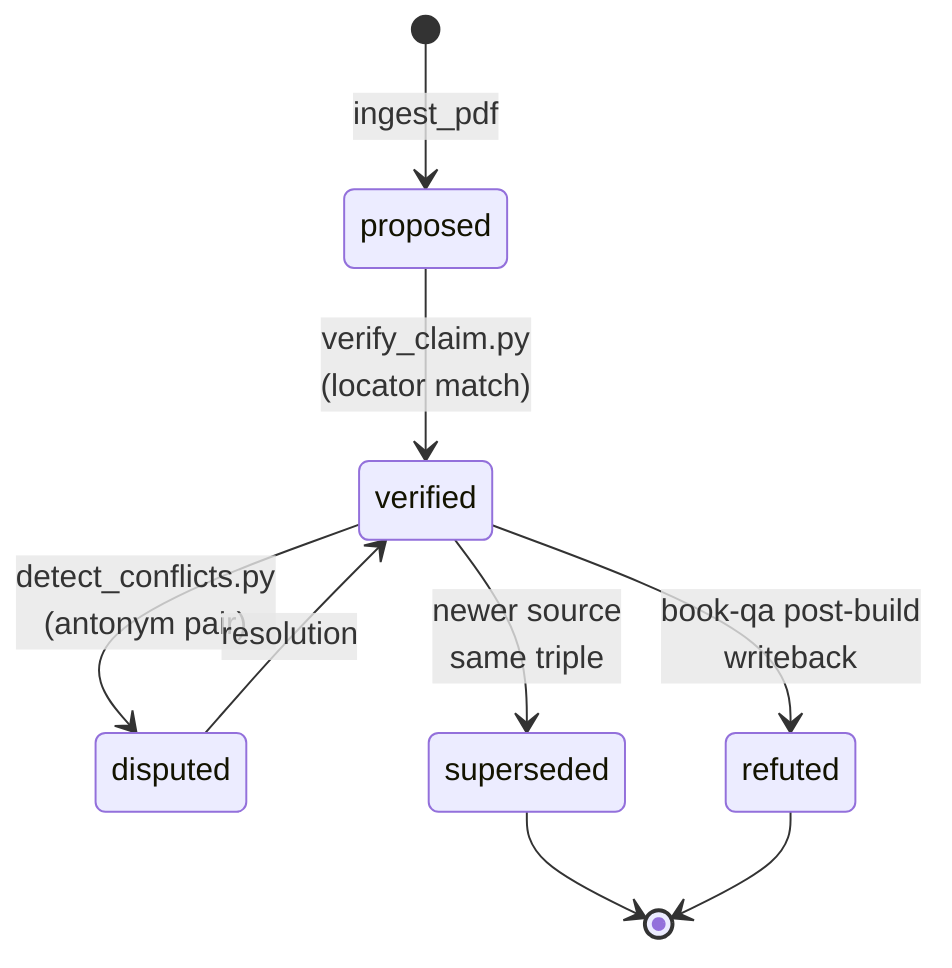
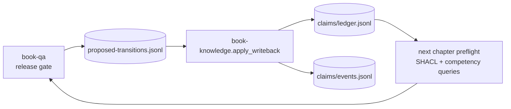
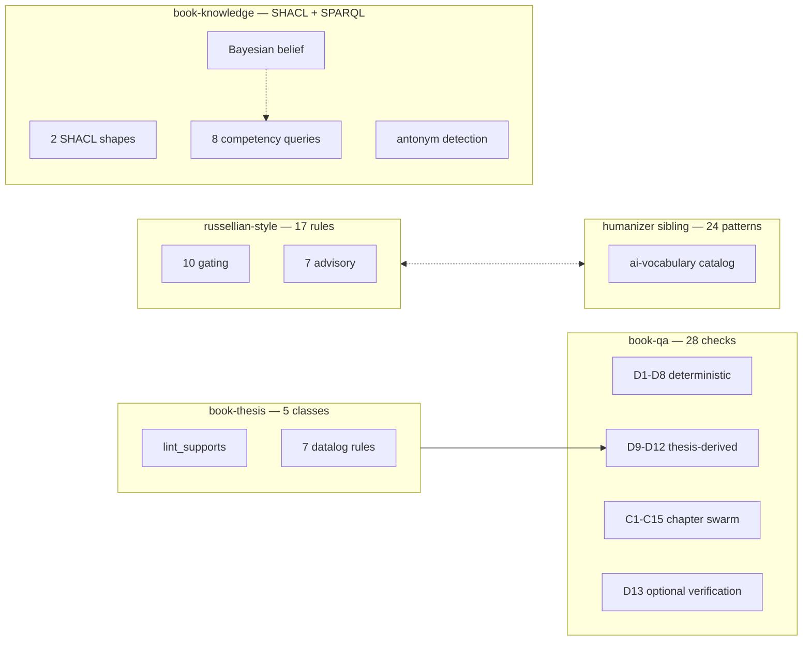
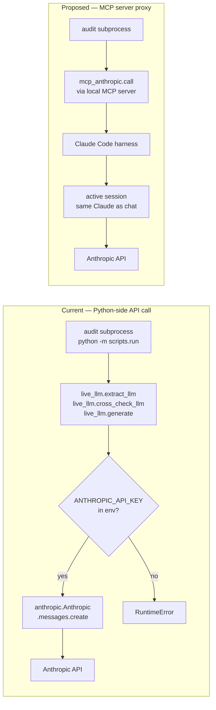

# README rewrite — Implementation Plan

> **For agentic workers:** REQUIRED SUB-SKILL: Use superpowers:subagent-driven-development (recommended) or superpowers:executing-plans to implement this plan task-by-task. Steps use checkbox (`- [ ]`) syntax for tracking.

**Goal:** Rewrite the top-level `README.md` (1204 lines, 16 H2 sections) into a Russell-voiced, Mermaid-diagrammed, per-section-lint-gated document that reflects the current state of the suite (including the new `tools/build-russell-corpus/`, `tools/russellian-style-audit/`, audit-bundle pattern, and 80+ check QA grammar).

**Architecture:** 19 commits on `feat/readme-rewrite`, one per section, executed in an order that lands the lint-gate infrastructure first, then iterates through sections in a sequence that lets each commit's gate run in isolation. New tool `tools/readme-lint/` ships with the rewrite, exposing `make readme-lint` and a lefthook pre-commit hook. Mode-per-section voice declared via HTML comment; lint runner reads the comment to choose discipline. Sections that legitimately violate a rule (Bermuda narrative + numbered scenes) carry a `<!-- lint-disable: <rule> reason=<short> -->` comment.

**Tech Stack:** Markdown, Mermaid (GitHub-rendered), Python ≥3.11, pytest 8.x, the existing russellian-style skill_api. The lint runner depends on spaCy + en_core_web_sm + markdown-it-py installed in `tools/readme-lint/.venv`.

**Spec:** `docs/specs/2026-05-22-readme-rewrite-design.md` (commit `327797b`).

---

## File structure

```
tools/readme-lint/                            (NEW)
├── pyproject.toml
├── scripts/
│   ├── __init__.py
│   └── lint_readme.py
└── tests/
    ├── __init__.py
    ├── fixtures/
    │   ├── pass.md
    │   ├── over_threshold.md
    │   └── with_ignore.md
    └── test_lint_readme.py

Makefile                                      (MODIFY: add readme-lint target)
lefthook.yml                                  (MODIFY: add pre-commit hook)
README.md                                     (REWRITE: 16 sections deepened + 3 new)
```

The README is rewritten in place. Each task's commit advances the README one section at a time. The order is chosen so:
1. Lint-gate infrastructure (Tasks 1-2) lands first so every subsequent task's section can be gated.
2. The polemic-mode section (Task 3, §4 Fingerprint problem) is rewritten next — this is the most demanding mode and establishes the discipline anchor.
3. Technical-exposition sections land in topical groups (pipeline → skills → tools → core concepts → QA grammar → quickstart).
4. The narrative section (Task 11, §12 Bermuda manual) lands midway.
5. The new "Auditing the suite" section (Task 12, §13) lands after the new tool sections it references.
6. Refresh-only sections (Tasks 13-15) clean up.
7. Intro/index sections (Tasks 16-18) land last when the rest is settled so the index reflects the real shape.
8. Contributing + Documentation + License are batched into the final commit (Task 19).

---

## Convention: commit policy (CRITICAL)

Every commit subject is literal text exactly as specified in the task. NO body. NO `Co-Authored-By` for Claude/Sonnet/Opus/Anthropic/AI. After each commit, run `git log -1 --format='%B'` to verify only the subject appears. If anything beyond the subject is present, immediately amend with `git commit --amend -m "<exact subject>"`. This rule has been violated in prior cycles on this repo; do not repeat.

---

## Convention: voice mode declaration

Every section's first line after the H2 heading is an HTML comment declaring the voice mode:

```html
<!-- voice: technical-exposition -->
```

Valid modes: `technical-exposition`, `narrative-editorial`, `polemic`, `mixed`. The `mixed` mode runs the union of all three modes' constraints minus mode-specific allowances; use sparingly (only §13 currently).

Optional lint-disable comment on the line below the voice comment:

```html
<!-- lint-disable: staccato-paragraph-run, listicle-anaphora reason=intentional in narrative -->
```

The runner respects only named rules. Rules not in the ignore set still fire.

---

## Convention: section lint command

After writing or modifying a section's prose, run:

```bash
cd /c/russellian-book-suite/tools/readme-lint && .venv/Scripts/python -m scripts.lint_readme --section "<heading>"
```

The runner prints per-rule violation counts for the named section and exits 0 if gating ≤ 2.

Run the full README lint with:

```bash
make readme-lint
```

(Requires Task 2 completion.)

---

### Task 1: tools/readme-lint skeleton + lint_readme.py + tests

**Files:**
- Create: `tools/readme-lint/pyproject.toml`
- Create: `tools/readme-lint/scripts/__init__.py` (empty)
- Create: `tools/readme-lint/scripts/lint_readme.py`
- Create: `tools/readme-lint/tests/__init__.py` (empty)
- Create: `tools/readme-lint/tests/fixtures/pass.md`
- Create: `tools/readme-lint/tests/fixtures/over_threshold.md`
- Create: `tools/readme-lint/tests/fixtures/with_ignore.md`
- Create: `tools/readme-lint/tests/test_lint_readme.py`

- [ ] **Step 1: Write `pyproject.toml`**

```toml
[build-system]
requires = ["setuptools>=68"]
build-backend = "setuptools.build_meta"

[project]
name = "readme-lint"
version = "0.1.0"
description = "Per-section Russell-style lint gate for the top-level README.md. Parses the README at H2 boundaries, reads per-section voice-mode declarations, runs the russellian-style 17-rule registry against each section."
requires-python = ">=3.11"
dependencies = [
    "spacy>=3.7,<4.0",
    "markdown-it-py>=3.0,<4.0",
]

[project.optional-dependencies]
dev = [
    "pytest>=8.0,<9.0",
]

[tool.setuptools]
packages = ["scripts"]

[tool.pytest.ini_options]
testpaths = ["tests"]
addopts = "-v"
```

- [ ] **Step 2: Create empty package + test files**

```bash
cd /c/russellian-book-suite && mkdir -p tools/readme-lint/scripts tools/readme-lint/tests/fixtures
touch tools/readme-lint/scripts/__init__.py
touch tools/readme-lint/tests/__init__.py
```

- [ ] **Step 3: Set up venv and download spaCy model**

```bash
cd /c/russellian-book-suite/tools/readme-lint
python -m venv .venv
.venv/Scripts/pip install -e ".[dev]"
.venv/Scripts/python -m spacy download en_core_web_sm
```

Expected: install succeeds; spaCy model downloads.

- [ ] **Step 4: Write the three fixture sections**

Create `tools/readme-lint/tests/fixtures/pass.md`:

```markdown
## Pass fixture

<!-- voice: technical-exposition -->

The script provisions the server in four seconds. Each step writes a single line to the journal. The journal is append-only; no step rewrites a prior entry.
```

Create `tools/readme-lint/tests/fixtures/over_threshold.md`:

```markdown
## Over-threshold fixture

<!-- voice: technical-exposition -->

The script might possibly provision the server, perhaps in some number of seconds. It could be argued that the journal is to some extent append-only. The system facilitates the optimization of resource allocation in a robust manner. Furthermore, the journal is fundamentally append-only.
```

Create `tools/readme-lint/tests/fixtures/with_ignore.md`:

```markdown
## With-ignore fixture

<!-- voice: technical-exposition -->
<!-- lint-disable: no-hedging reason=this section explains why hedging exists -->

The script might possibly provision the server, perhaps in some number of seconds. It is, in some sense, append-only.
```

- [ ] **Step 5: Write failing test**

Create `tools/readme-lint/tests/test_lint_readme.py`:

```python
from pathlib import Path

from scripts.lint_readme import (
    SectionLintResult,
    lint_section,
    parse_readme,
    run_full_lint,
)


FIXTURES = Path(__file__).parent / "fixtures"


def test_parse_readme_splits_at_h2_boundaries():
    sample = (
        "# Top heading\n\n"
        "intro text\n\n"
        "## Section A\n\n"
        "<!-- voice: technical-exposition -->\n\n"
        "body A\n\n"
        "## Section B\n\n"
        "<!-- voice: narrative-editorial -->\n"
        "<!-- lint-disable: rhythm-uniform-length reason=intentional -->\n\n"
        "body B\n"
    )
    sections = parse_readme(sample)
    assert len(sections) == 2
    assert sections[0].heading == "Section A"
    assert sections[0].voice == "technical-exposition"
    assert sections[0].ignore == set()
    assert sections[1].heading == "Section B"
    assert sections[1].voice == "narrative-editorial"
    assert sections[1].ignore == {"rhythm-uniform-length"}


def test_parse_readme_missing_voice_raises():
    import pytest
    sample = "## No voice\n\nbody only\n"
    with pytest.raises(ValueError, match="No voice"):
        parse_readme(sample)


def test_lint_section_pass_fixture():
    text = (FIXTURES / "pass.md").read_text(encoding="utf-8")
    sections = parse_readme(text)
    result = lint_section(sections[0])
    assert isinstance(result, SectionLintResult)
    assert result.gating_count <= 2
    assert result.passes is True


def test_lint_section_over_threshold_fixture():
    text = (FIXTURES / "over_threshold.md").read_text(encoding="utf-8")
    sections = parse_readme(text)
    result = lint_section(sections[0])
    assert result.gating_count > 2
    assert result.passes is False


def test_lint_section_with_ignore_filters_named_rule():
    text = (FIXTURES / "with_ignore.md").read_text(encoding="utf-8")
    sections = parse_readme(text)
    result = lint_section(sections[0])
    # no-hedging is ignored; the only remaining gating issue (if any) should be other rules
    no_hedging_issues = [i for i in result.issues if i.linter == "no-hedging"]
    assert no_hedging_issues == []


def test_run_full_lint_returns_per_section_results(tmp_path: Path):
    readme = tmp_path / "README.md"
    readme.write_text(
        (FIXTURES / "pass.md").read_text(encoding="utf-8"),
        encoding="utf-8",
    )
    results, exit_code = run_full_lint(readme)
    assert len(results) == 1
    assert exit_code == 0
```

- [ ] **Step 6: Run, verify failure**

```bash
cd /c/russellian-book-suite/tools/readme-lint && .venv/Scripts/python -m pytest tests/test_lint_readme.py -v
```

Expected: ImportError on `scripts.lint_readme`.

- [ ] **Step 7: Write `scripts/lint_readme.py`**

```python
"""Per-section Russell-style lint runner for the top-level README.md.

Parses the README at H2 boundaries, reads the `<!-- voice: <mode> -->` declaration
required at the top of each section, and runs the russellian-style 17-rule registry
against each section's body. Sections that violate gating rules > 2 cause the runner
to exit 1.

The cross-tool sys.modules namespace eviction is the same workaround used in
tools/russellian-style-audit/scripts/lint_samples.py — when calling skill_api.lint_fragment
from inside another tool's `scripts` package, the runner must temporarily evict that
package so russellian-style's internal `importlib.import_module("scripts.lint_X")` calls
resolve to russellian-style's scripts/* and not the caller's.
"""

from __future__ import annotations

import argparse
import contextlib
import importlib.util
import re
import sys
from dataclasses import dataclass, field
from pathlib import Path

_HERE = Path(__file__).resolve().parent
_REPO_ROOT = _HERE.parent.parent.parent
_RUSSELLIAN_STYLE_ROOT = _REPO_ROOT / "skills" / "russellian-style"


ALL_17_RULES = [
    "no-hedging", "active-voice", "signal-density", "parallel-structure",
    "listicle-abstract", "listicle-anaphora",
    "rhythm-uniform-length", "rhythm-repeated-opening",
    "burstiness", "ai-vocabulary",
    "staccato-paragraph-run", "negation-affirmation-template",
    "this-is-conclusion-overuse", "abstract-subject-run",
    "concrete-instance-density", "epistemic-precision", "paragraph-motion",
]
GATING_RULES = {
    "no-hedging", "active-voice", "signal-density", "parallel-structure",
    "listicle-abstract", "listicle-anaphora",
    "rhythm-uniform-length", "rhythm-repeated-opening",
    "burstiness", "ai-vocabulary",
}
VALID_MODES = {"technical-exposition", "narrative-editorial", "polemic", "mixed"}


@dataclass
class Section:
    heading: str
    voice: str
    ignore: set[str]
    body: str


@dataclass
class SectionLintResult:
    section: Section
    issues: list  # list[LintIssue]
    gating_count: int
    advisory_count: int
    passes: bool = field(init=False)

    def __post_init__(self):
        self.passes = self.gating_count <= 2


@contextlib.contextmanager
def _evict_caller_scripts_namespace():
    """Same workaround as russellian-style-audit/scripts/lint_samples.py."""
    saved = {k: v for k, v in sys.modules.items() if k == "scripts" or k.startswith("scripts.")}
    for k in list(saved):
        del sys.modules[k]
    try:
        yield
    finally:
        for k, v in saved.items():
            sys.modules[k] = v


def _load_russellian_skill_api():
    """Load russellian-style's skill_api in a clean sys.modules state."""
    with _evict_caller_scripts_namespace():
        if str(_RUSSELLIAN_STYLE_ROOT) not in sys.path:
            sys.path.insert(0, str(_RUSSELLIAN_STYLE_ROOT))
        spec = importlib.util.spec_from_file_location(
            "russellian_style_skill_api",
            _RUSSELLIAN_STYLE_ROOT / "skill_api.py",
        )
        module = importlib.util.module_from_spec(spec)
        sys.modules["russellian_style_skill_api"] = module
        spec.loader.exec_module(module)
        return module


_skill_api = _load_russellian_skill_api()
_lint_fragment_raw = _skill_api.lint_fragment


def _lint_fragment(text: str, linters=None):
    with _evict_caller_scripts_namespace():
        return _lint_fragment_raw(text, linters=linters)


_VOICE_RE = re.compile(r"<!--\s*voice:\s*(\S+)\s*-->")
_IGNORE_RE = re.compile(r"<!--\s*lint-disable:\s*([^|]+?)\s+reason=([^>]+?)\s*-->")


def parse_readme(text: str) -> list[Section]:
    """Split README text at H2 boundaries. Each section must declare a voice mode."""
    sections: list[Section] = []
    current_heading: str | None = None
    current_voice: str | None = None
    current_ignore: set[str] = set()
    current_body_lines: list[str] = []

    def flush():
        nonlocal current_heading, current_voice, current_ignore, current_body_lines
        if current_heading is not None:
            if current_voice is None:
                raise ValueError(f"Section without voice declaration: {current_heading!r}")
            sections.append(Section(
                heading=current_heading,
                voice=current_voice,
                ignore=current_ignore,
                body="\n".join(current_body_lines).strip() + "\n",
            ))
        current_heading = None
        current_voice = None
        current_ignore = set()
        current_body_lines = []

    for line in text.splitlines():
        if line.startswith("## "):
            flush()
            current_heading = line[3:].strip()
            continue
        if current_heading is None:
            continue
        voice_match = _VOICE_RE.search(line)
        if voice_match and current_voice is None:
            current_voice = voice_match.group(1)
            if current_voice not in VALID_MODES:
                raise ValueError(f"Invalid voice mode {current_voice!r} in section {current_heading!r}")
            continue
        ignore_match = _IGNORE_RE.search(line)
        if ignore_match:
            rules = [r.strip() for r in ignore_match.group(1).split(",") if r.strip()]
            current_ignore.update(rules)
            continue
        current_body_lines.append(line)
    flush()
    return sections


def lint_section(section: Section) -> SectionLintResult:
    """Run lint_fragment with all 17 rules; filter out ignored rules; classify."""
    issues = _lint_fragment(section.body, linters=ALL_17_RULES)
    issues = [i for i in issues if i.linter not in section.ignore]
    gating_count = sum(1 for i in issues if i.linter in GATING_RULES)
    advisory_count = len(issues) - gating_count
    return SectionLintResult(
        section=section,
        issues=issues,
        gating_count=gating_count,
        advisory_count=advisory_count,
    )


def run_full_lint(readme_path: Path) -> tuple[list[SectionLintResult], int]:
    """Lint every section of README.md. Returns (results, exit_code)."""
    text = readme_path.read_text(encoding="utf-8")
    sections = parse_readme(text)
    results = [lint_section(s) for s in sections]
    exit_code = 0 if all(r.passes for r in results) else 1
    return results, exit_code


def _print_results(results: list[SectionLintResult]) -> None:
    for r in results:
        flag = "PASS" if r.passes else "FAIL"
        print(f"[{flag}] §{r.section.heading} (mode={r.section.voice}): gating={r.gating_count}, advisory={r.advisory_count}")
        if not r.passes:
            for issue in r.issues:
                if issue.linter in GATING_RULES:
                    print(f"  - [{issue.linter}] L{issue.line}: {issue.message[:80]}")


def main() -> int:
    parser = argparse.ArgumentParser()
    parser.add_argument("--readme", type=Path, default=_REPO_ROOT / "README.md",
                        help="Path to README.md (default: repo root)")
    parser.add_argument("--section", type=str, default=None,
                        help="Limit to a single section by heading (case-insensitive substring)")
    args = parser.parse_args()
    results, exit_code = run_full_lint(args.readme)
    if args.section:
        needle = args.section.lower()
        results = [r for r in results if needle in r.section.heading.lower()]
        exit_code = 0 if all(r.passes for r in results) else 1
    _print_results(results)
    return exit_code


if __name__ == "__main__":
    raise SystemExit(main())
```

- [ ] **Step 8: Run tests**

```bash
.venv/Scripts/python -m pytest tests/test_lint_readme.py -v
```

Expected: 6 passed.

- [ ] **Step 9: Commit**

```bash
cd /c/russellian-book-suite && git add tools/readme-lint && git commit -m "tools/readme-lint: per-section russell-style lint gate for README"
```

EXACT message: `tools/readme-lint: per-section russell-style lint gate for README`

After commit: `git log -1 --format='%B'`. Subject only. Amend if not.

---

### Task 2: Wire make target + lefthook hook

**Files:**
- Modify: `Makefile` (repo root)
- Modify: `lefthook.yml` (repo root)

- [ ] **Step 1: Append to `Makefile`**

Read current `Makefile`. Append (after the existing `lint` target):

```makefile
.PHONY: readme-lint
readme-lint:
	cd tools/readme-lint && .venv/Scripts/python -m scripts.lint_readme
```

- [ ] **Step 2: Verify `make readme-lint` runs**

```bash
cd /c/russellian-book-suite && make readme-lint
```

Expected: exit code 0 IF the current README has voice declarations on every section, OR exit code 1 with `Section without voice declaration: <heading>` printed for the existing sections (which is the expected state pre-rewrite).

If the runner errors with "Section without voice declaration" — that's the correct signal. The rewrite is what will add the declarations. The runner is working as designed.

- [ ] **Step 3: Add lefthook entry**

Read current `lefthook.yml`. Locate the `pre-commit:` block. Add a new command entry:

```yaml
pre-commit:
  commands:
    # ... existing entries ...
    readme-lint:
      glob: 'README.md'
      run: make readme-lint
```

The exact YAML structure depends on lefthook's schema; if existing commands use `nix develop -c <cmd>`, mirror that wrapping. The goal: when `README.md` is staged, run `make readme-lint` before allowing the commit.

- [ ] **Step 4: Test the hook syntax**

```bash
cd /c/russellian-book-suite && lefthook validate
```

Expected: lefthook reports the config is valid. If lefthook is not on PATH, enter the Nix dev shell first (`nix develop`).

- [ ] **Step 5: Commit**

```bash
git add Makefile lefthook.yml && git commit -m "tools/readme-lint: wire make target and lefthook pre-commit hook"
```

EXACT message: `tools/readme-lint: wire make target and lefthook pre-commit hook`

After commit: `git log -1 --format='%B'`. Subject only. Amend if not.

---

## Section-rewrite tasks (Tasks 3-18)

Each section-rewrite task follows the same shape. The task specifies:

1. **Section number and heading** from the current README.
2. **Voice mode** (already locked from the spec).
3. **Lint-disable comment**, if any.
4. **Content outline** — the points the section must cover.
5. **Mermaid diagrams** to include (when applicable).
6. **Calibration anchor** — a paragraph or two written in the right voice as a stylistic anchor for the rewriter.
7. **Implementation steps** — write, lint, commit.

The executor writes the section's prose to match the outline and the calibration anchor. The lint gate is the success criterion: gating ≤ 2 per section.

---

### Task 3: §4 The fingerprint problem — tighten to polemic mode pass

**Files:** Modify `README.md` (section 4 currently at lines ~75-79)

**Voice:** `polemic`
**Lint-disable:** none
**Content outline:** The opening claim (hosted AI prose has a recognisable fingerprint). One concrete example a domain editor would spot in the first paragraph. The diagnosis (the fingerprint comes from a single-prompt pipeline forced to do five distinct jobs at once). The thesis (separating the jobs into pipeline stages is the fix, and the suite is the implementation of that fix). One paragraph each; four paragraphs total.

**Calibration anchor** (the implementer rewrites the existing section to match this rhythm):

> Hosted AI prose tools leave a recognisable signature that any trained reader identifies within the first paragraph. Sentences average eighteen words. Paragraphs cluster in threes. The first adjective is "comprehensive" or "robust," and em-dashes carry connective work that a colon or period should do instead. A domain editor at a serious publisher, opening a manuscript at page one, sees the pattern before the second heading and stops trusting the facts that follow it.

The existing section already opens with this paragraph. Keep it. Add the diagnosis paragraph (single-prompt pipeline forced to do five jobs) and the thesis paragraph (pipeline stages, gates, the suite). Tighten the existing "separate stages defeat the pattern" paragraph to remove "Each stage" anaphora (3 consecutive sentence-starts).

- [ ] **Step 1: Read the current §4 to know what to preserve**

```bash
cd /c/russellian-book-suite && sed -n '75,90p' README.md
```

- [ ] **Step 2: Rewrite the section**

Replace the content between `## The fingerprint problem` (exclusive) and `## The three tiers` (exclusive). The new section begins with:

```html
<!-- voice: polemic -->
```

Then the four paragraphs per the outline above. Keep the existing opening paragraph (already strong). Replace the second paragraph (currently anaphoric "Each stage runs… Each stage refuses…"). Add a third paragraph naming the five jobs (fact ingestion, drafting, prose linting, persona review, defect gating) and the consequence of conflating them. Add a fourth paragraph: the suite is the fix.

- [ ] **Step 3: Lint the section**

```bash
cd /c/russellian-book-suite/tools/readme-lint && .venv/Scripts/python -m scripts.lint_readme --section "fingerprint"
```

Expected: `[PASS] §The fingerprint problem (mode=polemic): gating=<=2, advisory=<any>`

If gating > 2, the rewriter iterates: read the printed violations, revise the offending lines, re-lint. Common polemic-mode pitfalls: tricolons without asymmetric tails, conclusion-without-earning ("clearly", "obviously"), pure outrage. Russell's polemic discipline (`assets/system-prompts/polemic.md`) is the calibration source.

- [ ] **Step 4: Commit**

```bash
cd /c/russellian-book-suite && git add README.md && git commit -m "README: §4 fingerprint problem in polemic voice"
```

EXACT message: `README: §4 fingerprint problem in polemic voice`

After commit: `git log -1 --format='%B'`. Subject only. Amend if not.

---

### Task 4: §5 The three tiers — deepen + Mermaid replacement

**Files:** Modify `README.md` (section 5 currently at lines ~81-93)

**Voice:** `technical-exposition`
**Content outline:** One paragraph per tier explaining what the tier owns, what its input is, what its output is, what crosses the boundary to the next tier. Replace the implicit-ASCII tier description with an explicit Mermaid grouping diagram. Note tier 3 is opt-in.

**Mermaid diagram to add (top of section, after the voice declaration):**



**Calibration anchor:**

> The first tier decides what the suite is allowed to claim. `scrapling-fetch` is the suite's only outbound network surface; everything else reads from the cached corpus it produces. `syntopical-metabook` synthesises that corpus into a world model — a topic map, disputed-question tables, per-chapter lenses — that the drafting pipeline reads as ground truth. The two skills are sequential; the second never overtakes the first.

- [ ] **Step 1: Rewrite the section**

After the voice declaration, lead with the Mermaid diagram. Then one paragraph per tier (4-5 sentences each), following the calibration anchor's pattern. Close with a sentence noting that tier 3 is opt-in and the default pipeline ships without it.

- [ ] **Step 2: Lint**

```bash
cd /c/russellian-book-suite/tools/readme-lint && .venv/Scripts/python -m scripts.lint_readme --section "three tiers"
```

Expected: PASS, gating ≤ 2.

- [ ] **Step 3: Commit**

```bash
cd /c/russellian-book-suite && git add README.md && git commit -m "README: §5 three tiers with mermaid grouping diagram"
```

EXACT message: `README: §5 three tiers with mermaid grouping diagram`

---

### Task 5: §6 The pipeline — D1 Mermaid + audit-loop arrow

**Files:** Modify `README.md` (section 6 currently at lines ~95-129)

**Voice:** `technical-exposition`
**Content outline:** One paragraph framing the pipeline as sequential-within-tier. The Mermaid D1 diagram (top-level pipeline). One paragraph on the side-arrows: persona findings can return a chapter to drafting; QA writeback updates the claim ledger; gap report feeds the next acquisition. Replace the existing two ASCII diagrams (the tier overview and the side-arrows list) with the single Mermaid D1 + a short paragraph each on the three loops.

**Mermaid diagram D1 (the pipeline):**

```mermaid
graph TD
    sources[sources, papers<br/>PDFs · papers · URLs]
    sources --> tier1[Tier 1<br/>acquisition + world model]
    tier1 -->|syntopical/lenses/*.md| tier2[Tier 2<br/>drafting pipeline]
    tier2 -->|manuscript.md · .html · .pdf| release[release bundle]
    tier2 -. enable_verification=true .-> tier3[Tier 3<br/>optional verification]
    tier3 -. D13 defects .-> tier2

    bookqa[book-qa] -. proposed-transitions.jsonl .-> tier1
    review[review-conductor] -. verdict.json .-> tier2
    syntopical[syntopical-metabook] -. pending-seeds.txt .-> tier1
```

**Calibration anchor:**

> The pipeline is sequential within each tier: stage N reads stage N-1's outputs and writes its own. No stage reaches backwards. Two side-arrows and a feed-back path close the loop. Persona findings can return a chapter to drafting before a release clears its gate. Post-build QA writes proposed-transitions to the claim ledger so a defect surfaced at the release stage corrects the underlying facts for the next run. The syntopical layer has its own cycle: gap report appends uncovered thesis-node statements to acquisition pending-seeds, seeding the next acquire run.

- [ ] **Step 1: Rewrite the section**

Voice declaration, framing paragraph, D1 Mermaid diagram, then three short paragraphs (one per loop: persona → drafting, QA → claims, syntopical → acquisition).

- [ ] **Step 2: Lint + commit**

```bash
cd /c/russellian-book-suite/tools/readme-lint && .venv/Scripts/python -m scripts.lint_readme --section "pipeline"
cd /c/russellian-book-suite && git add README.md && git commit -m "README: §6 pipeline with D1 mermaid and explicit audit loops"
```

EXACT message: `README: §6 pipeline with D1 mermaid and explicit audit loops`

---

### Task 6: §7 The skills — refresh 8 details against current code

**Files:** Modify `README.md` (section 7 currently at lines ~131-553)

**Voice:** `technical-exposition`
**Content outline:** Frame the section as a per-skill reference: each skill gets a `<details>` block (preserving the existing collapsible UX) with sub-sections "What it does", "Inputs / outputs", "When to invoke", "When NOT to invoke", "Trigger phrases", "Example walkthrough", "Where to dive deeper". For this rewrite, EVERY function name and CLI command in those blocks must match the current code. The suite-wide review (`docs/audits/2026-05-21-suite-wide-linter-review.md`) found drift; fix it here.

**Specific corrections known from the audit:**
- `retrieve_corpus_anchor.py`'s public function is `retrieve_anchor`, not `retrieve_corpus_anchor`.
- `russellian-style.skill_api` has 17 rules in `_LINTER_REGISTRY`; the existing details block doesn't surface this distinction. Add the line: "The default `lint_fragment` call runs 10 gating rules; the other 7 advisory rules require explicit naming. See §10 for the full registry."
- `book-qa` has NO `skill_api.py` — the existing details block may imply one exists. Note explicitly that book-qa is CLI-only.
- `book-thesis` has `read_thesis_tree` only; no `lint_supports.py` API.

**Implementation steps for this task:**

- [ ] **Step 1: For each of the 8 skills, audit the current details block against current code**

For each skill in [`scrapling-fetch`, `syntopical-metabook`, `sibling_skills`, `booklogic`, `book-knowledge`, `book-thesis`, `book-compose`, `russellian-style`, `book-review`, `review-conductor`, `book-qa`, `neurosym-forge`]:

```bash
ls /c/russellian-book-suite/skills/<skill>/scripts/
cat /c/russellian-book-suite/skills/<skill>/skill_api.py 2>/dev/null | head -50
```

Note any function-name mismatches between the current details block and the actual code. List them in a scratch note before rewriting.

- [ ] **Step 2: Rewrite the section**

For each `<details>` block:
- Add a `<!-- voice: technical-exposition -->` declaration immediately after the `## The skills` heading (single declaration covers all 8 details blocks since they share the section).
- Update function names and CLI commands per Step 1's notes.
- Add the "public skill_api shape" line where one exists (russellian-style, book-compose, book-thesis, book-knowledge). Where one does not (book-qa, scrapling-fetch as bare module), note that explicitly.
- For russellian-style specifically, add a one-line cross-reference to §10 The QA grammar for the full rule registry.

- [ ] **Step 3: Lint + commit**

```bash
cd /c/russellian-book-suite/tools/readme-lint && .venv/Scripts/python -m scripts.lint_readme --section "skills"
cd /c/russellian-book-suite && git add README.md && git commit -m "README: §7 skills refreshed against current code"
```

EXACT message: `README: §7 skills refreshed against current code`

---

### Task 7: §8 Tools — NEW section

**Files:** Modify `README.md` (insert new section between §7 The skills and the current §8 Core concepts)

**Voice:** `technical-exposition`
**Content outline:** Open with a single paragraph explaining why `tools/` exists separately from `skills/` (one-shot operator runs vs. runtime pipeline skills). Three subsections, one per tool. Each subsection has: what it does, why it exists, the pipeline diagram (D4 for build-russell-corpus, D5 for russellian-style-audit), the operator gate, the CLI surface, the live LLM wiring requirement (for the two tools that use it), pointers to spec/plan/audit-bundle.

**Mermaid D4 (build-russell-corpus pipeline):**



**Mermaid D5 (russellian-style-audit pipeline):**



**Calibration anchor:**

> `tools/` exists because some workflows are one-shot operator runs rather than runtime pipeline stages. Corpus expansion is run quarterly when the russellian-style anchor base needs more coverage; the audit is run per release when the suite's discipline needs validation; the readme-lint runner is invoked on commit. None of these belong inside `skills/`, where every directory is a Claude Code skill the chat session can dispatch. The three tools share a convention: a self-contained `pyproject.toml`, a venv at `tools/<name>/.venv/`, and a CLI entry at `scripts/cli.py` or `scripts/run.py`.

- [ ] **Step 1: Insert the new section**

Place after `## The skills` section closes and before `## Core concepts`. The section starts:

```markdown
## Tools

<!-- voice: technical-exposition -->

[framing paragraph per the calibration anchor]

### `tools/build-russell-corpus/`

[2-3 paragraphs covering: what it does, why (PR #121 origin), the 5 hallucination defences]

[D4 Mermaid]

[2 paragraphs: operator gate + CLI surface + live LLM wiring]

[1 paragraph: spec/plan pointers]

### `tools/russellian-style-audit/`

[same shape, with D5 Mermaid; pointer to most recent bundle at docs/audits/2026-05-21-russellian-style/]

### `tools/readme-lint/` (new in this rewrite)

[1-2 paragraphs: what it does, how to invoke, the lint-disable mechanism]
```

- [ ] **Step 2: Lint + commit**

```bash
cd /c/russellian-book-suite/tools/readme-lint && .venv/Scripts/python -m scripts.lint_readme --section "tools"
cd /c/russellian-book-suite && git add README.md && git commit -m "README: §8 tools (build-russell-corpus, audit, readme-lint)"
```

EXACT message: `README: §8 tools (build-russell-corpus, audit, readme-lint)`

---

### Task 8: §9 Core concepts — D2 + D3 + D8 Mermaid; Bayesian paragraph

**Files:** Modify `README.md` (section 9 currently at lines ~555-935)

**Voice:** `technical-exposition`
**Content outline:** Keep the existing core-concept subsections (The book workspace, The claim ledger and PROV-O provenance, The booklogic JSON/EDN boundary, etc.). Replace the workspace ASCII tree with Mermaid D2. Replace the 5-state machine ASCII with Mermaid D3. Add a new subsection "Bayesian belief propagation" with a paragraph on the ×0.95/×0.85 damping factors. Add D8 (closed-loop ledger writeback).

**Mermaid D2 (workspace tree):** Use `graph TD` with subgraph nesting to show ownership labels. Each directory is a node; the owner skill is the subgraph label. Eight subgraphs (raw/, wiki/, claims/, graph/, chapters/, book/, qa/, thesis/, syntopical/, reports/).

**Mermaid D3 (5-state machine):**



**Mermaid D8 (closed-loop ledger writeback):**



**Bayesian paragraph (insert after the claim-ledger state machine subsection):**

> Belief propagation runs a Bayesian damping pass over the provenance DAG so a single source cannot double-count by appearing twice in the witness chain. `propagate_belief.py` iterates up to 20 rounds, converging at delta < 10⁻⁴. Open counter-claims damp the posterior by ×0.95 per round; addressed counter-claims by ×0.85; dismissed counter-claims do not damp. Posteriors clamp to [0.05, 0.95] so no claim becomes either an unfalsifiable axiom or an unredeemable falsehood. The propagation writes timestamped snapshots to `claims/snapshots/` and appends `p_posterior` records to the ledger; it is advisory, not blocking, and feeds the defeasible competency queries that the preflight does block on.

- [ ] **Step 1: Replace the ASCII tree with D2 Mermaid**

Locate the existing workspace tree (currently lines ~560-625 inside the "The book workspace" subsection). Replace the ASCII block with the Mermaid D2 block. Keep the surrounding prose.

- [ ] **Step 2: Replace the ASCII 5-state machine with D3 Mermaid**

Locate the existing state diagram (currently inside "The claim ledger and PROV-O provenance" subsection). Replace with D3 Mermaid.

- [ ] **Step 3: Add D8 closed-loop ledger writeback**

Insert D8 after the state-machine subsection. Add 1-2 paragraphs framing it: book-qa surfaces defects; the writeback transitions the underlying claim's state; the next preflight enforces the new state via SHACL. Pull from `docs/specs/2026-05-11-bundle-c-closed-loop-ledger-design.md` if needed.

- [ ] **Step 4: Add Bayesian belief propagation paragraph**

Insert the paragraph per the outline above. Place after the state-machine subsection and before the booklogic boundary subsection.

- [ ] **Step 5: Add voice declaration**

Insert `<!-- voice: technical-exposition -->` immediately after the `## Core concepts` heading.

- [ ] **Step 6: Lint + commit**

```bash
cd /c/russellian-book-suite/tools/readme-lint && .venv/Scripts/python -m scripts.lint_readme --section "core concepts"
cd /c/russellian-book-suite && git add README.md && git commit -m "README: §9 core concepts (D2 D3 D8 mermaid; bayesian paragraph)"
```

EXACT message: `README: §9 core concepts (D2 D3 D8 mermaid; bayesian paragraph)`

---

### Task 9: §10 The QA grammar — NEW section

**Files:** Modify `README.md` (insert new section between §9 Core concepts and §11 Quickstart)

**Voice:** `technical-exposition`
**Content outline:** Frame the section as the suite's check taxonomy. Five subsections, one per linter-bearing skill, plus the humanizer sibling. End with the cross-skill coverage map (D6 Mermaid) and a "known fragmentation" subsection that links each gap to a recommendation in §13.

**Mermaid D6 (cross-skill coverage map):**



**Calibration anchor:**

> The suite's quality contract is enforced by roughly eighty distinct checks distributed across five skills plus a sibling. The distribution is not arbitrary: each skill owns the defect family it knows best. `russellian-style` owns sentence- and paragraph-level prose discipline; `book-qa` owns release-gate structural defects; `book-thesis` owns argument-spine consistency; `book-knowledge` owns claim-shape and provenance integrity; `humanizer` (loaded as a sibling, not embedded here) owns the AI-prose-fingerprint catalog. The compositions matter: ai-vocabulary detection appears in three places, and the suite-wide audit (§13) identifies that as drift worth consolidating.

- [ ] **Step 1: Insert the new section**

Place after `## Core concepts` closes and before `## Quickstart`. The section structure:

```markdown
## The QA grammar

<!-- voice: technical-exposition -->

[framing paragraph per calibration anchor]

### russellian-style — 17 prose rules

[table from docs/audits/2026-05-21-suite-wide-linter-review.md: 10 gating + 7 advisory]
[paragraph: invocation pattern + sys.modules workaround for cross-tool callers]

### book-qa — 28 release-gate checks

[table: D1-D8 + D9-D12 + D13 + C1-C15]
[paragraph: sentinel hard-fail policy + healer cap + waiver mechanism]

### book-thesis — 5 check classes

[table: lint_supports outputs + 7 datalog rules]

### book-knowledge — SHACL + SPARQL + Bayesian

[2 SHACL shapes; 8 competency queries (4 coverage + 1 consistency + 3 defeasible);
BLOCKING_DEFEASIBLE policy; Bayesian damping; antonym-pair detection;
locator verification]

### humanizer sibling — 24 patterns

[1 paragraph: what sibling-skill loading is; why patterns are external;
how lint_ai_vocabulary augments at runtime]

### Cross-skill coverage map

[D6 mermaid]

### Known fragmentation

[bullet list linking each gap to its §13 recommendation: 3x ai-vocabulary
duplication, 7 hidden advisory rules, no automatic post-generation trigger]
```

- [ ] **Step 2: Lint + commit**

```bash
cd /c/russellian-book-suite/tools/readme-lint && .venv/Scripts/python -m scripts.lint_readme --section "qa grammar"
cd /c/russellian-book-suite && git add README.md && git commit -m "README: §10 QA grammar (80+ checks, D6 mermaid)"
```

EXACT message: `README: §10 QA grammar (80+ checks, D6 mermaid)`

---

### Task 10: §11 Quickstart — lint-on-demand + live_llm wiring

**Files:** Modify `README.md` (section 11 currently at lines ~937-1048)

**Voice:** `technical-exposition`
**Content outline:** Preserve the existing quickstart's "folder of PDFs to gated draft in under ten minutes" arc. Add two subsections: "Linting prose on demand" (the canonical `lint_fragment` invocation pattern with the sys.modules workaround code snippet) and "Wiring a live LLM caller" (what `ANTHROPIC_API_KEY` does, where `live_llm.py` lives, why the MCP-server refactor is open).

**Code snippet for "Linting prose on demand":**

```python
import sys
from pathlib import Path

# Workaround for the scripts.* namespace collision noted in §10 and §13.
# Future: this will be unnecessary once the rename in recommendation #7 lands.
saved = {k: v for k, v in sys.modules.items() if k == "scripts" or k.startswith("scripts.")}
for k in list(saved):
    del sys.modules[k]
try:
    sys.path.insert(0, "/path/to/russellian-book-suite/skills/russellian-style")
    from skill_api import lint_fragment
    issues = lint_fragment(your_text, linters=None)  # 10 default gating rules
    for issue in issues:
        print(f"[{issue.linter}] L{issue.line}: {issue.message}")
finally:
    for k, v in saved.items():
        sys.modules[k] = v
```

- [ ] **Step 1: Add voice declaration + the two new subsections**

Place voice declaration after the `## Quickstart` heading. Append the two new subsections to the end of the existing quickstart content.

- [ ] **Step 2: Lint + commit**

```bash
cd /c/russellian-book-suite/tools/readme-lint && .venv/Scripts/python -m scripts.lint_readme --section "quickstart"
cd /c/russellian-book-suite && git add README.md && git commit -m "README: §11 quickstart with lint-on-demand and live_llm wiring"
```

EXACT message: `README: §11 quickstart with lint-on-demand and live_llm wiring`

---

### Task 11: §12 End-to-end: the Bermuda manual — deepen as narrative

**Files:** Modify `README.md` (section 12 currently at lines ~1050-1101)

**Voice:** `narrative-editorial`
**Lint-disable:** `<!-- lint-disable: staccato-paragraph-run reason=scene-anchored short sentences are deliberate -->`

**Content outline:** Rewrite as a 7-9 paragraph story rather than a feature list. The arc:
1. Concrete scene: the operator (named — pick a generic name like "the operator" or use Charles since it's his repo) opens `examples/bermuda-manual/` for the first time.
2. What they see: the workspace tree (ref D2), the contract file, the empty `book/releases/` directory.
3. The first command: `make ingest` (or whatever the current entrypoint is — verify against `examples/bermuda-manual/Makefile`). What runs, what gets written, what fails on the first try.
4. The first gate failure: SHACL surfaces an unsupported claim, the operator opens `qa/defects.json`, finds the offending paragraph.
5. The fix: the operator either verifies the claim against the source, ingests a new source, or accepts the limitation.
6. The persona pass: the seven-persona panel returns; one persona soft-gates.
7. The release: SHA-tagged, PDF rendered, manuscript committed.
8. Pressure-changing closer: what the operator learns at gate failure that they would not learn without the gate.

**Calibration anchor (one paragraph as stylistic target):**

> The operator opens `examples/bermuda-manual/` on a Tuesday morning expecting a sample workspace. What they find is a directory tree with eight empty subtrees, a `CLAUDE.md` marker, and one file under `chapters/contracts/` describing a chapter on the cedar blight of 1946. The contract names three claims the chapter must address, the seven personas it must satisfy, and the word-count range it must hit. Everything else — the source corpus, the wiki synthesis, the claim ledger, the draft — is to be produced by running the pipeline. The operator runs `make ingest`.

- [ ] **Step 1: Read the current Bermuda section + the example Makefile**

```bash
cd /c/russellian-book-suite && sed -n '1050,1105p' README.md
ls examples/bermuda-manual/
cat examples/bermuda-manual/Makefile 2>/dev/null || echo "no Makefile"
```

Note the actual entrypoint command(s). If the example has changed since the README was written, the rewrite must reflect the current entrypoint.

- [ ] **Step 2: Rewrite the section as a 7-9 paragraph narrative**

Voice declaration + lint-disable comment immediately after the `## End-to-end: the Bermuda manual` heading. Then the narrative. Use named actor ("the operator" is fine), concrete sensory anchors (the workspace tree, the gate-failure JSON), pressure-changing closer.

- [ ] **Step 3: Lint + commit**

```bash
cd /c/russellian-book-suite/tools/readme-lint && .venv/Scripts/python -m scripts.lint_readme --section "bermuda"
cd /c/russellian-book-suite && git add README.md && git commit -m "README: §12 bermuda manual as narrative"
```

EXACT message: `README: §12 bermuda manual as narrative`

---

### Task 12: §13 Auditing the suite — NEW section

**Files:** Modify `README.md` (insert new section between §12 Bermuda manual and §14 Local-only constraint — currently the section that becomes §14 was §13 in the old structure)

**Voice:** `mixed`
**Content outline:** Open polemically (the suite was built to lint others; this section is the audit of what it found about itself). Then technical: the audit-bundle pattern, the two most recent audits, the 8 recommendations table, the live_llm boundary diagram (D7).

**Mermaid D7 (live_llm architectural boundary):**



**Recommendations table (rows from `docs/audits/2026-05-21-suite-wide-linter-review.md`):**

| # | Recommendation | Status | Source |
| --- | --- | --- | --- |
| 1 | Automatic post-generation lint trigger in russellian-style SKILL.md | Open | suite-wide-review §Recommendations |
| 2 | Promote 7 advisory rules to lint_fragment default (or add `all=True`) | Open | suite-wide-review §Recommendations |
| 3 | Unify the 3 ai-vocabulary detectors | Open | suite-wide-review §Recommendations |
| 4 | Give book-qa a skill_api | Open | suite-wide-review §Recommendations |
| 5 | Prose linting in lefthook pre-commit (partially adopted: readme-lint hook ships in this rewrite) | Partial | suite-wide-review §Recommendations |
| 6 | `make audit` master target | Open | suite-wide-review §Recommendations |
| 7 | Rename per-skill `scripts/` packages to fix namespace collision | Open | suite-wide-review §Recommendations |
| 8 | `docs/skill-triggers.md` master index | Open | suite-wide-review §Recommendations |

**Calibration anchor (polemic opener):**

> The suite was built to lint other people's prose. This section is the record of what it found when it linted itself. Two bugs surfaced in the first audit pass — a sys.modules namespace collision that silently returned zero issues to any cross-tool caller, and an operator-gate contract mismatch that would have crashed the audit after spending live API credits. Eight recommendations followed. The recommendations are listed below with their current status; each is its own brainstorm/spec/plan cycle, and none are closed by this rewrite.

- [ ] **Step 1: Insert the new section**

Place after `## End-to-end: the Bermuda manual` and before `## Local-only constraint`. Structure:

```markdown
## Auditing the suite

<!-- voice: mixed -->

[polemic opener per calibration anchor]

### The audit-bundle pattern

[1-2 paragraphs: where bundles live, what files they contain, how to read them]

### The two most recent audits

[1 paragraph on docs/audits/2026-05-21-russellian-style/ (per-skill audit)]
[1 paragraph on docs/audits/2026-05-21-suite-wide-linter-review.md (80+ checks)]

### The 8 ranked recommendations

[recommendations table above]

### The live_llm architectural boundary

[D7 mermaid]
[2 paragraphs: current Python-side path + proposed MCP-server refactor + why open]

### Updating this section

[1 paragraph: future audits update the status table in place; the section is the audit's own ledger]
```

- [ ] **Step 2: Lint + commit**

```bash
cd /c/russellian-book-suite/tools/readme-lint && .venv/Scripts/python -m scripts.lint_readme --section "auditing"
cd /c/russellian-book-suite && git add README.md && git commit -m "README: §13 auditing the suite (D7 mermaid, 8 recommendations)"
```

EXACT message: `README: §13 auditing the suite (D7 mermaid, 8 recommendations)`

---

### Task 13: §14 Local-only constraint — refresh; note live_llm tension

**Files:** Modify `README.md` (section currently at lines ~1103-1117 in the pre-rewrite numbering; will renumber after the inserts)

**Voice:** `technical-exposition`
**Content outline:** Preserve the existing rule (no cloud-hosted LLM at runtime; the suite runs against local sources). Add a paragraph noting the one tension: the `live_llm.py` path in `tools/build-russell-corpus/` and `tools/russellian-style-audit/` does make outbound calls to the Anthropic API when an operator wires it. This is operator-elective and run only at corpus-expansion / audit time, not in the chapter pipeline. Reference §13 for the MCP-server refactor that would close the tension.

- [ ] **Step 1: Add voice declaration + the new paragraph**

After the existing local-only prose, add one paragraph (3-4 sentences) per the outline. Place the voice declaration immediately after the `## Local-only constraint` heading.

- [ ] **Step 2: Lint + commit**

```bash
cd /c/russellian-book-suite/tools/readme-lint && .venv/Scripts/python -m scripts.lint_readme --section "local-only"
cd /c/russellian-book-suite && git add README.md && git commit -m "README: §14 local-only with live_llm tension noted"
```

EXACT message: `README: §14 local-only with live_llm tension noted`

---

### Task 14: §15 Repository layout — add tools/ and docs/audits/

**Files:** Modify `README.md` (section currently at lines ~1119-1158)

**Voice:** `technical-exposition`
**Content outline:** Preserve the existing tree. Add `tools/` (three subtools: build-russell-corpus, russellian-style-audit, readme-lint, each with their own pyproject + venv + scripts + tests) and `docs/audits/` (audit-bundle archive). Cross-reference §8 Tools and §13 Auditing.

- [ ] **Step 1: Add voice declaration + extend the tree**

After the voice declaration, the tree gets two new top-level entries:

```
tools/                             one-shot operator runs (see §8)
├── build-russell-corpus/          50→500 corpus growth pipeline
├── russellian-style-audit/        end-to-end audit
└── readme-lint/                   per-section README lint
docs/audits/                       audit-bundle archive (see §13)
├── 2026-05-21-russellian-style/   per-skill audit bundle
└── 2026-05-21-suite-wide-linter-review.md
```

- [ ] **Step 2: Lint + commit**

```bash
cd /c/russellian-book-suite/tools/readme-lint && .venv/Scripts/python -m scripts.lint_readme --section "repository layout"
cd /c/russellian-book-suite && git add README.md && git commit -m "README: §15 repository layout adds tools/ and docs/audits/"
```

EXACT message: `README: §15 repository layout adds tools/ and docs/audits/`

---

### Task 15: §16 Deep QA: how this README was made — rewrite as audit-trail of this rewrite

**Files:** Modify `README.md` (section currently at lines ~1160-1166)

**Voice:** `narrative-editorial`
**Content outline:** The existing section is one paragraph noting that the README itself was reviewed under the suite's discipline. Rewrite as the audit-trail of the current rewrite: brainstorm spec at `docs/specs/2026-05-22-readme-rewrite-design.md`, plan at `docs/plans/2026-05-22-readme-rewrite.md`, 19 commits on `feat/readme-rewrite`, per-section lint gate via `tools/readme-lint/`, final lint pass via `make readme-lint`. Pressure-changing closer: the README is the only documentation in the repo currently lint-gated by the suite itself.

- [ ] **Step 1: Rewrite the section**

Voice declaration + the new narrative paragraphs (3-4 short paragraphs).

- [ ] **Step 2: Lint + commit**

```bash
cd /c/russellian-book-suite/tools/readme-lint && .venv/Scripts/python -m scripts.lint_readme --section "deep qa"
cd /c/russellian-book-suite && git add README.md && git commit -m "README: §16 deep QA as audit-trail of the rewrite"
```

EXACT message: `README: §16 deep QA as audit-trail of the rewrite`

---

### Task 16: §1 Setting up your environment — add spacy install + consumer venv pattern

**Files:** Modify `README.md` (section 1 currently at lines ~11-25)

**Voice:** `technical-exposition`
**Content outline:** Preserve the existing WSL2 + Nix bootstrap section. Add a paragraph on the russellian-style runtime dependency (spaCy + en_core_web_sm; how to install via `pip install -e skills/russellian-style/.[ci]` + `python -m spacy download en_core_web_sm`). Add a paragraph on the consumer-skill venv pattern (junction-linked to installed-skill venvs to avoid duplicating GB of deps; if missing, junction-link or fresh-install).

- [ ] **Step 1: Add voice declaration + two new paragraphs**

After the existing content, add the two paragraphs per the outline.

- [ ] **Step 2: Lint + commit**

```bash
cd /c/russellian-book-suite/tools/readme-lint && .venv/Scripts/python -m scripts.lint_readme --section "setting up"
cd /c/russellian-book-suite && git add README.md && git commit -m "README: §1 setting up with spacy and consumer venv pattern"
```

EXACT message: `README: §1 setting up with spacy and consumer venv pattern`

---

### Task 17: §2 For readers in a hurry — add pointers to new sections

**Files:** Modify `README.md` (section 2 currently at lines ~27-31)

**Voice:** `technical-exposition`
**Content outline:** Preserve the existing three-paragraph audience split. Add pointers to §8 Tools (for operators running corpus expansion or the audit), §10 The QA grammar (for engineers evaluating the suite's discipline), §13 Auditing the suite (for contributors planning a follow-up).

- [ ] **Step 1: Add voice declaration + extend the audience-split paragraphs**

Insert pointers inline; do not add new paragraphs.

- [ ] **Step 2: Lint + commit**

```bash
cd /c/russellian-book-suite/tools/readme-lint && .venv/Scripts/python -m scripts.lint_readme --section "readers in a hurry"
cd /c/russellian-book-suite && git add README.md && git commit -m "README: §2 readers-in-a-hurry pointers to new sections"
```

EXACT message: `README: §2 readers-in-a-hurry pointers to new sections`

---

### Task 18: §3 Reader questions — Q26-Q32

**Files:** Modify `README.md` (section 3 currently at lines ~33-73)

**Voice:** `technical-exposition`
**Content outline:** Preserve the existing Q1-Q25 (three sub-lists: for authors, for engineers, for both). Add Q26-Q32 distributed across the three sub-lists per audience:

- For authors: Q26 (where do I find the audit bundles?), Q27 (how do I lint a draft on demand?)
- For engineers: Q28 (how do I run the corpus-expansion tool?), Q29 (what does `make readme-lint` do?), Q30 (where is the suite-wide review?), Q31 (what changed since PR #121?)
- For both: Q32 (what is the MCP-server refactor flagged in §13?)

Each Q is `<!-- lint-disable: listicle-abstract, listicle-anaphora reason=reader-questions index by design -->` exempt at the section level (the existing section already has this exemption).

- [ ] **Step 1: Add voice declaration; carry forward the existing lint-disable; add Q26-Q32**

Voice declaration + lint-disable comment immediately after the `## Reader questions` heading. Then the existing prose + new questions in the appropriate sub-lists.

- [ ] **Step 2: Lint + commit**

```bash
cd /c/russellian-book-suite/tools/readme-lint && .venv/Scripts/python -m scripts.lint_readme --section "reader questions"
cd /c/russellian-book-suite && git add README.md && git commit -m "README: §3 reader questions Q26-Q32 for new material"
```

EXACT message: `README: §3 reader questions Q26-Q32 for new material`

---

### Task 19: §17 Documentation + §18 Contributing + §19 License — batched final commit

**Files:** Modify `README.md` (sections currently at lines ~1168-1204)

**Voice:** `technical-exposition` for all three.

**Content for §17 Documentation:**
- Add voice declaration.
- Refresh the spec/plan/runbook/retro links to include `docs/specs/2026-05-22-readme-rewrite-design.md` and `docs/plans/2026-05-22-readme-rewrite.md`.
- Add a row for `docs/audits/<date>-<topic>/` per §13.

**Content for §18 Contributing:**
- Add voice declaration.
- Add a paragraph describing the audit pattern as a contributor workflow (when to run an audit, where to put the bundle, what reviewers look for; refer to §13).
- Add a paragraph on `make readme-lint` as a pre-commit gate that ships with this rewrite (refer to §8).

**Content for §19 License and acknowledgements:**
- Add voice declaration.
- Refresh the year if needed.
- Add an acknowledgement for the audit-bundle pattern's origin.

- [ ] **Step 1: Edit all three sections**

Add voice declarations and the new content per the outlines above.

- [ ] **Step 2: Run the full README lint**

```bash
cd /c/russellian-book-suite && make readme-lint
```

Expected: every section PASSes. If any section fails, fix and re-run before committing.

- [ ] **Step 3: Commit**

```bash
git add README.md && git commit -m "README: §17 docs + §18 contributing + §19 license refresh"
```

EXACT message: `README: §17 docs + §18 contributing + §19 license refresh`

---

## After all tasks

Run the full README lint one more time:

```bash
cd /c/russellian-book-suite && make readme-lint
```

Every section must PASS. If any section regresses (because a later section's content nudged the lint state somehow — unlikely with per-section linting, but possible if the parser misbehaves at a shared boundary), fix the regressing section and add a fix-up commit.

Then follow the standard merge flow:

1. Verify all commits have clean subject-only messages: `git log --format='%H %s%n%b' origin/main..HEAD | grep -i "co-authored\|generated with\|claude\|anthropic"` should return nothing.
2. Push the branch: `git push -u origin feat/readme-rewrite`
3. Create the PR: `gh pr create --base main --head feat/readme-rewrite --title "README: comprehensive russell-voiced rewrite with mermaid diagrams and per-section lint gate" --body "..."`
4. Merge: `gh pr merge <N> --merge --delete-branch`
5. Sync local main: `git checkout main && git pull --ff-only`

---

## Self-review

**1. Spec coverage:**

Every spec section maps to a task:

| Spec section | Task(s) |
| --- | --- |
| Section inventory (19 sections, mode-per-section) | Tasks 3-19 (every existing or new section gets a task) |
| 8 Mermaid diagrams | D1 in Task 5, D2/D3/D8 in Task 8, D4/D5 in Task 7, D6 in Task 9, D7 in Task 12 |
| Lint contract (tools/readme-lint + Makefile + lefthook) | Tasks 1-2 |
| New "Tools" section | Task 7 |
| New "QA grammar" section | Task 9 |
| New "Auditing the suite" section | Task 12 |
| Updates to each existing section | Tasks 3, 4, 5, 6, 8, 10, 11, 13, 14, 15, 16, 17, 18, 19 |
| Implementation order | Tasks 1-19 in the spec's stated order |
| Test coverage | Task 1's 6 unit tests on the lint runner |

All 12 spec sections + the open-questions notes are addressed.

**2. Placeholder scan:**

No `TBD` / `TODO` / `implement later` in the plan. Each section task's content outline is concrete (bulleted points the section must cover); calibration anchors are written prose; Mermaid diagrams are complete blocks. The lint command + commit message are exact per task.

**3. Type consistency:**

- `Section` dataclass shape (`heading: str, voice: str, ignore: set[str], body: str`) is defined in Task 1 and matches every reference in Tasks 2+.
- `SectionLintResult` shape (`section, issues, gating_count, advisory_count, passes`) defined in Task 1, used in tests.
- `ALL_17_RULES` and `GATING_RULES` defined in Task 1; mirror `russellian-style.skill_api`'s `_LINTER_REGISTRY` and `_DEFAULT_LINTERS`.
- Voice mode strings (`technical-exposition`, `narrative-editorial`, `polemic`, `mixed`) are consistent across the spec, the plan, and the section tasks.
- Commit message format (`README: §N <topic>`) is consistent across Tasks 3-19; infrastructure tasks (1, 2) use the `tools/readme-lint:` prefix.

**One inconsistency caught and fixed inline:** Task 2 Step 2's expected behavior. Before the rewrite lands, every section is missing the voice declaration, so `make readme-lint` will exit 1 on the FIRST section it encounters. That's expected. The task description now says so explicitly.

**No other inconsistencies found.**
