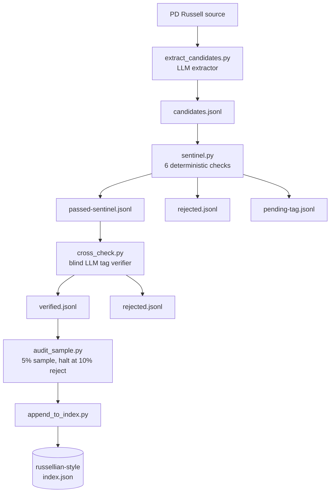

# README rewrite — comprehensive, Russell-voiced, lint-gated

Status: draft
Owner: top-level project documentation

## Problem

The top-level `README.md` (1204 lines, 16 H2 sections) has drifted against the
repository's current state since the last revision. Three concrete drifts:

- The `tools/` directory now contains two non-trivial one-shot tools
  (`tools/build-russell-corpus/`, `tools/russellian-style-audit/`) that the
  README does not mention. The audit-bundle pattern under `docs/audits/` is
  also undocumented.
- The 8 `<details>` blocks in "The skills" section contain function names and
  invocation patterns that the suite-wide review (commit `ae39a70`,
  `docs/audits/2026-05-21-suite-wide-linter-review.md`) found to be partially
  stale. The 80+-check QA grammar across 5 skills + the humanizer sibling is
  not surfaced at the top level.
- The README itself is written in default-AI prose, not under the discipline
  the suite enforces on every chapter it produces. The fingerprint-problem
  section is the closest the doc gets to Russell's voice; the rest reads as
  ordinary documentation.

This spec describes a comprehensive rewrite that (1) preserves the existing
16-section structure and adds 3 new sections for the new material, (2) writes
every section under a declared Russell voice mode, (3) replaces the 3 existing
ASCII diagrams with Mermaid and adds 5 new Mermaid diagrams, and (4) ships
with a `make readme-lint` gate that runs `lint_fragment` per section against
the declared mode's full 17-rule registry.

## Goals

- Every section of the rewritten README declares a voice mode in an HTML
  comment and passes `lint_fragment(section_text, linters=ALL_17_RULES)` with
  ≤ 2 gating violations under that mode's discipline.
- The 3 new sections ("Tools", "The QA grammar", "Auditing the suite") cover
  the post-PR-121 and post-PR-122 material with the depth a contributor
  needs.
- The 8 Mermaid diagrams (3 upgraded from ASCII + 5 new) render on GitHub
  inline and remain readable as raw text.
- A new `tools/readme-lint/` package ships with the rewrite, exposing a
  `make readme-lint` target and a lefthook pre-commit hook that runs the
  per-section lint when `README.md` is staged.
- The rewrite lands as one commit per section (19 commits) on a feature
  branch so each section's lint-gate runs in isolation.

## Non-goals

- Rewriting per-skill `SKILL.md` files (8 files; deferred to a separate
  brainstorm cycle).
- Adopting any of the 8 ranked recommendations from
  `docs/audits/2026-05-21-suite-wide-linter-review.md`. Each gets a row in the
  new "Auditing the suite" section with status `Open` and a pointer to the
  source review.
- Custom Mermaid styling beyond GitHub defaults (no `classDef` colors, no
  custom edge styling).
- Replacing the line-based H2 splitter in `lint_readme.py` with a real
  markdown parser. The line-based splitter is sufficient for the README's
  shape and avoids a dependency on markdown-it for the lint step.
- Translation to any other language.

## Section inventory

19 sections total. The 16 existing sections retain their position; the 3 new
sections are inserted between existing sections so the reading order matches
the architectural one (Tools after Skills; QA grammar after Core concepts;
Auditing after the Bermuda example).

| # | Section | Mode | Existing or new |
| --- | --- | --- | --- |
| 1 | Setting up your environment | technical-exposition | Existing — deepen |
| 2 | For readers in a hurry | technical-exposition | Existing — refresh |
| 3 | Reader questions | technical-exposition | Existing — extend with Q26–Q32 |
| 4 | The fingerprint problem | polemic | Existing — tighten |
| 5 | The three tiers | technical-exposition | Existing — deepen + Mermaid |
| 6 | The pipeline | technical-exposition | Existing — deepen + D1 Mermaid |
| 7 | The skills | technical-exposition | Existing — refresh 8 details against current code |
| 8 | **Tools** | technical-exposition | **NEW** — build-russell-corpus + russellian-style-audit + readme-lint |
| 9 | Core concepts | technical-exposition | Existing — deepen + D2, D3, D8 Mermaid |
| 10 | **The QA grammar** | technical-exposition | **NEW** — 80+ check taxonomy with D6 Mermaid |
| 11 | Quickstart | technical-exposition | Existing — add lint-on-demand pattern |
| 12 | End-to-end: the Bermuda manual | narrative-editorial | Existing — deepen as story |
| 13 | **Auditing the suite** | mixed (polemic opener, technical body) | **NEW** — audit-bundle pattern, 8 open recommendations, D7 Mermaid |
| 14 | Local-only constraint | technical-exposition | Existing — refresh; note live_llm tension |
| 15 | Repository layout | technical-exposition | Existing — add tools/ and docs/audits/ |
| 16 | Deep QA: how this README was made | narrative-editorial | Existing — rewrite to describe the new lint workflow |
| 17 | Documentation | technical-exposition | Existing — refresh links |
| 18 | Contributing | technical-exposition | Existing — add make readme-lint + audit pattern |
| 19 | License and acknowledgements | technical-exposition | Existing — refresh |

Each section's first line after the H2 is a voice-mode declaration:

```html
<!-- voice: technical-exposition -->
```

The Bermuda narrative section additionally carries an ignore comment for a
known intentional violation:

```html
<!-- voice: narrative-editorial -->
<!-- lint-disable: staccato-paragraph-run reason=scene-anchored short sentences are deliberate -->
```

The lint-gate runner respects the ignore comment for the named rule only.

## Mermaid diagrams

8 diagrams total. All use Mermaid syntax that GitHub renders inline; raw text
is navigable in any viewer.

| # | Diagram | Section | Replaces / new |
| --- | --- | --- | --- |
| D1 | Three-tier pipeline overview, with audit-loop arrow | §6 The pipeline | Replaces existing ASCII |
| D2 | Workspace tree (eight subtrees with ownership labels) | §9 Core concepts | Replaces existing ASCII |
| D3 | Claim ledger 5-state machine (proposed → verified → disputed → superseded → refuted) | §9 Core concepts | Replaces existing ASCII |
| D4 | build-russell-corpus pipeline (extract → sentinel → cross-check → audit → append) with 5 hallucination defences annotated | §8 Tools | New |
| D5 | russellian-style-audit pipeline (health → expansion → generation → lint → report) with halt paths | §8 Tools | New |
| D6 | Cross-skill linter taxonomy: 5 skills + humanizer sibling, 80+ checks grouped by defect family | §10 The QA grammar | New |
| D7 | live_llm architectural boundary: current Python-side + proposed MCP-server refactor | §13 Auditing the suite | New |
| D8 | Closed-loop ledger writeback: book-qa → proposed-transitions.jsonl → book-knowledge.apply_writeback → next preflight | §9 Core concepts | New |

Sketch of D4 (the others follow the same Mermaid `graph TD` convention; the
full diagrams are written during implementation):



## Lint contract

The rewrite ships a new tool `tools/readme-lint/`:

```
tools/readme-lint/
├── pyproject.toml
├── scripts/
│   ├── __init__.py
│   └── lint_readme.py
└── tests/
    ├── __init__.py
    ├── fixtures/
    │   ├── pass.md
    │   ├── over_threshold.md
    │   └── with_ignore.md
    └── test_lint_readme.py
```

`scripts/lint_readme.py` does the following:

1. Reads `README.md` from the repo root.
2. Splits at H2 boundaries (`^## ` lines). Each section is `(heading, voice_mode, ignore_set, body)`.
3. For each section, reads the `<!-- voice: <mode> -->` comment (required;
   missing → fail with `section without voice declaration: <heading>`).
4. Reads the optional `<!-- lint-disable: <rule>[, <rule>] reason=<short> -->`
   comment if present.
5. Calls `skill_api.lint_fragment(body, linters=ALL_17_RULES)` against the
   russellian-style skill. The call routes through the same sys.modules
   namespace-eviction context that `tools/russellian-style-audit/scripts/lint_samples.py`
   ships (extracted into a shared `_with_clean_scripts_namespace()` helper).
6. Filters out issues whose rule appears in the section's ignore set.
7. Aggregates per-section gating + advisory counts. Gating = the 10 default
   rules (`no-hedging`, `active-voice`, `signal-density`, `parallel-structure`,
   `listicle-abstract`, `listicle-anaphora`, `rhythm-uniform-length`,
   `rhythm-repeated-opening`, `burstiness`, `ai-vocabulary`). Advisory = the
   other 7.
8. Exit 0 if every section's gating ≤ 2. Exit 1 otherwise, with a per-section
   report to stdout.

Make target (in repo-root `Makefile`):

```makefile
.PHONY: readme-lint
readme-lint:
	cd tools/readme-lint && .venv/Scripts/python -m scripts.lint_readme
```

Lefthook entry (in `lefthook.yml`):

```yaml
pre-commit:
  commands:
    readme-lint:
      glob: 'README.md'
      run: make readme-lint
```

Tests cover three cases: a PASS section, an over-threshold section, and a
section with an ignore comment that would otherwise fail. The tests pass stubs
where reasonable but ultimately exercise the real `lint_fragment` against
small fixture sections (the lint surface is the unit under test).

## New section: "Tools"

Opens by noting that `tools/` exists because some workflows are one-shot
operator runs rather than runtime skills. Subsections per tool:

### `tools/build-russell-corpus/`

What it does, why it exists (the 50→500 corpus growth ask from the user
session that produced PR #121), the 5-stage pipeline (D4 diagram), the 5
hallucination defences (PD allow-list, source SHA-match, blind cross-check
tag agreement with the extractor's tag absent from the cross-check prompt,
two-layer lesson specificity, 5% audit halt threshold), the operator gate
(blocking stdin prompt, --auto-accept bypass, --skip-expansion bypass), the
CLI surface (six subcommands chained by `scripts/cli.py`), the live LLM
wiring requirement (current `live_llm.py` Python-side path + the MCP-server
architectural follow-up flagged in §13).

Includes the canonical command sequence from
`docs/plans/2026-05-21-russell-corpus-expansion.md` Task 19.

### `tools/russellian-style-audit/`

Same shape: what it does (5 health checks + expansion + 3 sample texts + lint
scoring), the bundle output structure under
`docs/audits/<date>-russellian-style/`, the operator gate, the `--auto-accept`
and `--skip-expansion` flags, the namespace-eviction workaround for
`lint_fragment` calls (with a pointer to the recommendation that will
eliminate the workaround). D5 diagram.

Reference: the most recent audit bundle at
`docs/audits/2026-05-21-russellian-style/README.md`.

### `tools/readme-lint/` (new in this rewrite)

What it does, how to invoke, how to add a lint-disable for a legitimate
exemption (with the Bermuda section as the canonical example).

## New section: "The QA grammar"

A structured walk through the suite's 80+ checks, organised by skill and
defect family. Pulls heavily from
`docs/audits/2026-05-21-suite-wide-linter-review.md`. Subsections:

- **russellian-style — 17 prose rules.** Full table from the suite-wide
  review (10 gating + 7 advisory). The gating/advisory distinction explained.
  The recommended invocation pattern (`from skill_api import lint_fragment`
  + the sys.modules workaround if calling from another tool).
- **book-qa — 28 release-gate checks.** D1-D8 deterministic + D9-D12
  thesis-derived + D13 optional + C1-C15 chapter swarm. Sentinel hard-fail
  policy. Healer 3-iteration cap. Waiver mechanism.
- **book-thesis — 5 check classes.** lint_supports (orphan, broken,
  unreachable, unadvanced) + 7 Datalog rules.
- **book-knowledge — SHACL + SPARQL + Bayesian.** 2 node shapes with embedded
  SPARQL, 8 competency queries (4 coverage + 1 consistency + 3 defeasible),
  BLOCKING_DEFEASIBLE = True default, propagate_belief Bayesian damping,
  antonym-pair detection, locator verification.
- **humanizer sibling — 24 patterns.** What sibling-skill loading is, why
  the patterns live external to this repo, how `lint_ai_vocabulary` augments
  its three sub-patterns with the sibling catalog at runtime.
- **Cross-skill coverage map** (D6 Mermaid). Shows where each defect family
  is detected and where the duplication is (3× ai-vocabulary, 4× paragraph-
  length-variance across D6 and C10).
- **Known fragmentation gaps** — short bullet list linking each gap to the
  recommendation in §13 that addresses it.

## New section: "Auditing the suite"

Opens polemically: the suite was built to lint other people's prose; this
section is the record of what it found when it linted itself. Then technical:

- **The audit-bundle pattern.** What an audit bundle is, where it lives
  (`docs/audits/<date>-<topic>/`), what files it contains (README, per-stage
  reports, sample texts, run ledgers).
- **The two most recent audits.** Bundle at
  `docs/audits/2026-05-21-russellian-style/` (per-skill audit) and review at
  `docs/audits/2026-05-21-suite-wide-linter-review.md` (suite-wide inventory).
  One paragraph of summary for each.
- **The 8 ranked recommendations.** Table form, one row per recommendation,
  columns: number, what, why, status (Open for all 8), pointer to the section
  of the source review.
  1. Add an automatic post-generation lint trigger to russellian-style SKILL.md
  2. Promote 7 advisory rules to lint_fragment default
  3. Unify the 3 ai-vocabulary detectors
  4. Give book-qa a skill_api
  5. Add prose linting to lefthook pre-commit (NOTE: this rewrite ships the
     readme-lint hook; the broader prose linting on chapter drafts remains
     Open)
  6. make audit master target
  7. Rename each skill's scripts/ package to fix the namespace collision
  8. docs/skill-triggers.md master index
- **The live_llm architectural boundary** (D7 Mermaid). Shows the current
  Python-side path (audit subprocess calls `anthropic.Anthropic().messages.create`)
  and the proposed MCP-server refactor (Claude-in-session proxies the call
  via an MCP server, no separate API key needed). Explains why both options
  are listed as open: the right shape depends on whether the suite's primary
  invocation surface is operator-driven (CLI) or Claude-driven (chat).

Closes by noting that this section is the audit's own mechanism: future
suite-wide audits update the recommendation status table in place rather than
rewriting the section.

## Updates to existing sections

For each existing section, the rewrite makes a specific, bounded change:

- **§1 Setting up your environment** — add the `pip install -e .[ci]` line
  with the spacy + en_core_web_sm download note; document the
  junction-linked-venv pattern for consumer skills.
- **§2 For readers in a hurry** — add pointers to §8 Tools and §10 QA grammar
  in the reader-questions index.
- **§3 Reader questions** — add Q26 (where do I find the audit bundles?),
  Q27 (how do I run the corpus-expansion tool?), Q28 (how do I lint a draft
  on demand?), Q29 (what does the make readme-lint target do?), Q30 (where
  is the suite-wide review?), Q31 (what changed since PR #121?), Q32 (what
  is the MCP-server refactor flagged in §13?).
- **§4 The fingerprint problem** — tighten the existing opener to pass
  polemic-mode lint. Currently the opener is close to passing but uses
  "moreover" once and has one rhythm-uniform-length stretch.
- **§5 The three tiers** — deepen each tier paragraph; replace tier ASCII
  with a Mermaid grouping diagram.
- **§6 The pipeline** — replace D1; add the explicit audit-loop arrow
  (book-qa → claims writeback → next preflight) that is currently described
  in prose but not in the diagram.
- **§7 The skills** — refresh all 8 `<details>` blocks against current code.
  The suite-wide review found that some function names referenced in the
  details blocks have drifted (e.g. retrieve_corpus_anchor's public function
  is retrieve_anchor, not retrieve_corpus_anchor). Add the public `skill_api`
  shape per skill where one exists, and note explicitly which skills have
  no skill_api (book-qa, book-thesis-as-runtime-skill).
- **§9 Core concepts** — replace D2 and D3 Mermaid; add D8 closed-loop
  ledger; add a paragraph on Bayesian belief propagation with the
  ×0.95/×0.85/1.0 damping factors.
- **§11 Quickstart** — add the lint-on-demand invocation pattern (the same
  code snippet the suite-wide review surfaces); add the live_llm wiring
  requirement for users who want to run build-russell-corpus or the audit
  with a real LLM.
- **§12 End-to-end: the Bermuda manual** — deepen as a story. Named actor
  (the operator), concrete scene (the workspace tree on first run), the
  pressure-changing closer (what the operator learns at gate failure). The
  narrative-editorial mode allows the sentence-rhythm swings the technical
  sections cannot use.
- **§14 Local-only constraint** — refresh; explicitly note the one tension
  in the rule: the live_llm path makes outbound API calls to Anthropic. This
  is the only place the suite breaks local-only and §13 explains why it's
  flagged as architecturally open.
- **§15 Repository layout** — add `tools/` (now non-trivial: three subtools)
  and `docs/audits/` to the tree.
- **§16 Deep QA: how this README was made** — rewrite the section to
  describe the new lint-gate workflow: brainstorm → spec → plan → 19 commits
  (one per section) → per-section lint passes → final review → merge. The
  section becomes the audit-trail of this rewrite.
- **§18 Contributing** — add `make readme-lint` to the contributor workflow;
  add a paragraph describing the audit pattern as a contributor workflow
  (when to run an audit, where to put the bundle, what reviewers look for).

## Implementation order

19 commits on `feat/readme-rewrite`, one per section:

1. `tools/readme-lint/`: skeleton + lint_readme.py + tests (lands first so
   every subsequent section commit can be gated by it)
2. Add `make readme-lint` target + lefthook hook
3. §4 The fingerprint problem — tighten to polemic mode pass
4. §5 The three tiers — deepen + Mermaid replacement
5. §6 The pipeline — D1 replacement + audit-loop arrow
6. §7 The skills — refresh all 8 details against current code
7. §8 Tools — new section with D4 + D5
8. §9 Core concepts — D2, D3, D8 Mermaid; Bayesian paragraph
9. §10 The QA grammar — new section with D6
10. §11 Quickstart — lint-on-demand + live_llm wiring
11. §12 Bermuda manual — deepen as narrative
12. §13 Auditing the suite — new section with D7 + 8 recommendations table
13. §14 Local-only — refresh
14. §15 Repository layout — add tools/ and docs/audits/
15. §16 Deep QA — rewrite as audit-trail of this rewrite
16. §1 Setting up — add spacy install + consumer venv pattern
17. §2 For readers in a hurry — pointers to new sections
18. §3 Reader questions — Q26-Q32
19. §18 Contributing — make readme-lint + audit pattern paragraph

Sections §17 Documentation, §19 License are out-of-scope (refresh-only,
trivial, batched into the final commit alongside §18).

## Testing

- `tools/readme-lint/tests/test_lint_readme.py` — 3 unit tests against
  fixture sections (PASS, over-threshold, with-ignore)
- A `tools/readme-lint/tests/test_real_readme.py` integration test that
  invokes the lint against the actual repo `README.md` and asserts every
  section passes. This test gates the merge: if any section drifts under
  the lint, the test fails.
- The 19-commit sequence means each commit runs the lint against the
  in-flight README; sections that pass remain passing as later sections
  land.

## Out of scope

- Per-skill `SKILL.md` updates (8 files; deferred to a separate brainstorm)
- Adopting the 8 recommendations (documented as Open, not adopted)
- Custom Mermaid styling
- A real markdown parser for the lint script
- Translation

## Open questions

- The lefthook hook runs `make readme-lint` on every commit that touches
  `README.md`. On Windows, `make` requires GNU Make or WSL; the existing
  lefthook entries use `nix develop -c` to ensure the right toolchain. The
  rewrite uses the same `nix develop -c` wrapping for consistency.
- The `tools/readme-lint/.venv` install needs the russellian-style runtime
  deps (spacy + en_core_web_sm + markdown-it-py). Either junction-link the
  audit venv or install fresh; spec defers the choice to the implementation
  plan.
- The Bermuda manual section uses concession-marker counts (sentence-initial
  "But", "Yet", "However") that the linter's `staccato-paragraph-run` rule
  might flag. The spec assumes a `lint-disable: staccato-paragraph-run`
  comment is sufficient; if the rule fires on a different pattern in
  narrative mode, the implementation may need to extend the ignore set.
