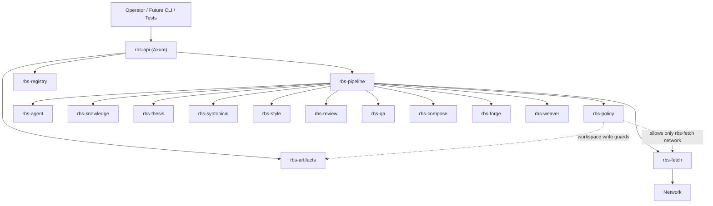

# Russellian Book Suite v2 — Rust/Axum Architecture Design

Date: 2026-05-31. Status: written spec, awaiting user review.

## 1. Goal

Replace the Python-based Russellian Book Suite with an API-first Rust system built on Axum. The target architecture is a modular monolith: one deployable API server, one Cargo workspace, and separate crates with explicit capability contracts. The rewrite preserves the suite's behavioral contracts and artifact semantics; it does not preserve the current Python module layout.

The first implementation plan should build a thin but real vertical slice: API server, workspace registry, job runner, policy guards, artifact store, native fetch boundary, and one migrated domain gate. The system must be testable without live network, live LLM calls, or mutable global state.

## 2. Non-goals

- Do not build a microservice system in v2.0. The operational complexity is not justified before the domain crates stabilize.
- Do not keep Python as the default runtime path. Temporary compatibility shims are allowed only as migration aids.
- Do not put book-domain logic in Axum handlers.
- Do not make direct outbound HTTP possible outside the fetch boundary.
- Do not retire a Python skill until its Rust replacement passes golden compatibility tests for the accepted fixture set.

## 3. Current-state accounting

The audit found these v1 architecture pressure points:

- Cross-skill imports rely on private loaders and `sys.path` manipulation.
- `scripts.*` namespace collisions can cause silent wrong-module behavior.
- Public API surfaces are inconsistent: some skills expose `skill_api.py`, others are CLI-only or script imports.
- Runtime and tested copies can diverge, creating stale sibling-loading failures.
- Per-skill virtual environments are not a reproducible platform boundary.
- The network boundary exists conceptually in `scrapling-fetch`, but v2 needs it as enforceable core infrastructure.

The v2 design fixes these by moving from path-based imports to typed Rust traits, from skill-local scripts to crate-level service APIs, and from per-skill runtime environments to a single workspace build.

## 4. Accepted decisions

1. **Rust + Axum.** v2 targets Rust, with Axum as the primary API framework.
2. **API-first.** The API server is the main operator surface. A CLI can be added later as a client over the API.
3. **Modular monolith.** One service process, many crates. No microservices in the first architecture.
4. **Core fetch boundary.** `scrapling-fetch` becomes `rbs-fetch`, a Rust-native core crate and the only outbound network boundary.
5. **Milestone-1 fetch modes.** `Plain` mode is implemented first. `Stealth` and `Dynamic` are present in the type system but return a typed `UnsupportedMode` error until a Rust-native browser strategy is selected.
6. **Review unification.** `book-review` and `review-conductor` merge into one `rbs-review` crate with `persona` and `panel` modules.
7. **Wiki-backed architecture memory.** Architecture lessons and decisions are recorded in `C:\Users\charl\russellian-book-suite-v2-wiki`.

## 5. High-level architecture



Axum is an adapter over services. Request handlers validate inputs, call application services, and return typed responses. Long-running actions return jobs rather than blocking request threads.

## 6. Cargo workspace layout

```text
russellian-book-suite/
  Cargo.toml
  crates/
    rbs-core/
    rbs-policy/
    rbs-artifacts/
    rbs-registry/
    rbs-pipeline/
    rbs-fetch/
    rbs-agent/
    rbs-api/
    rbs-api-client/
    rbs-knowledge/
    rbs-thesis/
    rbs-syntopical/
    rbs-style/
    rbs-review/
    rbs-qa/
    rbs-compose/
    rbs-forge/
    rbs-weaver/
  tests/
    fixtures/
    golden/
    e2e/
```

### Dependency rules

- `rbs-core` depends on no suite crate.
- `rbs-policy`, `rbs-artifacts`, `rbs-registry`, and `rbs-pipeline` may depend on `rbs-core`.
- Domain crates depend on `rbs-core`, `rbs-artifacts`, and narrow traits from infrastructure crates.
- `rbs-api` depends on service traits and composition modules; handlers do not depend on concrete internals.
- Only `rbs-fetch` may depend on outbound HTTP client or browser automation crates.
- Only `rbs-api` depends on Axum.

## 7. Core crates

### 7.1 `rbs-core`

Purpose: shared types and invariants.

Owns:

- IDs: `WorkspaceId`, `ChapterId`, `ClaimId`, `ArtifactId`, `JobId`, `CapabilityId`, `SourceId`.
- Newtyped paths: `WorkspaceRoot`, `OwnedPath`, `ArtifactPath`.
- Common enums: `Severity`, `GateVerdict`, `IssueKind`, `JobStatus`.
- Error types: `SuiteError`, `ValidationError`, `PolicyError`, `ArtifactError`, `CapabilityError`.
- Time and hash value objects: `Timestamp`, `Sha256`.

Rule: semantic strings become newtypes when they carry invariants.

### 7.2 `rbs-policy`

Purpose: make suite invariants executable.

Owns:

- Workspace write ownership.
- Path traversal rejection.
- Network permission policy.
- Capability allow/deny checks.
- Test helpers for proving policy behavior.

Initial workspace ownership:

| Owner | Writable subtrees |
|---|---|
| `rbs-knowledge` | `raw/`, `wiki/`, `claims/`, `graph/` |
| `rbs-thesis` | `thesis/`, thesis-derived `qa/` inputs |
| `rbs-syntopical` | `syntopical/` |
| `rbs-compose` | `chapters/`, `book/releases/` |
| `rbs-review` | review artifacts under `chapters/drafts/<chapter_id>/` |
| `rbs-qa` | `qa/`, `claims/proposed-transitions.jsonl` |
| `rbs-forge` | verifier project roots and verifier output artifacts |
| `rbs-weaver` | explicit weave output directories |

### 7.3 `rbs-artifacts`

Purpose: typed artifact storage over the filesystem.

Owns:

- JSON, YAML, Markdown, binary, and JSONL artifact read/write helpers.
- Checksums and provenance metadata.
- Atomic writes.
- Golden-test helpers.
- Artifact manifests.

Trait:

```rust
trait ArtifactStore {
    fn read_json<T>(&self, id: ArtifactId) -> Result<T, ArtifactError>;
    fn write_json<T>(&self, owner: CapabilityId, path: ArtifactPath, value: &T) -> Result<ArtifactId, ArtifactError>;
    fn read_text(&self, id: ArtifactId) -> Result<String, ArtifactError>;
    fn write_text(&self, owner: CapabilityId, path: ArtifactPath, value: &str) -> Result<ArtifactId, ArtifactError>;
}
```

The trait shape is illustrative; the implementation plan may split sync and async versions if needed.

### 7.4 `rbs-registry`

Purpose: replace `skill_api.py` and `sibling_skills.py` with versioned Rust capability contracts.

Owns:

- `CapabilityDescriptor`.
- Semantic version and compatibility checks.
- Capability registry.
- Compile-time and runtime discovery for API exposure.

Trait:

```rust
trait Capability {
    const ID: &'static str;
    const VERSION: semver::Version;
    fn descriptor(&self) -> CapabilityDescriptor;
}
```

### 7.5 `rbs-pipeline`

Purpose: long-running execution.

Owns:

- Job lifecycle.
- DAG stage execution.
- Cancellation.
- Staleness checks.
- Retry policy.
- Structured job events.

Job statuses:

- `Queued`
- `Running`
- `Blocked`
- `Succeeded`
- `Failed`
- `Cancelled`

Jobs emit append-only event streams. The event stream is the operator-facing truth for progress, not logs scraped from stdout.

### 7.6 `rbs-agent`

Purpose: all non-deterministic LLM, subagent, reviewer, entailment, and healer calls.

Owns:

- Prompt packets.
- Agent dispatch abstraction.
- Stubbed test implementation.
- Response parsing boundaries.
- Optional provider adapters.

Rule: domain crates build packets and parse responses; they do not call external LLM services directly.

## 8. `rbs-fetch`

`rbs-fetch` is core infrastructure, not a domain skill. It preserves the current `scrapling-fetch` contract natively in Rust.

### 8.1 Public model

```rust
enum FetchMode {
    Plain,
    Stealth,
    Dynamic,
}

enum FetchError {
    FetchFailed { url: String, reason: String },
    RateLimitExceeded { url: String },
    BlockedRequest { url: String },
    NotPdf { url: String, content_type: String },
    OfflineMiss { url: String },
    ArxivIdNotFound { arxiv_id: String },
    UnsupportedMode { mode: FetchMode },
}
```

Milestone 1 implements `Plain`. `Stealth` and `Dynamic` return `UnsupportedMode` from the runtime fetcher. Their enum variants exist from the start so API clients and job specs do not need a breaking change later.

### 8.2 Required behavior

- Per-host rate limiting.
- Robots.txt policy.
- Suite User-Agent.
- Disk TTL cache.
- Offline mode.
- arXiv adapter.
- OpenAlex adapter.
- Semantic Scholar adapter.
- DOI resolver.
- Streaming PDF download with content-type check, partial-file cleanup, byte count, and sha256.
- HTML-to-Markdown and Markdown-to-paragraph extraction.

### 8.3 API exposure

Fetch work is job-based:

- `POST /fetch/pages`
- `POST /fetch/papers/arxiv`
- `POST /fetch/papers/openalex`
- `POST /fetch/papers/doi`
- `POST /fetch/pdf`
- `POST /fetch/extract`

These endpoints enqueue jobs. They do not perform network work on the request path.

## 9. Domain crates

### 9.1 `rbs-knowledge`

Ports `book-knowledge`.

Owns source manifests, claim ledger, verification state, conflicts, writeback, wiki synthesis artifacts, and graph validation reports. It performs no direct network access. Source acquisition goes through `rbs-fetch`; ingestion receives local artifacts.

### 9.2 `rbs-thesis`

Ports `book-thesis`.

Owns thesis tree, paragraph support links, entailment packet generation, contradiction checks, and D9-D12 defect artifacts. Entailment dispatch goes through `rbs-agent`.

### 9.3 `rbs-syntopical`

Ports `syntopical-metabook`.

Reads canonical knowledge and chapter artifacts. Writes only `syntopical/`. Acquires papers only through `rbs-fetch`. Produces acquisition manifests, topic maps, disputed questions, concept reconciliation, lenses, gap reports, and governance reports.

### 9.4 `rbs-style`

Ports `russellian-style`.

Owns deterministic prose lints, rule registry, style reports, gating/advisory distinction, and refusal scope. The passive-voice rule receives a Rust-native implementation or an explicit reduced-precision rule with golden tests documenting the changed behavior.

### 9.5 `rbs-review`

Ports and merges `book-review` and `review-conductor`.

Modules:

- `persona`: persona definitions, packet construction, review parsing.
- `panel`: panel config, gating/advisory semantics, fail-closed aggregation.
- `outcomes`: exemplar loading and selection.

Actual review dispatch goes through `rbs-agent`.

### 9.6 `rbs-qa`

Ports `book-qa`.

Owns D1-D13 and C1-C15 defect models, deterministic linting, sentinel aggregation, healer packets, waiver evaluation, and writeback proposals. It is the first recommended domain port after core infrastructure.

### 9.7 `rbs-compose`

Ports `book-compose`.

Owns chapter contracts, drafts, release bundles, and book releases. It orchestrates other services through `rbs-pipeline`; it does not own their internals. It should be ported late because it depends on most other crates.

### 9.8 `rbs-forge`

Ports `neurosym-forge`.

Owns verifier scaffolding and optional D13 integration. Verifier execution is behind a `VerifierClient` trait.

### 9.9 `rbs-weaver`

Ports `paragraph-weaver`.

Owns paragraph threading, immutable-body enforcement, seam edits, bridges, feasibility gates, and provenance render.

## 10. Axum API design

### 10.1 App state

`AppState` contains trait objects or generic service handles for:

- workspace service
- artifact service
- job service
- fetch service
- domain capability registry
- auth/session policy

Shared state uses `Arc<T>`. Mutable shared state is isolated inside repositories or job queues, not scattered through handlers.

### 10.2 Initial routes

System:

- `GET /health`
- `GET /version`
- `GET /capabilities`

Workspaces:

- `POST /workspaces`
- `GET /workspaces/:workspace_id`
- `GET /workspaces/:workspace_id/manifest`

Jobs:

- `POST /jobs`
- `GET /jobs/:job_id`
- `GET /jobs/:job_id/events`
- `POST /jobs/:job_id/cancel`

Artifacts:

- `GET /artifacts/:artifact_id`
- `GET /workspaces/:workspace_id/artifacts`

Fetch:

- `POST /fetch/pages`
- `POST /fetch/pdf`
- `POST /fetch/extract`
- `POST /fetch/papers/arxiv`
- `POST /fetch/papers/openalex`
- `POST /fetch/papers/doi`

Book workflow:

- `POST /chapters/:chapter_id/review`
- `POST /chapters/:chapter_id/qa`
- `POST /chapters/:chapter_id/compose`
- `GET /claims/:claim_id`
- `GET /syntopical/topics`
- `GET /syntopical/gaps`

### 10.3 Error envelope

Every API error returns:

```json
{
  "error": {
    "code": "policy.path_traversal",
    "message": "path escapes workspace root",
    "details": {},
    "trace_id": "..."
  }
}
```

Status policy:

- `400` for malformed requests.
- `401` for missing/invalid auth when auth is enabled.
- `403` for policy violations.
- `404` for unknown workspace/job/artifact resources.
- `409` for state conflicts or stale artifacts.
- `422` for semantically valid requests that fail domain validation.
- `500` for internal failures.
- `503` for unavailable external capability, including disabled fetch mode.

### 10.4 Milestone-1 auth

Milestone 1 binds to `127.0.0.1` by default. A bearer token is required when `RBS_API_TOKEN` is set or when the bind address is not loopback. This keeps local development simple while preventing accidental unauthenticated network exposure.

## 11. Storage

Milestone 1 uses the filesystem as the canonical artifact store and SQLite for API metadata:

- Filesystem: book workspace artifacts, source files, release bundles, generated reports.
- SQLite: workspace registry, job metadata, job event index, artifact index, capability run records.

Rationale: the existing suite is file-artifact centered; SQLite gives robust queryable state for API operations without requiring an external database.

## 12. Testing strategy

### 12.1 Test pyramid

1. Unit tests per crate.
2. Property tests for IDs, path guards, artifact round trips, DAG invariants, and parser behavior.
3. Contract tests for OpenAPI snapshots, schema compatibility, capability descriptors, and error envelopes.
4. Axum handler tests using `tower::ServiceExt::oneshot`.
5. Integration tests over temporary filesystem workspaces.
6. End-to-end API tests booting Axum on an ephemeral port.
7. Golden regression tests comparing Rust outputs to approved v1 fixture outputs.
8. Security and policy tests for traversal, no-shadow-writes, network boundary, and malformed payloads.
9. Performance tests using Criterion plus API load smoke tests.

### 12.2 `rbs-fetch` tests

- Typed error tests for all `FetchError` variants.
- Adapter fixture tests for arXiv, OpenAlex, Semantic Scholar, and DOI.
- Cache tests: write, read, TTL expiry, cache key normalization, offline hit, offline miss.
- Local mock server tests for robots and rate limiting.
- PDF streaming tests: valid PDF writes checksum; non-PDF removes partial file.
- Extraction tests for HTML-to-Markdown and Markdown-to-paragraph behavior.
- Dependency-policy tests proving only `rbs-fetch` uses outbound HTTP client or browser automation crates.

### 12.3 CI gates

- `cargo fmt --check`
- `cargo clippy --workspace --all-targets -- -D warnings`
- `cargo test --workspace`
- OpenAPI snapshot check.
- Golden artifact compatibility check.
- Dependency-policy check: no outbound HTTP client or browser automation crates outside `rbs-fetch`.
- Workspace-policy check: no direct writes outside owner subtrees in integration tests.

Live network tests run only behind an explicit `live` feature in scheduled or manually triggered jobs.

## 13. Migration plan

### 13.1 Core order

1. `rbs-core`
2. `rbs-api`
3. `rbs-policy`
4. `rbs-artifacts`
5. `rbs-fetch`
6. `rbs-pipeline`
7. `rbs-registry`
8. `rbs-agent`

### 13.2 Domain order

1. `rbs-qa`
2. `rbs-review`
3. `rbs-style`
4. `rbs-knowledge`
5. `rbs-thesis`
6. `rbs-syntopical`
7. `rbs-weaver`
8. `rbs-compose`
9. `rbs-forge`

Rationale: `rbs-qa` has clear inputs and outputs, `rbs-review` removes a known split boundary, and `rbs-compose` should wait until its dependencies have stable contracts.

## 14. Risks and mitigations

| Risk | Mitigation |
|---|---|
| Rewrite becomes line-by-line translation | Port by capability contracts and golden behavior, not file structure |
| Axum handlers accumulate logic | Handler tests assert wiring; service tests assert behavior |
| Fetch boundary leaks | Dependency-policy lint plus `rbs-policy` runtime checks |
| Stealth/Dynamic fetch complexity stalls core | `Plain` ships first; unsupported modes are typed and explicit |
| Current QA semantics get flattened | Typed defect enums and golden tests for every D/C class |
| Artifact compatibility is lost | Golden fixtures must pass before retiring each Python skill |
| API state becomes inconsistent with files | SQLite indexes derived artifact records and stores checksums |

## 15. Spec review checklist

- No placeholder sections remain.
- All milestone-1 decisions needed for planning are explicit.
- Known unresolved topics are either deferred by design or represented as typed unsupported capabilities.
- The architecture matches the user decisions: Rust, Axum, API-first, native fetch boundary, comprehensive tests, wiki-backed memory.
