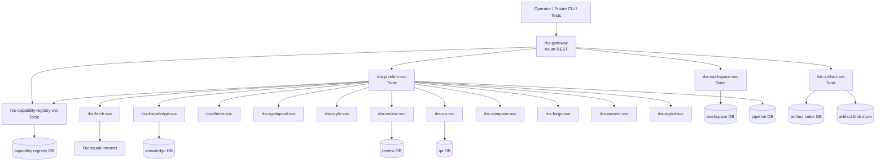

# Russellian Book Suite v2 — Rust Microservices Architecture Design

Date: 2026-05-31. Updated: 2026-06-01. Status: superseded in part by the V3 conformance architecture.

V3 supersession note: `docs/superpowers/specs/2026-06-01-rbs-v3-architecture-design.md`
and `docs/superpowers/specs/2026-06-01-rbs-v3-skill-migration-plan-design.md`
supersede this document wherever service-call ownership, query/command
classification, contract catalogs, dossier coverage, or architecture
conformance gates are concerned. In particular, V3 replaces any implied
"domain services only interact through pipeline" rule with the query/command
split: cross-domain commands are pipeline stages; explicitly allowlisted
cross-domain queries may use direct Tonic calls; domain-to-platform calls follow
platform-service boundary rules.

## 1. Goal

Replace the Python-based Russellian Book Suite with a Rust microservice architecture. The target system is a distributed suite of independently deployable services that communicate through versioned gRPC contracts, expose an operator-facing REST API through an Axum gateway, and preserve the current skill suite's behavioral contracts and artifact semantics.

The first implementation plan should build a thin but real vertical slice across the MSA stack: gateway, workspace service, artifact service, capability registry, pipeline service, fetch service, one domain gate service, gRPC contracts, SQLx persistence, tracing/OpenTelemetry, and contract tests. The system must be testable without live network, live LLM calls, or hidden global state.

## 2. Standard platform stack

The v2 platform stack is:

| Layer | Standard choice | Use in v2 |
|---|---|---|
| Async runtime | Tokio | Runtime for every service, background task, cancellation path, and graceful shutdown path |
| Public REST API | Axum | `rbs-gateway`, health/readiness endpoints, operator API, OpenAPI snapshots |
| Service-to-service RPC | Tonic | gRPC contracts between services; all service calls go through protobuf APIs |
| Serialization | Serde + prost | Serde for REST JSON, artifacts, config, and golden fixtures; prost/protobuf for Tonic |
| Database access | SQLx | Compile-checked SQL, migrations, and service-owned databases/schemas |
| Tracing/logs | tracing + OpenTelemetry | Required distributed traces across REST, gRPC, jobs, fetches, and artifact writes |

SQLx is chosen over SeaORM because the metadata and ledger models need explicit schemas, migrations, and predictable SQL. SeaORM remains out of scope for v2 unless a later service proves it needs ORM-style entity modeling.

## 3. Non-goals

- Do not preserve the current Python module layout.
- Do not use Python as a default runtime path. Temporary compatibility shims are allowed only as migration aids.
- Do not put book-domain logic in the Axum gateway.
- Do not permit outbound HTTP outside `rbs-fetch-svc`.
- Do not allow cross-service database reads. Services communicate through Tonic or artifact references, not direct SQL into another service's store.
- Do not hot-load arbitrary code into the gateway or pipeline. New skills run as services or adapters behind explicit capability manifests.
- Do not retire a Python skill until its Rust service replacement passes golden compatibility tests for the accepted fixture set.
- Do not introduce a message broker in milestone 1. The first pipeline service uses SQLx-backed durable jobs and gRPC calls. A broker can be added later if load or workflow fan-out justifies it.

## 4. Current-state accounting

The audit found these v1 architecture pressure points:

- Cross-skill imports rely on private loaders and `sys.path` manipulation.
- `scripts.*` namespace collisions can cause silent wrong-module behavior.
- Public API surfaces are inconsistent: some skills expose `skill_api.py`, others are CLI-only or script imports.
- Runtime and tested copies can diverge, creating stale sibling-loading failures.
- Per-skill virtual environments are not a reproducible platform boundary.
- The network boundary exists conceptually in `scrapling-fetch`, but v2 needs it as an enforceable service boundary.

The v2 MSA fixes these by replacing path-based imports with gRPC contracts, replacing skill-local scripts with service APIs, replacing per-skill virtualenvs with one Rust workspace, and making outbound network access a single deployed service.

## 5. Accepted decisions

1. **Rust + Tokio.** Every service uses Tokio.
2. **Public REST via Axum.** Operators and future CLIs talk to the suite through an Axum gateway.
3. **Full microservices.** v2 targets independently deployable services, not a modular monolith.
4. **Service-to-service gRPC via Tonic.** Internal calls use Tonic/protobuf contracts.
5. **Serialization split.** Serde owns REST JSON, artifacts, config, and golden tests; prost/protobuf owns gRPC wire contracts.
6. **SQLx persistence.** Services use SQLx with service-owned databases or schemas. No cross-service SQL.
7. **Observability required.** `tracing` and OpenTelemetry are part of milestone 1, not a later add-on.
8. **Core fetch service.** `scrapling-fetch` becomes `rbs-fetch-svc`, the only outbound network service.
9. **Milestone-1 fetch modes.** `Plain` mode is implemented first. `Stealth` and `Dynamic` remain in the protobuf/API model but return typed `UnsupportedMode` errors until a Rust-native browser strategy is selected.
10. **Review unification.** `book-review` and `review-conductor` merge into one `rbs-review-svc` with persona and panel modules.
11. **Capability extension plane.** Arbitrary future skills are added through manifests, `rbs-capability-registry-svc`, generic `CapabilityExecutor` contracts, permission declarations, schema validation, and pipeline capability stages.
12. **Wiki-backed architecture memory.** Architecture lessons and decisions are recorded in `C:\Users\charl\russellian-book-suite-v2-wiki`.
13. **Superseded by V3 query/command call ownership.** The command-orchestration topology in this V2 document is retained as historical context, but V3 is authoritative for cross-domain queries, cross-domain commands, domain-to-platform calls, contract catalogs, and conformance checks.

## 6. Service topology



The gateway is thin. It validates REST requests, starts jobs, reads status, exposes capability discovery/admin endpoints, and returns typed responses. It does not import domain service internals. Service composition happens through Tonic clients and the pipeline service. Capability resolution happens through `rbs-capability-registry-svc`, not hard-coded gateway or pipeline branches.

V3 clarification: the topology above shows command orchestration. It does not
forbid direct cross-domain query RPCs. V3's service contract catalog decides
which operations are `query` versus `command`, which cross-domain query callers
are allowlisted, and which cross-domain commands must be represented as
pipeline stages.

## 7. Repository layout

```text
russellian-book-suite/
  Cargo.toml
  crates/
    rbs-core/              # shared IDs, errors, value objects
    rbs-proto/             # protobuf source + generated tonic/prost code
    rbs-telemetry/         # tracing/OpenTelemetry setup
    rbs-config/            # env/config loading
    rbs-policy/            # shared policy decisions and test helpers
    rbs-capability-sdk/    # helpers for external capability services
    rbs-gateway/           # Axum REST gateway
    rbs-api-client/        # REST client for tests/future CLI
    rbs-workspace-svc/
    rbs-artifact-svc/
    rbs-capability-registry-svc/
    rbs-pipeline-svc/
    rbs-fetch-svc/
    rbs-agent-svc/
    rbs-knowledge-svc/
    rbs-thesis-svc/
    rbs-syntopical-svc/
    rbs-style-svc/
    rbs-review-svc/
    rbs-qa-svc/
    rbs-compose-svc/
    rbs-forge-svc/
    rbs-weaver-svc/
  proto/
    rbs/v1/*.proto
  capabilities/
    *.yaml
  schemas/
    capabilities/*.schema.json
  migrations/
    <service-name>/*.sql
  tests/
    fixtures/
    golden/
    contract/
    e2e/
  deploy/
    docker-compose.yml
    k8s/
```

## 8. Dependency rules

- `rbs-core` depends on no suite crate.
- `rbs-proto` depends on Tonic/prost and shared core conversions only.
- `rbs-telemetry` is shared by all service binaries.
- `rbs-config` is shared by all service binaries.
- `rbs-capability-sdk` may depend on `rbs-core`, `rbs-proto`, `rbs-config`, and `rbs-telemetry`; it does not depend on the gateway or concrete domain services.
- `rbs-gateway` is the only crate that depends on Axum.
- Service crates may depend on their own domain modules, `rbs-core`, `rbs-proto`, `rbs-config`, `rbs-telemetry`, `rbs-policy`, SQLx, Tokio, tracing, and Tonic.
- Service crates must not depend on each other directly. Calls cross service boundaries through generated Tonic clients.
- Only `rbs-fetch-svc` may depend on outbound HTTP client or browser automation crates.
- Each service owns its database migrations. No service reads another service's tables directly.

## 9. Core shared crates

### 9.1 `rbs-core`

Shared domain-neutral types:

- IDs: `WorkspaceId`, `ChapterId`, `ClaimId`, `ArtifactId`, `JobId`, `CapabilityId`, `SourceId`, `TraceId`.
- Newtyped paths: `WorkspaceRoot`, `OwnedPath`, `ArtifactPath`.
- Common enums: `Severity`, `GateVerdict`, `IssueKind`, `JobStatus`.
- Error types: `SuiteError`, `ValidationError`, `PolicyError`, `ArtifactError`, `CapabilityError`.
- Time and hash value objects: `Timestamp`, `Sha256`.

Rule: semantic strings become newtypes when they carry invariants.

### 9.2 `rbs-proto`

Owns protobuf files and generated code for:

- workspace service
- artifact service
- pipeline service
- capability registry service
- generic capability executor service
- fetch service
- agent service
- knowledge service
- thesis service
- syntopical service
- style service
- review service
- QA service
- compose service
- forge service
- weaver service

Every protobuf service gets compatibility tests. Breaking protobuf changes require an explicit version bump.

### 9.3 `rbs-telemetry`

Owns:

- tracing subscriber setup
- OpenTelemetry exporter setup
- trace propagation between Axum and Tonic
- request/job/span naming conventions
- redaction rules for prompt and source content

Every REST request, gRPC request, job execution, artifact write, fetch call, and agent call must carry a trace context.

### 9.4 `rbs-config`

Owns 12-factor configuration:

- bind addresses
- database URLs
- service endpoint URLs
- auth tokens/secrets
- telemetry exporter endpoint
- fetch policy
- feature flags

No service hardcodes environment-specific paths or endpoints.

### 9.5 `rbs-policy`

Owns reusable policy types and tests:

- workspace write ownership rules
- path traversal rejection
- outbound-network boundary rules
- capability allow/deny checks
- service dependency lint helpers

Runtime enforcement lives in the owning service; policy tests verify the shared rule set.

### 9.6 `rbs-capability-sdk`

Optional helper crate for external capability services. Owns manifest parsing helpers, executor request/response helpers, schema validation helpers, fixture helpers, and trace propagation helpers. It is not required for non-Rust services, which can implement the protobuf contracts directly.

## 10. Service responsibilities

### 10.1 `rbs-gateway`

Public Axum REST API. Responsibilities:

- REST DTO validation.
- Auth.
- Rate limiting for operator-facing endpoints.
- OpenAPI snapshots.
- Tonic clients to backend services.
- Capability discovery and admin route wiring.
- Trace creation and propagation.

The gateway does not execute domain logic and does not write workspace artifacts directly.

### 10.2 `rbs-workspace-svc`

Owns workspace registry, workspace lifecycle, workspace manifests, and workspace-level policy metadata.

### 10.3 `rbs-artifact-svc`

Owns artifact indexing, atomic artifact writes, checksums, provenance metadata, and blob storage abstraction. Milestone 1 can use filesystem or MinIO-compatible storage behind the service boundary, but callers only receive artifact IDs and handles.

### 10.4 `rbs-pipeline-svc`

Owns long-running jobs, DAG execution, cancellation, retries, staleness checks, and job events. It orchestrates services over Tonic and persists durable job state with SQLx. Generic skill stages are scheduled by resolving `capability_id`, `operation_id`, and version constraints through `rbs-capability-registry-svc`.

Job statuses:

- `Queued`
- `Running`
- `Blocked`
- `Succeeded`
- `Failed`
- `Cancelled`

### 10.5 `rbs-capability-registry-svc`

Owns capability manifests, capability versions, operation metadata, permissions, schema references, maturity state, endpoint resolution, and capability health state. It validates manifests, rejects forbidden permission requests, exposes discovery to the gateway, and provides scheduling metadata to `rbs-pipeline-svc`.

Capability states:

- `Draft`
- `Registered`
- `TestPending`
- `Enabled`
- `Deprecated`
- `Disabled`
- `Rejected`
- `Quarantined`

Capability maturity levels:

- `Experimental`
- `Beta`
- `Stable`
- `Core`
- `Deprecated`
- `Disabled`

### 10.6 `rbs-fetch-svc`

Ports `scrapling-fetch`. It is the only service with outbound network access.

Milestone 1 behavior:

- `Plain` mode implemented.
- `Stealth` and `Dynamic` return `UnsupportedMode`.
- per-host rate limiting
- robots.txt policy
- suite User-Agent
- disk/object TTL cache
- offline mode
- arXiv adapter
- OpenAlex adapter
- Semantic Scholar adapter
- DOI resolver
- streaming PDF download
- HTML-to-Markdown and Markdown-to-paragraph extraction

### 10.7 `rbs-agent-svc`

Owns all non-deterministic LLM, subagent, reviewer, entailment, and healer calls. Domain services build packets and parse structured outputs; they do not call external LLM providers directly.

### 10.8 Domain services

| Service | Ports | Owns |
|---|---|---|
| `rbs-knowledge-svc` | `book-knowledge` | source manifests, claim ledger, verification state, conflicts, writeback, wiki/graph reports |
| `rbs-thesis-svc` | `book-thesis` | thesis tree, supports links, entailment packets, contradiction checks, D9-D12 artifacts |
| `rbs-syntopical-svc` | `syntopical-metabook` | acquisition manifests, topic maps, disputed questions, concept reconciliation, lenses, gaps, governance reports |
| `rbs-style-svc` | `russellian-style` | deterministic style linters, rule registry, style reports, refusal scope |
| `rbs-review-svc` | `book-review` + `review-conductor` | personas, panel configs, dispatch packets, severity parsing, fail-closed verdict aggregation |
| `rbs-qa-svc` | `book-qa` | D1-D13/C1-C15 defects, sentinel, healer packets, waivers, writeback proposals |
| `rbs-compose-svc` | `book-compose` | chapter contracts, drafts, release bundles, book releases |
| `rbs-forge-svc` | `neurosym-forge` | verifier scaffolding and D13 verifier integration |
| `rbs-weaver-svc` | `paragraph-weaver` | paragraph threading, immutable-body enforcement, bridges, seam edits, provenance render |

## 11. Public REST API

The gateway exposes operator-friendly REST:

System:

- `GET /health`
- `GET /ready`
- `GET /version`
- `GET /capabilities`
- `GET /capabilities/:capability_id`
- `GET /capabilities/:capability_id/operations`
- `POST /capabilities/register`
- `POST /capabilities/:capability_id/enable`
- `POST /capabilities/:capability_id/disable`

Workspaces:

- `POST /workspaces`
- `GET /workspaces/:workspace_id`
- `GET /workspaces/:workspace_id/manifest`

Jobs:

- `POST /jobs`
- `GET /jobs/:job_id`
- `GET /jobs/:job_id/events`
- `POST /jobs/:job_id/cancel`

Artifacts:

- `GET /artifacts/:artifact_id`
- `GET /workspaces/:workspace_id/artifacts`

Fetch:

- `POST /fetch/pages`
- `POST /fetch/pdf`
- `POST /fetch/extract`
- `POST /fetch/papers/arxiv`
- `POST /fetch/papers/openalex`
- `POST /fetch/papers/doi`

Book workflow:

- `POST /chapters/:chapter_id/review`
- `POST /chapters/:chapter_id/qa`
- `POST /chapters/:chapter_id/compose`
- `GET /claims/:claim_id`
- `GET /syntopical/topics`
- `GET /syntopical/gaps`

## 12. Internal gRPC contracts

Every service has:

- `Health` RPC or readiness method.
- request messages with explicit `workspace_id`, `trace_id`, and caller metadata where relevant.
- response messages that return artifact IDs instead of raw file paths for durable outputs.
- typed error mapping to gateway error codes.

Contract examples:

- `PipelineService.SubmitJob`
- `PipelineService.GetJob`
- `PipelineService.StreamJobEvents`
- `ArtifactService.WriteArtifact`
- `ArtifactService.ReadArtifact`
- `CapabilityRegistryService.RegisterCapability`
- `CapabilityRegistryService.ResolveCapability`
- `CapabilityRegistryService.EnableCapability`
- `CapabilityRegistryService.DisableCapability`
- `CapabilityExecutor.Describe`
- `CapabilityExecutor.Execute`
- `FetchService.FetchPage`
- `FetchService.DownloadPdf`
- `QaService.LintArtifact`
- `ReviewService.RunPanel`

## 13. Error model

The gateway REST error envelope remains:

```json
{
  "error": {
    "code": "policy.path_traversal",
    "message": "path escapes workspace root",
    "details": {},
    "trace_id": "..."
  }
}
```

Service errors are represented in protobuf as structured status details and mapped to:

- `400` malformed REST request
- `401` missing/invalid auth
- `403` policy violation
- `404` unknown workspace/job/artifact
- `409` state conflict or stale artifact
- `422` domain validation failure
- `500` internal failure
- `503` unavailable service or unsupported capability

## 14. Storage

Each service owns its persistent state. Milestone 1 uses SQLx migrations and Postgres-compatible schemas for service metadata. SQLite may be used only for hermetic unit tests where SQLx supports the same behavior.

Storage boundaries:

- `rbs-workspace-svc`: workspace registry and workspace metadata.
- `rbs-artifact-svc`: artifact index plus blob-store metadata.
- `rbs-capability-registry-svc`: manifests, operation versions, endpoint refs, permission declarations, schema refs, maturity state, health status.
- `rbs-pipeline-svc`: jobs, job events, retries, orchestration state.
- `rbs-fetch-svc`: fetch cache metadata and fetch audit records.
- Domain services: only their domain-specific indexes and reports.

Artifact bytes live behind `rbs-artifact-svc`. Milestone 1 may use local filesystem or MinIO-compatible storage, but direct file access is not exposed across services.

## 15. Deployment model

Milestone 1 ships a local distributed dev topology:

- one binary per service
- Docker Compose for service startup
- service-owned databases/schemas
- gateway plus gRPC backend services
- capability manifests loaded into `rbs-capability-registry-svc`
- OpenTelemetry collector
- structured logs
- health/readiness endpoints
- graceful shutdown for every service

Kubernetes manifests live under `deploy/k8s/` after Docker Compose is stable.

## 16. Testing strategy

### 16.1 Test pyramid

1. Unit tests per crate.
2. Property tests for IDs, path guards, artifact round trips, DAG invariants, parser behavior, and service request validation.
3. Protobuf contract tests for backward compatibility.
4. Capability manifest schema tests and permission policy tests.
5. OpenAPI snapshot tests for gateway REST.
6. Tonic service tests with in-process clients.
7. Axum handler tests using `tower::ServiceExt::oneshot`.
8. Component tests per service with test databases.
9. Docker Compose integration tests across gateway + selected services.
10. End-to-end API tests booting the local MSA stack.
11. Golden regression tests comparing Rust outputs to approved v1 fixture outputs.
12. Security and policy tests for traversal, no-shadow-writes, network boundary, malformed payloads, cross-service DB isolation, and forbidden capability permissions.
13. Observability tests proving trace propagation across REST to gRPC to job execution and generic capability execution.
14. Performance tests using Criterion plus API/gRPC load smoke tests.

### 16.2 `rbs-fetch-svc` tests

- Typed error tests for all fetch error variants.
- Adapter fixture tests for arXiv, OpenAlex, Semantic Scholar, and DOI.
- Cache tests: write, read, TTL expiry, cache key normalization, offline hit, offline miss.
- Local mock server tests for robots and rate limiting.
- PDF streaming tests: valid PDF writes checksum; non-PDF removes partial blobs.
- Extraction tests for HTML-to-Markdown and Markdown-to-paragraph behavior.
- Dependency-policy tests proving only `rbs-fetch-svc` uses outbound HTTP client or browser automation crates.

### 16.3 CI gates

- `cargo fmt --check`
- `cargo clippy --workspace --all-targets -- -D warnings`
- `cargo test --workspace`
- SQLx migration checks.
- protobuf generation and compatibility checks.
- capability manifest validation.
- capability permission lint.
- OpenAPI snapshot checks.
- Tonic contract tests.
- generic `CapabilityExecutor` contract tests.
- Golden artifact compatibility checks.
- dependency-policy check: no outbound HTTP client or browser automation crates outside `rbs-fetch-svc`.
- workspace-policy check: no direct writes outside owner boundaries in integration tests.
- trace propagation smoke test.

Live network tests run only behind an explicit `live` feature in scheduled or manually triggered jobs.

## 17. Migration plan

### 17.1 Platform order

1. `rbs-core`
2. `rbs-proto`
3. `rbs-telemetry`
4. `rbs-config`
5. `rbs-capability-sdk`
6. `rbs-gateway`
7. `rbs-workspace-svc`
8. `rbs-artifact-svc`
9. `rbs-capability-registry-svc`
10. `rbs-pipeline-svc`
11. `rbs-fetch-svc`
12. `rbs-agent-svc`

### 17.2 Domain service order

1. `rbs-qa-svc`
2. `rbs-review-svc`
3. `rbs-style-svc`
4. `rbs-knowledge-svc`
5. `rbs-thesis-svc`
6. `rbs-syntopical-svc`
7. `rbs-weaver-svc`
8. `rbs-compose-svc`
9. `rbs-forge-svc`

Rationale: `rbs-qa-svc` has clear inputs and outputs, `rbs-review-svc` removes a known split boundary, and `rbs-compose-svc` should wait until its dependencies have stable contracts.

## 18. Risks and mitigations

| Risk | Mitigation |
|---|---|
| Distributed complexity slows early delivery | First milestone is a thin vertical slice with only required services active |
| Capability registry becomes a second gateway | Registry owns metadata and policy only; execution remains in services and orchestration remains in pipeline |
| Arbitrary skills bypass platform boundaries | Manifest permissions, executor contracts, and policy CI deny direct artifact, network, provider, and cross-service DB access |
| Service boundaries become chatty | Pipeline service orchestrates coarse-grained jobs; services exchange artifact IDs, not large inline payloads |
| Gateway accumulates domain logic | Gateway tests assert wiring only; service tests assert behavior |
| Cross-service DB coupling appears | CI dependency/schema lints forbid direct DB access outside owner service |
| Fetch boundary leaks | Dependency-policy lint plus runtime service isolation |
| Traces are missing when needed | OpenTelemetry is required in milestone 1; trace propagation test is a CI gate |
| Stealth/Dynamic fetch complexity stalls core | `Plain` ships first; unsupported modes are typed and explicit |
| Current QA semantics get flattened | Typed defect enums and golden tests for every D/C class |
| Artifact compatibility is lost | Golden fixtures must pass before retiring each Python skill |

## 19. Spec review checklist

- No placeholder sections remain.
- The architecture matches the user decisions: Rust, Tokio, Axum, Tonic, Serde, SQLx, tracing, OpenTelemetry, full microservices, native fetch boundary, comprehensive tests, wiki-backed memory.
- Known unresolved topics are deferred explicitly or represented as typed unsupported capabilities.
- Every current skill maps to one service or an intentional merged service.
- Arbitrary future skills have a registry, manifest, permission, schema, and generic executor path.
