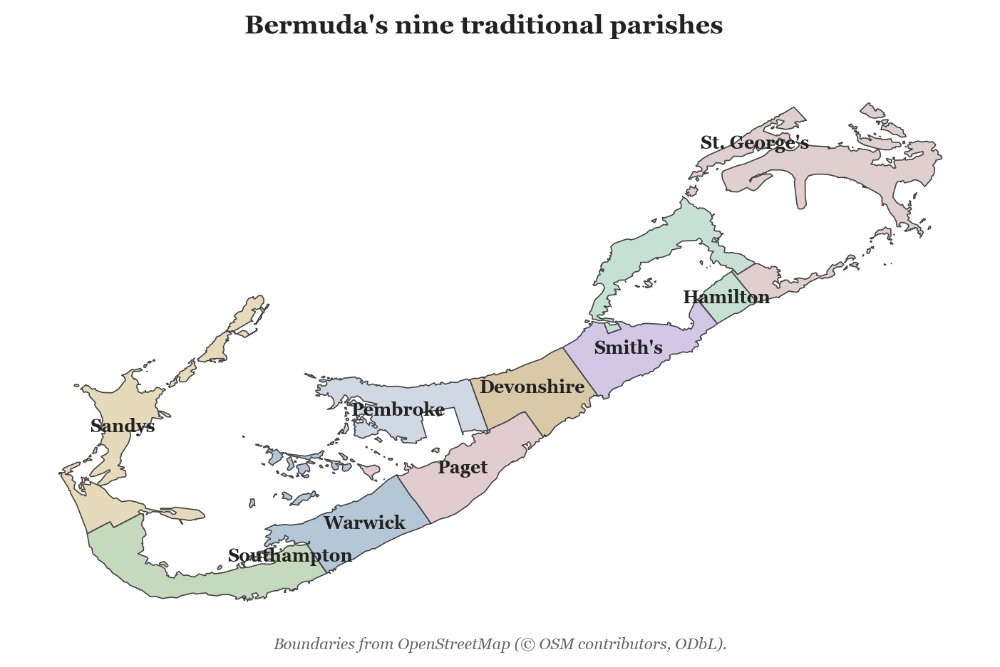
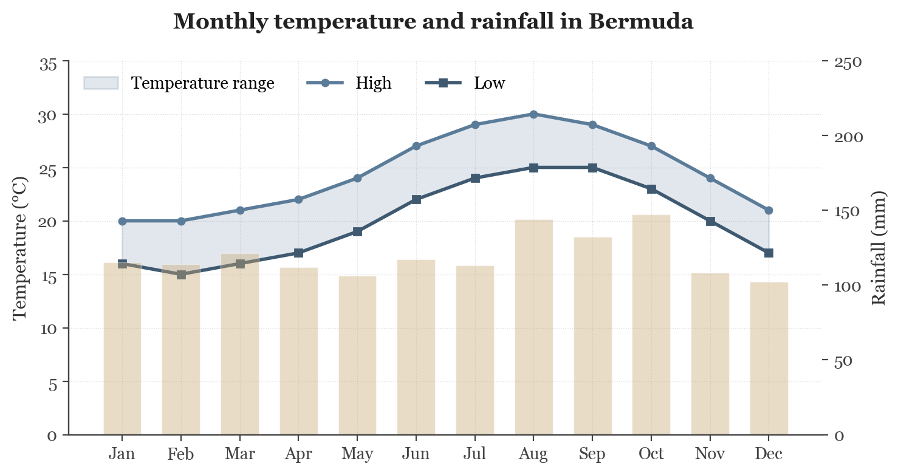
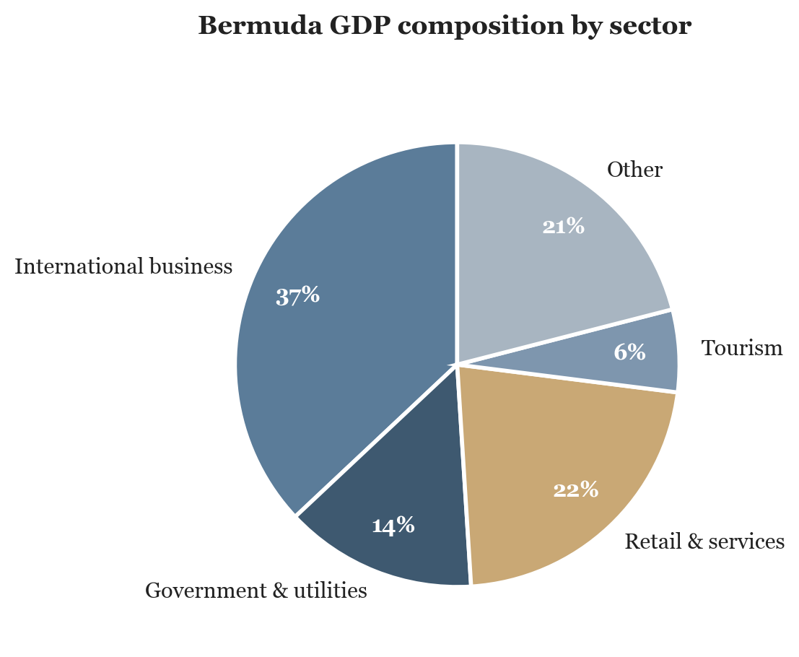
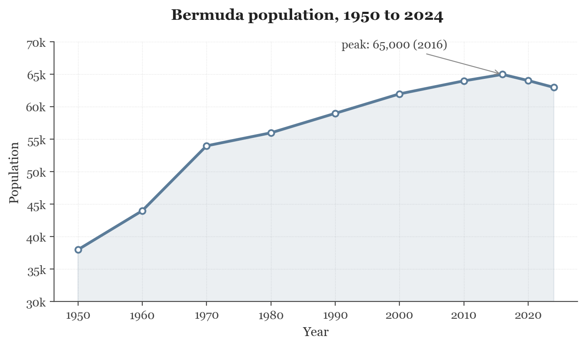
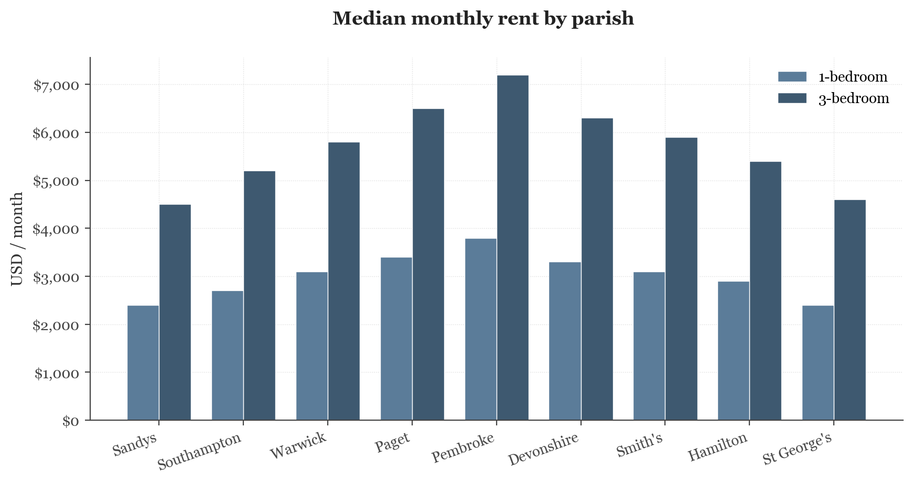
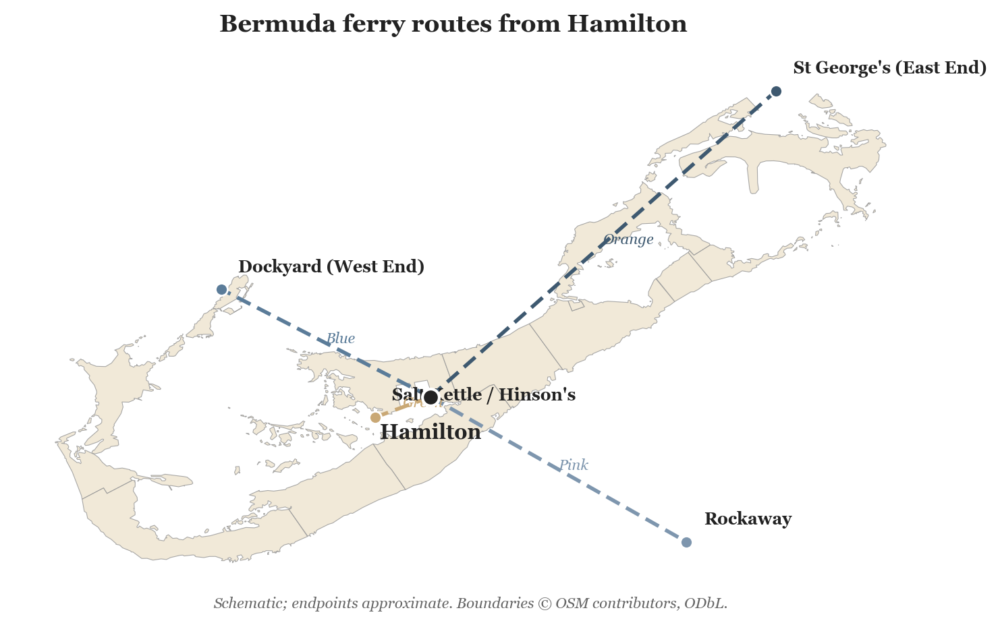
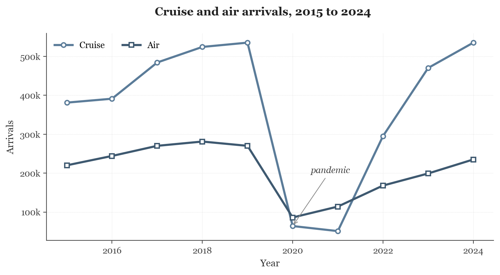

# Life in Bermuda

_Compiled 2026-05-11_

---

## Table of Contents

1. Introduction and Geography
2. History
3. Government and Legal System
4. Economy
5. Demographics and Society
6. Daily Life and Cost of Living
7. Housing and Immigration
8. Education
9. Healthcare
10. Transportation, Recreation, and Tourism

---

## Preface

This manual gives a working picture of contemporary Bermuda for the reader who needs more than tourist copy and less than a doctoral thesis. It covers the geography that produced the place, the history that shaped its institutions, the government that runs it now, the economy that pays for it, the people who live in it, the practical question of what living there costs, the rules that govern who may live there at all, the school system that raises a child through to college, the hospital that treats them, and the ways they get around.

The chapters are written as argument-bearing prose anchored in concrete scenes. Where data are clearer in a chart or a table, you will find the chart or the table. Where a term needs a one-sentence gloss, the gloss appears in a sidebar rather than as a parenthetical interruption of the sentence. Where a claim has a nuance or a contested source, the nuance lives in a footnote.

Numeric claims trace to the sources collected at the back. Where two sources disagreed, the dispute is noted in the prose rather than papered over. Where a source was thin, the prose says so.

The manual is short by design. A reader should be able to finish it in an evening and feel they understand the place well enough to talk about it.

## How the chapters are arranged

The first three chapters set the frame: the islands themselves, the history that turned them into a colony and a colony into a self-governing territory, and the government and legal system that runs the place today. The fourth chapter explains where the money comes from and what that money has done to the economy. The fifth describes the people. The sixth tells you what it costs to live there day to day, and the seventh tells you whether you may even live there at all. The last three chapters cover education, healthcare, and the practical questions of moving around and what people do with their time.

---

# Chapter 1: Introduction and Geography

You stand on Nonsuch Island at dusk in late October, fifteen acres of limestone and recovered scrub
eighteen miles off the Main Island. The wind off Castle Harbour carries salt and the dry-grass smell
of the hillside. At your feet, in a concrete burrow set into the soil, a Bermuda petrel returns from
sixty days at sea. The bird drops out of the dark, finds its hole, and disappears. No light shows.
The colony declared this species extinct after 1609; in 1951 an expedition relocated it on these
rocks. Eighteen breeding pairs survived then. Every later count traces to that night.

## Orientation

A bird that the colony declared extinct in the seventeenth century turned up nesting on a rocky
islet in 1951. A house that runs out of water has no aquifer to drill and no river to draw from; it
has a roof, a tank, and the next storm. The territory holds the highest-latitude tropical climate on
Earth. These three facts belong to the same archipelago, and the archipelago is small. Bermuda
covers 53.3 square kilometres of land, 1,040 kilometres east of Cape Hatteras, with no other land of
consequence within a thousand kilometres. The isolation governs every fact below.

For the record: the territory sits at 32 degrees 18 minutes north and 64 degrees 47 minutes west.
Miami lies 1,770 kilometres to the south-west; Halifax, 1,350 kilometres to the north. Bermuda is a
British Overseas Territory, and its administrative continuity runs unbroken from the seventeenth
century.

## Composition and Scale

No mountain, no river, no lake of any size exists on Bermuda. Town Hill, on the Main Island, marks
the highest point at 79 metres above sea level<a href="#fn-ch01-towhill">1</a>. Eight inhabited islands, joined by
bridges, carry the bulk of the population on a continuous road network. Crystal Caves, on the
eastern Main Island, opens onto stalactite chambers and saltwater pools that sit at sea level inside
the limestone. The cave system records the archipelago as a limestone cap on a submarine volcano.

The territory comprises 181 named islands and rocks. A second contemporary survey gives 138; the
difference depends on the rule for counting reef cays and small rocks<a href="#fn-ch01-islandcount">2</a>. The land area
is 53.3 square kilometres, the coastline 103 kilometres, and the surface divides 14.8 percent arable
to 85.2 percent other, of which 55 percent is built footprint and 45 percent rural or open
land<a href="#fn-ch01-land-use">3</a>.

The territory holds nine traditional parishes. Settlers from the Virginia Company and the Somers
Isles Company drew the boundaries during the seventeenth century, and the parish names commemorate
English and Scottish shareholders in those companies. Richard Norwood's earlier division of the
colony in 1616 produced eight units called "tribes"; the modern roster renames several (Bedford
became Hamilton; Cavendish became Devonshire) and adds parishes the original division did not
contain. The Town of St. George holds municipal status as one of Bermuda's two municipal
corporations. The town, the oldest continuously inhabited English town in the New World, holds
UNESCO World Heritage status.

The parishes run in a chain from west to east along the fish-hook of the archipelago. Population and
area divide unevenly across them.

| Parish | Position | Area (km²) | Rough population |
| --- | --- | ---: | ---: |
| Sandys | West End | 5.9 | 7,200 |
| Southampton | West | 5.7 | 5,800 |
| Warwick | Central west | 5.7 | 8,600 |
| Paget | Central | 5.4 | 5,000 |
| Pembroke | Central north (Hamilton) | 5.7 | 10,300 |
| Devonshire | Central | 4.9 | 7,300 |
| Smith's | Central east | 4.9 | 5,700 |
| Hamilton (parish) | East | 5.3 | 5,000 |
| St. George's | East End | 9.2 | 4,400 |

Pembroke carries the City of Hamilton and the densest concentration of people. St. George's holds
the largest land area and the smallest resident count of any parish.

## Climate

The territory holds the highest-latitude tropical climate on Earth. Köppen classifies it as Af, the
wettest tropical category, in which no month falls below the dry-month threshold. Some
climatologists read the same record as humid subtropical. The disagreement turns on which weather
station's record is read and on the threshold rule applied to the precipitation
distribution<a href="#fn-ch01-koppen">4</a>. The Gulf Stream washes the western flank of the archipelago and moderates the
air throughout the year.

> **Köppen Af.** The wettest tropical category in the Köppen-Geiger system. Every month receives at
least 60 millimetres of rainfall, and no month qualifies as dry.

Winter temperatures from January through March average 18 degrees Celsius; summer highs sit near 30.
Annual mean rainfall is 1,453.8 millimetres, and rain falls in every month. Recorded temperatures
span 6.3 degrees Celsius in February 1993 to 33.9 degrees Celsius in August 1989<a href="#fn-ch01-climate-normals">5</a>. Frost does not
form, and snow has not been recorded.

The monthly distribution holds the seasonal shape of the archipelago.

| Month | Mean low (°C) | Mean high (°C) | Mean rainfall (mm) |
| --- | ---: | ---: | ---: |
| January | 14 | 20 | 117 |
| February | 14 | 20 | 119 |
| March | 14 | 21 | 122 |
| April | 16 | 22 | 105 |
| May | 18 | 25 | 105 |
| June | 22 | 28 | 117 |
| July | 23 | 30 | 114 |
| August | 24 | 31 | 137 |
| September | 23 | 29 | 132 |
| October | 21 | 27 | 147 |
| November | 18 | 24 | 113 |
| December | 16 | 21 | 126 |

October carries the highest mean rainfall; April and May the lowest. The summer months produce the
highest temperatures and a secondary convective rainfall peak.

> **The Bermuda-Azores High.** A semi-permanent high-pressure cell that sits over the central North
Atlantic. The cell strengthens in summer and weakens in winter, and its rotation steers tropical
weather systems toward or away from the archipelago.

The Bermuda-Azores High governs the seasonal pattern. Convective showers and tropical waves dominate
the summer; eastward-moving fronts off North America dominate the winter. The hurricane season runs
from June through November. The footprint of the islands and their northerly position reduce the
rate of direct hits, but the rate is not zero.

Morgan's Cloud earns its own paragraph. The phenomenon is local and convective: a cloud band that
forms along the length of the islands in late summer, walks the archipelago, and throws heavy
showers and waterspouts. It is named, recurrent, and visible from any beach.

The hardiness zone runs from 11b to 12a, among the warmest categories the system labels. Building
codes, agricultural planning, and the storm-resistance standards of the housing stock all rest on
these climate facts.

## Water

No river, no lake, and no aquifer of consequence exists on Bermuda. Every drop of household
freshwater comes from rain caught on a roof. Bermudian law obliges every residence to channel
rainfall from its roof into a sealed cistern beneath or beside the building, and the cistern's
capacity scales with roof area rather than with island geology. Walk past any house on a January
morning and you hear the gutters running; the white limestone roofs glisten where the rain has just
left them. The cost-of-living equation that the later chapters develop carries trucked supplemental
water and bottled water as residual line items because rain alone fails to meet demand in dry
months.

## Native Ecology

Forest covers 1,000 hectares of land, 20 percent of the surface. The flora today
comprises 165 plant species; 14 are endemic and 25 carry endangered status<a href="#fn-ch01-flora-counts">6</a>. When Spanish navigators
charted the islands around 1503, an old-growth forest of Bermuda cedar covered most of the surface.
The heartwood is a deep red, which local lore associates with the iron-rich soil; the colour in fact
comes from polyphenolic pigments characteristic of the genus.

> **Bermuda cedar (*Juniperus bermudiana*).** An endemic juniper that once dominated the
archipelago's forest canopy. The heartwood resists rot and worm, and seventeenth-century shipwrights
cut it for hulls; two introduced scale insects killed roughly eight million trees in the 1940s.

Centuries of cutting for shipbuilding and houses thinned the cedar, but the population had recovered
by 1900. Then in the 1940s, two introduced scale-insect species killed roughly eight million Bermuda
cedars within a decade<a href="#fn-ch01-cedarblight">7</a>. The standing crop collapsed. The cedar has not regained its
old range. The Bermuda palmetto, the only endemic palm, persists in protected groves; the Bermuda
olivewood, the cave fern, and the native iris also persist. Mangroves reach their northern global
limit on the islands. Imports dominate the land outside the developed zones, and casuarina and
Brazilian pepper lead the spread.

The native non-flying terrestrial vertebrate fauna of Bermuda begins and ends with the Bermuda
skink, a rock lizard. Introduced predators, and the broken glass of discarded bottles in which the
lizards became trapped, drove the skink to near disappearance, but the species has begun to
recolonise the Main Island. Native birds include the eastern bluebird, the white-eyed vireo, the
grey catbird, and the Bermuda petrel, called the cahow.

The cahow is the best-known endemic. Settlers and their livestock drove the petrel to apparent
extinction after 1609; for three hundred and forty years no record of a living bird existed. In 1951
an expedition led by Robert Cushman Murphy and Louis S. Mowbray, with a fifteen-year-old David B.
Wingate present, located nesting populations on the rocky islets of Castle Harbour<a href="#fn-ch01-cahow">8</a>. Wingate
then built the conservation programme that has carried the species through the past seven decades.

In 1962 Wingate took up residence on Nonsuch Island, a stripped fifteen-acre limestone block in
Castle Harbour, and began to replant it. He planted Bermuda cedar from seed. He planted palmetto. He
cleared casuarina and pepper by hand. He built concrete burrows for the cahow because the original
soft-soil burrows had eroded off the smaller islets on which the relict colony nested. He installed
wooden baffles at the burrow entrance to exclude the long-tailed tropicbird, which competed for the
same nest holes and killed petrel chicks. Over the next forty years the cahow population rose from
eighteen breeding pairs to over a hundred. The project ran on one man and a typewriter, on the same
fifteen acres on which a bird the colony had buried for three centuries was rebuilt.

## Coastal Waters and Territorial Limits

The pink-sand beaches draw their colour from the calcium-carbonate skeletons of red foraminifera
mixed with white coral sand<a href="#fn-ch01-homotrema">9</a>. The beaches sit on a fringing reef platform, and the sand
grades into shallow turquoise water within metres. Scuba divers reach historic shipwrecks and coral
gardens across the platform.

> **Foraminifera.** Single-celled marine organisms that secrete calcium-carbonate shells. The red
species *Homotrema rubrum* lives on the underside of the Bermuda reefs; its shells wash ashore and
tint the beach sand pink.

Bermuda claims a territorial sea of 12 nautical miles from shore and an exclusive fishing zone of
200 nautical miles. The fishing zone encloses an area of roughly 430,000 square kilometres against a
land area of 53.3, a ratio of 8,000 to 1<a href="#fn-ch01-maritime-zone">10</a>. The economic implications belong to a later chapter.

Bermuda is 53.3 square kilometres of land, 1,040 kilometres from any continent, with no rivers, no
aquifer, a tropical climate at unusual latitude, a hurricane window from June through November, a
fragile native ecology dominated by introduced species, and a maritime jurisdiction that dwarfs its
land. Every constraint that the later chapters address derives from one or more of those facts: the
price of a cucumber, the depth of a roof catchment, the storm shutter on a rented house, the legal
status of a charter boat at the edge of the fishing zone. A reader who proceeds without these facts
will not understand the import-cost structure or the hurricane-driven design of the housing stock
that the later chapters describe.

<section class="footnotes" role="doc-endnotes">
<h2 class="footnotes-heading">Notes</h2>
<ol>
<li id="fn-ch01-towhill">
Sources disagree on Town Hill's elevation. The Bermuda Department of Conservation <a href="#fnref-ch01-towhill" class="footnote-back" aria-label="back to text">↩</a>
</li>
<li id="fn-ch01-islandcount">
The 181 figure counts every named rock and reef cay above mean high water; the 138 <a href="#fnref-ch01-islandcount" class="footnote-back" aria-label="back to text">↩</a>
</li>
<li id="fn-ch01-land-use">
<em>(definition for land-use missing)</em> <a href="#fnref-ch01-land-use" class="footnote-back" aria-label="back to text">↩</a>
</li>
<li id="fn-ch01-koppen">
The Köppen classification depends on the rainfall threshold for the driest month. L. F. <a href="#fnref-ch01-koppen" class="footnote-back" aria-label="back to text">↩</a>
</li>
<li id="fn-ch01-climate-normals">
<em>(definition for climate-normals missing)</em> <a href="#fnref-ch01-climate-normals" class="footnote-back" aria-label="back to text">↩</a>
</li>
<li id="fn-ch01-flora-counts">
<em>(definition for flora-counts missing)</em> <a href="#fnref-ch01-flora-counts" class="footnote-back" aria-label="back to text">↩</a>
</li>
<li id="fn-ch01-cedarblight">
The two scale insects were *Carulaspis minima* and *Lepidosaphes newsteadi*, both <a href="#fnref-ch01-cedarblight" class="footnote-back" aria-label="back to text">↩</a>
</li>
<li id="fn-ch01-cahow">
David Wingate's role in the cahow story is sometimes overstated. The 1951 rediscovery <a href="#fnref-ch01-cahow" class="footnote-back" aria-label="back to text">↩</a>
</li>
<li id="fn-ch01-homotrema">
The red foraminiferan is *Homotrema rubrum*, a sessile species that grows on the <a href="#fnref-ch01-homotrema" class="footnote-back" aria-label="back to text">↩</a>
</li>
<li id="fn-ch01-maritime-zone">
<em>(definition for maritime-zone missing)</em> <a href="#fnref-ch01-maritime-zone" class="footnote-back" aria-label="back to text">↩</a>
</li>
</ol>
</section>

# Chapter 2: History

## Discovery and the Spanish Avoidance

On the afternoon of 28 July 1609, the *Sea Venture* came apart on the outer reef.<a href="#fn-ch02-wreckdate">1</a> A
hurricane had driven her three days across the Atlantic. The pumps gave out. Water rose in the hold
past the salt beef and the seed corn. Sir George Somers, sixty years old, watched a black line break
the horizon — the reef, half a mile off — and ran the ship straight at it. The hull jammed between
two heads of coral and held. The crew lowered the boats. One hundred and fifty people came ashore on
an island the Spanish had charted a century earlier and refused to land on. They had
reason.<a href="#fn-ch02-demonios">2</a>

The reefs around Bermuda ate ships. Spanish pilots called the place "Demoniorum Insulam" — Islands
of Demons — and routed their convoys past it. Juan de Bermúdez first documented the islands in 1503.
Pedro Martyr's 1511 map names the archipelago "La Bermuda." Gonzalo Fernández de Oviedo y Valdés
produced the earliest written account from his 1515 visit aboard *La Garza* with Bermúdez. The
Spanish charted the reefs and left them alone. A Frenchman named Russell wrecked there in 1570 and
escaped; the English mariner Henry May wrecked on the same reefs in 1593 and made it home.

## The Sea Venture and the Path to Settlement

On 2 June 1609, Sir George Somers sailed the flagship *Sea Venture* from England leading nine
vessels bound for Jamestown, Virginia. A storm caught the fleet on 24 July. The crew drove *Sea
Venture* onto Bermuda's reefs to stop her from sinking. The wreck saved all 150 sailors and settlers
aboard and one dog.

The castaways spent nine months on the island. They drank rainwater and ate palm pulp, cedar
berries, fish, birds, and wild hogs. They built two new ships from Bermuda cedar: *Deliverance* at
forty feet and eighty tons, and *Patience* at twenty-nine feet and thirty tons. In spring 1610 the
survivors departed and reached Jamestown in June. Somers returned to Bermuda and died on the island
that year, his body shipped to Dorset for burial. St. George's, in Bermuda, keeps his heart.
Shakespeare drew on accounts of the wreck for *The Tempest* and the line "the still-vex'd
Bermoothes."

## The 1612 Charter and the Somers Isles Company

In 1612, the Virginia Company extended its Royal Charter to include Bermuda. The company sent sixty
settlers under Sir Richard Moore aboard the *Plough*. They joined three men left behind earlier —
Carter, Chard, and Waters — and founded the town now called St. George's. The town is the oldest
continuously inhabited English town in the New World.

The Somers Isles Company formed in 1615 under the same shareholders who controlled the Virginia
Company and managed the colony until 1684. Representative government began in 1620 with the first
session of the House of Assembly. The surveyor Richard Norwood divided the colony into eight
parishes. Settlers planted Virginia tobacco from 1614 onward, and by 1625 Bermuda exported more
tobacco than Virginia. Tobacco prices collapsed in 1630, and farmers shifted to corn, potatoes,
fruit, poultry, and livestock. The colony lasted on those crops until the company's charter ran out.

## Slavery in the Plantation Era

In August 1616, enslaved Africans and Native Americans arrived in Bermuda, making it the first
English colony to use enslaved Africans. By 1619, fifty to one hundred enslaved persons worked the
island. The 1623 Assembly forbade enslaved persons to trade without their masters' consent.
Rebellions broke out in 1656, 1661, 1673, 1682, and 1730. The 1761 conspiracy was the largest: a
planned uprising involving the majority of the Black population. Six executions followed, and the
colony banned all Black celebrations.<a href="#fn-ch02-conspiracy1761">3</a>

By 1721, enslaved persons numbered 3,517 of a population of 8,366.<a href="#fn-ch02-pop-1721">4</a> Black indentures ran ninety-nine
years or for life. Scottish exiles served seven-year terms. Irish exiles were blamed for the slavery
troubles of 1664 and the Assembly forbade Irish entry afterward. As the economy turned to the sea in
the 1690s, enslaved men worked as sailors, carpenters, coopers, blacksmiths, masons, and
shipwrights. Prices ran from eight pounds for children to twenty-six pounds for able-bodied men.

Mary Prince changed the argument. Born enslaved in Bermuda, she dictated *The History of Mary
Prince* to Susanna Strickland in a London room in late 1830, and the Anti-Slavery Society published
it in 1831.<a href="#fn-ch02-prince1831">5</a> The book ran to three editions in its first year. Her testimony reached the
British public and advanced the campaign that ended slavery throughout the British Empire by the
1834 Abolition Act.

## The Maritime Economy and the Bermuda Sloop

Royal administration began under Charles II in 1683 and company control ended in 1684. The economy
turned from tobacco to shipbuilding, wrecking, whaling, piloting, fishing, and salt raking. Jacob
Jacobson, a castaway from a 1619 wreck, designed the Bermuda sloop based on craft from the Dutch
coast. Bermudian shipwrights raked the masts fifteen degrees aft and rigged triangular sails on long
booms. The sloops sailed close to the wind and ran above five knots.

Bermuda cedar supplied the timber. In 1691 Governor Isaac Richier described it as strong as American
oak and weighing two-thirds as much. The wood resisted marine borers and lasted long in salt water.
Crews of enslaved and free labor built thirty-ton sloops in three to four months. Bermudian planters
cultivated cedar groves as inheritance crops. The Royal Navy adopted the design. HMS *Pickle*
carried news of Trafalgar and Nelson's death back to England in 1805.

Bermudians had raked sea salt across the Caribbean since the 1630s. Salt Cay and Grand Turk Island
became their salt colonies in the 1680s. By 1708, eighteen vessels worked the pans; the count
reached sixty-five by 1716, and 200 by 1740.<a href="#fn-ch02-salt-vessels">6</a>

Henry May had wrecked on the same reefs a century before the trade matured. By the 1690s his
namesakes ran the pans. A Bermudian captain in 1696 worked the season the way the trade ran for the
next century: he sailed south in March with seven enslaved rakers and three free hands, raked
through the dry months, and loaded the sloop down to the gunwales by August for the run to
Charleston or Boston. The salt earned silver. The silver bought corn and cloth. The cycle held the
colony together for a hundred years.

Then the trade unraveled. The colonial government of the Bahamas, which claimed jurisdiction over
the Turks, seized Bermudian sloops in 1786 and pressed taxation on the trade. The War of 1812 closed
American salt markets. Hurricanes in 1813 and 1815 destroyed the pans. By 1815, most Bermudians
abandoned the Turks Islands.

The same war revealed what Bermudian sloops could do as commerce raiders. Bermudian privateers
captured 298 ships during the War of 1812, over a fifth of all British naval and privateering
captures in the western Atlantic theater.<a href="#fn-ch02-privateers">7</a>

## The Naval Base Era

After the American Revolution, Britain lost all its continental naval bases between the Canadian
Maritime provinces and Florida. London promoted Bermuda as the strategic anchor between Halifax and
the Caribbean. Settlers founded Hamilton in 1790 and the legislature moved its seat there in 1815.
The Royal Navy began building a large dockyard on Ireland Island in 1811. The British Army
garrisoned the archipelago and fortified the coasts.

From Bermuda, the Royal Navy planned and launched the 1814 attacks on Washington and the Chesapeake.
Soon after, the North American Station shifted its headquarters to Bermuda from Halifax. During the
American Civil War, Confederate blockade runners used the colony as a base. The Globe Hotel in St.
George's housed the Confederate agent and now operates as a museum.

During the Anglo-Boer War of 1899 to 1902, Bermuda housed 5,000 Boer prisoners of war on five
islands.<a href="#fn-ch02-boer-pows">8</a> One of them was Captain Fritz Joubert Duquesne. On 25 June 1902 he slipped off Darrell's
Island and swam past the patrol boats, reached the Main Island, and got off Bermuda. Forty years
later, in 1942, the FBI arrested him in New York for running the Duquesne Spy Ring on behalf of Nazi
Germany.

## The Twentieth Century

The colony's economy diversified into tourism and the air, and pulled away from agriculture. The
1930 Smoot-Hawley Tariff Act ended the export trade in fresh vegetables to the United States and
pushed the colony further toward tourism. The first airplane reached Bermuda in 1930, a Stinson
Detroiter seaplane from New York. Imperial Airways and Pan American began scheduled flying-boat
service to Darrell's Island in 1937. The Bermuda Railway operated from 1931 to 1948 and connected
St. George's to Somerset.

Bermudians fought in both World Wars. In World War II, the Ireland Island dockyard formed
trans-Atlantic convoys and British Security Co-ordination ran imperial censorship from Bermuda. Over
1,200 staff opened mail in a Hamilton hotel for coded messages, secret writing, and microdots, and
identified Nazi spies passing through the Atlantic post.<a href="#fn-ch02-bsc-staff">9</a>

In 1941, the destroyers-for-bases deal gave the US ninety-nine-year leases on bases in British
territories, Bermuda included. The Bermuda bases covered 580 hectares of largely sea-reclaimed land.<a href="#fn-ch02-reclaimed-land">10</a>
Fort Bell on St. David's Island became Kindley Field and then US Naval Air Station Bermuda. On 1
September 1995, both US military bases closed, and the United States returned the base lands in
2002.

## Self-Government and the Modern Constitution

Through the 1967 Constitution, universal adult suffrage entered Bermuda law. Before that, voting
depended on property holdings. A two-party system formed in the 1960s around the Progressive Labour
Party, founded in February 1963, and the United Bermuda Party. The first universal-suffrage election
ran on 22 May 1968. PLP supporters stood outside the polling stations from sunrise. They had waited
three and a half centuries for the vote. The UBP took the larger share of the forty seats and formed
the first government under the new constitution. The PLP took the opposition benches.

The Constitution Order set the architecture that still governs the colony.

> **The Constitution Order 1968.** The Order in Council issued by the United Kingdom that
established Bermuda's current constitutional framework. It vests executive authority in the Governor
on behalf of the Crown, creates a bicameral Parliament with an elected House of Assembly and an
appointed Senate, and reserves defence, external affairs, internal security, and the police service
to the Governor.

> **British Overseas Territory.** The constitutional status of fourteen territories that remain
under the sovereignty of the United Kingdom without forming part of it. Bermuda is the oldest of
them. Residents hold British Overseas Territories citizenship and, since the 2002 Act, full British
citizenship in parallel.

> **Bermudian status.** The statutory category that confers the right to vote, to work without a
permit, and to hold land without restriction. It descends by birth to a Bermudian parent, by
marriage subject to a long residence test, or by grant of the Minister responsible for immigration.
Permanent Resident Certificates confer residence but not status; the distinction structures most of
the island's labour-market politics.

The same constitutional architecture put a Crown-appointed governor at the head of the colonial
executive. The arrangement made the governor a target.

On 10 March 1973, local Black Power militants assassinated Governor Richard Sharples and his
aide-de-camp on the lawn of Government House. Sharples had walked his Great Dane after dinner. Two
gunmen waited in the shrubbery and shot both men. Erskine Burrows, one of the militants, was
convicted for the killings. His hanging on 2 December 1977 sparked three days of riots.<a href="#fn-ch02-riots1977">11</a>
The island saw its only general strike in 1981. Bermudian voters defeated the 1995 independence
referendum.

| Governor | Years served |
|---|---|
| Richard Sharples | 1972–1973 |
| Edwin Leather | 1973–1977 |
| Sir Richard Gozney | 2007–2012 |
| George Fergusson | 2012–2016 |
| John Rankin | 2016–2020 |
| Rena Lalgie | 2020–2025 |
| Andrew Murdoch | 2025– |

In 1948, scheduled commercial airline service began at Kindley Field, now L. F. Wade International
Airport Airport International Airport. Tourism peaked in the 1960s and 1970s. By the late 1970s,
international business — insurance, reinsurance, and corporate domicile — surpassed tourism as the
leading sector. It has held that position since. The PLP took power in the 1998 election under
Jennifer Smith and has won every election since. Bermuda has prospered since World War II and now
sits among the major centers for offshore finance.

## Twenty-First Century

Hurricane Fabian struck Bermuda in 2003, took out a span of the Causeway, and killed four people.
Storms returned through the 2010s — Bertha, Fay, Gonzalo, Joaquin, Nicole — and the cluster tested
the colony's seawalls and roof construction codes. Hurricane Paulette followed in 2020.

Then, on a course nobody had charted, Flora Duffy won the women's triathlon at the 2020 Summer
Olympics. She took home Bermuda's first Olympic gold and made the colony the smallest territory to
win Olympic gold.

<section class="footnotes" role="doc-endnotes">
<h2 class="footnotes-heading">Notes</h2>
<ol>
<li id="fn-ch02-wreckdate">
Sources split between 28 July 1609 and 25 July 1609 for the grounding; the storm <a href="#fnref-ch02-wreckdate" class="footnote-back" aria-label="back to text">↩</a>
</li>
<li id="fn-ch02-demonios">
The Spanish toponym appears as *Islas de los Demonios* on Pedro Martyr's 1511 chart and <a href="#fnref-ch02-demonios" class="footnote-back" aria-label="back to text">↩</a>
</li>
<li id="fn-ch02-conspiracy1761">
The execution count of six rests on surviving Assembly minutes; some secondary <a href="#fnref-ch02-conspiracy1761" class="footnote-back" aria-label="back to text">↩</a>
</li>
<li id="fn-ch02-pop-1721">
<em>(definition for pop-1721 missing)</em> <a href="#fnref-ch02-pop-1721" class="footnote-back" aria-label="back to text">↩</a>
</li>
<li id="fn-ch02-prince1831">
The book carries an 1831 imprint from F. Westley and A. H. Davis, London, for the <a href="#fnref-ch02-prince1831" class="footnote-back" aria-label="back to text">↩</a>
</li>
<li id="fn-ch02-salt-vessels">
<em>(definition for salt-vessels missing)</em> <a href="#fnref-ch02-salt-vessels" class="footnote-back" aria-label="back to text">↩</a>
</li>
<li id="fn-ch02-privateers">
The figure of 298 prizes comes from Admiralty court returns at Halifax and Bermuda. <a href="#fnref-ch02-privateers" class="footnote-back" aria-label="back to text">↩</a>
</li>
<li id="fn-ch02-boer-pows">
<em>(definition for boer-pows missing)</em> <a href="#fnref-ch02-boer-pows" class="footnote-back" aria-label="back to text">↩</a>
</li>
<li id="fn-ch02-bsc-staff">
<em>(definition for bsc-staff missing)</em> <a href="#fnref-ch02-bsc-staff" class="footnote-back" aria-label="back to text">↩</a>
</li>
<li id="fn-ch02-reclaimed-land">
<em>(definition for reclaimed-land missing)</em> <a href="#fnref-ch02-reclaimed-land" class="footnote-back" aria-label="back to text">↩</a>
</li>
<li id="fn-ch02-riots1977">
Three people died in the December 1977 unrest by official count. Eyewitness and press <a href="#fnref-ch02-riots1977" class="footnote-back" aria-label="back to text">↩</a>
</li>
</ol>
</section>

# Chapter 3: Government and Legal System

A judge crosses Court Street in Hamilton at nine in the morning, horsehair wig in hand and red robe
over the arm, and turns into the Supreme Court building above Reid Street. The clerks have set the
day's cause list on the bench: a contested will, a regulatory appeal, two indictments. Across the
harbour, in the town of St. George's, the cricketers buried in the churchyard of St. Peter's lie
under the same Crown that puts the wig on the judge's head. The grave markers go back to the
eighteenth century. The two scenes, four hundred years apart, share one chain of authority. The
Bermuda Constitution Order 1968 and the Privy Council in London close the chain at its modern end.
The chapters below trace the rest of the chain back through the cabinet, the Assembly, and the
inherited common law of England.

## Constitutional Status

Bermuda is the oldest British Overseas Territory. Colonial government on the island began in 1612,
and self-governing status here predates that of every peer territory. A British Overseas Territory
is self-governing in domestic affairs and remains under the British Crown, with London retaining
external sovereignty. The Bermuda Constitution Order 1968 (drafted in 1967, in force in 1968)
defines the structure of internal government, the powers of Parliament, and the office of the
Governor.<a href="#fn-ch03-constitution68">1</a> Britain retains responsibility for external affairs, defence, internal
security, and policing — powers reserved to the Crown and not delegated to Bermuda. The territory
exercises autonomy in every other field of domestic policy and administration.

In 1995 voters answered an independence referendum and over 73 percent rejected independence.<a href="#fn-ch03-ref-1995">2</a> The
PLP recommended that its supporters stay away from the polls, and turnout fell well below the levels
of the elections that followed. Independence has not returned to the ballot since. Recent PLP
leadership has framed constitutional prerequisites for any future move toward independence,
including the end of annual voter registration and further redistricting of electoral boundaries.

King Charles III is head of state and has held the throne since 8 September 2022. The 1968
Constitution fixes the role of the monarch and delegates daily executive authority to the Governor
and the Cabinet. The Crown acts in Bermuda through the Governor.

## Historical Foundations

Colonial government in Bermuda began in 1612 under the Virginia Company. The House of Assembly held
its first session in 1620 and is the lower house of Parliament. A Council functioned as the upper
house from the seventeenth century until 1888. In 1888 the Council split into an Executive Council,
the precursor of the cabinet, and a Legislative Council, the precursor of the Senate.

## Parliament

The Parliament of Bermuda dates from 1620 and ranks third in the world for continuous operation,
behind Iceland's Althing and the Tynwald of the Isle of Man.<a href="#fn-ch03-parliament1620">3</a>

The House of Assembly seats 36 members. Voters elect each member from a single-seat district. Each
term runs five years.<a href="#fn-ch03-house36">4</a> The 2002 reform replaced the prior 40-seat layout of two-member
districts with the present 36 single-seat districts.

The Senate is the revising chamber: it scrutinises and amends bills sent up from the House of
Assembly. Eleven senators sit, all appointed by the Governor — five on the Premier's advice, three
on the Leader of the Opposition's advice, and three at the Governor's own discretion.<a href="#fn-ch03-senate11">5</a>
Joan Dillas-Wright presides as Senate President. Dennis Lister chairs the House of Assembly as
Speaker.

## The Governor

The Monarch appoints the Governor on the British Government's advice. Andrew Murdoch took office on
23 January 2025 and succeeded Rena Lalgie.

Reserved powers fall to the Governor across four domains: external affairs, defence, internal
security, and policing. Within every other field, the Cabinet writes policy. Oversight of the
Bermuda Police Service also sits with the Governor.

## Cabinet and Premier

The Premier leads the majority party in the House of Assembly and is head of government. David Burt
is Premier. He led the Progressive Labour Party to victory in the 2025 general election and
continued in post.

Fourteen members sit in the cabinet, drawn from the two chambers of Parliament. Current portfolios
assign Kim Wilkerson to Attorney General; Kim Wilson to Health; Owen Darrell to Tourism and
Transport; and Alexa Lightbourne to Home Affairs. The Premier sets the composition of the cabinet
and assigns portfolios. Cabinet members answer to the House of Assembly under the Westminster
convention of confidence: a vote of no confidence in the House removes the Premier and forces either
resignation or dissolution.

## Political Parties

The 1968 general election was the first vote in Bermuda to proceed under universal adult suffrage.
Universal adult suffrage entered Bermuda law through the 1967 Constitution. Prior franchise rules
excluded non-property owners and people of colour from the vote. The lifting of those rules reshaped
the electorate that has decided every contest since.

Two parties dominate elections. Founded in February 1963 with predominantly Black and working-class
origins, the Progressive Labour Party held independence as a founding plank from 1963 onward, then
dropped it from later election platforms. Every election since 1998 has gone to the PLP.<a href="#fn-ch03-plp1998">6</a>

Out of the merger of the Bermuda Democratic Alliance and members of the United Bermuda Party came
the One Bermuda Alliance, which holds opposition status. The United Bermuda Party itself held the
office of government from 1968 to 1998 without interruption, and the PLP has held it without
interruption since.

The 2017 result delivered 24 seats and 58.89 percent of the vote to the PLP, against 12 seats and
40.61 percent for the OBA. The election ran on a register of 46,669 voters.<a href="#fn-ch03-election-2017">7</a> General elections
occurred in 2012, 2017, 2020, and 2025.

## Judicial System

The judiciary sits as a four-tier structure with London at the top. The base hears traffic and small
claims; the apex hears constitutional appeals against the Cabinet. The same chain that puts a moped
rider in front of a magistrate on a Monday morning traffic call also puts a Bermudian commercial
dispute in front of five Law Lords in Westminster. The Magistrates' Court calls the traffic list
first, the regulatory list second, and the criminal docket last; the Supreme Court list runs longer
and on its own calendar.

At the base of the system, the Magistrates' Court hears claims of low value, regulatory matters
under statute, offences tried by summary procedure, and examinations of indictable charges before
trial in the Supreme Court. Original jurisdiction over civil matters and trials on indictment sits
with the Supreme Court. Above it, the Court of Appeal reviews Supreme Court decisions. Final appeals
across every matter go to the Judicial Committee of the Privy Council.<a href="#fn-ch03-privycouncil">8</a>

| Court | Seat | Jurisdiction | Composition |
|---|---|---|---|
| Magistrates' Court | Hamilton | Summary offences, civil claims under BMD 25,000, traffic, committal hearings | Stipendiary magistrates |
| Supreme Court | Hamilton (Court Street) | Civil matters of original jurisdiction, trials on indictment, judicial review | Chief Justice and puisne judges |
| Court of Appeal | Hamilton, sits in sessions | Appeals from the Supreme Court on law and fact | President and Justices of Appeal |
| Judicial Committee of the Privy Council | London (Downing Street) | Final appeal across every Bermudian matter | Law Lords sitting as the Board |

A Bermudian barrister who argues at the Privy Council walks back from the hearing room on Downing
Street the way the cabinet has walked back from London for a century: with a ruling that binds every
lower court on the island. The route is direct. There is no intermediate Commonwealth tribunal and
no constitutional court between the Court of Appeal in Hamilton and the Law Lords on the Board. The
same route carries the appeals of half a dozen other British Overseas Territories, and the cause
papers travel by the same overnight bag the barrister carries back to chambers in Hamilton.
Final-instance jurisdiction in London preserves a uniform reading of common-law doctrine across the
territories that share the route.

> **Common law.** The body of judge-made law inherited from England. Rules emerge from accumulated
court decisions on the same point, not from statute. Bermudian courts apply the English common law
as modified by Bermudian precedent and by Privy Council rulings on appeal.

> **The Privy Council.** A committee of senior British judges, sitting in London as the Judicial
Committee, that hears final appeals from British Overseas Territories and several Commonwealth
realms. Its rulings bind every Bermudian court below it and close the chain of appeal.

## Legal Foundation

The common law of England forms the foundation of the legal system that Bermuda inherits. The 1968
Constitution sits above ordinary statute. Bermudian statute layers on top of the inherited common
law, and Bermudian statute can and does diverge from English statute — the Companies Act 1981, the
Trustee Act 1975, and the Stamp Duties Act 1976 are examples that finance practitioners encounter
directly. Judicial precedent from the Supreme Court, the Court of Appeal, and the Privy Council
binds the lower courts under the doctrine of stare decisis: courts follow earlier decisions on the
same point of law.

A Crown Prosecutor at a money-laundering trial in the Supreme Court works under a statutory regime
that has reshaped Bermudian commercial law over the past two decades. Charges proceed under the
Proceeds of Crime Act and the supporting anti-money-laundering rules; the prosecution must prove
that funds passing through a Bermudian account came from criminal conduct elsewhere. The regime has
tracked the same international template that London and the European Union follow, and Bermuda has
revised the statute several times to meet successive rounds of evaluation by the Financial Action
Task Force. The same statute pulls the beneficial ownership register into court as documentary
evidence, and the defence cross-examines the corporate service provider who filed the entries. The
trial proceeds before a judge and jury under adversarial procedure inherited from England.

> **AML/CFT.** Anti-money-laundering and counter-financing-of-terrorism rules. The framework
requires regulated firms — banks, trust companies, insurers, corporate service providers — to
identify the natural persons behind every account and transaction, to file suspicious-activity
reports, and to retain records. Bermuda's regime tracks the Financial Action Task Force
recommendations.

> **Beneficial ownership register.** A statutory record of the natural persons who ultimately own or
control a Bermudian company. The register sits with the Bermuda Monetary Authority; competent
authorities access it on request, and certain categories disclose to the public.

## Administrative Divisions

Bermuda recognises two municipal corporations. The City of Hamilton serves as the capital and seat
of government. Hamilton dates from 1790 and gained the seat of government in 1815. The Town of St.
George holds municipal status as the second of the two corporations.

Nine traditional parishes carry historical and cartographic weight: Sandys, Southampton, Warwick,
Paget, Pembroke, Devonshire, Smith's, Hamilton, and St. George's. Richard Norwood's
seventeenth-century survey divided the colony into eight original tribes, the ancestor of the modern
parish layout. The parishes hold no administrative role under the present constitution.

## Maritime Jurisdiction

Bermuda claims a territorial sea that extends 12 nautical miles from the baseline and an exclusive
fishing zone that extends 200 nautical miles from the same line. The limits set the seaward extent
of regulatory authority and enforcement jurisdiction. Licences, quotas, and enforcement against
unauthorised harvest of marine stock all operate within the fishing-zone boundary.

## Summary

Reserved Crown powers and an elected legislature share the work of governing Bermuda, and the line
between them — drawn in 1968 and unchanged since — has held through eight elections and one
referendum. The Privy Council in London closes the chain of appellate review, which keeps Bermudian
common-law doctrine in step with the wider British family of territories. The constitutional
architecture of 1968, layered on a parliament that first sat in 1620, is the oldest such structure
in the British overseas empire and remains the structure under which the island is governed today.

<section class="footnotes" role="doc-endnotes">
<h2 class="footnotes-heading">Notes</h2>
<ol>
<li id="fn-ch03-constitution68">
The Bermuda Constitution Order 1968 fixes the structure of internal government, <a href="#fnref-ch03-constitution68" class="footnote-back" aria-label="back to text">↩</a>
</li>
<li id="fn-ch03-ref-1995">
The 16 August 1995 independence referendum returned a 73.6 percent vote against <a href="#fnref-ch03-ref-1995" class="footnote-back" aria-label="back to text">↩</a>
</li>
<li id="fn-ch03-parliament1620">
The House of Assembly first convened in 1620. The institution ranks third in the <a href="#fnref-ch03-parliament1620" class="footnote-back" aria-label="back to text">↩</a>
</li>
<li id="fn-ch03-house36">
The House of Assembly seats 36 members elected from single-seat electoral districts for <a href="#fnref-ch03-house36" class="footnote-back" aria-label="back to text">↩</a>
</li>
<li id="fn-ch03-senate11">
The Senate seats 11 members and functions as the revising chamber. The Governor <a href="#fnref-ch03-senate11" class="footnote-back" aria-label="back to text">↩</a>
</li>
<li id="fn-ch03-plp1998">
The Progressive Labour Party formed in February 1963. It has won every Bermudian general <a href="#fnref-ch03-plp1998" class="footnote-back" aria-label="back to text">↩</a>
</li>
<li id="fn-ch03-election-2017">
The Bermuda Parliamentary Registry's official 2017 general election results record <a href="#fnref-ch03-election-2017" class="footnote-back" aria-label="back to text">↩</a>
</li>
<li id="fn-ch03-privycouncil">
The Judicial Committee of the Privy Council sits in London as Bermuda's final court <a href="#fnref-ch03-privycouncil" class="footnote-back" aria-label="back to text">↩</a>
</li>
</ol>
</section>

# Chapter 4: Economy

## Front Street, 8 a.m. Tuesday

The Paget ferry docks at the foot of Queen Street and unloads its underwriters in a single quiet
wave. They cross to Front Street in pressed shirts and carry leather portfolios under their arms.
The pink stucco on the harbour side has not yet warmed. A doorway midway up the block carries the
smell of a Bermudiana codfish breakfast onto the pavement: potato, onion, salt cod, a hard egg laid
on top. By half past eight the boardrooms above the street will be open and the morning calls into
London and New York will already be under way. Bermuda's nominal GDP per capita reached $138,935 in
2024, the fourth-highest figure recorded for any economy in the world, and the men and women
crossing Front Street write a meaningful share of it.

## Scale and Ranking

Sixty-three thousand people on twenty-one square miles of mid-Atlantic limestone produce more output
than dozens of sovereign states. Bermuda ranks fourth in the world for per-capita income. Nominal
GDP per capita reached $138,935 in 2024. Nominal GDP totalled $8.98 billion that year, and GDP at
purchasing-power parity totalled $7.738 billion — the gap between the two reflects the high cost of
imported goods on the island, which compresses the local purchasing power of each nominal dollar.
The 63,805 residents (2025 projection) carry that output through a labour force of 37,629.

Wages and price stability complete the picture. Average gross salary stands at $70,238 per year.
Unemployment fell to 1.6% in 2024, the lowest rate since 1970. Real GDP growth in 2024 was first
estimated at 4.5% to 5.0%; a later revision pulled the figure down to 1.9% on a provisional reading
(see Outlook). Inflation eased to 1.9% across the year.

Services produce 91.5% of output.<a href="#fn-ch04-gdp-composition">1</a> Industry follows at 4.6%, agriculture at 0.2%;
the residual reflects rounding in the official series. The shape of that output is the shape of the
chapter that follows.

The sector breakdown points to two activities and only two. International business sits inside the
services figure and produces over 60% of output by itself. Tourism sits inside it as well and
produces an estimated 28%. Everything else — local retail, construction, government, agriculture,
light manufacturing — fills the remainder.

| Pillar | Share of GDP | Primary activity | Main external customer |
|---|---:|---|---|
| International business | over 60% | Reinsurance, captive insurance, corporate domicile | United States, Europe, Japan |
| Tourism | ~28% | Hotel stays, cruise calls, event visits | United States, Canada, United Kingdom |
| Domestic services | ~3% | Retail, professional services, local finance | Resident population |
| Industry | 4.6% | Light manufacturing, construction | Resident population |
| Agriculture | 0.2% | Local produce, dairy | Resident population |

## International Business

Two terms carry the rest of this section, and both deserve precise definition before deployment.

> **Reinsurance.** Insurance bought by insurance companies. A primary insurer that wrote a
homeowner's policy in Florida cedes part of the loss exposure to a reinsurer, which holds the
catastrophic tail on its own balance sheet. The reinsurer takes premium in return for accepting that
tail.

> **Captive insurer.** A company set up by a corporate group to insure its own risk under a single
regulator, instead of buying coverage on the open market. A captive lets an airline, a hospital
network, or an energy major hold its operational risk on a vehicle it controls.

Bermuda is the world's second-largest captive insurance domicile<a href="#fn-ch04-captive-count">2</a> and its
third-largest reinsurance centre.<a href="#fn-ch04-reinsurance-distinction">3</a> International business produces over 60%
of economic output. Hurricane risk in the United States, earthquake risk in Japan, and windstorm
risk in Europe flow through Bermuda balance sheets.

Reinsurance writers headquartered on the island underwrite property catastrophe lines — the very
large risks that ordinary insurers cannot carry alone — for the global primary market. Captive
insurers domiciled here let multinationals self-insure operational risk under one regulator. The
supervisor that stands behind both segments is the Bermuda Monetary Authority.

> **Bermuda Monetary Authority (BMA).** Bermuda's financial-services regulator. The BMA is not a
central bank and does not issue currency or conduct monetary policy. It writes the rules under which
reinsurers, captives, banks, and investment funds operate on the island, and it audits compliance
with those rules.<a href="#fn-ch04-bma-powers">4</a>

The BMA operates a Solvency II–equivalent regime for commercial reinsurers (Class 4 and Class 3B
carriers) and a lighter regime for captives (Class 1 to Class 3). Solvency II equivalence with the
European Union, in place since 2016, is the structural reason European cedants prefer Bermuda paper.
Four licensed local banks serve the cluster: Butterfield Bank, Clarien Bank, Bermuda Commercial
Bank, and HSBC Bank Bermuda.

Over 12,500 foreign companies register on the island, and US owners control most of them. Bermuda
runs an open ship registry — open in the sense that owners need not be Bermudian — covering 160
vessels under the 2017 count. Major holding companies headquartered on the island include Bacardi
Limited and Jardine Matheson Holdings; Bunge, historically Bermuda-domiciled, redomiciled to
Switzerland in the late 2010s and now trades as Bunge Global SA. Offshore companies spent $967
million on the local economy in the year 2000. That wage bill, those office rents, and that
procurement spending drive demand across housing, professional services, and skilled labour.

The reinsurance cluster concentrates capacity for catastrophe lines that the global primary market
cannot absorb. Manufacturers, airlines, energy firms, and hospital networks use the captive sector
to fund their own retained risk. Foreign-exchange inflows from these activities pay the import bill
of a territory with no manufacturing base of any scale.

### A Front Street Boardroom, December 2005

Katrina, Rita, and Wilma had landed inside fourteen weeks. Insured losses for the 2005 Atlantic
season ran above $80 billion on first count and forced every US reinsurance buyer to renew on
January 1 with a different book. The buyer's agent flew from Atlanta on the Sunday and walked into a
boardroom three floors above Front Street on a Monday morning, carrying a binder of exposure tables
for a Gulf Coast portfolio. The underwriter across the table read the tables, marked two zones for
exclusion, and quoted a rate four times the prior year's price. The agent signed: he had no other
domicile that could write the limit at any price. By the end of January, fifteen new Class 4
reinsurers had taken licences from the BMA and recapitalised the global market by roughly $20
billion.<a href="#fn-ch04-katrina-impact">5</a> The renewal cycle that followed every subsequent hurricane season runs through the same
boardrooms.

## Tourism

The Fairmont Southampton, the largest hotel on the island at 593 rooms, closed in 2020 for a
multi-year renovation under Gencom ownership and Fairmont management; its reopening anchors the
hospitality workforce planning effort across 2025 to 2027. Tourism produces an estimated 28% of GDP,
and 85% of all visitors come from North America. Visitor arrivals peaked in 2018 at 770,683,
alongside $411 million in leisure spending that year. Arrivals had already fallen from 571,700 in
1996 to 454,444 by 2001 — a drop of 117,000 in five years — and continued to slide after the
September 2001 shock.

A Hospitality Sub-Committee formed in 2025 to address staffing demand from the sector. The February
2026 Hospitality Summit and a follow-up Career Fair connected 170 job seekers with hotel and
restaurant employers.

Event tourism punctuates the calendar. The America's Cup of 2017, the Newport-to-Bermuda Race, the
Bermuda Championship on the PGA Tour, and Cup Match draw event-driven visitors throughout the year.
Most visitors come from the United States East Coast, Canada, and the United Kingdom. Cruise calls
land at the terminal at the Royal Naval Dockyard. Air arrivals route through L. F. Wade
International Airport International Airport International Airport, which sits on St. David's Island
in St. George's Parish.

## Currency

Bermudian dollars (BMD) circulate alongside US dollars at a one-to-one peg, and shopkeepers accept
both interchangeably. No capital controls — that is, no government limits on moving money in or out
of the territory — apply to commercial flows. The peg removes nominal exchange-rate risk against the
dollar for the US-facing financial sector and removes the need for an independent monetary policy.

## Fiscal Architecture

Bermuda imposes no personal income tax, no capital-gains tax, and no inheritance tax — and, until
2025, no tax on corporate profit. A sales tax does not exist either. Customs duties, payroll tax,
and — since 2025 — corporate income tax fund the government, alongside real-estate tax, stamp
duties, and assorted fees. Import duties supplied close to 30% of government revenue across the bulk
of the period since the Second World War. Payroll tax generated $467 million in fiscal year 2018/19.<a href="#fn-ch04-payroll-tax">6</a>

Net government borrowing reached $2.586 billion by 2020. The debt-to-revenue ratio hit 340% under
that load.<a href="#fn-ch04-debt-2024">7</a> Analysts warned of a "fiscal cliff" — the point at which debt-service costs would crowd
out core spending and force a credit-rating downgrade or austerity package. That warning anchored
the public debate. The 2025/26 budget reversed the trajectory of the prior decade. It projected a
budget surplus of $43.3 million, the second surplus in a row, and the largest in twenty years.

## Corporate Income Tax and OECD Pillar Two

The reversal in the fiscal accounts followed a regulatory change pushed from outside the island.

> **OECD Pillar Two.** A global agreement brokered through the Organisation for Economic
Co-operation and Development. It sets a minimum effective corporate tax rate of 15% on multinational
groups with consolidated revenues above €750 million. A jurisdiction that taxes those firms below
the floor loses the difference to a top-up tax collected by another participating jurisdiction, so
zero-tax domiciles face a direct incentive to adopt the floor.<a href="#fn-ch04-pillar-two">8</a>

The rule was designed to constrain the use of zero-tax jurisdictions for profit shifting — a
category in which Bermuda figured prominently. Bermuda introduced a Corporate Income Tax in
response. The CIT applies to multinational entities meeting the consolidated-revenue threshold.

The Royal Gazette called the 2026/27 budget a "defining moment as CIT takes hold." That budget books
CIT revenue for the first time. Initial estimates set CIT receipts at $187.5 million for the year.
Transfers to the consolidated fund for 2025/26 reached $279 million, exceeding the estimate by a
wide margin. Across 2026/27 and 2027/28, annual CIT yield is forecast to average $600 million. A
$605 million debt repayment falls due in January 2027, paid in full from these receipts. On current
trajectory, national debt is forecast to be eliminated within a decade of CIT introduction.

## Labour and Workforce Development

Premier David Burt of the Progressive Labour Party leads the government after the 2025 general
election. His administration runs the Economic Development Strategy 2023 to 2027 across all economic
ministries. Minister Jason Hayward holds the Economy and Labour portfolio.

The National Workforce Development Advisory Board, established in 2024, aligns workforce planning
with industry demand. Its members include employers, training institutions, unions, and government
departments. The Department of Workforce Development runs Bridge to Work, Graduate Apprenticeships,
On-the-Job Training, and certification subsidies for residents.

The Youth Employment Strategy supported more than 320 young people aged 18 to 26 through training
and employment services in 2025. In total, 450 to 600 young people have gone through the strategy
since launch.

The National Certification and Apprenticeship Board re-launched to expand apprenticeships and short
courses across trade categories. Processing times fell under the 2025 Work Permit Policy and the
revised Partner Residence rules. The Incentives for Job Makers Policy now scores firms with fewer
than ten Bermudian employees for tax concessions.

## Digital and Fintech Track

The Economic Development Department backs digital capability through the Video Game Design
Challenge, the CyberSmart cyber-hygiene pilot, and innovation sprints by the Bermuda Innovation and
Technology Association. Thirty-five graduates emerged from the Fintech Training Programme across two
cohorts in 2025, with structured internship tracks running for Berkeley Institute students through
the school year. Free to residents through 2027, the Bermuda Coders Initiative has reached over 500
Bermuda-based participants since launch — close to one in every hundred residents on the island.

## Outlook

The reinsurance cluster still dominates the global market for catastrophe capacity, and the tourism
sector recovers as the Fairmont Southampton prepares to reopen. CIT receipts now fund a
debt-elimination path the prior decade had ruled out. Provisional 2024 growth came in at 1.9% on one
revised reading, against the earlier estimate of 4.5% to 5.0%; the headline rebound proved softer
than first reported. The Royal Gazette framed 2025 as a year when "economic growth slows again."
Unemployment at 1.6% marks a 54-year low for the labour market all the same. International business
expanded its share of output, and tourism continued its recovery from the pandemic-era trough.

For the first time, a Bermudian government will repay a $605 million obligation in January 2027 in
cash drawn from a tax on corporate profit — a tax that did not exist eighteen months earlier.

<section class="footnotes" role="doc-endnotes">
<h2 class="footnotes-heading">Notes</h2>
<ol>
<li id="fn-ch04-gdp-composition">
The sectoral shares cited here come from the 2023 official series, while the <a href="#fnref-ch04-gdp-composition" class="footnote-back" aria-label="back to text">↩</a>
</li>
<li id="fn-ch04-captive-count">
A captive insurer differs from a foreign company on the registry: the 12,500-plus <a href="#fnref-ch04-captive-count" class="footnote-back" aria-label="back to text">↩</a>
</li>
<li id="fn-ch04-reinsurance-distinction">
A primary insurer contracts directly with the policyholder — the <a href="#fnref-ch04-reinsurance-distinction" class="footnote-back" aria-label="back to text">↩</a>
</li>
<li id="fn-ch04-bma-powers">
The BMA's Solvency II equivalence with the European Union dates to March 2016 and <a href="#fnref-ch04-bma-powers" class="footnote-back" aria-label="back to text">↩</a>
</li>
<li id="fn-ch04-katrina-impact">
<em>(definition for katrina-impact missing)</em> <a href="#fnref-ch04-katrina-impact" class="footnote-back" aria-label="back to text">↩</a>
</li>
<li id="fn-ch04-payroll-tax">
<em>(definition for payroll-tax missing)</em> <a href="#fnref-ch04-payroll-tax" class="footnote-back" aria-label="back to text">↩</a>
</li>
<li id="fn-ch04-debt-2024">
<em>(definition for debt-2024 missing)</em> <a href="#fnref-ch04-debt-2024" class="footnote-back" aria-label="back to text">↩</a>
</li>
<li id="fn-ch04-pillar-two">
The €750 million threshold tracks the existing Country-by-Country Reporting standard <a href="#fnref-ch04-pillar-two" class="footnote-back" aria-label="back to text">↩</a>
</li>
</ol>
</section>

# Chapter 5: Demographics and Society

The Somerset ground sits between the South Road and Mangrove Bay. By ten o'clock on the Thursday of
Cup Match, the boundary rope is laid and the dice tents stand under the casuarinas on the western
side of the field. A red-and-blue scoreboard tracks the first innings. Picnic coolers crowd the
bank. A transistor radio carries the ball-by-ball commentary out from one car window and another
picks it up six paces along; the sound runs the length of the boundary in pieces, and a child
between them holds a paper plate of macaroni pie. Behind the slip cordon, the umpire raises both
arms at his waist and calls stumps for the lunch interval. Workplaces across the chain have closed
for two days. Families have driven the length of the island to be here or at the eastern ground in
St. George's. The fixture has run between the Somerset and St. George's clubs in late July or early
August on Emancipation Day and Somers Day each year since 1902. The match is the calendar in one
event.

## Population and Density

A Sunday morning in Hamilton runs short on space. The pews fill, the coffee shops fill, and the
harbour road fills, and the chain that holds it all measures fifty-three square kilometres. Fewer
than sixty-five thousand people live on that ground.

The 2016 census recorded 63,779 residents. The mid-year estimate for 2021 reached 64,185. Density
stands near 1,201 people per square kilometre, which puts Bermuda among the densest jurisdictions on
Earth. Native-born Bermudians form 70 percent of the population.

The trajectory across the chart is the trajectory of the labour market. Numbers rose through the
post-war decades on the back of the international-business cluster, plateaued in the 2000s, and have
moved only by small annual increments since.

The age structure tilts toward older cohorts. In 2016, children under fourteen made up 14.92 percent
of the population, working-age adults 68.29 percent, and those sixty-five and over 16.78 percent. By
2021 the over-sixty-five share had climbed to 20.42 percent. The total fertility rate fell to 1.222
by 2023, well below the 2.1 replacement threshold — the level at which a population sustains itself
without inward migration. Bermuda no longer holds that level. The workforce holds steady because
workers arrive from elsewhere.

> **Bermudian status.** The legal category that grants the unrestricted right to live, work, vote,
and own land in Bermuda. The Bermuda Immigration and Protection Act 1956 defines the category; the
policy debate over pathways into it runs into the housing and immigration chapter.

## Ethnic Composition

The 2016 census put Black Bermudians at 52.3 percent of the population, White Bermudians at 30.5
percent, the Mixed category at 9.1 percent, Asian residents at 4.1 percent, and the Other category
at 4.0 percent.

| Group | Share (2016 census) |
| --- | ---: |
| Black Bermudian | 52.3% |
| White Bermudian | 30.5% |
| Mixed | 9.1% |
| Asian | 4.1% |
| Other | 4.0% |

Bermuda was the first English colony to bring enslaved Africans into its labour force. The arrival
of enslaved Africans and Native Americans in August 1616 set the racial structure that has shaped
every demographic shift across four centuries. Black Bermudians have held majority status since the
nineteenth century.

White Bermudians trace ancestry to settlers from England and to arrivals from Portugal's Atlantic
islands. The Mixed category captures intermarriage that links Africans, Europeans, indigenous
peoples, and the Irish indentured labourers brought to the islands in the seventeenth century.
Income data exposes the racial gap that persists today: the 2009 employment survey put median annual
income for Black Bermudians at $50,539 against $71,607 for White Bermudians, both figures in
Bermudian dollars (BMD), which pegs at parity with the US dollar. The gap of $21,068 is the only
direct measure of the racial economic divide that the workspace records, and it tracks four
centuries of inherited structure into present payrolls.

## Migration Patterns

Bermudians left the islands in numbers across the 17th and 18th centuries. About 10,000 emigrated<a href="#fn-ch05-emigration">1</a> to
colonies in North America during that span. The land area of the chain offered no room to subdivide
farms across each generation, so younger sons sailed for the mainland — and because Bermuda's
economy ran on the sea, those sons carried the maritime trades they had grown up in to the harbours
of Virginia, the Carolinas, Georgia, and Florida.

Portuguese immigration reshaped the islands after 1849. The first Portuguese immigrants reached
Bermuda from Madeira aboard the vessel *Golden Rule* on 4 November 1849. Successive waves came from
the Azores and Cape Verde to work in agriculture and later in the trades. The community of
Portuguese descent now forms a third strand alongside the populations of Black and White Bermudians.

The Festa do Senhor Santo Cristo runs every May at the Vasco da Gama Club in Hamilton. The
procession leaves the club hall at midday on the Sunday of the feast, passes Victoria Park, and
circles back along Cedar Avenue behind the brass band and the canopy that shelters the image of the
Santo Cristo. Older Madeirans walk the route in dark suits; their grandchildren follow in red
sashes; the band stops at three of the houses along the line, and the congregation pauses with it.
Portuguese is the language of the homily that morning and of the older talk on the steps after. The
feast is the public face of a community that arrived in 1849, took root in the market gardens of
Devonshire and Smith's, and now keeps its name on a third of the trades licences on the island.

## Language

Bermudian English is the language of the territory. It blends features from the dialects of Britain,
the West Indies, and the United States. The accent and the lexicon shift across parishes and across
class lines. Formal writing follows the conventions of Britain, with spellings such as *colour*,
*programme*, and *centre*.

Bermudians of Portuguese descent speak Portuguese at home. Immigration from the Azores, Madeira, and
Cape Verde Islands seeded that linguistic community. The older generation still uses Portuguese in
family settings.

## Religion

In the early 1800s, Methodist preaching reached enslaved and free Black communities in Bermuda and
broke the legal monopoly of the Church of England, and the African Methodist Episcopal Church took
hold.

> **African Methodist Episcopal (AME) Church.** A denomination founded by Black congregants who had
been segregated within white-led Methodist churches in the United States. Established formally in
Bermuda in 1869, it now stands as the institutional backbone of Black religious life on the islands
and accounts for 8.6 percent of the population.

The 2010 census recorded a Christian majority. Protestants made up 46.2 percent of the population,
Roman Catholics 14.5 percent, the African Methodist Episcopal Church 8.6 percent, and Seventh-Day
Adventists 6.7 percent. Other Christian denominations accounted for 9.1 percent and the unaffiliated
for 17.8 percent — a share that had risen from 14 percent in 2000 and by 2010 already exceeded the
Roman Catholic share. Adventist congregations also draw a following of size; mainstream
Methodism, at 2.7 percent, does not.

| Denomination | Share (2010 census) |
| --- | ---: |
| Protestant (other) | 46.2% |
| Unaffiliated | 17.8% |
| Roman Catholic | 14.5% |
| Other Christian | 9.1% |
| African Methodist Episcopal | 8.6%<a href="#fn-ch05-ame-share">2</a> |
| Seventh-Day Adventist | 6.7% |
| Methodist (mainstream) | 2.7% |

The 8:30 service at the AME church on Court Street in Hamilton runs to a packed nave on the Sunday
after Cup Match. The choir takes the first hymn at a tempo the congregation marks with hands on the
pew backs. The presiding elder reads from Exodus. Notices follow the sermon: the women's auxiliary
collects for the youth scholarship, the men's chorus rehearses on Wednesday, the cricket squad of
one of the parish leagues asks for transport to a fixture in Sandys. The doors at the back stay open
through the second hymn and the sound carries into the street; passers-by on the way to coffee at
the Washington Mall stop on the pavement under the louvred shutters and listen for the chorus before
walking on.

## Cultural Traditions

### Gombey Dancers

The Gombey dance forms the central thread in the heritage of Black Bermudians.

> **Gombey.** A masked dance tradition with roots in West Africa, fused on Bermudian ground with
gestures from the Caribbean and the United States and the snare drum of the British military
garrison. Dancers wear costumes, masks, and tall headdresses, and perform on Boxing Day, on New
Year's Day, and on Bermuda Day.

The Bermudian version uses the snare drum of the British military. The drum entered the tradition
through the labour of enslaved workers at the bases of the British garrison. The result fuses rhythm
from West Africa, gestures from the Caribbean and the United States, and a percussion line from the
colonial garrison.

### Cup Match

Cup Match defines the Bermudian summer. The fixture runs as a two-day cricket holiday between the
Somerset and St. George's clubs in late July or early August. Workplaces close, and families travel
between the eastern and western ends of the chain. The public alternates between cricket
spectatorship and the dice tents pitched alongside the ground. The match thus joins sport, the
calendar, and the long arc of Bermudian summer in one event.

### Bermuda Day

Bermuda Day opens the summer season. The holiday, set on 24 May, brings parades, dinghy races
(small-boat sailing races run with two-handed crews on twelve- and fourteen-foot hulls), and the
Half Marathon Derby. Bermuda Day celebrates the territory's identity within the Atlantic.

### The America's Cup

Sailing also drives the calendar at the level of elite sport. Bermuda hosted the 35th America's Cup
in 2017, drawing the foiling catamarans of six syndicates to the Great Sound and turning the
harbours into a spectator stadium for six weeks.

## Cuisine

Bermudian cooking borrows from the kitchens of West Africa, Britain, Portugal, and the West Indies,
and the borrowings appear at the table rather than on the page. Bermuda fish chowder with black rum
and sherry pepper sauce is the national dish. Each diner finishes the bowl at the table with a
splash of Gosling's Black Seal rum and Outerbridge's Sherry Pepper Sauce — the local hot sauce, made
on the islands and sold from corner stores.

Cassava pie marks Christmas. Cooks grate cassava, sweeten the mixture, and bake the pie around
chicken or pork; the result is the centrepiece of the Bermudian Christmas table and the dish that
travels back from any Bermudian who has spent the holiday abroad. The Dark 'n' Stormy is the
islands' cocktail and combines Gosling's Black Seal rum with ginger beer; the rum swizzle competes
for the same title, and Swizzle Inn at Bailey's Bay has served swizzles to drivers, sailors, and
conscripts since 1932.

## Architecture and the Roof

Bermudian architecture follows one rule that the climate enforces. The white limestone roof catches
rainwater. Builders cut overlapping slabs from the local coral limestone, lime-wash them in white,
and channel runoff into cisterns under each home. Stucco walls in pastel and stairways that flare
outward at the base, the so-called welcoming arms, finish the exterior.

The roof works as plumbing, not as decoration. Bermuda has no rivers and no large freshwater
aquifer. Every house, hotel, and office stores its own water supply under the floor. The white
surface reflects sunlight and feeds the cistern below, and the law makes the system mandatory for
every residence. Lose a roof in a storm and the household is on rations until the slabs and the
lime-wash go back up.

## Dress and Social Code

Bermudians treat etiquette as a serious matter. A request for directions without a prior "good
morning" reads as a snub. The dress code reverses the norms of the wider Atlantic: the territory
treats Bermuda shorts as formal attire, and the classic outfit pairs knee-length tailored shorts
with knee socks, blazer, and tie for the office and for evening wear. The standard for the public
realm runs equally strict — the law prohibits topless sunbathing on every beach in the chain.

## Symbols

> **Bermudiana.** *Sisyrinchium bermudianum*, a small blue-violet iris endemic to the archipelago
and the national flower of Bermuda. The plant flowers in April and May and gives its name to the
historical collection at the Bermuda College library and to a generation of road signs along the
South Road.

The Bermudiana stands for the same trait that the limestone roof and the Gombey costume each stand
for in their own register: a feature local to the chain that has no parallel on neighbouring shores.
The territory has built its public symbols out of what the geography supplies.

## Letters and Public Memory

Bermudian literature carries one document of weight in the history of the empire. *The History of
Mary Prince*, the work of an enslaved Bermudian woman, contributed to the moral case that ended
slavery throughout the British Empire. Abolitionists in London used the book to force the question
in Parliament in the years before the 1834 emancipation. The book remains the single Bermudian text
of consequence in the literary record of abolition.

David B. Wingate, the conservationist, belongs in any sketch of Bermudian society. He found the
nesting populations of the Bermuda petrel in the islets of Castle Harbour in 1951. His rediscovery
of a bird thought extinct for three centuries shaped a national pride in environmental stewardship.
That stewardship now shows up in school curricula and in cabinet portfolios.

<section class="footnotes" role="doc-endnotes">
<h2 class="footnotes-heading">Notes</h2>
<ol>
<li id="fn-ch05-emigration">
Wilkinson, *Bermuda in the Old Empire* (1950), summarises emigration to North American colonies through the seventeenth and eighteenth centuries; the ten-thousand figure is the conventional consolidated estimate. <a href="#fnref-ch05-emigration" class="footnote-back" aria-label="back to text">↩</a>
</li>
<li id="fn-ch05-ame-share">
Bermuda Department of Statistics, 2010 census religion report; the AME share has been stable across the 2000 and 2010 census rounds. <a href="#fnref-ch05-ame-share" class="footnote-back" aria-label="back to text">↩</a>
</li>
</ol>
</section>

# Chapter 6: Daily Life and Cost of Living

It is six in the evening on a Friday in March and the MarketPlace on Church Street, Hamilton, is
full. A family of four — two parents in office wear, two children in school uniform — pushes a
trolley past the cereal aisle. The father picks up a box of imported corn flakes. The shelf tag
reads $12.40. He puts it in the trolley, takes it out, looks at the store-brand alternative at
$9.80, puts that in instead. The mother runs a tally on her phone: milk $5.24, eggs $8.18, a pound
of chicken at $10.39, apples $4.93, bread $8.00. The basket holds less than a week of meals and the
running total has crossed $90. At the till the conversation is the one that recurs in every
expatriate household on the island, the older child asked first and then asked again: do we stay for
another year, or do we go home.

The answer to that question lives in this chapter. A loaf of white bread costs eight dollars in
Hamilton. A litre of milk costs five dollars and twenty-four cents. A pack of cigarettes costs
eighteen. Bermuda imports nearly every consumer good it consumes, and the shelf prices land on the
resident in full. The 53.3 square kilometers of limestone described in Chapter 1 produce no grain,
no cattle, no oil. Container ships supply the supermarkets, the restaurants, and the petrol
stations. Customs duties account for 30% of Bermuda's government revenue: the
importer pays the duty at the dock and recovers it in the price the customer pays.

The Bermudian dollar trades at par with the United States dollar, a statutory currency peg operated
through the Bermuda Monetary Authority.<a href="#fn-ch06-bmdpeg">1</a> Every price quoted below uses the Bermudian dollar.

> **BMD: the dollar that is not a dollar.** The Bermudian dollar (BMD) is pegged at 1:1 with the
United States dollar and accepted interchangeably on the island. The peg is a policy choice, not an
exchange-rate observation. The Bermuda Monetary Authority manages reserves to defend it. The
practical consequence is the one the resident feels every day: a US salary converts at par, a US
price list converts at par, and a Bermudian shelf price is simply higher in the same currency.

## The Headline Numbers

Numbeo's March 2026 snapshot puts ex-rent monthly costs at $2,164.20 for a single resident and
$8,003.20 for a family of four.<a href="#fn-ch06-numbeo">2</a> Both figures cover groceries, utilities, transport,
restaurant meals, and personal services. They exclude rent. They also exclude health insurance
premiums and tuition, which Numbeo's standard basket does not itemize.

Living expenses run approximately 94% above United States levels. Rent climbs to 185% of the
corresponding US figure. Together the two numbers place Bermuda among the world's five most
expensive locations to live, alongside Monaco, Singapore, Hong Kong, and Zurich.

The trade is plain enough. Bermuda imposes no income tax, no capital gains tax, no sales tax, and no
inheritance tax. Revenue comes instead from import duties, payroll tax, land tax, and a 2025
corporate income tax on the largest multinationals. The resident keeps most of a salary after tax.
Every shelf price carries the duty that the income statement does not. The rest of this chapter is
the receipt.

## Groceries

Supermarket prices reflect the import chain in full. The shopper pays the wholesale cost, the
freight, the dock duty, and the retail margin. Consider the Friday shop above: a litre of milk at
$5.24, a dozen eggs at $8.18, a pound of chicken fillets at $10.39, and a bottle of mid-range wine
at $25. The till reads about $50 before the basket holds anything substantial.

Shelf prices in Hamilton supermarkets, March 2026:

- Milk, 1 liter: $5.24
- White bread, 1 lb: $8.00
- Eggs, 12 large: $8.18
- Chicken fillets, 1 lb: $10.39
- Beef round, 1 lb: $8.39
- Local cheese, 1 lb: $8.47
- Apples, 1 lb: $4.93
- Bananas, 1 lb: $3.28
- Tomatoes, 1 lb: $4.36
- Wine, mid-range bottle: $25.00
- Cigarettes, pack of 20: $18.00

The figures run between roughly two and four times US shelf prices for the same items, by
inspection. The duty rate is the proximate driver; the freight surcharge and the small-market retail
margin compound it.

## Restaurants

The restaurant trade serves a mixed clientele of expatriate professionals, cruise passengers, and
Bermudian residents. Menu prices reflect both the import cost of food and the wages paid in a
high-cost service economy.

A dinner for two at a mid-range restaurant equals the cost of a week of groceries.

Meal prices in Hamilton, March 2026:

- Inexpensive restaurant meal: $55.00
- Mid-range dinner for two, three courses: $150.00
- McDonald's combo meal: $15.75
- Cappuccino: $5.83
- Domestic draft beer, pint: $8.00

## Utilities

Bermuda's electricity comes almost entirely from diesel burned at the BELCO Pembroke power station.
BELCO passes the fuel cost through to the customer, and per-kWh rates rank among the highest in the
developed world.<a href="#fn-ch06-belcotariff">3</a>

> **BELCO: a single-utility grid on diesel.** Bermuda Electric Light Company (BELCO) is the sole
electric utility on the island. Its Pembroke plant burns imported heavy fuel oil and diesel to
generate the island's power. There is no national grid to fall back on, no neighbouring jurisdiction
to import from, and — until the recent solar tranches — no significant non-fossil capacity. The fuel
surcharge on the monthly bill is the variable line that moves the most.

Picture the BELCO control room at three in the morning during a Category 2 hurricane: anemometers
reading 105 knots, the operators tracking which feeders the storm has dropped, the dispatch desk
routing crews to the lines that can still be worked. Hurricanes occur in Bermuda from June through
November, and the season is the variable that converts the electricity bill into a question of
resilience as well as cost. The household that runs a deep freeze through a forty-hour outage learns
the price of a generator and the price of the diesel that feeds it.

Utility costs in Bermuda, March 2026:

- Basic utilities for a 915-sq-ft apartment (electricity, heating, cooling, water, garbage): $253.54
/ month - Mobile phone plan, 10GB+ data: $147.50 / month - Broadband internet, 60+ Mbps: $152.50 /
month

Combined utility, mobile, and broadband spend therefore runs about $553.54 per month for the
resident of a 915-sq-ft apartment. Households that run air conditioning across the summer drive the
electricity line several multiples higher; the family-of-four budget below carries that uplift, plus
a larger residence and additional handsets, at roughly $750.

> **The cistern requirement.** Freshwater in Bermuda comes entirely from rainfall, collected on
roofs and stored in household tanks. The arrangement is not a tradition; it is a legal requirement
for all residences.<a href="#fn-ch06-cisternlaw">4</a> The white stepped limestone roof and the sealed cistern beneath the
house are building-code items. The household pays no municipal water bill in normal years. In a dry
August it pays the water-truck operator instead, by the load.

The rainfall that feeds the cistern averages 1,453.8 millimeters a year, distributed across the
calendar with enough variance that a long July without storms drains the tank below the pump's
intake. The water truck arrives at dawn in Tucker's Town — the cluster of older estates on the east
end — with the hose unspooled before the driver has stepped down from the cab. He drops the line
through the cistern hatch and lets the meter run. Several thousand gallons later he leaves a paper
invoice on the kitchen counter and the cistern is full again. The household that bought the property
without inspecting the catchment learns the price of that omission on a single morning.

The Easter weekend is the other instructive interval. A pipe under a Paget house separates at the
join, the cistern empties through the floor of a bathroom, and the household plumber — whose
mobile-phone voicemail is already three calls deep — quotes a callout fee that begins at $300 and
rises with the hour. The same labour, on the United States mainland, would cost a quarter of that.
The island absorbs the differential through the income line on the household ledger, every time.

## Transport

The law caps household car ownership at one vehicle and regulates engine size. The second adult
therefore travels by scooter, bicycle, bus, ferry, or taxi.

Transport costs in Bermuda, March 2026:

- One-way public transport ticket: $4.75
- Monthly transit pass: $69.00
- Taxi start fare: $6.47
- Taxi per mile: $6.11
- Gasoline, 1 liter: $2.28
- New compact car, Volkswagen Golf: $32,500.00
- Mid-size sedan, Toyota Corolla: $42,333.33

A monthly transit pass costs $69.00 and covers unlimited bus and ferry travel within the public
network. A household that puts one adult on the bus and ferry compresses that adult's transport line
to roughly $70 per month. A household that runs a car instead absorbs the gasoline, the insurance,
and the purchase price of a vehicle Bermudian dealers list well above its North American sticker.
The choice between the two is, in budget terms, the choice between $70 a month and ten times that.

## Health Insurance

Health insurance is mandatory in Bermuda and splits between employer and employee. Premiums for
full-coverage plans range $700–$1,500 per person per month. The premium reflects the cost of
imported pharmaceuticals, the cost of overseas specialist referrals to the United States, and the
cost of insuring a small risk pool whose population cannot spread premiums across many lives.

A two-earner household plans for $1,400 to $3,000 per month of combined premium. The employer
carries half under most contracts.<a href="#fn-ch06-employerhalf">5</a>

## Housing

Rent forms the largest line item of any household budget in Bermuda. JBM Realty reported in 2025
that the average 1-bedroom apartment in Hamilton rents for $3,300 / month. The Numbeo March 2026
snapshot reports a parallel range:

- 1-bedroom in city center: $3,741.43 / month
- 1-bedroom outside center: $2,450.00 / month
- 3-bedroom in city center: $8,608.33 / month
- 3-bedroom outside center: $7,577.50 / month

Median single-family home prices have historically exceeded one million United States dollars.
Non-Bermudian purchasers face a license fee of 8% of purchase price for houses and 6% for
condominiums, plus stamp duty. A second gate sits behind the fee: the Annual Rental Value (ARV)
threshold, used to gate non-Bermudian property purchases above a defined floor.

> **Annual Rental Value (ARV).** The ARV of a Bermudian property is the assessed annual rent the
property would command at arms' length, set by the Department of Land Valuation. The figure drives
land tax and — critically for the non-Bermudian buyer — eligibility to purchase. Houses below the
threshold ARV cannot be sold to a non-Bermudian at any price. The mechanism is a quota by
tax-assessment value: it reserves the lower tiers of the market for Bermudian buyers and
concentrates expatriate ownership at the top.

Between the license fee, the ARV gate, and the limited inventory, expatriate ownership concentrates
at the highest tier of the market.

## A Monthly Budget for One Adult

Consider a single resident — an underwriter at a reinsurer in Hamilton, say — who rents a 1-bedroom
outside the city, takes the 7 bus into work, eats out on Friday and three other nights a month, runs
the AC through August, and carries a full-coverage health plan. The month settles as follows.

<table class="gt_table" data-quarto-bootstrap="false" data-quarto-disable-processing="false" style="font-family: 'Georgia, 'Times New Roman', serif';-webkit-font-smoothing: antialiased;-moz-osx-font-smoothing: grayscale;display: table;border-collapse: collapse;line-height: normal;margin-left: auto;margin-right: auto;color: #333333;font-size: 11px;font-weight: normal;font-style: normal;background-color: white;width: auto;border-top-style: solid;border-top-width: 1.2px;border-top-color: #444;border-right-style: none;border-right-width: 2px;border-right-color: #D3D3D3;border-bottom-style: solid;border-bottom-width: 1.2px;border-bottom-color: #444;border-left-style: none;border-left-width: 2px;border-left-color: #D3D3D3;">
<thead style="border-style: none;">

 <tr class="gt_heading" style="border-style: none;background-color: white;text-align: center;border-bottom-color: white;border-left-style: none;border-left-width: 1px;border-left-color: #D3D3D3;border-right-style: none;border-right-width: 1px;border-right-color: #D3D3D3;">
 <td class="gt_heading gt_title gt_font_normal" colspan="3" style="border-style: none;color: #333333;font-size: 14px;font-weight: normal;padding-top: 4px;padding-bottom: 4px;padding-left: 5px;padding-right: 5px;border-bottom-color: white;border-bottom-width: 0;background-color: white;text-align: center;border-left-style: none;border-left-width: 1px;border-left-color: #D3D3D3;border-right-style: none;border-right-width: 1px;border-right-color: #D3D3D3;">A single adult's monthly budget</td>
 </tr>
 <tr class="gt_heading" style="border-style: none;background-color: white;text-align: center;border-bottom-color: white;border-left-style: none;border-left-width: 1px;border-left-color: #D3D3D3;border-right-style: none;border-right-width: 1px;border-right-color: #D3D3D3;">
 <td class="gt_heading gt_subtitle gt_font_normal gt_bottom_border" colspan="3" style="border-style: none;color: #333333;font-size: 11px;font-weight: normal;padding-top: 3px;padding-bottom: 5px;padding-left: 5px;padding-right: 5px;border-top-color: white;border-top-width: 0;background-color: white;text-align: center;border-bottom-color: #D3D3D3;border-left-style: none;border-left-width: 1px;border-left-color: #D3D3D3;border-right-style: none;border-right-width: 1px;border-right-color: #D3D3D3;border-bottom-style: solid;border-bottom-width: 2px;">Underwriter renting outside Hamilton, BMD pegged at parity with USD.</td>
 </tr>
<tr class="gt_col_headings" style="border-style: none;background-color: transparent;border-top-style: solid;border-top-width: 1.2px;border-top-color: #444;border-bottom-style: solid;border-bottom-width: 1px;border-bottom-color: #444;border-left-style: none;border-left-width: 1px;border-left-color: #D3D3D3;border-right-style: none;border-right-width: 1px;border-right-color: #D3D3D3;">
 <th class="gt_col_heading gt_columns_bottom_border gt_left" id="" rowspan="1" colspan="1" scope="col" style="border-style: none;color: #333333;background-color: #F1ECDC;font-size: 100%;font-weight: bold;text-transform: inherit;border-left-style: none;border-left-width: 1px;border-left-color: #D3D3D3;border-right-style: none;border-right-width: 1px;border-right-color: #D3D3D3;vertical-align: bottom;padding-top: 6px;padding-bottom: 5px;padding-left: 5px;padding-right: 5px;overflow-x: hidden;text-align: left;"></th>
 <th class="gt_col_heading gt_columns_bottom_border gt_right" id="amount" rowspan="1" colspan="1" scope="col" style="border-style: none;color: #333333;background-color: #F1ECDC;font-size: 100%;font-weight: bold;text-transform: inherit;border-left-style: none;border-left-width: 1px;border-left-color: #D3D3D3;border-right-style: none;border-right-width: 1px;border-right-color: #D3D3D3;vertical-align: bottom;padding-top: 6px;padding-bottom: 5px;padding-left: 5px;padding-right: 5px;overflow-x: hidden;text-align: right;font-variant-numeric: tabular-nums;">Monthly cost (BMD)</th>
 <th class="gt_col_heading gt_columns_bottom_border gt_right" id="share" rowspan="1" colspan="1" scope="col" style="border-style: none;color: #333333;background-color: #F1ECDC;font-size: 100%;font-weight: bold;text-transform: inherit;border-left-style: none;border-left-width: 1px;border-left-color: #D3D3D3;border-right-style: none;border-right-width: 1px;border-right-color: #D3D3D3;vertical-align: bottom;padding-top: 6px;padding-bottom: 5px;padding-left: 5px;padding-right: 5px;overflow-x: hidden;text-align: right;font-variant-numeric: tabular-nums;">Share</th>
</tr>
</thead>
<tbody class="gt_table_body" style="border-style: none;border-top-style: solid;border-top-width: 2px;border-top-color: #D3D3D3;border-bottom-style: solid;border-bottom-width: 2px;border-bottom-color: #444;">
 <tr style="border-style: none;background-color: transparent;">
 <th class="gt_row gt_left gt_stub" style="border-style: none;padding-top: 5px;padding-bottom: 5px;padding-left: 5px;padding-right: 5px;margin: 10px;border-top-style: solid;border-top-width: 0.5px;border-top-color: #e5e5e5;border-left-style: none;border-left-width: 1px;border-left-color: #D3D3D3;border-right-style: solid;border-right-width: 2px;border-right-color: #D3D3D3;vertical-align: middle;overflow-x: hidden;color: #333333;background-color: white;font-size: 100%;font-weight: initial;text-transform: inherit;text-align: left;">Rent, 1-bedroom outside Hamilton</th>
 <td class="gt_row gt_right" style="border-style: none;padding-top: 5px;padding-bottom: 5px;padding-left: 5px;padding-right: 5px;margin: 10px;border-top-style: solid;border-top-width: 0.5px;border-top-color: #e5e5e5;border-left-style: none;border-left-width: 1px;border-left-color: #D3D3D3;border-right-style: none;border-right-width: 1px;border-right-color: #D3D3D3;vertical-align: middle;overflow-x: hidden;text-align: right;font-variant-numeric: tabular-nums;background-color: #FAF6E9">$2,450</td>
 <td class="gt_row gt_right" style="border-style: none;padding-top: 5px;padding-bottom: 5px;padding-left: 5px;padding-right: 5px;margin: 10px;border-top-style: solid;border-top-width: 0.5px;border-top-color: #e5e5e5;border-left-style: none;border-left-width: 1px;border-left-color: #D3D3D3;border-right-style: none;border-right-width: 1px;border-right-color: #D3D3D3;vertical-align: middle;overflow-x: hidden;text-align: right;font-variant-numeric: tabular-nums;background-color: #FAF6E9">50.1%</td>
 </tr>
 <tr style="border-style: none;background-color: transparent;">
 <th class="gt_row gt_left gt_stub" style="border-style: none;padding-top: 5px;padding-bottom: 5px;padding-left: 5px;padding-right: 5px;margin: 10px;border-top-style: solid;border-top-width: 0.5px;border-top-color: #e5e5e5;border-left-style: none;border-left-width: 1px;border-left-color: #D3D3D3;border-right-style: solid;border-right-width: 2px;border-right-color: #D3D3D3;vertical-align: middle;overflow-x: hidden;color: #333333;background-color: white;font-size: 100%;font-weight: initial;text-transform: inherit;text-align: left;">Groceries (Numbeo, net of restaurants)</th>
 <td class="gt_row gt_right" style="border-style: none;padding-top: 5px;padding-bottom: 5px;padding-left: 5px;padding-right: 5px;margin: 10px;border-top-style: solid;border-top-width: 0.5px;border-top-color: #e5e5e5;border-left-style: none;border-left-width: 1px;border-left-color: #D3D3D3;border-right-style: none;border-right-width: 1px;border-right-color: #D3D3D3;vertical-align: middle;overflow-x: hidden;text-align: right;font-variant-numeric: tabular-nums;">$700</td>
 <td class="gt_row gt_right" style="border-style: none;padding-top: 5px;padding-bottom: 5px;padding-left: 5px;padding-right: 5px;margin: 10px;border-top-style: solid;border-top-width: 0.5px;border-top-color: #e5e5e5;border-left-style: none;border-left-width: 1px;border-left-color: #D3D3D3;border-right-style: none;border-right-width: 1px;border-right-color: #D3D3D3;vertical-align: middle;overflow-x: hidden;text-align: right;font-variant-numeric: tabular-nums;">14.3%</td>
 </tr>
 <tr style="border-style: none;background-color: transparent;">
 <th class="gt_row gt_left gt_stub" style="border-style: none;padding-top: 5px;padding-bottom: 5px;padding-left: 5px;padding-right: 5px;margin: 10px;border-top-style: solid;border-top-width: 0.5px;border-top-color: #e5e5e5;border-left-style: none;border-left-width: 1px;border-left-color: #D3D3D3;border-right-style: solid;border-right-width: 2px;border-right-color: #D3D3D3;vertical-align: middle;overflow-x: hidden;color: #333333;background-color: white;font-size: 100%;font-weight: initial;text-transform: inherit;text-align: left;">Restaurant meals (4 inexpensive tier)</th>
 <td class="gt_row gt_right" style="border-style: none;padding-top: 5px;padding-bottom: 5px;padding-left: 5px;padding-right: 5px;margin: 10px;border-top-style: solid;border-top-width: 0.5px;border-top-color: #e5e5e5;border-left-style: none;border-left-width: 1px;border-left-color: #D3D3D3;border-right-style: none;border-right-width: 1px;border-right-color: #D3D3D3;vertical-align: middle;overflow-x: hidden;text-align: right;font-variant-numeric: tabular-nums;">$220</td>
 <td class="gt_row gt_right" style="border-style: none;padding-top: 5px;padding-bottom: 5px;padding-left: 5px;padding-right: 5px;margin: 10px;border-top-style: solid;border-top-width: 0.5px;border-top-color: #e5e5e5;border-left-style: none;border-left-width: 1px;border-left-color: #D3D3D3;border-right-style: none;border-right-width: 1px;border-right-color: #D3D3D3;vertical-align: middle;overflow-x: hidden;text-align: right;font-variant-numeric: tabular-nums;">4.5%</td>
 </tr>
 <tr style="border-style: none;background-color: transparent;">
 <th class="gt_row gt_left gt_stub" style="border-style: none;padding-top: 5px;padding-bottom: 5px;padding-left: 5px;padding-right: 5px;margin: 10px;border-top-style: solid;border-top-width: 0.5px;border-top-color: #e5e5e5;border-left-style: none;border-left-width: 1px;border-left-color: #D3D3D3;border-right-style: solid;border-right-width: 2px;border-right-color: #D3D3D3;vertical-align: middle;overflow-x: hidden;color: #333333;background-color: white;font-size: 100%;font-weight: initial;text-transform: inherit;text-align: left;">Utilities, mobile, broadband</th>
 <td class="gt_row gt_right" style="border-style: none;padding-top: 5px;padding-bottom: 5px;padding-left: 5px;padding-right: 5px;margin: 10px;border-top-style: solid;border-top-width: 0.5px;border-top-color: #e5e5e5;border-left-style: none;border-left-width: 1px;border-left-color: #D3D3D3;border-right-style: none;border-right-width: 1px;border-right-color: #D3D3D3;vertical-align: middle;overflow-x: hidden;text-align: right;font-variant-numeric: tabular-nums;">$554</td>
 <td class="gt_row gt_right" style="border-style: none;padding-top: 5px;padding-bottom: 5px;padding-left: 5px;padding-right: 5px;margin: 10px;border-top-style: solid;border-top-width: 0.5px;border-top-color: #e5e5e5;border-left-style: none;border-left-width: 1px;border-left-color: #D3D3D3;border-right-style: none;border-right-width: 1px;border-right-color: #D3D3D3;vertical-align: middle;overflow-x: hidden;text-align: right;font-variant-numeric: tabular-nums;">11.3%</td>
 </tr>
 <tr style="border-style: none;background-color: transparent;">
 <th class="gt_row gt_left gt_stub" style="border-style: none;padding-top: 5px;padding-bottom: 5px;padding-left: 5px;padding-right: 5px;margin: 10px;border-top-style: solid;border-top-width: 0.5px;border-top-color: #e5e5e5;border-left-style: none;border-left-width: 1px;border-left-color: #D3D3D3;border-right-style: solid;border-right-width: 2px;border-right-color: #D3D3D3;vertical-align: middle;overflow-x: hidden;color: #333333;background-color: white;font-size: 100%;font-weight: initial;text-transform: inherit;text-align: left;">Monthly transit pass</th>
 <td class="gt_row gt_right" style="border-style: none;padding-top: 5px;padding-bottom: 5px;padding-left: 5px;padding-right: 5px;margin: 10px;border-top-style: solid;border-top-width: 0.5px;border-top-color: #e5e5e5;border-left-style: none;border-left-width: 1px;border-left-color: #D3D3D3;border-right-style: none;border-right-width: 1px;border-right-color: #D3D3D3;vertical-align: middle;overflow-x: hidden;text-align: right;font-variant-numeric: tabular-nums;">$69</td>
 <td class="gt_row gt_right" style="border-style: none;padding-top: 5px;padding-bottom: 5px;padding-left: 5px;padding-right: 5px;margin: 10px;border-top-style: solid;border-top-width: 0.5px;border-top-color: #e5e5e5;border-left-style: none;border-left-width: 1px;border-left-color: #D3D3D3;border-right-style: none;border-right-width: 1px;border-right-color: #D3D3D3;vertical-align: middle;overflow-x: hidden;text-align: right;font-variant-numeric: tabular-nums;">1.4%</td>
 </tr>
 <tr style="border-style: none;background-color: transparent;">
 <th class="gt_row gt_left gt_stub" style="border-style: none;padding-top: 5px;padding-bottom: 5px;padding-left: 5px;padding-right: 5px;margin: 10px;border-top-style: solid;border-top-width: 0.5px;border-top-color: #e5e5e5;border-left-style: none;border-left-width: 1px;border-left-color: #D3D3D3;border-right-style: solid;border-right-width: 2px;border-right-color: #D3D3D3;vertical-align: middle;overflow-x: hidden;color: #333333;background-color: white;font-size: 100%;font-weight: initial;text-transform: inherit;text-align: left;">Health insurance, employee share</th>
 <td class="gt_row gt_right" style="border-style: none;padding-top: 5px;padding-bottom: 5px;padding-left: 5px;padding-right: 5px;margin: 10px;border-top-style: solid;border-top-width: 0.5px;border-top-color: #e5e5e5;border-left-style: none;border-left-width: 1px;border-left-color: #D3D3D3;border-right-style: none;border-right-width: 1px;border-right-color: #D3D3D3;vertical-align: middle;overflow-x: hidden;text-align: right;font-variant-numeric: tabular-nums;">$500</td>
 <td class="gt_row gt_right" style="border-style: none;padding-top: 5px;padding-bottom: 5px;padding-left: 5px;padding-right: 5px;margin: 10px;border-top-style: solid;border-top-width: 0.5px;border-top-color: #e5e5e5;border-left-style: none;border-left-width: 1px;border-left-color: #D3D3D3;border-right-style: none;border-right-width: 1px;border-right-color: #D3D3D3;vertical-align: middle;overflow-x: hidden;text-align: right;font-variant-numeric: tabular-nums;">10.2%</td>
 </tr>
 <tr style="border-style: none;background-color: transparent;">
 <th class="gt_row gt_left gt_stub" style="border-style: none;padding-top: 5px;padding-bottom: 5px;padding-left: 5px;padding-right: 5px;margin: 10px;border-top-style: solid;border-top-width: 0.5px;border-top-color: #e5e5e5;border-left-style: none;border-left-width: 1px;border-left-color: #D3D3D3;border-right-style: solid;border-right-width: 2px;border-right-color: #D3D3D3;vertical-align: middle;overflow-x: hidden;color: #333333;background-color: white;font-size: 100%;font-weight: initial;text-transform: inherit;text-align: left;">Personal, clothing, leisure</th>
 <td class="gt_row gt_right" style="border-style: none;padding-top: 5px;padding-bottom: 5px;padding-left: 5px;padding-right: 5px;margin: 10px;border-top-style: solid;border-top-width: 0.5px;border-top-color: #e5e5e5;border-left-style: none;border-left-width: 1px;border-left-color: #D3D3D3;border-right-style: none;border-right-width: 1px;border-right-color: #D3D3D3;vertical-align: middle;overflow-x: hidden;text-align: right;font-variant-numeric: tabular-nums;">$400</td>
 <td class="gt_row gt_right" style="border-style: none;padding-top: 5px;padding-bottom: 5px;padding-left: 5px;padding-right: 5px;margin: 10px;border-top-style: solid;border-top-width: 0.5px;border-top-color: #e5e5e5;border-left-style: none;border-left-width: 1px;border-left-color: #D3D3D3;border-right-style: none;border-right-width: 1px;border-right-color: #D3D3D3;vertical-align: middle;overflow-x: hidden;text-align: right;font-variant-numeric: tabular-nums;">8.2%</td>
 </tr>
</tbody>
 <tfoot class="gt_sourcenotes" style="border-style: none;color: #333333;background-color: white;border-bottom-style: none;border-bottom-width: 2px;border-bottom-color: #D3D3D3;border-left-style: none;border-left-width: 2px;border-left-color: #D3D3D3;border-right-style: none;border-right-width: 2px;border-right-color: #D3D3D3;">
 
 <tr style="border-style: none;background-color: transparent;">
 <td class="gt_sourcenote" colspan="3" style="border-style: none;font-size: 9px;padding-top: 6px;padding-bottom: 6px;padding-left: 5px;padding-right: 5px;text-align: left;"><em>Total: <strong>$4,893</strong> per month.</em> Figures rounded; based on Numbeo March 2026 with editor's notes.</td>
 </tr>

</tfoot>

</table>

 

Rent alone consumes half of it. Strip the rent and the remainder still exceeds the post-tax budget
of a comparable single adult in most US metropolitan markets.

## A Monthly Budget for a Family of Four

A family with two children, a 3-bedroom outside Hamilton, one car, and full-coverage plans for
everyone faces a different arithmetic.

<table class="gt_table" data-quarto-bootstrap="false" data-quarto-disable-processing="false" style="font-family: 'Georgia, 'Times New Roman', serif';-webkit-font-smoothing: antialiased;-moz-osx-font-smoothing: grayscale;display: table;border-collapse: collapse;line-height: normal;margin-left: auto;margin-right: auto;color: #333333;font-size: 11px;font-weight: normal;font-style: normal;background-color: white;width: auto;border-top-style: solid;border-top-width: 1.2px;border-top-color: #444;border-right-style: none;border-right-width: 2px;border-right-color: #D3D3D3;border-bottom-style: solid;border-bottom-width: 1.2px;border-bottom-color: #444;border-left-style: none;border-left-width: 2px;border-left-color: #D3D3D3;">
<thead style="border-style: none;">

 <tr class="gt_heading" style="border-style: none;background-color: white;text-align: center;border-bottom-color: white;border-left-style: none;border-left-width: 1px;border-left-color: #D3D3D3;border-right-style: none;border-right-width: 1px;border-right-color: #D3D3D3;">
 <td class="gt_heading gt_title gt_font_normal" colspan="3" style="border-style: none;color: #333333;font-size: 14px;font-weight: normal;padding-top: 4px;padding-bottom: 4px;padding-left: 5px;padding-right: 5px;border-bottom-color: white;border-bottom-width: 0;background-color: white;text-align: center;border-left-style: none;border-left-width: 1px;border-left-color: #D3D3D3;border-right-style: none;border-right-width: 1px;border-right-color: #D3D3D3;">A family of four's monthly budget</td>
 </tr>
 <tr class="gt_heading" style="border-style: none;background-color: white;text-align: center;border-bottom-color: white;border-left-style: none;border-left-width: 1px;border-left-color: #D3D3D3;border-right-style: none;border-right-width: 1px;border-right-color: #D3D3D3;">
 <td class="gt_heading gt_subtitle gt_font_normal gt_bottom_border" colspan="3" style="border-style: none;color: #333333;font-size: 11px;font-weight: normal;padding-top: 3px;padding-bottom: 5px;padding-left: 5px;padding-right: 5px;border-top-color: white;border-top-width: 0;background-color: white;text-align: center;border-bottom-color: #D3D3D3;border-left-style: none;border-left-width: 1px;border-left-color: #D3D3D3;border-right-style: none;border-right-width: 1px;border-right-color: #D3D3D3;border-bottom-style: solid;border-bottom-width: 2px;">Two working adults, two children, one car, one preschool place.</td>
 </tr>
<tr class="gt_col_headings" style="border-style: none;background-color: transparent;border-top-style: solid;border-top-width: 1.2px;border-top-color: #444;border-bottom-style: solid;border-bottom-width: 1px;border-bottom-color: #444;border-left-style: none;border-left-width: 1px;border-left-color: #D3D3D3;border-right-style: none;border-right-width: 1px;border-right-color: #D3D3D3;">
 <th class="gt_col_heading gt_columns_bottom_border gt_left" id="" rowspan="1" colspan="1" scope="col" style="border-style: none;color: #333333;background-color: #F1ECDC;font-size: 100%;font-weight: bold;text-transform: inherit;border-left-style: none;border-left-width: 1px;border-left-color: #D3D3D3;border-right-style: none;border-right-width: 1px;border-right-color: #D3D3D3;vertical-align: bottom;padding-top: 6px;padding-bottom: 5px;padding-left: 5px;padding-right: 5px;overflow-x: hidden;text-align: left;"></th>
 <th class="gt_col_heading gt_columns_bottom_border gt_right" id="amount" rowspan="1" colspan="1" scope="col" style="border-style: none;color: #333333;background-color: #F1ECDC;font-size: 100%;font-weight: bold;text-transform: inherit;border-left-style: none;border-left-width: 1px;border-left-color: #D3D3D3;border-right-style: none;border-right-width: 1px;border-right-color: #D3D3D3;vertical-align: bottom;padding-top: 6px;padding-bottom: 5px;padding-left: 5px;padding-right: 5px;overflow-x: hidden;text-align: right;font-variant-numeric: tabular-nums;">Monthly cost (BMD)</th>
 <th class="gt_col_heading gt_columns_bottom_border gt_right" id="share" rowspan="1" colspan="1" scope="col" style="border-style: none;color: #333333;background-color: #F1ECDC;font-size: 100%;font-weight: bold;text-transform: inherit;border-left-style: none;border-left-width: 1px;border-left-color: #D3D3D3;border-right-style: none;border-right-width: 1px;border-right-color: #D3D3D3;vertical-align: bottom;padding-top: 6px;padding-bottom: 5px;padding-left: 5px;padding-right: 5px;overflow-x: hidden;text-align: right;font-variant-numeric: tabular-nums;">Share</th>
</tr>
</thead>
<tbody class="gt_table_body" style="border-style: none;border-top-style: solid;border-top-width: 2px;border-top-color: #D3D3D3;border-bottom-style: solid;border-bottom-width: 2px;border-bottom-color: #444;">
 <tr style="border-style: none;background-color: transparent;">
 <th class="gt_row gt_left gt_stub" style="border-style: none;padding-top: 5px;padding-bottom: 5px;padding-left: 5px;padding-right: 5px;margin: 10px;border-top-style: solid;border-top-width: 0.5px;border-top-color: #e5e5e5;border-left-style: none;border-left-width: 1px;border-left-color: #D3D3D3;border-right-style: solid;border-right-width: 2px;border-right-color: #D3D3D3;vertical-align: middle;overflow-x: hidden;color: #333333;background-color: white;font-size: 100%;font-weight: initial;text-transform: inherit;text-align: left;">Rent, 3-bedroom outside Hamilton</th>
 <td class="gt_row gt_right" style="border-style: none;padding-top: 5px;padding-bottom: 5px;padding-left: 5px;padding-right: 5px;margin: 10px;border-top-style: solid;border-top-width: 0.5px;border-top-color: #e5e5e5;border-left-style: none;border-left-width: 1px;border-left-color: #D3D3D3;border-right-style: none;border-right-width: 1px;border-right-color: #D3D3D3;vertical-align: middle;overflow-x: hidden;text-align: right;font-variant-numeric: tabular-nums;background-color: #FAF6E9">$7,577</td>
 <td class="gt_row gt_right" style="border-style: none;padding-top: 5px;padding-bottom: 5px;padding-left: 5px;padding-right: 5px;margin: 10px;border-top-style: solid;border-top-width: 0.5px;border-top-color: #e5e5e5;border-left-style: none;border-left-width: 1px;border-left-color: #D3D3D3;border-right-style: none;border-right-width: 1px;border-right-color: #D3D3D3;vertical-align: middle;overflow-x: hidden;text-align: right;font-variant-numeric: tabular-nums;background-color: #FAF6E9">50.6%</td>
 </tr>
 <tr style="border-style: none;background-color: transparent;">
 <th class="gt_row gt_left gt_stub" style="border-style: none;padding-top: 5px;padding-bottom: 5px;padding-left: 5px;padding-right: 5px;margin: 10px;border-top-style: solid;border-top-width: 0.5px;border-top-color: #e5e5e5;border-left-style: none;border-left-width: 1px;border-left-color: #D3D3D3;border-right-style: solid;border-right-width: 2px;border-right-color: #D3D3D3;vertical-align: middle;overflow-x: hidden;color: #333333;background-color: white;font-size: 100%;font-weight: initial;text-transform: inherit;text-align: left;">Groceries (Numbeo, net of restaurants)</th>
 <td class="gt_row gt_right" style="border-style: none;padding-top: 5px;padding-bottom: 5px;padding-left: 5px;padding-right: 5px;margin: 10px;border-top-style: solid;border-top-width: 0.5px;border-top-color: #e5e5e5;border-left-style: none;border-left-width: 1px;border-left-color: #D3D3D3;border-right-style: none;border-right-width: 1px;border-right-color: #D3D3D3;vertical-align: middle;overflow-x: hidden;text-align: right;font-variant-numeric: tabular-nums;">$2,300</td>
 <td class="gt_row gt_right" style="border-style: none;padding-top: 5px;padding-bottom: 5px;padding-left: 5px;padding-right: 5px;margin: 10px;border-top-style: solid;border-top-width: 0.5px;border-top-color: #e5e5e5;border-left-style: none;border-left-width: 1px;border-left-color: #D3D3D3;border-right-style: none;border-right-width: 1px;border-right-color: #D3D3D3;vertical-align: middle;overflow-x: hidden;text-align: right;font-variant-numeric: tabular-nums;">15.4%</td>
 </tr>
 <tr style="border-style: none;background-color: transparent;">
 <th class="gt_row gt_left gt_stub" style="border-style: none;padding-top: 5px;padding-bottom: 5px;padding-left: 5px;padding-right: 5px;margin: 10px;border-top-style: solid;border-top-width: 0.5px;border-top-color: #e5e5e5;border-left-style: none;border-left-width: 1px;border-left-color: #D3D3D3;border-right-style: solid;border-right-width: 2px;border-right-color: #D3D3D3;vertical-align: middle;overflow-x: hidden;color: #333333;background-color: white;font-size: 100%;font-weight: initial;text-transform: inherit;text-align: left;">Restaurant meals (6 mid-tier)</th>
 <td class="gt_row gt_right" style="border-style: none;padding-top: 5px;padding-bottom: 5px;padding-left: 5px;padding-right: 5px;margin: 10px;border-top-style: solid;border-top-width: 0.5px;border-top-color: #e5e5e5;border-left-style: none;border-left-width: 1px;border-left-color: #D3D3D3;border-right-style: none;border-right-width: 1px;border-right-color: #D3D3D3;vertical-align: middle;overflow-x: hidden;text-align: right;font-variant-numeric: tabular-nums;">$700</td>
 <td class="gt_row gt_right" style="border-style: none;padding-top: 5px;padding-bottom: 5px;padding-left: 5px;padding-right: 5px;margin: 10px;border-top-style: solid;border-top-width: 0.5px;border-top-color: #e5e5e5;border-left-style: none;border-left-width: 1px;border-left-color: #D3D3D3;border-right-style: none;border-right-width: 1px;border-right-color: #D3D3D3;vertical-align: middle;overflow-x: hidden;text-align: right;font-variant-numeric: tabular-nums;">4.7%</td>
 </tr>
 <tr style="border-style: none;background-color: transparent;">
 <th class="gt_row gt_left gt_stub" style="border-style: none;padding-top: 5px;padding-bottom: 5px;padding-left: 5px;padding-right: 5px;margin: 10px;border-top-style: solid;border-top-width: 0.5px;border-top-color: #e5e5e5;border-left-style: none;border-left-width: 1px;border-left-color: #D3D3D3;border-right-style: solid;border-right-width: 2px;border-right-color: #D3D3D3;vertical-align: middle;overflow-x: hidden;color: #333333;background-color: white;font-size: 100%;font-weight: initial;text-transform: inherit;text-align: left;">Utilities, mobile, broadband</th>
 <td class="gt_row gt_right" style="border-style: none;padding-top: 5px;padding-bottom: 5px;padding-left: 5px;padding-right: 5px;margin: 10px;border-top-style: solid;border-top-width: 0.5px;border-top-color: #e5e5e5;border-left-style: none;border-left-width: 1px;border-left-color: #D3D3D3;border-right-style: none;border-right-width: 1px;border-right-color: #D3D3D3;vertical-align: middle;overflow-x: hidden;text-align: right;font-variant-numeric: tabular-nums;">$750</td>
 <td class="gt_row gt_right" style="border-style: none;padding-top: 5px;padding-bottom: 5px;padding-left: 5px;padding-right: 5px;margin: 10px;border-top-style: solid;border-top-width: 0.5px;border-top-color: #e5e5e5;border-left-style: none;border-left-width: 1px;border-left-color: #D3D3D3;border-right-style: none;border-right-width: 1px;border-right-color: #D3D3D3;vertical-align: middle;overflow-x: hidden;text-align: right;font-variant-numeric: tabular-nums;">5.0%</td>
 </tr>
 <tr style="border-style: none;background-color: transparent;">
 <th class="gt_row gt_left gt_stub" style="border-style: none;padding-top: 5px;padding-bottom: 5px;padding-left: 5px;padding-right: 5px;margin: 10px;border-top-style: solid;border-top-width: 0.5px;border-top-color: #e5e5e5;border-left-style: none;border-left-width: 1px;border-left-color: #D3D3D3;border-right-style: solid;border-right-width: 2px;border-right-color: #D3D3D3;vertical-align: middle;overflow-x: hidden;color: #333333;background-color: white;font-size: 100%;font-weight: initial;text-transform: inherit;text-align: left;">Car: gasoline, insurance, amortised purchase</th>
 <td class="gt_row gt_right" style="border-style: none;padding-top: 5px;padding-bottom: 5px;padding-left: 5px;padding-right: 5px;margin: 10px;border-top-style: solid;border-top-width: 0.5px;border-top-color: #e5e5e5;border-left-style: none;border-left-width: 1px;border-left-color: #D3D3D3;border-right-style: none;border-right-width: 1px;border-right-color: #D3D3D3;vertical-align: middle;overflow-x: hidden;text-align: right;font-variant-numeric: tabular-nums;">$900</td>
 <td class="gt_row gt_right" style="border-style: none;padding-top: 5px;padding-bottom: 5px;padding-left: 5px;padding-right: 5px;margin: 10px;border-top-style: solid;border-top-width: 0.5px;border-top-color: #e5e5e5;border-left-style: none;border-left-width: 1px;border-left-color: #D3D3D3;border-right-style: none;border-right-width: 1px;border-right-color: #D3D3D3;vertical-align: middle;overflow-x: hidden;text-align: right;font-variant-numeric: tabular-nums;">6.0%</td>
 </tr>
 <tr style="border-style: none;background-color: transparent;">
 <th class="gt_row gt_left gt_stub" style="border-style: none;padding-top: 5px;padding-bottom: 5px;padding-left: 5px;padding-right: 5px;margin: 10px;border-top-style: solid;border-top-width: 0.5px;border-top-color: #e5e5e5;border-left-style: none;border-left-width: 1px;border-left-color: #D3D3D3;border-right-style: solid;border-right-width: 2px;border-right-color: #D3D3D3;vertical-align: middle;overflow-x: hidden;color: #333333;background-color: white;font-size: 100%;font-weight: initial;text-transform: inherit;text-align: left;">Health insurance (2 adults + 2 children)</th>
 <td class="gt_row gt_right" style="border-style: none;padding-top: 5px;padding-bottom: 5px;padding-left: 5px;padding-right: 5px;margin: 10px;border-top-style: solid;border-top-width: 0.5px;border-top-color: #e5e5e5;border-left-style: none;border-left-width: 1px;border-left-color: #D3D3D3;border-right-style: none;border-right-width: 1px;border-right-color: #D3D3D3;vertical-align: middle;overflow-x: hidden;text-align: right;font-variant-numeric: tabular-nums;">$1,400</td>
 <td class="gt_row gt_right" style="border-style: none;padding-top: 5px;padding-bottom: 5px;padding-left: 5px;padding-right: 5px;margin: 10px;border-top-style: solid;border-top-width: 0.5px;border-top-color: #e5e5e5;border-left-style: none;border-left-width: 1px;border-left-color: #D3D3D3;border-right-style: none;border-right-width: 1px;border-right-color: #D3D3D3;vertical-align: middle;overflow-x: hidden;text-align: right;font-variant-numeric: tabular-nums;">9.4%</td>
 </tr>
 <tr style="border-style: none;background-color: transparent;">
 <th class="gt_row gt_left gt_stub" style="border-style: none;padding-top: 5px;padding-bottom: 5px;padding-left: 5px;padding-right: 5px;margin: 10px;border-top-style: solid;border-top-width: 0.5px;border-top-color: #e5e5e5;border-left-style: none;border-left-width: 1px;border-left-color: #D3D3D3;border-right-style: solid;border-right-width: 2px;border-right-color: #D3D3D3;vertical-align: middle;overflow-x: hidden;color: #333333;background-color: white;font-size: 100%;font-weight: initial;text-transform: inherit;text-align: left;">One preschool place</th>
 <td class="gt_row gt_right" style="border-style: none;padding-top: 5px;padding-bottom: 5px;padding-left: 5px;padding-right: 5px;margin: 10px;border-top-style: solid;border-top-width: 0.5px;border-top-color: #e5e5e5;border-left-style: none;border-left-width: 1px;border-left-color: #D3D3D3;border-right-style: none;border-right-width: 1px;border-right-color: #D3D3D3;vertical-align: middle;overflow-x: hidden;text-align: right;font-variant-numeric: tabular-nums;">$1,342</td>
 <td class="gt_row gt_right" style="border-style: none;padding-top: 5px;padding-bottom: 5px;padding-left: 5px;padding-right: 5px;margin: 10px;border-top-style: solid;border-top-width: 0.5px;border-top-color: #e5e5e5;border-left-style: none;border-left-width: 1px;border-left-color: #D3D3D3;border-right-style: none;border-right-width: 1px;border-right-color: #D3D3D3;vertical-align: middle;overflow-x: hidden;text-align: right;font-variant-numeric: tabular-nums;">9.0%</td>
 </tr>
</tbody>
 <tfoot class="gt_sourcenotes" style="border-style: none;color: #333333;background-color: white;border-bottom-style: none;border-bottom-width: 2px;border-bottom-color: #D3D3D3;border-left-style: none;border-left-width: 2px;border-left-color: #D3D3D3;border-right-style: none;border-right-width: 2px;border-right-color: #D3D3D3;">
 
 <tr style="border-style: none;background-color: transparent;">
 <td class="gt_sourcenote" colspan="3" style="border-style: none;font-size: 9px;padding-top: 6px;padding-bottom: 6px;padding-left: 5px;padding-right: 5px;text-align: left;"><em>Total: <strong>$14,969</strong> per month — roughly three times the single-adult budget for less than three times the consumption.</em></td>
 </tr>

</tfoot>

</table>

 

Set the two budgets side by side and the geometry is visible. The single resident pays just under
five thousand dollars a month and rent takes half. The family pays three times that, and rent still
takes half. Bermuda's cost structure compounds with household size; it does not amortize away.

## Why the Numbers Are What They Are

The high cost of living in Bermuda follows directly from the geography of Chapter 1, the
constitutional and tax architecture of Chapters 3 and 4, and the import dependence of an island that
grows nothing. The MarketPlace cereal box, the BELCO control room, the water truck in Tucker's Town,
and the Paget plumber are the same fact stated four ways: a small jurisdiction with no domestic
supply chain prices every input at delivered cost, and the resident clears the invoice. Chapter 7
examines the housing market in detail. Chapter 9 examines the healthcare system that the insurance
line in this chapter pays for.

<section class="footnotes" role="doc-endnotes">
<h2 class="footnotes-heading">Notes</h2>
<ol>
<li id="fn-ch06-bmdpeg">
The Bermudian dollar was decoupled from sterling and pegged to the United States dollar <a href="#fnref-ch06-bmdpeg" class="footnote-back" aria-label="back to text">↩</a>
</li>
<li id="fn-ch06-numbeo">
Numbeo aggregates user-submitted price observations and weights them by recency, with a <a href="#fnref-ch06-numbeo" class="footnote-back" aria-label="back to text">↩</a>
</li>
<li id="fn-ch06-belcotariff">
BELCO's residential tariff combines a fixed facilities charge, a tiered energy rate <a href="#fnref-ch06-belcotariff" class="footnote-back" aria-label="back to text">↩</a>
</li>
<li id="fn-ch06-cisternlaw">
The Public Health (Water Storage) Regulations require every Bermudian dwelling to <a href="#fnref-ch06-cisternlaw" class="footnote-back" aria-label="back to text">↩</a>
</li>
<li id="fn-ch06-employerhalf">
The Health Insurance Act 1970 obliges every employer to provide insurance covering <a href="#fnref-ch06-employerhalf" class="footnote-back" aria-label="back to text">↩</a>
</li>
</ol>
</section>

# Chapter 7: Housing and Immigration

## A Viewing in Devonshire

The agent pulled the car off Middle Road and turned up a lane in Devonshire. A two-bedroom cottage
stood behind a low limestone wall: white roof, painted shutters, a strip of grass running to a
hedge. The couple had grown up two parishes apart and worked in Hamilton — she at one of the
offshore law firms, he at a reinsurance broker in the city. The agent named a figure in the high
seven figures. The couple did the arithmetic in the car. Her parents could lend a deposit; his
parents could match part of it; the bank would carry the rest at a rate that consumed most of the
second salary. A school friend in London had bought a one-bedroom in Zone 3 the year before for
under half the price. The friend complained about the commute. The couple looked at the hedge and
the strip of grass and said nothing for a while. Median single-family home prices in Bermuda crossed
the $1 million mark some years ago and have held above it. On 21 square miles of fixed land, the
floor of the local market sits where the ceiling of many foreign markets ends.

## Market Structure

A one-bedroom flat in central Hamilton rents for about $3,750 a month. An ocean-facing house with a
private garden and pool rents from $16,000. Bermuda spans 21 square miles across a chain of small
islands with no developable interior, and demand from international business meets a fixed stock of
land. According to Numbeo's March 2026 cost-of-living index, rental costs in Bermuda run roughly 185
percent above the United States average — about 2.85 times the U.S. figure on a self-reported
aggregate basis.

The market splits along two axes. Hamilton commands a premium over the parishes — the nine
traditional administrative subdivisions outside the capital. The regime for status holders, who hold
the unrestricted right to live, work, vote, and own land in Bermuda, differs from the regime for
non-Bermudian purchasers. Both axes shape every transaction in the rental and purchase markets.

## Rental Costs

Numbeo reported the following monthly rents for March 2026:

- One-bedroom in central Hamilton: $3,741.43
- One-bedroom outside the centre: $2,450.00
- Three-bedroom in central Hamilton: $8,608.33
- Three-bedroom outside the centre: $7,577.50

JBM Realty, one Bermuda brokerage, published its own 2025 averages at slightly lower headline
figures: about $3,300 per month for a one-bedroom in Hamilton, about $2,200 per month outside
Hamilton, and about $4,000 per month for two-bedroom units in Hamilton. Bermuda has no MLS, so
brokerage averages reflect only that brokerage's listings.

The premium tier sits well above these figures. The flow of listings runs thin and the names on
premium leases repeat: senior reinsurance executives, fintech founders, partners at the offshore law
firms. A four- or five-bedroom family house in Paget or Warwick rents in the $10,000 to $14,000
range. The ocean-facing trophy properties — private garden, pool, dock — start at $16,000 a month
and climb from there. The gap between Hamilton and the parishes exceeds 50 percent.

## Purchase Market

Apartments in central Hamilton sell for $1,360.70 per square foot. Apartments outside the centre
sell for $837.81 per square foot. Median single-family home prices in Bermuda crossed the $1 million
mark some years ago and have held above it.

Land ownership in Bermuda is concentrated and turnover is slow. Supply is finite, demand from abroad
sits under restriction, and the buyer population is small. The market lacks depth. A non-Bermudian
buyer who wants a specific property in a specific parish waits years for a listing in that parish at
all.

## Foreign Property Restrictions

The Annual Rental Value (ARV) is a tax-assessed valuation that doubles as an immigration filter.

> **The ARV bracket.** Every property in Bermuda carries an Annual Rental Value set by the Land
Valuation Office for tax purposes.<a href="#fn-ch07-arv-method">1</a> The Department of Immigration uses the ARV as the
qualification threshold for non-Bermudian purchase: a non-Bermudian acquires only a unit whose ARV
exceeds the policy floor for its property type. The floor for houses sits higher than the floor for
condominiums, and the Minister of Home Affairs amends both from time to time. The effect is to
confine non-Bermudian purchases to the upper tier of the stock and to reserve the entry-level and
middle market for status holders.

A licence from the Minister of Home Affairs authorises every non-Bermudian acquisition. Licence fees
attach to the purchase price. Non-Bermudians purchasing property pay a licence fee of 8 percent of
the purchase price for houses and 6 percent for condominiums. Stamp duty applies as a separate
transaction tax on every property transfer in Bermuda, set on a sliding scale by value. Legal fees
raise the total transaction cost further.

A status holder faces none of these restrictions. Status holders pay no licence fee, face no ARV
threshold, and access the full inventory.

The table below sets out the access regime by buyer category:

<table class="gt_table" data-quarto-bootstrap="false" data-quarto-disable-processing="false" style="font-family: 'Georgia, 'Times New Roman', serif';-webkit-font-smoothing: antialiased;-moz-osx-font-smoothing: grayscale;display: table;border-collapse: collapse;line-height: normal;margin-left: auto;margin-right: auto;color: #333333;font-size: 11px;font-weight: normal;font-style: normal;background-color: white;width: auto;border-top-style: solid;border-top-width: 1.2px;border-top-color: #444;border-right-style: none;border-right-width: 2px;border-right-color: #D3D3D3;border-bottom-style: solid;border-bottom-width: 1.2px;border-bottom-color: #444;border-left-style: none;border-left-width: 2px;border-left-color: #D3D3D3;">
<thead style="border-style: none;">

 <tr class="gt_heading" style="border-style: none;background-color: white;text-align: center;border-bottom-color: white;border-left-style: none;border-left-width: 1px;border-left-color: #D3D3D3;border-right-style: none;border-right-width: 1px;border-right-color: #D3D3D3;">
 <td class="gt_heading gt_title gt_font_normal" colspan="5" style="border-style: none;color: #333333;font-size: 14px;font-weight: normal;padding-top: 4px;padding-bottom: 4px;padding-left: 5px;padding-right: 5px;border-bottom-color: white;border-bottom-width: 0;background-color: white;text-align: center;border-left-style: none;border-left-width: 1px;border-left-color: #D3D3D3;border-right-style: none;border-right-width: 1px;border-right-color: #D3D3D3;">Who can buy what, and at what cost</td>
 </tr>
 <tr class="gt_heading" style="border-style: none;background-color: white;text-align: center;border-bottom-color: white;border-left-style: none;border-left-width: 1px;border-left-color: #D3D3D3;border-right-style: none;border-right-width: 1px;border-right-color: #D3D3D3;">
 <td class="gt_heading gt_subtitle gt_font_normal gt_bottom_border" colspan="5" style="border-style: none;color: #333333;font-size: 11px;font-weight: normal;padding-top: 3px;padding-bottom: 5px;padding-left: 5px;padding-right: 5px;border-top-color: white;border-top-width: 0;background-color: white;text-align: center;border-bottom-color: #D3D3D3;border-left-style: none;border-left-width: 1px;border-left-color: #D3D3D3;border-right-style: none;border-right-width: 1px;border-right-color: #D3D3D3;border-bottom-style: solid;border-bottom-width: 2px;">Bermuda residential-property purchase rules by buyer category.</td>
 </tr>
<tr class="gt_col_headings gt_spanner_row" style="border-style: none;background-color: transparent;border-top-style: solid;border-top-width: 1.2px;border-top-color: #444;border-bottom-style: hidden;border-bottom-width: 1px;border-bottom-color: #444;border-left-style: none;border-left-width: 1px;border-left-color: #D3D3D3;border-right-style: none;border-right-width: 1px;border-right-color: #D3D3D3;">
 <th class="gt_col_heading gt_columns_bottom_border gt_left" id="" rowspan="2" colspan="1" scope="col" style="border-style: none;color: #333333;background-color: #F1ECDC;font-size: 100%;font-weight: bold;text-transform: inherit;border-left-style: none;border-left-width: 1px;border-left-color: #D3D3D3;border-right-style: none;border-right-width: 1px;border-right-color: #D3D3D3;vertical-align: bottom;padding-top: 6px;padding-bottom: 5px;padding-left: 5px;padding-right: 5px;overflow-x: hidden;text-align: left;"></th>
 <th class="gt_col_heading gt_columns_bottom_border gt_left" id="arv" rowspan="2" colspan="1" scope="col" style="border-style: none;color: #333333;background-color: #F1ECDC;font-size: 100%;font-weight: bold;text-transform: inherit;border-left-style: none;border-left-width: 1px;border-left-color: #D3D3D3;border-right-style: none;border-right-width: 1px;border-right-color: #D3D3D3;vertical-align: bottom;padding-top: 6px;padding-bottom: 5px;padding-left: 5px;padding-right: 5px;overflow-x: hidden;text-align: left;">ARV threshold</th>
 <th class="gt_center gt_columns_top_border gt_column_spanner_outer" id="Licence-fee" rowspan="1" colspan="2" scope="colgroup" style="border-style: none;color: #333333;background-color: #F1ECDC;font-size: 100%;font-weight: bold;text-transform: inherit;padding-top: 0;padding-bottom: 0;padding-left: 4px;padding-right: 4px;text-align: center;">
 Licence fee
 </th>
 <th class="gt_col_heading gt_columns_bottom_border gt_left" id="inventory" rowspan="2" colspan="1" scope="col" style="border-style: none;color: #333333;background-color: #F1ECDC;font-size: 100%;font-weight: bold;text-transform: inherit;border-left-style: none;border-left-width: 1px;border-left-color: #D3D3D3;border-right-style: none;border-right-width: 1px;border-right-color: #D3D3D3;vertical-align: bottom;padding-top: 6px;padding-bottom: 5px;padding-left: 5px;padding-right: 5px;overflow-x: hidden;text-align: left;">Inventory accessible</th>
</tr>
<tr class="gt_col_headings" style="border-style: none;background-color: transparent;border-top-style: solid;border-top-width: 1.2px;border-top-color: #444;border-bottom-style: solid;border-bottom-width: 1px;border-bottom-color: #444;border-left-style: none;border-left-width: 1px;border-left-color: #D3D3D3;border-right-style: none;border-right-width: 1px;border-right-color: #D3D3D3;">
 <th class="gt_col_heading gt_columns_bottom_border gt_center" id="house_fee" rowspan="1" colspan="1" scope="col" style="border-style: none;color: #333333;background-color: #F1ECDC;font-size: 100%;font-weight: bold;text-transform: inherit;border-left-style: none;border-left-width: 1px;border-left-color: #D3D3D3;border-right-style: none;border-right-width: 1px;border-right-color: #D3D3D3;vertical-align: bottom;padding-top: 6px;padding-bottom: 5px;padding-left: 5px;padding-right: 5px;overflow-x: hidden;text-align: center;">House</th>
 <th class="gt_col_heading gt_columns_bottom_border gt_center" id="condo_fee" rowspan="1" colspan="1" scope="col" style="border-style: none;color: #333333;background-color: #F1ECDC;font-size: 100%;font-weight: bold;text-transform: inherit;border-left-style: none;border-left-width: 1px;border-left-color: #D3D3D3;border-right-style: none;border-right-width: 1px;border-right-color: #D3D3D3;vertical-align: bottom;padding-top: 6px;padding-bottom: 5px;padding-left: 5px;padding-right: 5px;overflow-x: hidden;text-align: center;">Condo</th>
</tr>
</thead>
<tbody class="gt_table_body" style="border-style: none;border-top-style: solid;border-top-width: 2px;border-top-color: #D3D3D3;border-bottom-style: solid;border-bottom-width: 2px;border-bottom-color: #444;">
 <tr style="border-style: none;background-color: transparent;">
 <th class="gt_row gt_left gt_stub" style="border-style: none;padding-top: 5px;padding-bottom: 5px;padding-left: 5px;padding-right: 5px;margin: 10px;border-top-style: solid;border-top-width: 0.5px;border-top-color: #e5e5e5;border-left-style: none;border-left-width: 1px;border-left-color: #D3D3D3;border-right-style: solid;border-right-width: 2px;border-right-color: #D3D3D3;vertical-align: middle;overflow-x: hidden;color: #333333;background-color: white;font-size: 100%;font-weight: initial;text-transform: inherit;text-align: left;">Bermudian / status holder</th>
 <td class="gt_row gt_left" style="border-style: none;padding-top: 5px;padding-bottom: 5px;padding-left: 5px;padding-right: 5px;margin: 10px;border-top-style: solid;border-top-width: 0.5px;border-top-color: #e5e5e5;border-left-style: none;border-left-width: 1px;border-left-color: #D3D3D3;border-right-style: none;border-right-width: 1px;border-right-color: #D3D3D3;vertical-align: middle;overflow-x: hidden;text-align: left;background-color: #FAF6E9">None</td>
 <td class="gt_row gt_center" style="border-style: none;padding-top: 5px;padding-bottom: 5px;padding-left: 5px;padding-right: 5px;margin: 10px;border-top-style: solid;border-top-width: 0.5px;border-top-color: #e5e5e5;border-left-style: none;border-left-width: 1px;border-left-color: #D3D3D3;border-right-style: none;border-right-width: 1px;border-right-color: #D3D3D3;vertical-align: middle;overflow-x: hidden;text-align: center;background-color: #FAF6E9">—</td>
 <td class="gt_row gt_center" style="border-style: none;padding-top: 5px;padding-bottom: 5px;padding-left: 5px;padding-right: 5px;margin: 10px;border-top-style: solid;border-top-width: 0.5px;border-top-color: #e5e5e5;border-left-style: none;border-left-width: 1px;border-left-color: #D3D3D3;border-right-style: none;border-right-width: 1px;border-right-color: #D3D3D3;vertical-align: middle;overflow-x: hidden;text-align: center;background-color: #FAF6E9">—</td>
 <td class="gt_row gt_left" style="border-style: none;padding-top: 5px;padding-bottom: 5px;padding-left: 5px;padding-right: 5px;margin: 10px;border-top-style: solid;border-top-width: 0.5px;border-top-color: #e5e5e5;border-left-style: none;border-left-width: 1px;border-left-color: #D3D3D3;border-right-style: none;border-right-width: 1px;border-right-color: #D3D3D3;vertical-align: middle;overflow-x: hidden;text-align: left;background-color: #FAF6E9">Full stock</td>
 </tr>
 <tr style="border-style: none;background-color: transparent;">
 <th class="gt_row gt_left gt_stub" style="border-style: none;padding-top: 5px;padding-bottom: 5px;padding-left: 5px;padding-right: 5px;margin: 10px;border-top-style: solid;border-top-width: 0.5px;border-top-color: #e5e5e5;border-left-style: none;border-left-width: 1px;border-left-color: #D3D3D3;border-right-style: solid;border-right-width: 2px;border-right-color: #D3D3D3;vertical-align: middle;overflow-x: hidden;color: #333333;background-color: white;font-size: 100%;font-weight: initial;text-transform: inherit;text-align: left;">Permanent Resident</th>
 <td class="gt_row gt_left" style="border-style: none;padding-top: 5px;padding-bottom: 5px;padding-left: 5px;padding-right: 5px;margin: 10px;border-top-style: solid;border-top-width: 0.5px;border-top-color: #e5e5e5;border-left-style: none;border-left-width: 1px;border-left-color: #D3D3D3;border-right-style: none;border-right-width: 1px;border-right-color: #D3D3D3;vertical-align: middle;overflow-x: hidden;text-align: left;">Restricted</td>
 <td class="gt_row gt_center" style="border-style: none;padding-top: 5px;padding-bottom: 5px;padding-left: 5px;padding-right: 5px;margin: 10px;border-top-style: solid;border-top-width: 0.5px;border-top-color: #e5e5e5;border-left-style: none;border-left-width: 1px;border-left-color: #D3D3D3;border-right-style: none;border-right-width: 1px;border-right-color: #D3D3D3;vertical-align: middle;overflow-x: hidden;text-align: center;">Per policy</td>
 <td class="gt_row gt_center" style="border-style: none;padding-top: 5px;padding-bottom: 5px;padding-left: 5px;padding-right: 5px;margin: 10px;border-top-style: solid;border-top-width: 0.5px;border-top-color: #e5e5e5;border-left-style: none;border-left-width: 1px;border-left-color: #D3D3D3;border-right-style: none;border-right-width: 1px;border-right-color: #D3D3D3;vertical-align: middle;overflow-x: hidden;text-align: center;">Per policy</td>
 <td class="gt_row gt_left" style="border-style: none;padding-top: 5px;padding-bottom: 5px;padding-left: 5px;padding-right: 5px;margin: 10px;border-top-style: solid;border-top-width: 0.5px;border-top-color: #e5e5e5;border-left-style: none;border-left-width: 1px;border-left-color: #D3D3D3;border-right-style: none;border-right-width: 1px;border-right-color: #D3D3D3;vertical-align: middle;overflow-x: hidden;text-align: left;">Defined subset</td>
 </tr>
 <tr style="border-style: none;background-color: transparent;">
 <th class="gt_row gt_left gt_stub" style="border-style: none;padding-top: 5px;padding-bottom: 5px;padding-left: 5px;padding-right: 5px;margin: 10px;border-top-style: solid;border-top-width: 0.5px;border-top-color: #e5e5e5;border-left-style: none;border-left-width: 1px;border-left-color: #D3D3D3;border-right-style: solid;border-right-width: 2px;border-right-color: #D3D3D3;vertical-align: middle;overflow-x: hidden;color: #333333;background-color: white;font-size: 100%;font-weight: initial;text-transform: inherit;text-align: left;">Non-Bermudian buyer</th>
 <td class="gt_row gt_left" style="border-style: none;padding-top: 5px;padding-bottom: 5px;padding-left: 5px;padding-right: 5px;margin: 10px;border-top-style: solid;border-top-width: 0.5px;border-top-color: #e5e5e5;border-left-style: none;border-left-width: 1px;border-left-color: #D3D3D3;border-right-style: none;border-right-width: 1px;border-right-color: #D3D3D3;vertical-align: middle;overflow-x: hidden;text-align: left;">Above floor</td>
 <td class="gt_row gt_center" style="border-style: none;padding-top: 5px;padding-bottom: 5px;padding-left: 5px;padding-right: 5px;margin: 10px;border-top-style: solid;border-top-width: 0.5px;border-top-color: #e5e5e5;border-left-style: none;border-left-width: 1px;border-left-color: #D3D3D3;border-right-style: none;border-right-width: 1px;border-right-color: #D3D3D3;vertical-align: middle;overflow-x: hidden;text-align: center;">8%</td>
 <td class="gt_row gt_center" style="border-style: none;padding-top: 5px;padding-bottom: 5px;padding-left: 5px;padding-right: 5px;margin: 10px;border-top-style: solid;border-top-width: 0.5px;border-top-color: #e5e5e5;border-left-style: none;border-left-width: 1px;border-left-color: #D3D3D3;border-right-style: none;border-right-width: 1px;border-right-color: #D3D3D3;vertical-align: middle;overflow-x: hidden;text-align: center;">6%</td>
 <td class="gt_row gt_left" style="border-style: none;padding-top: 5px;padding-bottom: 5px;padding-left: 5px;padding-right: 5px;margin: 10px;border-top-style: solid;border-top-width: 0.5px;border-top-color: #e5e5e5;border-left-style: none;border-left-width: 1px;border-left-color: #D3D3D3;border-right-style: none;border-right-width: 1px;border-right-color: #D3D3D3;vertical-align: middle;overflow-x: hidden;text-align: left;">Upper tier only</td>
 </tr>
</tbody>
 <tfoot class="gt_sourcenotes" style="border-style: none;color: #333333;background-color: white;border-bottom-style: none;border-bottom-width: 2px;border-bottom-color: #D3D3D3;border-left-style: none;border-left-width: 2px;border-left-color: #D3D3D3;border-right-style: none;border-right-width: 2px;border-right-color: #D3D3D3;">
 
 <tr style="border-style: none;background-color: transparent;">
 <td class="gt_sourcenote" colspan="5" style="border-style: none;font-size: 9px;padding-top: 6px;padding-bottom: 6px;padding-left: 5px;padding-right: 5px;text-align: left;"><em>ARV: Annual Rental Value. Licence fees are one-off, paid on completion. Source: Ministry of Home Affairs guidance, 2025 Work Permit Policy.</em></td>
 </tr>

</tfoot>

</table>

 

## Bermudian Status

> **Bermudian status.** Bermudian status is the legal category that grants the unrestricted right to
live, work, vote, and own land in Bermuda. Status is acquired by birth to a Bermudian parent, by
grant under the Bermuda Immigration and Protection Act, or by long-residence pathways defined by
statute.<a href="#fn-ch07-status-routes">2</a> Status sits at the top of the residence ladder. Below it sit the Permanent
Resident Certificate, the Partner Residence permit, and the standard work permit. The rights of each
tier shrink as the ladder descends.

The Permanent Resident Certificate confers indefinite leave to remain and the right to work without
a permit. Holders neither vote nor own land on the same terms as status holders.<a href="#fn-ch07-prc-criteria">3</a> The
Bermuda government refined workforce retention policies regarding Permanent Resident Certificates in
the 2025 round of immigration reform.

## A Renewal Cycle at the Reinsurance Firm

The HR director at a Hamilton reinsurance firm kept the work-permit calendar on a single
spreadsheet. Each row carried an employee, a passport number, a permit category, an expiry date, and
an advertising deadline. Renewals fell in waves: the underwriters in March, the actuaries in May,
the IT and operations staff scattered across the year. For each renewal she drafted a job
advertisement, ran it for the prescribed period in the local press, logged the Bermudian
applications received, recorded the screening notes, and filed the package with the Department of
Immigration. The state protects Bermudian jobs through this regime: the Department requires
employers to advertise the post to Bermudian applicants and to demonstrate that no qualified
Bermudian fills it before the Department issues a permit to a non-Bermudian. In 2025 the Bermuda
government issued an updated Work Permit Policy and revised Partner Residence and Permission to
Reside policies; the reforms have improved processing timelines that international-business
employers had identified as a brake on competitiveness.

## Work Permits

Every non-Bermudian worker requires a permit issued by the Department of Immigration. The permit
binds the worker to a named employer and a named post, and it lapses when the post
ends.<a href="#fn-ch07-permit-categories">4</a> A reinsurance underwriter who holds a permit at one Hamilton firm and
accepts a higher offer from another Hamilton firm files a fresh application; she does not transfer a
personal right to remain.

> **Restricted occupations and the advertising rule.** A short list of occupations is reserved for
Bermudians and Permanent Residents — categories that include taxi drivers, landscape gardeners,
hairdressers, and bartenders, among others.<a href="#fn-ch07-restricted-list">5</a> For all other posts the advertising
rule applies: the employer publishes the vacancy, waits the prescribed period, screens any Bermudian
applicants, and documents the result. Specific exemptions and concessionary categories exist for
particular cases — transfers within a multinational, the initial cohort at a newly licensed firm,
spouses of Bermudians — but the advertising rule remains the spine of the regime.

> **The six-year permit cycle.** Standard work permits issue for one, two, three, or five years and
renew on application.<a href="#fn-ch07-permit-cycle">6</a> A long-term permit holder accumulates qualifying residence
toward the Permanent Resident Certificate over a defined period of continuous lawful residence under
the Bermuda Immigration and Protection Act. The clock runs only while the permit runs; an
interruption resets the calculation. Status itself sits beyond the Permanent Resident Certificate
and follows separate statutory criteria.

## Recent Immigration Developments

The Incentives for Job Makers Policy gained a scoring framework. A firm with under ten Bermudian
employees applies for concessions through the framework that governs the rest of the market, and the
framework rewards local hiring, training, and apprenticeships.

The Department of Workforce Development scaled vocational and youth programmes that supply Bermudian
candidates to posts that would otherwise require permits. The Youth Employment Strategy supported
more than 320 young people aged 18 to 26 in 2025. A small absolute number on a small island fills
posts that would otherwise draw a comparable number of work-permit applications.

Debate over work permit policy and pathways to Bermudian status continues. The demographic argument
runs that an aging, slowly shrinking population needs new pathways to renew the workforce; the
labour-market argument runs that any new pathway must not displace Bermudians from posts they can
hold. Successive governments have weighed the two without resolution.

## What This Means for an Arrival

Rental costs in Bermuda absorb a heavy slice of the salary that the resident receives: a one-bedroom
in central Hamilton claims $3,741.43 a month, a three-bedroom claims $8,608.33, and the premium tier
begins at $16,000. Property purchase, where it is open at all, is confined to the upper tier of the
market and carries a licence fee of 8 percent for houses or 6 percent for condominiums on top of the
price, with stamp duty and legal fees layered above that. The right to remain depends on a current
work permit tied to a named employer, and the permit lapses with the post. Status, the Permanent
Resident Certificate, and the Partner Residence permit each open separate paths to longer residence
under defined criteria. The arrival who plans for one year and the arrival who plans for thirty face
the same housing market but very different immigration calculations.

<section class="footnotes" role="doc-endnotes">
<h2 class="footnotes-heading">Notes</h2>
<ol>
<li id="fn-ch07-arv-method">
The Annual Rental Value is a notional figure: the Land Valuation Office estimates the <a href="#fnref-ch07-arv-method" class="footnote-back" aria-label="back to text">↩</a>
</li>
<li id="fn-ch07-status-routes">
The statutory routes to Bermudian status under the Bermuda Immigration and <a href="#fnref-ch07-status-routes" class="footnote-back" aria-label="back to text">↩</a>
</li>
<li id="fn-ch07-prc-criteria">
The Permanent Resident Certificate is issued on application to non-Bermudians who <a href="#fnref-ch07-prc-criteria" class="footnote-back" aria-label="back to text">↩</a>
</li>
<li id="fn-ch07-permit-categories">
The Department of Immigration administers several permit categories beyond the <a href="#fnref-ch07-permit-categories" class="footnote-back" aria-label="back to text">↩</a>
</li>
<li id="fn-ch07-restricted-list">
The Department of Immigration maintains a published list of occupations closed <a href="#fnref-ch07-restricted-list" class="footnote-back" aria-label="back to text">↩</a>
</li>
<li id="fn-ch07-permit-cycle">
A standard work permit issues for one, two, three, or five years at the <a href="#fnref-ch07-permit-cycle" class="footnote-back" aria-label="back to text">↩</a>
</li>
</ol>
</section>

# Chapter 8: Education

At ten past five in the afternoon, the eighteen-year-old stands at the L. F. Wade International
Airport Airport departure gate with one large suitcase and a passport in a clear plastic sleeve. The
flight is the late one to Toronto via Halifax; the connection at the far end goes to a university in
southern Ontario. Her mother and father lean on the metal rail beyond the security line. The father
has not spoken since the bagging counter. She has a Bermuda School Certificate in her bag, a
scholarship from the family's insurance firm, and a residence form for a campus 2,200 kilometres
away. She will come home in December, again in April, and then for the long summer; the cycle will
run four years. The island built the system that produced her, and the system, by design, sends her
off the island to finish.

A Bermudian who wants a bachelor's degree boards a plane. The territory runs one government school
system, one community college on a single Paget Parish campus, and a small set of fee-charging
schools — and stops there. No university operates on Bermudian soil. This chapter sets out the
structure that produced the eighteen-year-old at the gate: the legal frame of compulsory schooling,
the institutions that teach her, the historical decisions that shaped them, and the active
programmes that link school to work.

The pipeline runs in five layers from pre-primary at age four to tertiary at age eighteen, and a
sixth, overseas, layer for the bachelor's degree. The layers below break down by tier and provider.

| Layer | Ages | Provider | Cost to family |
|---|---|---|---|
| Pre-primary | 4 | Public or private | Free in public stream |
| Public primary | 5–11 | Government | Free |
| Public middle | 11–14 | Government | Free |
| Public senior | 14–18 | Government (Berkeley, CedarBridge) | Free through age 19 |
| Private parochial | 5–18 | Catholic, Anglican, other | Tuition |
| Private non-parochial | 5–18 | Saltus, BHS, Warwick, Somersfield | Tuition |
| Tertiary | 18+ | Bermuda College, Paget | Reduced fees |
| Overseas degree | 18+ | UK, Canadian, US, Caribbean universities | Tuition plus travel |

The first seven layers sit inside Bermuda. The eighth sits abroad. The system is engineered so that
every student who wants a bachelor's degree passes through the eighth.

## Compulsory Schooling

Bermuda law makes school attendance mandatory for children aged 5 through 16. The Government of
Bermuda funds tuition-free schooling up to age 19. The school year runs from September to June,
inclusive. The Easter and Christmas breaks set the rhythm; the summer holiday runs from late June to
early September and aligns with the North American university calendar.

The system runs four tiers above a pre-primary year that admits children at age four: primary,
middle, senior, and Bermuda College. Primary school covers six years (P1 through P6) from age five
to age eleven. Middle school covers ages eleven to fourteen across three years (M1 through M3);
senior school covers ages fourteen to eighteen across four years (S1 through S4). Compulsory
attendance ends at sixteen, but government tuition continues through nineteen, so a student finishes
senior school without paying fees.

The four-tier division above is the one the Department of Education uses; the school buildings
themselves were not always grouped this way. The reorganisation into discrete middle and senior
schools settled in the 1990s after a long sequence of school-board reforms that traced back to the
desegregation pressures of the 1960s.

## Public School Curriculum

The middle school curriculum sets nine subject areas: English, Mathematics, Social Studies, Science,
Physical Education, the arts, Business Studies, Design and Technology, and Foreign Language. The
senior school curriculum covers English Language Arts, Mathematics, Science, Social Studies,
Business Studies, Design and Technology, Physical Education, Foreign Language, Visual Art, Health
Education, Family Studies, Theatre, Dance, Music, Computer Science, and Functional Skills.

Two senior institutions, The Berkeley Institute and CedarBridge Academy, serve students aged 14 to
18. Berkeley sits in Pembroke Parish; CedarBridge sits in Devonshire. Between them they take the
bulk of the public senior cohort. The two schools share the same curriculum and the same examination
but draw from different catchments and carry different histories.

> **The Berkeley Institute.** The senior school founded in Pembroke Parish in 1897 to provide a
secondary education to Black Bermudians at a time when the rest of the public secondary system was
closed to them. The Institute kept that role through the segregation era and through the
desegregation of the 1960s. It became part of the integrated public senior stream after the 1971
Education Act and now operates as one of the two public senior schools alongside CedarBridge
Academy.

Berkeley's lineage matters to the shape of the system. Through the first half of the twentieth
century, public secondary education divided along racial lines, and Berkeley supplied the route for
Black Bermudians into clerkships, the civil service, and overseas study. The schools desegregated
through the 1960s under pressure from the same Theatre Boycott and Progressive Group politics that
produced the 1968 Constitution. The integration was uneven and contested; the institutional history
sits inside Berkeley's identity to this day.

Students complete secondary education with the Bermuda School Certificate. The Certificate combines
internal coursework with external examinations modelled on the Cambridge IGCSE.

> **Cambridge IGCSE.** The International General Certificate of Secondary Education, an examination
programme administered by Cambridge Assessment International Education for students aged 14 to 16.
The IGCSE is the international cousin of the British GCSE; the Bermuda School Certificate uses its
subject syllabuses and external grading as the comparative benchmark for university applications.

Graduates of the Certificate qualify for direct enrolment at Bermuda College and apply to overseas
universities on the strength of the same IGCSE-aligned grades.

## Bermuda College

Bermuda College is the only tertiary institution on the island, located in Paget Parish. Parliament
created it through the Bermuda College Act of 1974, which folded together a trade school, a
hospitality school, and a sixth-form centre: the Bermuda Technical Institute (1956), the Bermuda
Hotel and Catering College (1965), and the Academic Sixth Form Centre (1967). One college absorbed
all three. The 1974 consolidation came one year after the assassination of Governor Sharples and
amid the longer political reset that produced the modern constitutional order; the college's three
feeder institutions had themselves served racially defined cohorts in the period before
desegregation.

The college runs four divisions — Applied Science and Technology, Business Administration and
Hospitality, Liberal Arts, and the Centre for Professional and Career Education. Programmes lead to
associate degrees, certificates, diplomas, and professional designations. The Centre delivers
continuing-education courses and workforce training that carry no credit toward a degree.

> **Associate degree.** A two-year tertiary qualification awarded after a programme of sixty
semester credits. The North American academic system treats the associate degree as the lower half
of a four-year bachelor's degree, and Bermuda College structures its associate programmes for
transfer into the third year of a partner university.

The associate degree is therefore not a terminal qualification for most students; it is the first
two rungs of a four-year programme split between Paget and an overseas campus.

It is half past six on a Wednesday evening, and the lights are on in a CASE classroom on the
Stonington campus in Paget. Twelve adults sit at desks meant for eighteen-year-olds. Half are
reinsurance underwriters from Hamilton offices; the rest hold posts at banks, brokerages, and law
firms. The instructor, a Bermudian fellow of a UK actuarial body, has written a reserving formula on
the whiteboard. Two of the underwriters are tracking it against the previous year's loss runs from
their own books. The class meets twice a week for ten weeks and concludes with a written examination
set by a London body. None of the credits transfer to a degree; all of them count for promotion. The
Hamilton labour market reads the certificates as a parallel currency to formal degrees.

Between 2016 and 2022, Bermuda College averaged 663 students per year.<a href="#fn-ch08-bc-enrolment">1</a> Class sizes average fifteen
students. The faculty includes 37 instructors on staff plus a roster of adjunct lecturers drawn from
Hamilton firms.<a href="#fn-ch08-bc-enrolment">1</a> Dr David Sam serves as president.

The college library holds more than 35,000 volumes and 1,315 microfilm reels.<a href="#fn-ch08-bc-library">2</a> The Bermudiana
collection inside the library preserves Bermudian historical materials — local records, rare texts,
and government papers. Six computer labs supply programming languages, software packages, and
internet access.

### Transfer Partnerships

Bermuda College has signed transfer agreements with ten Canadian universities across New Brunswick,
Nova Scotia, and Ontario, two UK universities, St George's University in Grenada, and at least 25
universities in the United States.<a href="#fn-ch08-transfer-partners">3</a> A 2+2 nursing partnership runs with Kentucky State University:
two years at Bermuda College followed by two years at Kentucky State, credits intact. Students
therefore can begin at Bermuda College and finish a degree abroad without losing course credits.

The transfer regime is the cost-control mechanism of the system. Two years in Paget at Bermuda
College tuition, followed by two years at a partner university at full overseas rates, produces a
bachelor's degree at half the price of a four-year overseas placement.

## Private and Parochial Schools

Private schools operate alongside the public system, following British, IB (International
Baccalaureate), or other international curricula. Saltus Grammar School and Bermuda High School for
Girls fall into this group. Mount Saint Agnes Academy operates in the Roman Catholic tradition;
Somersfield Academy is Montessori-affiliated. Warwick Academy, founded in 1662 — older than the
United States — ranks among the oldest schools in the Western Hemisphere.

> **Saltus Grammar School.** A coeducational private school founded in 1888 in Pembroke Parish on a
bequest by Samuel Saltus. The school covers ages four through eighteen across a primary, middle, and
senior division and teaches a British-pattern curriculum that culminates in IGCSE and A-Level
examinations. Its graduates enter UK, Canadian, and US universities at a rate well above the
public-system average.

It is a Friday morning in late June, and the senior school of Saltus Grammar walks in procession
across the lawn behind the Pembroke campus. The Year Twelve cohort goes first in black gowns over
white shirts; the staff follow in academic dress; parents and younger siblings line the path with
cameras. The Head Boy reads the leavers' roll. Each name is paired with an offer: McGill, Edinburgh,
Toronto, Imperial, Queen's, Mount Allison, Oxford, Princeton. A photograph runs in the Royal Gazette
the following morning. The graduates disperse to summer jobs at Hamilton firms before the August
flights.

These schools prepare students for admission to UK, Canadian, and US universities. Curricula follow
international standards instead of the Bermuda School Certificate that the public schools award.
They charge tuition, so enrolment depends on family means or scholarship support. The
independent-school sector remains the subject of the recurring policy debate of the 2010s. The
Progressive Labour Party argued that public-sector resources should not subsidise transport,
examinations, or shared facilities at fee-charging schools; the United Bermuda Party and the One
Bermuda Alliance argued that the parallel sector relieves capacity in the public system at no
marginal cost to government. Successive ministers have moved the boundary without resolving the
underlying argument.

## The Overseas Pathway

A Bermudian who wants a bachelor's degree leaves the island. Students travel to universities in the
United Kingdom, Canada, the United States, or the Caribbean. Government scholarship programmes and
corporate sponsorships fund overseas tuition. Sponsorship priorities follow the island's labour
demand: insurance, finance, law, and medicine.

The transfer routes through Bermuda College reduce the cost barrier but do not remove it. A student
can complete two years of coursework at Bermuda College, then transfer the credits to a partner
institution abroad and finish the degree there. Travel, accommodation, and the third- and
fourth-year tuition still fall on the family or the sponsor. The reinsurance and law firms in
Hamilton fund a steady cohort of overseas undergraduates each year on terms that bind the graduate
to a return-of-service contract at the sponsoring firm.

## Workforce-Aligned Programmes

Government education extends beyond the standard cycle of school and college. The Youth Employment
Strategy supported more than 320 young adults aged 18 to 26 through training and employment services
in 2025.<a href="#fn-ch08-yes-2025">4</a> Its target is the gap between school-leaving and stable work — the cohort that does not
enter Bermuda College and does not leave the island for a degree.

A second initiative, the Bermuda Coders Initiative, trains residents in software development. It is
free for residents through 2027 and has reached over 500 Bermuda-based participants.<a href="#fn-ch08-coders-2025">5</a> The programme
complements the computer-science strand inside senior school and treats coding as a workforce skill,
not a hobby. The combined intake of the Strategy and the Coders Initiative supplies the local
labour-supply response that the work-permit regime described in the previous chapter requires the
Department of Workforce Development to demonstrate before a non-Bermudian permit issues.

## Implications for Developers

A relocating developer must decide where to place children and how to plan a path to a
computer-science degree. Public schools cost nothing through age nineteen; parochial and private
schools charge fees that vary by institution. Saltus Grammar School and Bermuda High School for
Girls route students into UK and US universities through international curricula.

A computer-science degree requires overseas study. Bermuda College awards associate degrees,
certificates, and diplomas in the field, not bachelor's degrees. Transfer agreements shorten the
overseas residency. Government scholarship priorities target insurance, finance, law, and medicine,
so funding for software study comes from corporate sponsorship or family resources. The senior
school computer-science strand and the Bermuda Coders Initiative supply local technical training
between school and degree. The eighteen-year-old at the L. F. Wade International Airport
International Airport gate is the system's intended product; the system is designed to bring her
back, but neither the design nor the funding guarantees the return.

<section class="footnotes" role="doc-endnotes">
<h2 class="footnotes-heading">Notes</h2>
<ol>
<li id="fn-ch08-bc-enrolment">
Bermuda College registrar enrolment and staffing figures, 2016–2022. The Ministry of Education annual statistical digest reports the same averages. <a href="#fnref-ch08-bc-enrolment" class="footnote-back" aria-label="back to text">↩</a>
</li>
<li id="fn-ch08-bc-library">
Bermuda College library holdings reported in the Ministry of Education annual statistical digest. <a href="#fnref-ch08-bc-library" class="footnote-back" aria-label="back to text">↩</a>
</li>
<li id="fn-ch08-transfer-partners">
Bermuda College registrar list of transfer agreements with Canadian, UK, Caribbean, and US partner institutions. <a href="#fnref-ch08-transfer-partners" class="footnote-back" aria-label="back to text">↩</a>
</li>
<li id="fn-ch08-yes-2025">
Youth Employment Strategy 2025 report, Bermuda Government. <a href="#fnref-ch08-yes-2025" class="footnote-back" aria-label="back to text">↩</a>
</li>
<li id="fn-ch08-coders-2025">
Bermuda Government Coders Initiative programme figures, 2025. <a href="#fnref-ch08-coders-2025" class="footnote-back" aria-label="back to text">↩</a>
</li>
</ol>
</section>

# Chapter 9: Healthcare

A Saturday night at King Edward VII Memorial Hospital. The emergency department in Paget Parish runs
at its usual weekend tempo: stretchers down the corridor, two trauma bays in use, a triage nurse
calling the next name. Outside the building, the helipad lights cycle from red to white. A Learjet
air ambulance, dispatched by the Bermuda Hospitals Board on the standing referral pathway to Johns
Hopkins Medicine in Baltimore, sits on the apron at L. F. Wade International Airport International
Airport while the rotors of a transfer helicopter spin up at the hospital pad. A man in his fifties,
mid-anterior infarct, will be on board within the hour. The transfer crew works through the
checklist; the cardiologist on the ground signs the paperwork. The flight will cross 1,770
kilometres of Atlantic before the patient sees a catheterisation lab. Every step of that pathway —
admission, stabilisation, transport, overseas reception — sits under one operator.

## Bermuda Hospitals Board

The Bermuda Hospitals Board operates the public hospital system.<a href="#fn-ch09-bhb-statute">1</a> Its mandate dates to
the Bermuda Hospitals Board Act, 1970, which established the Board and fixed its scope. Ownership
runs through the Ministry of Health and Family Services on behalf of the Bermuda Government. The
Board takes the legal form of a quango — a quasi-autonomous government body — and therefore operates
outside the civil service while it answers to the Ministry, to Parliament, and to the public funding
pipeline.

> **Bermuda Hospitals Board (BHB).** The statutory operator of Bermuda's public hospital system,
established by the Bermuda Hospitals Board Act, 1970. Runs King Edward VII Memorial Hospital, the
Mid-Atlantic Wellness Institute, and the Lamb Foggo Urgent Care Centre. Reports to the Ministry of
Health and Family Services.

The Board governs one acute hospital, one psychiatric institute, and one urgent care centre. King
Edward VII Memorial Hospital handles acute care. The Mid-Atlantic Wellness Institute handles mental
health, addiction, and intellectual-disability services. The Lamb Foggo Urgent Care Centre, a
satellite outpatient site east of Hamilton, handles urgent outpatient demand from that end of the
island. KEMH carries the bulk of admissions and the entire emergency caseload; the other two sites
sit at the periphery of that volume. Almost 1,800 staff members work across the Board, drawn from
Bermuda and from countries across the world.

Dr Michael Richmond holds the chief of staff post at the Board. The Board affiliates with Johns
Hopkins Medicine for clinical consulting, accreditation support, and stroke-care collaboration. The
affiliation predates 2020 and supplies KEMH with an ongoing consultative link to the Johns Hopkins
academic medical centre in Baltimore. The link reduces the time between a Bermudian patient's
diagnosis and an academic-grade second opinion, and it underwrites the standing referral pathway
sketched in the opening scene.

## King Edward VII Memorial Hospital

KEMH sits in Paget Parish on the central spine of the island. The hospital delivers the island's
primary acute care. The clinical suite covers acute medicine, surgery, intensive care, maternity,
the emergency department, and outpatient diagnostics. The emergency department runs 24 hours a day.
Specialists cover trauma, critical care, and urgent care management around the clock.

Patient throughput in 2017, the most recent full-year figure on the public record, fixes the
hospital's scale.<a href="#fn-ch09-kemh-throughput">2</a> The system handled 6,000 hospital admissions and 30,000
emergency department visits in that year. Outpatient procedures added a further 6,300 cases. The
figures cover the entire Bermuda Hospitals Board service line, with KEMH carrying the bulk of
admissions and the entire emergency caseload. Thirty thousand emergency visits against a resident
population of sixty-four thousand equates to 46.9 percent of residents passing through the ED door
each year.

In October 2022 the Board switched to PEARL, an electronic medical records system.<a href="#fn-ch09-pearl-emr">3</a> PEARL
replaced the prior records workflow across admissions, clinical notes, pharmacy orders, and
discharge summaries. The migration aimed at unified patient documentation across the Board's three
sites and at integration with overseas referral partners. Around the same time, surgical staff
raised concerns about supply chains. Reporting in the press cited shortages of equipment used in the
operating theatres and identified a threat to surgical capacity from the supply gap. The Board has
since reviewed the procurement workflow for the operating theatres.

Fourteen patients died of causes the Board classed as unexpected. Five patients required emergency
intervention to preserve life. Nine patients sustained injuries the Board classed as permanent.
These outcomes belong to a five-year window between March 28, 2011 and December 31, 2015, in which
the Board logged 430 incidents that resulted in harm to patients.<a href="#fn-ch09-patient-safety-2017">4</a> The 2015
disclosure of the data prompted a board-level review of the patient-safety regime.

## Mid-Atlantic Wellness Institute

The Mid-Atlantic Wellness Institute sits in Devonshire Parish, on land set aside for the Board. MWI
carries the island's mental health and substance-abuse caseload.<a href="#fn-ch09-mwi-mandate">5</a> The facility delivers
inpatient psychiatric care, residential addiction treatment, and a roster of community mental health
programs run by the Board. MWI completes the Board's reach across psychiatric care and across
intellectual-disability care.

> **Mid-Atlantic Wellness Institute (MWI).** The Bermuda Hospitals Board's psychiatric and
behavioural-health facility in Devonshire Parish. Delivers inpatient psychiatric care, residential
addiction treatment, intellectual-disability services, and community mental-health programs. Sits
outside KEMH on a separate Devonshire campus.

Seven o'clock on the intellectual-disability ward, shift change. The outgoing nurse hands over a
clipboard to the incoming nurse at a desk near the medication room. Twelve names on the roll; three
new admissions in the past month. The outgoing nurse runs through behavioural notes, sleep records,
medication adjustments, and one referral to KEMH for a non-psychiatric complaint. Outside the
window, the lights of the Devonshire campus pick out the shape of the residential blocks. The
Board's coverage of this caseload — psychiatric inpatients, intellectual-disability residents, and
addiction-treatment clients — sits on this same campus, and the same nursing roster covers it across
two shifts a day.

## Insurance Architecture

Premiums on the island rank among the highest in the world. Comprehensive plans price between $700
and $1,500 per person per month. Imported pharmaceuticals, imported equipment, and overseas
referrals drive the figure. The Bermuda per-capita health spend lands at the top of the global
league tables for the same combination of reasons.

Bermuda runs a health insurance system that mixes public payers and private payers. Statute requires
every employed resident on the island to hold cover, and statute also requires every employer to
contribute toward that cover for each worker on the payroll. The mandate produces a coverage rate
close to universal across the working population and pushes the small remaining uninsured group
toward the public schemes.

The Standard Hospital Benefit forms the legal floor of the insurance market — the minimum coverage
every approved insurer must provide.<a href="#fn-ch09-shb-statute">6</a> Statute mandates the Standard Hospital Benefit as
a base health insurance package, and approved insurers administer the benefit on behalf of
policyholders. Supplementary plans extend cover to physician visits, prescription drugs, dental
care, vision care, and overseas treatment. The split between the mandated floor and the private
supplement defines consumer choice on the island.

> **Standard Hospital Benefit (SHB).** The statutory minimum health insurance package every approved
insurer in Bermuda must offer. Covers inpatient hospital services at KEMH and a defined list of
outpatient services. Supplementary cover for physician visits, drugs, and overseas referrals sits on
top of the SHB floor.

The Health Insurance Department administers two public plans on behalf of populations the private
market underserves.<a href="#fn-ch09-hid-plans">7</a> FutureCare covers residents aged 65 and over. HIP, the Health
Insurance Plan, covers low-income residents on a means-tested basis. The two schemes absorb the
population groups that the premium structure described above prices out of the private market. A
third plan, the Government Employees Health Insurance scheme, covers active and retired civil
servants and their dependants.

> **HIP and FutureCare.** Two public health insurance plans administered by the Health Insurance
Department. HIP — the Health Insurance Plan — covers low-income residents on a means-tested basis;
FutureCare covers residents aged 65 and over. Both plans operate on the Standard Hospital Benefit
floor.

Premium day at the Health Insurance Department in Hamilton. A HIP enrolment clerk works through a
queue at the front desk: a renewal, a means-tested application, a switch from HIP to FutureCare for
a resident who has just turned sixty-five. The clerk pulls a paper file, verifies a stub of recent
income, prints a cover note. The same clerk will see thirty more files before lunch. The public-plan
caseload moves through a single floor of a single building on Reid Street, and the floor handles the
population the private market does not.

The product comparison below sets the three principal coverage routes against one another.

<table class="gt_table" data-quarto-bootstrap="false" data-quarto-disable-processing="false" style="font-family: 'Georgia, 'Times New Roman', serif';-webkit-font-smoothing: antialiased;-moz-osx-font-smoothing: grayscale;display: table;border-collapse: collapse;line-height: normal;margin-left: auto;margin-right: auto;color: #333333;font-size: 11px;font-weight: normal;font-style: normal;background-color: white;width: auto;border-top-style: solid;border-top-width: 1.2px;border-top-color: #444;border-right-style: none;border-right-width: 2px;border-right-color: #D3D3D3;border-bottom-style: solid;border-bottom-width: 1.2px;border-bottom-color: #444;border-left-style: none;border-left-width: 2px;border-left-color: #D3D3D3;">
<thead style="border-style: none;">

 <tr class="gt_heading" style="border-style: none;background-color: white;text-align: center;border-bottom-color: white;border-left-style: none;border-left-width: 1px;border-left-color: #D3D3D3;border-right-style: none;border-right-width: 1px;border-right-color: #D3D3D3;">
 <td class="gt_heading gt_title gt_font_normal" colspan="4" style="border-style: none;color: #333333;font-size: 14px;font-weight: normal;padding-top: 4px;padding-bottom: 4px;padding-left: 5px;padding-right: 5px;border-bottom-color: white;border-bottom-width: 0;background-color: white;text-align: center;border-left-style: none;border-left-width: 1px;border-left-color: #D3D3D3;border-right-style: none;border-right-width: 1px;border-right-color: #D3D3D3;">Bermuda's four health-insurance products</td>
 </tr>
 <tr class="gt_heading" style="border-style: none;background-color: white;text-align: center;border-bottom-color: white;border-left-style: none;border-left-width: 1px;border-left-color: #D3D3D3;border-right-style: none;border-right-width: 1px;border-right-color: #D3D3D3;">
 <td class="gt_heading gt_subtitle gt_font_normal gt_bottom_border" colspan="4" style="border-style: none;color: #333333;font-size: 11px;font-weight: normal;padding-top: 3px;padding-bottom: 5px;padding-left: 5px;padding-right: 5px;border-top-color: white;border-top-width: 0;background-color: white;text-align: center;border-bottom-color: #D3D3D3;border-left-style: none;border-left-width: 1px;border-left-color: #D3D3D3;border-right-style: none;border-right-width: 1px;border-right-color: #D3D3D3;border-bottom-style: solid;border-bottom-width: 2px;">Premium and coverage at a glance.</td>
 </tr>
<tr class="gt_col_headings" style="border-style: none;background-color: transparent;border-top-style: solid;border-top-width: 1.2px;border-top-color: #444;border-bottom-style: solid;border-bottom-width: 1px;border-bottom-color: #444;border-left-style: none;border-left-width: 1px;border-left-color: #D3D3D3;border-right-style: none;border-right-width: 1px;border-right-color: #D3D3D3;">
 <th class="gt_col_heading gt_columns_bottom_border gt_left" id="" rowspan="1" colspan="1" scope="col" style="border-style: none;color: #333333;background-color: #F1ECDC;font-size: 100%;font-weight: bold;text-transform: inherit;border-left-style: none;border-left-width: 1px;border-left-color: #D3D3D3;border-right-style: none;border-right-width: 1px;border-right-color: #D3D3D3;vertical-align: bottom;padding-top: 6px;padding-bottom: 5px;padding-left: 5px;padding-right: 5px;overflow-x: hidden;text-align: left;"></th>
 <th class="gt_col_heading gt_columns_bottom_border gt_left" id="operator" rowspan="1" colspan="1" scope="col" style="border-style: none;color: #333333;background-color: #F1ECDC;font-size: 100%;font-weight: bold;text-transform: inherit;border-left-style: none;border-left-width: 1px;border-left-color: #D3D3D3;border-right-style: none;border-right-width: 1px;border-right-color: #D3D3D3;vertical-align: bottom;padding-top: 6px;padding-bottom: 5px;padding-left: 5px;padding-right: 5px;overflow-x: hidden;text-align: left;">Operator</th>
 <th class="gt_col_heading gt_columns_bottom_border gt_left" id="premium" rowspan="1" colspan="1" scope="col" style="border-style: none;color: #333333;background-color: #F1ECDC;font-size: 100%;font-weight: bold;text-transform: inherit;border-left-style: none;border-left-width: 1px;border-left-color: #D3D3D3;border-right-style: none;border-right-width: 1px;border-right-color: #D3D3D3;vertical-align: bottom;padding-top: 6px;padding-bottom: 5px;padding-left: 5px;padding-right: 5px;overflow-x: hidden;text-align: left;">Monthly premium</th>
 <th class="gt_col_heading gt_columns_bottom_border gt_left" id="coverage" rowspan="1" colspan="1" scope="col" style="border-style: none;color: #333333;background-color: #F1ECDC;font-size: 100%;font-weight: bold;text-transform: inherit;border-left-style: none;border-left-width: 1px;border-left-color: #D3D3D3;border-right-style: none;border-right-width: 1px;border-right-color: #D3D3D3;vertical-align: bottom;padding-top: 6px;padding-bottom: 5px;padding-left: 5px;padding-right: 5px;overflow-x: hidden;text-align: left;">Coverage notes</th>
</tr>
</thead>
<tbody class="gt_table_body" style="border-style: none;border-top-style: solid;border-top-width: 2px;border-top-color: #D3D3D3;border-bottom-style: solid;border-bottom-width: 2px;border-bottom-color: #444;">
 <tr style="border-style: none;background-color: transparent;">
 <th class="gt_row gt_left gt_stub" style="border-style: none;padding-top: 5px;padding-bottom: 5px;padding-left: 5px;padding-right: 5px;margin: 10px;border-top-style: solid;border-top-width: 0.5px;border-top-color: #e5e5e5;border-left-style: none;border-left-width: 1px;border-left-color: #D3D3D3;border-right-style: solid;border-right-width: 2px;border-right-color: #D3D3D3;vertical-align: middle;overflow-x: hidden;color: #333333;background-color: white;font-size: 100%;font-weight: initial;text-transform: inherit;text-align: left;">HIP</th>
 <td class="gt_row gt_left" style="border-style: none;padding-top: 5px;padding-bottom: 5px;padding-left: 5px;padding-right: 5px;margin: 10px;border-top-style: solid;border-top-width: 0.5px;border-top-color: #e5e5e5;border-left-style: none;border-left-width: 1px;border-left-color: #D3D3D3;border-right-style: none;border-right-width: 1px;border-right-color: #D3D3D3;vertical-align: middle;overflow-x: hidden;text-align: left;">Health Insurance Department</td>
 <td class="gt_row gt_left" style="border-style: none;padding-top: 5px;padding-bottom: 5px;padding-left: 5px;padding-right: 5px;margin: 10px;border-top-style: solid;border-top-width: 0.5px;border-top-color: #e5e5e5;border-left-style: none;border-left-width: 1px;border-left-color: #D3D3D3;border-right-style: none;border-right-width: 1px;border-right-color: #D3D3D3;vertical-align: middle;overflow-x: hidden;text-align: left;">Means-tested, subsidised</td>
 <td class="gt_row gt_left" style="border-style: none;padding-top: 5px;padding-bottom: 5px;padding-left: 5px;padding-right: 5px;margin: 10px;border-top-style: solid;border-top-width: 0.5px;border-top-color: #e5e5e5;border-left-style: none;border-left-width: 1px;border-left-color: #D3D3D3;border-right-style: none;border-right-width: 1px;border-right-color: #D3D3D3;vertical-align: middle;overflow-x: hidden;text-align: left;">Low-income residents; Standard Hospital Benefit plus limited supplement</td>
 </tr>
 <tr style="border-style: none;background-color: transparent;">
 <th class="gt_row gt_left gt_stub" style="border-style: none;padding-top: 5px;padding-bottom: 5px;padding-left: 5px;padding-right: 5px;margin: 10px;border-top-style: solid;border-top-width: 0.5px;border-top-color: #e5e5e5;border-left-style: none;border-left-width: 1px;border-left-color: #D3D3D3;border-right-style: solid;border-right-width: 2px;border-right-color: #D3D3D3;vertical-align: middle;overflow-x: hidden;color: #333333;background-color: white;font-size: 100%;font-weight: initial;text-transform: inherit;text-align: left;">FutureCare</th>
 <td class="gt_row gt_left" style="border-style: none;padding-top: 5px;padding-bottom: 5px;padding-left: 5px;padding-right: 5px;margin: 10px;border-top-style: solid;border-top-width: 0.5px;border-top-color: #e5e5e5;border-left-style: none;border-left-width: 1px;border-left-color: #D3D3D3;border-right-style: none;border-right-width: 1px;border-right-color: #D3D3D3;vertical-align: middle;overflow-x: hidden;text-align: left;background-color: #FAF6E9">Health Insurance Department</td>
 <td class="gt_row gt_left" style="border-style: none;padding-top: 5px;padding-bottom: 5px;padding-left: 5px;padding-right: 5px;margin: 10px;border-top-style: solid;border-top-width: 0.5px;border-top-color: #e5e5e5;border-left-style: none;border-left-width: 1px;border-left-color: #D3D3D3;border-right-style: none;border-right-width: 1px;border-right-color: #D3D3D3;vertical-align: middle;overflow-x: hidden;text-align: left;background-color: #FAF6E9">Capped seniors rate</td>
 <td class="gt_row gt_left" style="border-style: none;padding-top: 5px;padding-bottom: 5px;padding-left: 5px;padding-right: 5px;margin: 10px;border-top-style: solid;border-top-width: 0.5px;border-top-color: #e5e5e5;border-left-style: none;border-left-width: 1px;border-left-color: #D3D3D3;border-right-style: none;border-right-width: 1px;border-right-color: #D3D3D3;vertical-align: middle;overflow-x: hidden;text-align: left;background-color: #FAF6E9">Residents aged 65+; SHB plus drug, vision, overseas-referral cover</td>
 </tr>
 <tr style="border-style: none;background-color: transparent;">
 <th class="gt_row gt_left gt_stub" style="border-style: none;padding-top: 5px;padding-bottom: 5px;padding-left: 5px;padding-right: 5px;margin: 10px;border-top-style: solid;border-top-width: 0.5px;border-top-color: #e5e5e5;border-left-style: none;border-left-width: 1px;border-left-color: #D3D3D3;border-right-style: solid;border-right-width: 2px;border-right-color: #D3D3D3;vertical-align: middle;overflow-x: hidden;color: #333333;background-color: white;font-size: 100%;font-weight: initial;text-transform: inherit;text-align: left;">GEHI</th>
 <td class="gt_row gt_left" style="border-style: none;padding-top: 5px;padding-bottom: 5px;padding-left: 5px;padding-right: 5px;margin: 10px;border-top-style: solid;border-top-width: 0.5px;border-top-color: #e5e5e5;border-left-style: none;border-left-width: 1px;border-left-color: #D3D3D3;border-right-style: none;border-right-width: 1px;border-right-color: #D3D3D3;vertical-align: middle;overflow-x: hidden;text-align: left;">Government Employees Health Insurance</td>
 <td class="gt_row gt_left" style="border-style: none;padding-top: 5px;padding-bottom: 5px;padding-left: 5px;padding-right: 5px;margin: 10px;border-top-style: solid;border-top-width: 0.5px;border-top-color: #e5e5e5;border-left-style: none;border-left-width: 1px;border-left-color: #D3D3D3;border-right-style: none;border-right-width: 1px;border-right-color: #D3D3D3;vertical-align: middle;overflow-x: hidden;text-align: left;">Civil-service payroll deduction</td>
 <td class="gt_row gt_left" style="border-style: none;padding-top: 5px;padding-bottom: 5px;padding-left: 5px;padding-right: 5px;margin: 10px;border-top-style: solid;border-top-width: 0.5px;border-top-color: #e5e5e5;border-left-style: none;border-left-width: 1px;border-left-color: #D3D3D3;border-right-style: none;border-right-width: 1px;border-right-color: #D3D3D3;vertical-align: middle;overflow-x: hidden;text-align: left;">Active and retired civil servants and their dependants</td>
 </tr>
 <tr style="border-style: none;background-color: transparent;">
 <th class="gt_row gt_left gt_stub" style="border-style: none;padding-top: 5px;padding-bottom: 5px;padding-left: 5px;padding-right: 5px;margin: 10px;border-top-style: solid;border-top-width: 0.5px;border-top-color: #e5e5e5;border-left-style: none;border-left-width: 1px;border-left-color: #D3D3D3;border-right-style: solid;border-right-width: 2px;border-right-color: #D3D3D3;vertical-align: middle;overflow-x: hidden;color: #333333;background-color: white;font-size: 100%;font-weight: initial;text-transform: inherit;text-align: left;">Private comprehensive</th>
 <td class="gt_row gt_left" style="border-style: none;padding-top: 5px;padding-bottom: 5px;padding-left: 5px;padding-right: 5px;margin: 10px;border-top-style: solid;border-top-width: 0.5px;border-top-color: #e5e5e5;border-left-style: none;border-left-width: 1px;border-left-color: #D3D3D3;border-right-style: none;border-right-width: 1px;border-right-color: #D3D3D3;vertical-align: middle;overflow-x: hidden;text-align: left;">Approved private insurers</td>
 <td class="gt_row gt_left" style="border-style: none;padding-top: 5px;padding-bottom: 5px;padding-left: 5px;padding-right: 5px;margin: 10px;border-top-style: solid;border-top-width: 0.5px;border-top-color: #e5e5e5;border-left-style: none;border-left-width: 1px;border-left-color: #D3D3D3;border-right-style: none;border-right-width: 1px;border-right-color: #D3D3D3;vertical-align: middle;overflow-x: hidden;text-align: left;">$700–$1,500 per person</td>
 <td class="gt_row gt_left" style="border-style: none;padding-top: 5px;padding-bottom: 5px;padding-left: 5px;padding-right: 5px;margin: 10px;border-top-style: solid;border-top-width: 0.5px;border-top-color: #e5e5e5;border-left-style: none;border-left-width: 1px;border-left-color: #D3D3D3;border-right-style: none;border-right-width: 1px;border-right-color: #D3D3D3;vertical-align: middle;overflow-x: hidden;text-align: left;">SHB floor plus physician, drugs, dental, vision, overseas referrals</td>
 </tr>
</tbody>
 <tfoot class="gt_sourcenotes" style="border-style: none;color: #333333;background-color: white;border-bottom-style: none;border-bottom-width: 2px;border-bottom-color: #D3D3D3;border-left-style: none;border-left-width: 2px;border-left-color: #D3D3D3;border-right-style: none;border-right-width: 2px;border-right-color: #D3D3D3;">
 
 <tr style="border-style: none;background-color: transparent;">
 <td class="gt_sourcenote" colspan="4" style="border-style: none;font-size: 9px;padding-top: 6px;padding-bottom: 6px;padding-left: 5px;padding-right: 5px;text-align: left;"><em>SHB: Standard Hospital Benefit, the mandatory floor every Bermuda plan must include. Source: Bermuda Health Council annual report.</em></td>
 </tr>

</tfoot>

</table>

 

## Overseas Referrals

A range of specialty procedures falls outside the island's clinical reach. Transplants, complex
oncology cases, and a portion of cardiac procedures route to the United States. The standard
referral list runs to Johns Hopkins Medicine, Lahey Clinic, and Massachusetts General Hospital. A
subset of patients routes to Canada or to the United Kingdom for procedures or programs that the US
partners do not offer. The supplementary insurance tier funds the overseas leg of treatment,
including transport, lodging, and the procedure itself.

The referral pathway carries direct cost consequences for the insurance pool. Each overseas case
bills at the rates of high-cost US tertiary providers. The insurance pool absorbs those rates and
reflects them back into the premiums paid by Bermudian policyholders. The pattern reinforces the
island's place at the top of per-capita health spending tables, and it closes the loop back to the
helipad scene that opened this chapter: the Saturday-night cardiac transfer is not an exception in
the system, but its standing operating mode. A Bermudian who needs an organ transplant, an
interventional cardiology procedure, or an oncological regimen beyond KEMH's range will leave the
island under the same arrangement, on the same insurance tier, through the same set of US tertiary
partners.

## Demographics and System Pressure

Bermudians live, on average, to 81.<a href="#fn-ch09-demographic-2024">8</a> The figure ranks at the top of the
international comparison set.
Chronic disease prevalence on the island runs high in the same way. Diabetes, hypertension, and
obesity rates among the resident population exceed the rates seen across peer developed economies,
and the gap has widened across the past decade.

The age structure adds further load on the system. By 2021 residents aged 65 or over made up 20.42
percent of the population.<a href="#fn-ch09-demographic-2024">8</a> The shift drives demand for chronic and long-term care, for FutureCare
enrolment, and for the same overseas-referral pathway the opening scene illustrated. The Bermuda
Health Plan and a sequence of insurance regulations target premium growth and consolidation of the
public schemes. Reform output to date amounts to a sequence of small adjustments to the financing
model, without a structural reset of premiums or provider contracts.

## System Summary

One operator runs the public hospital system. One acute hospital carries the load. The cost of
keeping that arrangement intact — imported drugs, imported equipment, overseas referrals priced at
US tertiary rates — is paid back into the premiums every employer and every employee on the island
writes each month. The aging population and the chronic disease burden press on that arithmetic
across the coming decade, and the policy file to date holds adjustments, not answers.

<section class="footnotes" role="doc-endnotes">
<h2 class="footnotes-heading">Notes</h2>
<ol>
<li id="fn-ch09-bhb-statute">
The Bermuda Hospitals Board Act, 1970 established the Board and fixed its scope as <a href="#fnref-ch09-bhb-statute" class="footnote-back" aria-label="back to text">↩</a>
</li>
<li id="fn-ch09-kemh-throughput">
The 2017 figures — 6,000 admissions, 30,000 emergency visits, 6,300 outpatient <a href="#fnref-ch09-kemh-throughput" class="footnote-back" aria-label="back to text">↩</a>
</li>
<li id="fn-ch09-pearl-emr">
PEARL replaced the prior records workflow across admissions, clinical notes, pharmacy <a href="#fnref-ch09-pearl-emr" class="footnote-back" aria-label="back to text">↩</a>
</li>
<li id="fn-ch09-patient-safety-2017">
Patient Safety Review, tabled in the Bermuda House of Assembly, 2017. The <a href="#fnref-ch09-patient-safety-2017" class="footnote-back" aria-label="back to text">↩</a>
</li>
<li id="fn-ch09-mwi-mandate">
MWI sits at the Devonshire campus and carries the inpatient psychiatric, residential <a href="#fnref-ch09-mwi-mandate" class="footnote-back" aria-label="back to text">↩</a>
</li>
<li id="fn-ch09-shb-statute">
The Standard Hospital Benefit is a base health insurance package mandated by Bermuda <a href="#fnref-ch09-shb-statute" class="footnote-back" aria-label="back to text">↩</a>
</li>
<li id="fn-ch09-hid-plans">
The Health Insurance Department administers FutureCare for residents aged 65 and over <a href="#fnref-ch09-hid-plans" class="footnote-back" aria-label="back to text">↩</a>
</li>
<li id="fn-ch09-demographic-2024">
Bermuda Department of Statistics, demographic series. Resident life expectancy <a href="#fnref-ch09-demographic-2024" class="footnote-back" aria-label="back to text">↩</a>
</li>
</ol>
</section>

# Chapter 10: Transportation, Recreation, and Tourism

## How People Move

At seven in the morning on the Middle Road, a pink-and-blue scooter weaves out of Devonshire toward
Hamilton. The rider keeps to the left, leans into the corner at Collector's Hill, and passes a hedge
of Bermuda cedar that gives off resin in the rising heat. A construction crew works a roundabout
near the Aquarium, cones laid out in two arcs, a flagman waving each vehicle through. The chain
wakes up like this: small motors, no large ones. The territory banned all motor vehicles outright
until 1946 and granted general permission only in 1948.<a href="#fn-ch10-motor-ban">1</a> The rule still holds in 2026: a household
keeps at most one private car, and rental car counters do not exist. Visitors pick a small two-seat
electric Twizy, a livery scooter (the local term for a for-hire scooter), a taxi, or the bus.

The road network reflects the policy. Bermuda holds 447 kilometres of paved roads, half of
which sit in private hands.<a href="#fn-ch10-road-inventory">2</a> Drivers keep to the left, in line with British convention. The legal
speed limit is 35 km/h, about 22 mph, on every road in the chain. Narrow roadbeds and dense
settlement enforce the cap.

> **The Twizy.** The Renault Twizy is a small two-seat electric quadricycle that licensed operators
rent to visitors. The tandem cabin seats one driver and one passenger, and the top speed maps
cleanly onto the 35 km/h legal limit. The vehicle satisfies the rule against rental cars because it
registers as an auxiliary cycle rather than a passenger car.

## The Bus Network

The state runs the buses. A government service replaced the Bermuda Railway in 1948. The fleet wears
a livery of pink and blue, and buses stop at markers in those same colours along the road. Eleven
routes radiate from the main terminal in Hamilton, the hub for almost every overland trip.

Cash fares scale with distance and are paid in tokens scaled to fare zones. A monthly transit pass
costs $69.<a href="#fn-ch10-transit-fares">3</a> Tourists who plan to circulate use a Transportation Pass that covers unlimited bus and
ferry travel for one, two, three, four, or seven days.

> **The cash-zone fare system.** The bus network divides the chain into fourteen fare zones, and a
short hop inside three zones costs less than a long ride end to end. The driver does not make
change; a passenger boards with the exact fare in coins or with a paper token bought at the central
terminal. A monthly pass or a Transportation Pass bypasses the count entirely.

## The Ferries

Water cuts the islands into segments, so the ferry carries the load that a bridge would carry
elsewhere. SeaExpress operates four colour-coded ferry routes from Hamilton's terminal: Blue runs
west to the Royal Naval Dockyard, Orange links Dockyard to the Town of St. George, Green reaches
Rockaway, and Pink crosses Hamilton Harbour to Paget and Warwick. The fast catamaran on the Blue
Route cuts the Hamilton-to-Dockyard run from an hour by bus to twenty minutes on the
water.

The route names map onto the geography. The table below lists each colour code against endpoints and
typical journey time.

| Route | From | To | Typical journey time |
|--------|----------|---------------------|---------------------:|
| Blue | Hamilton | Royal Naval Dockyard | 20 minutes (fast cat) |
| Pink | Hamilton | Paget and Warwick | 25 minutes |
| Green | Hamilton | Rockaway (Southampton) | 30 minutes |
| Orange | Dockyard | Town of St. George | 60 minutes |

The Blue and Pink routes carry most of the daily commute. The Orange route links the two ends of the
chain without passing through Hamilton. A Tuesday in June at the Front Street ferry dock shows the
system at its compression point: a Twizy parked at the curb beside the cruise-ship turnaround at
noon, the driver waiting while a passenger steps onto the Pink ferry to Paget, a steel band setting
up at the head of the dock for the afternoon cruise call. The harbour, the bus terminus, and the
cruise berth meet inside a hundred metres of waterfront.

## The Airport

L. F. Wade International Airport International Airport International Airport sits on St. David's
Island, inside St. George's Parish, at the East End. The airport handled 900,000 passengers in 2006,
the most recent figure on record. The single runway runs 3,048 metres, which supports
wide-body aircraft up to the Airbus A380. Seven scheduled airlines connect Bermuda to Canada, the
United Kingdom, and the United States.

The first airplane reached Bermuda in 1930: a Stinson Detroiter seaplane out of New York City,
eighteen years before the runway opened. No car rental counter operates at the airport; arriving
visitors leave by taxi or public bus.

## Rail and Road History

The Bermuda Railway operated from 1931 to 1948 and connected the Town of St. George at the East End
to Somerset at the West End. The line ran along trestles — railroad bridges built on timber or steel
framing — and embankments hugging the north shore. Construction costs and wartime damage broke the
operating company. After closure, the right-of-way passed to public hands and now carries the
Bermuda Railway Trail. The trail runs 18 miles end to end and offers the only car-free
overland route across most of the chain.

## Beaches

The south shore carries the headline beaches. Bermuda's pink-sand beaches derive their colour from
the calcium carbonate skeletons of red foraminifera — microscopic single-celled organisms — mixed
with white coral sand. The pink tone deepens at the water line and pales toward the dune. Horseshoe
Bay Beach in Southampton is the most photographed beach in Bermuda. Warwick Long Bay runs for half a
mile under low cliffs to the east of Horseshoe. Elbow Beach in Paget sits beside the hotel of the
same name. Tobacco Bay in St. George's Parish wraps a sheltered swimming area inside a ring of
eroded limestone.

The chain offers beaches across a range of conditions. Church Bay draws snorkellers for the reef
structure offshore; John Smith's Bay is the only beach with a summer lifeguard; Jobson's Cove sits
as a small sheltered pocket off Warwick Long Bay.

## Diving and Sailing

The reef and the wreck count drive the dive industry. Bermuda's waters host more than 300 documented
shipwrecks. The wrecks span four centuries, from sixteenth-century galleons such as the Spanish
merchant *San Antonio*, lost on the reefs in 1621, to twentieth-century steel. The shallow reef and
the clarity of the water put many wrecks within recreational dive depths.

Sailing carries the same weight in the calendar. The Newport-to-Bermuda Race has been run biennially
since 1906 and finishes off the East End, 635 nautical miles from Rhode Island. Late on a Friday in
mid-June, a 50-foot sloop comes around the St. David's Lighthouse with the spinnaker still up, the
navigator on the bow, the sail number visible from the cliff. The committee boat marks the line and
logs each finisher in order. Bermuda hosted the 35th America's Cup in 2017, with the cup races
sailed on the Great Sound in foiling 50-foot catamarans (the AC50 class built for that edition). The
Bermuda fitted dinghy class — a 14-foot wooden hull crewed by six and rigged with so much sail that
the boat is bailed continuously through a race — is unique to the territory and races during Bermuda
Day.

> **The AC50.** The AC50 was the one-design foiling catamaran class built for the 35th America's Cup
in 2017. The hulls measured fifty feet, a wing rig replaced the soft sail, and the boats lifted
clear of the water on hydrofoils once apparent wind crossed the lift threshold. The class existed
only for that edition; the AC75 monohull replaced it.

## Golf and Cricket

Golf occupies a large share of the recreation footprint. Bermuda has one of the highest
concentrations of golf courses per capita in the world. Port Royal hosts the Bermuda Championship on
the PGA Tour; Mid Ocean Club, Tucker's Point, and Belmont Hills round out the major courses. The
limestone substrate drains rainfall fast and keeps fairways playable through summer storms.

Cricket carries the cultural weight that golf does not. Cup Match is a two-day cricket holiday
between Somerset and St. George's clubs. Workplaces close, and crowds shuttle between the cricket
and the Crown and Anchor tents alongside the boundary. On the second afternoon at Somerset Cricket
Club, the umpire raises both arms, calls stumps, and the wickets come up out of the pitch in a
single motion. Spectators cross to the tents, the rum punch tables stay open until dusk, and the
result is announced over the PA. The holiday runs for forty-eight hours; then the country goes back
to work.

> **Crown and Anchor.** Crown and Anchor is a six-sided dice game introduced to Bermuda by British
sailors in the nineteenth century. Players place cash bets on six symbols painted on a canvas mat —
crown, anchor, heart, diamond, club, spade — and the operator rolls three dice with the same faces;
payouts run one-to-one, two-to-one, or three-to-one according to how many dice match the chosen
symbol. Bermudian law permits the game only during Cup Match.

## Heritage Sites

Historic towns anchor the visitor circuit. The Town of St. George at the East End is designated a
UNESCO World Heritage Site as the oldest continuously inhabited English town in the New World. The
town retains a seventeenth-century street plan along with timber-frame and limestone buildings from
the same period. St. Peter's Church there is the oldest Anglican parish church in continuous use
across the Western Hemisphere. Four hundred years of unbroken Sunday services have run inside the
same walls.

At the West End, the Royal Naval Dockyard closes the historical bracket. The nineteenth-century
fortress now houses the National Museum of Bermuda, restaurants, and the cruise terminal. In Paget,
the Bermuda Botanical Gardens cover a 36-acre site near Camden House, the Premier's official
residence. Beneath the limestone of Hamilton parish, the Crystal and Fantasy Caves hold saltwater
pools under stalactite ceilings.

## Food and Drink for the Visitor

Bermuda fish chowder with black rum and sherry pepper sauce is the national dish. Cooks build it on
a base of rockfish or grouper bones and finish each bowl at the table with Gosling's Black Seal rum
and Outerbridge's Sherry Pepper Sauce. The Dark 'n' Stormy is the national cocktail and combines
Gosling's Black Seal rum with ginger beer. Swizzle Inn at Bailey's Bay has been serving rum swizzles
since 1932.

Visitors who attend formal events find a dress code that reverses Atlantic norms. Bermuda shorts,
with knee socks and a jacket and tie, count as formal wear — the only Atlantic capital where the man
in shorts is the man at the lectern. Topless sunbathing is legally prohibited.

## The Tourism Economy

The Bermuda Tourism Authority is the island's official destination marketing organisation. It
operates at arm's length from government and runs the Go To Bermuda consumer brand. The country
packs its visitor offer into 21 square miles; the compact geography keeps any beach, fort, or ferry
stop within an hour of Hamilton.

Tourism contributes 28% of GDP under the BTA's total economic-impact measure, which counts indirect
and induced effects alongside direct spending; the direct-contribution figure is far smaller.
Arrivals peaked in 2018 at 770,683.<a href="#fn-ch10-bta-arrivals">4</a> Cruise calls cluster between April and October and dock chiefly
at the Royal Naval Dockyard's King's Wharf. Air arrivals run year-round but skew toward summer.

The hotel inventory took a hit at the start of the decade. Bermuda's largest hotel, the Fairmont
Southampton at 593 rooms, closed in 2020 for a multi-year renovation, removing the largest single
block of resort rooms from the market.<a href="#fn-ch10-fairmont">5</a> Reopening now runs on the 2025–2027 schedule.

## Sport on the World Stage

Bermuda has won one Olympic gold medal in its history. At the 2020 Summer Olympics, Flora Duffy won
the women's triathlon. Duffy trained on the same coastal roads that visitors now ride on scooters;
the country declared a public holiday on the day of her win. Bermuda Day opens the summer season on
the twenty-fourth of May, with parades, dinghy races, and the Half Marathon Derby. The Derby runs
from Somerset to Hamilton along a route that traces most of the old railway line.

## What an Outsider Should Carry Away

Late afternoon at Horseshoe Bay, the pink at the water line is at its deepest. A ferry leaves
Hamilton on the Blue Route. A scooter climbs the South Road past Warwick Long Bay. In the Town of
St. George, the bell at St. Peter's rings out the same hour it has rung since the colony's founding,
and a cricket umpire at Somerset Cricket Club calls the close of play. The country that banned the
car kept its measure of a day.

<section class="footnotes" role="doc-endnotes">
<h2 class="footnotes-heading">Notes</h2>
<ol>
<li id="fn-ch10-motor-ban">
Wilkinson and Zuill, motoring history of Bermuda, on the 1946 vehicle ban and 1948 general permission. <a href="#fnref-ch10-motor-ban" class="footnote-back" aria-label="back to text">↩</a>
</li>
<li id="fn-ch10-road-inventory">
Bermuda Department of Public Transportation, road inventory, on the 447-kilometre paved network and the public/private split. <a href="#fnref-ch10-road-inventory" class="footnote-back" aria-label="back to text">↩</a>
</li>
<li id="fn-ch10-transit-fares">
Bermuda Department of Public Transportation, published fare schedule, on the $69 monthly pass. <a href="#fnref-ch10-transit-fares" class="footnote-back" aria-label="back to text">↩</a>
</li>
<li id="fn-ch10-bta-arrivals">
Bermuda Tourism Authority, annual arrivals data, on the 2018 peak of 770,683. <a href="#fnref-ch10-bta-arrivals" class="footnote-back" aria-label="back to text">↩</a>
</li>
<li id="fn-ch10-fairmont">
Bermuda Tourism Authority, hotel inventory, on the Fairmont Southampton's 593-room count. <a href="#fnref-ch10-fairmont" class="footnote-back" aria-label="back to text">↩</a>
</li>
</ol>
</section>

---

## How to read this manual

This is a manual for somebody who wants to understand Bermuda, not a brochure for someone considering a visit. Read it the way you might read a country handbook: cover to cover for orientation, then back to whichever chapter the present moment is asking about.

If you are deciding whether to move there, start with Chapter 7 (Housing and Immigration) and then Chapter 6 (Daily Life and Cost of Living). Those two chapters will tell you whether the move is plausible at all. Chapter 4 (Economy) explains the kind of work that brings people in. Chapter 9 (Healthcare) and Chapter 8 (Education) cover the two big questions families ask next.

If you are reading the manual as background for a business or investment decision, start with Chapter 4 (Economy) and Chapter 3 (Government and Legal System).

If you are reading for general curiosity, start with Chapter 1 (Introduction and Geography) and Chapter 2 (History). The geography produced the history, and the history produced everything else.

## A note on numbers

The manual cites numbers conservatively. Where sources disagreed, the prose follows the canonical-facts document adopted during preparation. Population figures are based on the 2016 Census plus the 2024 inter-census update.

Currency figures are quoted in Bermuda dollars, which trade at parity with the US dollar.

## What this manual does not cover

The manual does not attempt to be a tourist guide, a travel writing essay, a policy brief, or a partisan account of Bermudian politics.

It does not offer recommendations on where to stay, what to eat, which beach to swim at, or which scooter rental company to use.

---

## Glossary

**AC50.** A class of foiling fifty-foot catamarans designed for the 2017 America's Cup, raced in Bermuda's Great Sound.

**African Methodist Episcopal Church (AME).** Historically Black denomination present in Bermuda since the nineteenth century.

**Annual Rental Value (ARV).** The notional annual rent of a property, used as the base for Bermuda's land tax and as the threshold for several immigration and housing rules.

**Bermuda cedar.** *Juniperus bermudiana*, a juniper endemic to Bermuda, called "cedar" in local usage.

**Bermuda dollar (BMD).** Bermuda's currency, pegged at parity with the US dollar; both circulate interchangeably.

**Bermuda Hospitals Board (BHB).** The statutory body that runs King Edward VII Memorial Hospital and the Mid-Atlantic Wellness Institute.

**Bermuda Monetary Authority (BMA).** The financial regulator and currency authority, established 1969.

**Bermudian status.** The legal category of full Bermudian citizenship, which carries the right to live, work, and own property without restriction.

**British Overseas Territory.** Constitutional status of Bermuda since 2002 (formerly Crown Colony); a self-governing territory under the British Crown.

**Captive insurer.** An insurance company set up to insure the risks of its parent group rather than to write outside business.

**Cistern.** Underground rainwater storage required for every Bermuda house.

**Common law.** The English-inherited body of judge-made law that, alongside Bermudian statutes, forms the basis of Bermuda's legal system.

**Constitution Order 1968.** The instrument that established Bermuda's current constitutional framework.

**Cup Match.** The two-day cricket holiday between the Somerset and St. George's clubs, held in late July or early August.

**FutureCare.** Bermuda's public health insurance plan for residents aged 65 and over.

**HIP (Health Insurance Plan).** The basic public health insurance product administered by the Bermuda Health Council.

**KEMH.** King Edward VII Memorial Hospital, the islands' main acute-care hospital.

**L. F. Wade International Airport.** Bermuda's only commercial airport, on St. David's Island in St. George's Parish.

**Mid-Atlantic Wellness Institute (MWI).** Bermuda's psychiatric and intellectual-disability hospital.

**OECD Pillar Two.** The international agreement imposing a 15 per cent minimum corporate tax on large multinationals.

**Privy Council.** The Judicial Committee of the Privy Council in London, the final court of appeal for Bermuda.

**Reinsurance.** Insurance for insurers; the dominant export industry of Bermuda's international business sector.

**Sea Venture.** The English ship wrecked on Bermuda's outer reef in July 1609, leading to the settlement of the islands.

---

## Sources

This manual draws on a collection of primary source documents prepared during research. Where the prose makes a numeric claim, the relevant source is listed below.

1. **cost-of-living** — Numbeo aggregate cost-of-living survey for Bermuda (retrieved March 2026).
2. **culture** — Bermuda National Trust and Department of Culture briefings on Cup Match, Bermuda Day, Gombey troupes, and the religious calendar.
3. **demographics** — Bermuda Department of Statistics 2016 Census and inter-census updates through 2024.
4. **economy** — Bermuda Monetary Authority annual reports, Ministry of Finance budget statements, and OECD Pillar Two country notes.
5. **education** — Ministry of Education annual statistical digest; Bermuda College registrar's office; private school directories.
6. **geography** — Department of Conservation Services briefings, Bermuda Aquarium Museum & Zoo factsheets, and the original Norwood survey records.
7. **government** — Bermuda Constitution Order 1968 and subsequent amendments; Cabinet Office structure documents.
8. **healthcare** — Bermuda Health Council annual reports and Bermuda Hospitals Board briefings.
9. **history** — Academic and primary-source accounts of the Sea Venture, the early colonial period, slavery, emancipation, the 1968 constitutional settlement, and twentieth-century political history.
10. **overview** — General-reference compilation cross-checked against other sources.
11. **recent-developments** — News reporting from The Royal Gazette and Bernews on 2024–2026 policy changes.
12. **tourism** — Bermuda Tourism Authority arrivals data and the Ministry of Tourism strategic plan.
13. **transportation** — Department of Public Transportation route briefings; Marine and Ports ferry schedules.

The parish map is rendered from OpenStreetMap administrative boundaries (© OpenStreetMap contributors, ODbL).

---

## For Further Reading

The works below informed the manual but are not directly footnoted in it. A reader wanting depth on any of the chapters should start here. Items are grouped by theme rather than by chapter; most cover ground that several chapters touch.

### Foundational histories

**Henry C. Wilkinson.** *Bermuda in the Old Empire* (Oxford University Press, 1950) and *Bermuda from Sail to Steam* (Oxford University Press, 1973). The two-volume standard scholarly history; dense but unmatched on the colonial and nineteenth-century periods.

**William S. Zuill.** *The Story of Bermuda and Her People* (Macmillan, 1999, third edition). The accessible single-volume narrative; the book most Bermudian schools assign.

**Cyril O. Packwood.** *Chained on the Rock* (Eliseo Torres, 1975). The first sustained study of slavery in Bermuda. Essential for any treatment of the 1834 emancipation.

### Primary voices

**Mary Prince.** *The History of Mary Prince, a West Indian Slave* (London, 1831; Penguin Classics edition, 2000). The 1831 narrative that helped force Parliament's hand on emancipation; the only Bermudian slave autobiography.

**William Strachey.** *A True Reportory of the Wreck and Redemption of Sir Thomas Gates, Knight* (1610, widely anthologised). The eyewitness account of the *Sea Venture* wreck that almost certainly fed Shakespeare's *Tempest*.

**Mark Twain.** *Some Rambling Notes of an Idle Excursion* (*Atlantic Monthly*, 1877–78; collected in *The $30,000 Bequest*, 1906). Twain's affectionate sketches from his first Bermuda visit; the founding text of Bermuda travel writing.

### Governance, economy, finance

**Bermuda Monetary Authority.** *Annual Report* (current year; bma.bm). The authoritative figures on the reinsurance and banking sectors. Updated each spring.

**Government of Bermuda.** *Bermuda Constitution Order 1968* (HMSO; reprinted by Bermuda Laws Online, laws.bm). The founding constitutional instrument and its subsequent amendments.

**Catherine Duffy.** *Held Captive: A History of International Insurance in Bermuda* (Oakwell Boulton, 2004). The closest thing to a popular history of the captive-insurance industry. Verify edition at point of purchase.

### Race, politics, modern society

**Quito Swan.** *Black Power in Bermuda: The Struggle for Decolonization* (Palgrave Macmillan, 2009). Scholarly treatment of the 1960s–70s political upheaval, the 1973 assassinations, and the rise of the Progressive Labour Party.

**Walton Brown Jr.** *Bermuda and the Struggle for Reform* (Cahow Press, 2011). Insider political history by a former PLP cabinet minister. Partisan but well-sourced.

### Reference and archives

**Bermuda National Library.** *Bermudiana Collection* and the *Royal Gazette* digital archive at bnl.bm. The *Royal Gazette* is digitised 1784 to 1899 and held on microfilm and behind royalgazette.com/archives for everything later. The first stop for any primary-source question.

**Bernews** (bernews.com). The daily-news archive (2008 to present), with reliable search. Complements the *Royal Gazette* for the post-2008 period.

**The Bermudian** (thebermudian.com). The longest-running magazine on the islands, with feature writing across history, culture, and politics. Holds a strong essay archive.
