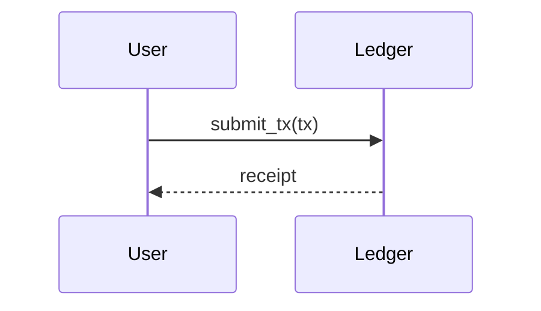

# Drafting Playbook

Drafting is the fourth of five stages. Inputs: an approved outline, a validated contract, a SHACL-conforming workspace. Outputs: a styled section file per outline section, a concatenated `draft.md`, and a chapter-level style-pass report. No prose is written until the prior stages have passed.

## The 5-stage workflow

### Stage 1. Load contract

```python
from scripts.chapter_contract import load_contract
contract = load_contract(Path("chapters/contracts/ch-03.yaml"))
```

`load_contract` parses YAML, validates against `assets/chapter-contract.schema.json`, and returns a dict. Validation errors raise `ContractValidationError`. The pipeline halts on failure; the user is told which field violated which constraint.

### Stage 2. Pre-flight gate

```python
from scripts.preflight import preflight
result = preflight(workspace)
if not result.passes:
    raise SystemExit(f"workspace not release-ready: {result.issues}")
```

`preflight` calls `book-knowledge`'s `validate_shacl` and `run_competency_queries` in-process. Failure conditions: SHACL non-conformance, unsupported verified claims, contradiction pairs touching cited claims. The function writes a timestamped report under `graph/reports/`. Fail closed: do not proceed to outlining when `result.passes` is `False`.

### Stage 3. Outline

```python
from scripts.query_chapter_evidence import query_chapter_evidence
evidence = query_chapter_evidence(workspace, "ch-03")
```

The returned `{"chapter_id": ..., "claims": [...]}` enumerates every verified claim whose `tbf:supportsChapter` triple names this chapter. Claude reads the contract plus the evidence list, writes the outline to `chapters/drafts/<chapter_id>/outline.md`, and asks the user to approve. See `outline-discipline.md` for the structural rules.

### Stage 4. Section drafting

For each outline section:

1. Select the verified claims assigned to the section by the outline.
2. Read each claim's `canonical_text` plus its `source_spans`. Quote source text verbatim or paraphrase with citation; never paraphrase without citation.
3. Write the first draft to `chapters/drafts/<chapter_id>/section-<n>.md`. Apply code-as-proof discipline (below).
4. Invoke the russellian-style skill on the section file:
   ```
   Skill tool: russellian-style
   args: rewrite chapters/drafts/<chapter_id>/section-<n>.md
   ```
   Wait for the rewritten prose plus the per-section style-pass report.
5. Write the styled prose back to `section-<n>.md`. Append the report to `chapters/drafts/<chapter_id>/style-pass-report.md`.

After all sections are styled, concatenate them into `chapters/drafts/<chapter_id>/draft.md` with section headers preserved. Run `chapter_contract_check.check_draft(draft, contract)`. The result must report `passes=True`. On failure, the failed acceptance tests indicate which sections need rework; the playbook re-enters step 3 for those sections only.

### Stage 5. Release bundle

```python
from scripts.build_release_bundle import build_release_bundle
bundle = build_release_bundle(workspace, "ch-03", "0.1.0", ["markdown", "pdf"])
```

The bundle is described in `release-bundle-format.md`.

## Code-as-proof rules

Code blocks in the chapter prose are evidence, not decoration. The rules:

1. Every code block is immediately preceded by prose that states the invariant the code preserves or the property it demonstrates.
2. Prose explains why the code is the optimal resolution to the stated problem. Prose does not narrate what the code does line by line; the reader can read the code.
3. Code blocks longer than thirty lines are extracted to a sibling file under `chapters/drafts/<chapter_id>/listings/` and referenced by relative path.
4. Every code block is either fenced as a known language (` ```rust `, ` ```python `) or marked `text` for output samples. Never use unfenced indented code.
5. A code block whose source is the workspace's ingested codebase carries a footnote citation pointing to the `doc_id` and locator. Code lifted from external memory is forbidden.

## Citation density

The contract's `evidence_requirements.evidence_density_target` is the per-1000-words floor. After each section is drafted, count cited claims and section words. Surface the live density to the user when:

- Section density falls below `0.7 * evidence_density_target`. Warning: re-evaluate citation density.
- Section density falls below `0.4 * evidence_density_target`. Hard fail: section must be reworked.
- Chapter-wide density falls below `evidence_density_target` after all sections are drafted. The chapter is rejected until a section is rebalanced or new claims are surfaced from the workspace.

Density above `1.5 * evidence_density_target` is also surfaced. Over-cited prose is a different failure mode: the chapter is acting as a bibliography rather than an argument.

## Diagram conventions

Diagrams live as Mermaid blocks inside the Markdown source:

````

````

Pandoc renders Mermaid blocks via the `pandoc-mermaid` filter when present; otherwise the bundle ships the block as-is. ASCII art is permitted only when the diagram cannot be expressed in Mermaid (e.g. circuit-layout schematics). TikZ is used only for the LaTeX output target and is wrapped in a raw-block:

````
```{=latex}
\begin{tikzpicture}
  % ...
\end{tikzpicture}
```
````

## Section-level russellian-style invocation

The invocation contract:

1. Write the section file to disk first. The skill operates on a path, not on inline text.
2. Call the Skill tool with the absolute path:
   ```
   russellian-style rewrite C:\path\to\workspace\chapters\drafts\ch-03\section-3.md
   ```
3. The skill returns the rewritten prose and a per-section style-pass report listing hedge counts, passive-voice counts, modifier-budget violations, and parallel-structure violations.
4. Write the rewritten prose back to the same file. Append the report to `chapters/drafts/<chapter_id>/style-pass-report.md` with a header `## section-<n>`.
5. The chapter-level report is shipped in the release bundle as `style-pass-report.md`.

Sections rewritten by the skill but still failing the contract's style acceptance tests indicate either an under-specified contract or prose so far from the target that one rewrite pass is insufficient. The playbook permits a maximum of two rewrite passes per section before escalating to the user.
